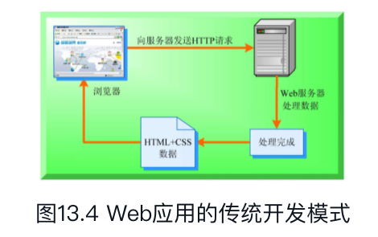
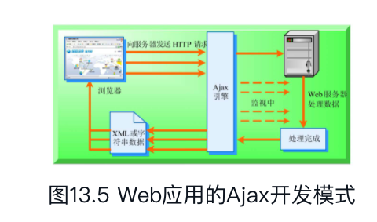

# 什么是Ajax

> **简单地说就是前后端交互传输json的引擎**

传统的Web应用模式中，页面中用户的每一次操作都将触发一次返回Web服务器的HTTP请求，服务器进行相应的处理（获得数据、运行与不同的系统会话）后，返回一个HTML页面给客户端，如图13.4所示。



而在Ajax应用中，页面中用户的操作将通过Ajax引擎与服务器端进行通信，然后将返回结果提交给客户端页面的Ajax引擎，再由Ajax引擎来决定将这些数据插入到页面的指定位置，如图13.5所示。



Ajax的优势：对于每个用户的行为，在传统的Web应用模式中，将生成一次HTTP请求，而在Ajax应用开发模式中，将变成对Ajax引擎的一次JavaScript调用。在Ajax应用开发模式中通过JavaScript实现在不刷新整个页面的情况下，对部分数据进行更新，从而降低了网络流量，给用户带来更好的体验。**比如验证提醒啥的**。


在Ajax应用中，通过JavaScript操作DOM，可以达到在不刷新页面的情况下实时修改用户界面的目的。

# Ajax应用


```javascript
1. 原生的JS实现方式（了解）
				 //1.创建核心对象
	            var xmlhttp;
	            if (window.XMLHttpRequest)
	            {// code for IE7+, Firefox, Chrome, Opera, Safari
	                xmlhttp=new XMLHttpRequest();
	            }
	            else
	            {// code for IE6, IE5
	                xmlhttp=new ActiveXObject("Microsoft.XMLHTTP");
	            }
	
	            //2. 建立连接
	            /*
	                参数：
	                    1. 请求方式：GET、POST
	                        * get方式，请求参数在URL后边拼接。send方法为空参
	                        * post方式，请求参数在send方法中定义
	                    2. 请求的URL：
	                    3. 同步或异步请求：true（异步）或 false（同步）
	
	             */
	            xmlhttp.open("GET","ajaxServlet?username=tom",true);
	
	            //3.发送请求
	            xmlhttp.send();
	
	            //4.接受并处理来自服务器的响应结果
	            //获取方式 ：xmlhttp.responseText
	            //什么时候获取？当服务器响应成功后再获取
	
	            //当xmlhttp对象的就绪状态改变时，触发事件onreadystatechange。
	            xmlhttp.onreadystatechange=function()
	            {
	                //判断readyState就绪状态是否为4，判断status响应状态码是否为200
	                if (xmlhttp.readyState==4 && xmlhttp.status==200)
	                {
	                   //获取服务器的响应结果
	                    var responseText = xmlhttp.responseText;
	                    alert(responseText);
	                }
	            }
	2. JQeury实现方式
		1. $.ajax()
			* 语法：$.ajax({键值对});
			 //使用$.ajax()发送异步请求
	            $.ajax({
	                url:"ajaxServlet1111" , // 请求路径
	                type:"POST" , //请求方式
	                //data: "username=jack&age=23",//请求参数
	                data:{"username":"jack","age":23},
	                success:function (data) {
	                    alert(data);
	                },//响应成功后的回调函数
	                error:function () {
	                    alert("出错啦...")
	                },//表示如果请求响应出现错误，会执行的回调函数
	
	                dataType:"text"//设置接受到的响应数据的格式
	            });
		2. $.get()：发送get请求
			* 语法：$.get(url, [data], [callback], [type])
				* 参数：
					* url：请求路径
					* data：请求参数
					* callback：回调函数
					* type：响应结果的类型

		3. $.post()：发送post请求
			* 语法：$.post(url, [data], [callback], [type])
				* 参数：
					* url：请求路径
					* data：请求参数
					* callback：回调函数
					* type：响应结果的类型
```

# 代码实践

[springboot-mybatis-ajax-druid学习demo](https://github.com/TsinghuaDream/springboot-mybatis-ajax)

