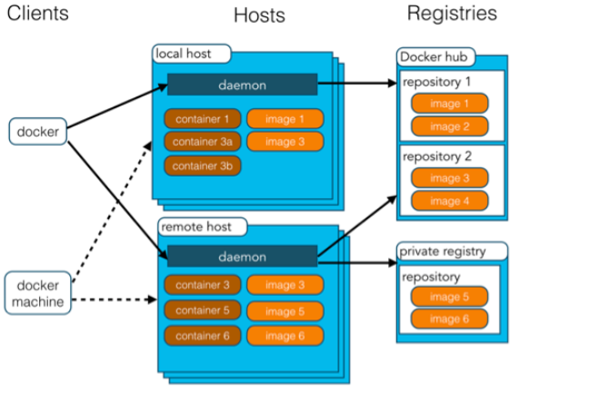
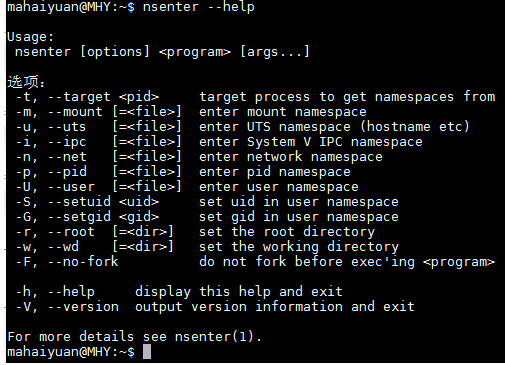
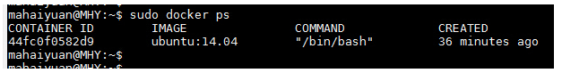
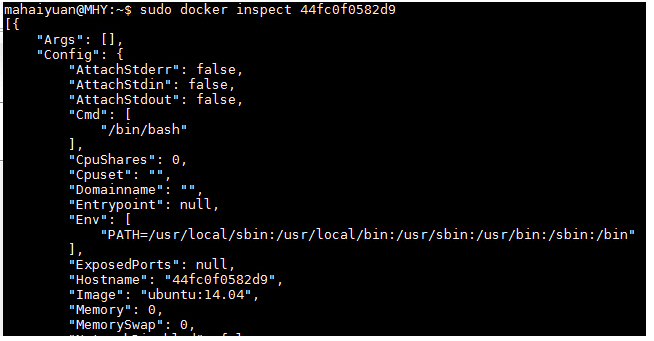
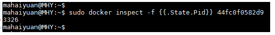
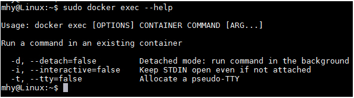

# 咩系Docker

Docker 是一个开源的应用容器引擎，基于 Go 语言并遵从 Apache2.0 协议开源。

Docker 可以让开发者打包他们的应用以及依赖包到一个轻量级、可移植的容器中，然后发布到任何流行的 Linux 机器上，也可以实现虚拟化。

容器是完全使用沙箱机制，相互之间不会有任何接口（类似 iPhone 的 app）,更重要的是容器性能开销极低。

# Docker应用场景

- Web 应用的自动化打包和发布。
- 自动化测试和持续集成、发布。
- 在服务型环境中部署和调整数据库或其他的后台应用。
- 从头编译或者扩展现有的 OpenShift 或 Cloud Foundry 平台来搭建自己的 PaaS 环境。

# Docker的优点

Docker 是一个用于开发，交付和运行应用程序的开放平台。Docker 使您能够将应用程序与基础架构分开，从而可以快速交付软件。借助 Docker，您可以与<u>管理应用程序相同的方式来管理基础架构</u>。<u>通过利用 Docker 的方法来快速交付，测试和部署代码，您可以大大减少编写代码和在生产环境中运行代码之间的延迟</u>。

## 1、快速，一致地交付您的应用程序

Docker 允许开发人员使用您提供的应用程序或服务的本地容器在标准化环境中工作，从而简化了开发的生命周期。

容器非常适合持续集成和持续交付（CI / CD）工作流程，请考虑以下示例方案：

- 您的开发人员在本地编写代码，并使用 Docker 容器与同事共享他们的工作。
- 他们使用 Docker 将其应用程序推送到测试环境中，并执行自动或手动测试。
- 当开发人员发现错误时，他们可以在开发环境中对其进行修复，然后将其重新部署到测试环境中，以进行测试和验证。
- 测试完成后，将修补程序推送给生产环境，就像将更新的镜像推送到生产环境一样简单。

## 2、响应式部署和扩展

Docker 是基于容器的平台，允许高度可移植的工作负载。Docker 容器可以在开发人员的本机上，数据中心的物理或虚拟机上，云服务上或混合环境中运行。

Docker 的可移植性和轻量级的特性，还可以使您轻松地完成动态管理的工作负担，并根据业务需求指示，实时扩展或拆除应用程序和服务。

## 3、在同一硬件上运行更多工作负载

Docker 轻巧快速。它为基于虚拟机管理程序的虚拟机提供了可行、经济、高效的替代方案，因此您可以利用更多的计算能力来实现业务目标。Docker 非常适合于高密度环境以及中小型部署，而您可以用更少的资源做更多的事情。

# Docker架构

Docker 包括三个基本概念:

- **镜像（Image）**：Docker 镜像（Image），就相当于是一个 root 文件系统。比如官方镜像 ubuntu:16.04 就包含了完整的一套 Ubuntu16.04 最小系统的 root 文件系统。

- **容器（Container）**：镜像（Image）和容器（Container）的关系，就像是面向对象程序设计中的**类和实例**一样，镜像是静态的定义，容器是镜像运行时的实体。容器可以被创建、启动、停止、删除、暂停等。

- **仓库（Repository）**：仓库可看成一个代码控制中心，用来**保存镜像**。

  > 从仓库（一般为DockerHub）下载（pull）一个镜像，Docker执行run方法得到一个容器，用户在容器里执行各种操作。Docker执行commit方法将一个容器转化为镜像。Docker利用login、push等命令将本地镜像推送（push）到仓库。其他机器或服务器上就可以使用该镜像去生成容器，进而运行相应的应用程序了。

  Docker 使用客户端-服务器 (C/S) 架构模式，使用远程API来管理和创建Docker容器。

  Docker 容器通过 Docker 镜像来创建。

  容器与镜像的关系类似于面向对象编程中的对象与类。

  | Docker | 面向对象 |
  | ------ | -------- |
  | 容器   | 对象     |
  | 镜像   | 类       |

  

| 概念                   | 说明                                                         |
| ---------------------- | ------------------------------------------------------------ |
| Docker 镜   像(Images) | Docker 镜像是用于创建 Docker 容器的模板，比如 Ubuntu 系统。  |
| Docker 容器(Container) | 容器是独立运行的一个或一组应用，是镜像运行时的实体。         |
| Docker 客户端(Client)  | Docker 客户端通过命令行或者其他工具使用 Docker SDK (https://docs.docker.com/develop/sdk/) 与 Docker 的守护进程通信。 |
| Docker 主机(Host)      | 一个物理或者虚拟的机器用于执行 Docker 守护进程和容器。       |
| Docker Registry        | Docker 仓库用来保存镜像，可以理解为代码控制中的代码仓库。Docker Hub([https://hub.docker.com](https://hub.docker.com/)) 提供了庞大的镜像集合供使用。一个 Docker Registry 中可以包含多个仓库（Repository）；每个仓库可以包含多个标签（Tag）；每个标签对应一个镜像。 |
| Docker Machine         | Docker Machine是一个简化Docker安装的命令行工具，通过一个简单的命令行即可在相应的平台上安装Docker，比如VirtualBox、 Digital Ocean、Microsoft Azure。 |

# Docker中关于镜像的操作

## 1、下载已有镜像

1: docker search imagename(centos)       #查看centos镜像是否存在

2:docker pull imagename(centos)        #利用pull命令获取镜像

3:docker images      #查看当前系统中的images信息

## 2、新建自有镜像

### 1:利用其他镜像修改再制作镜像

 ==> 利用commit提交更新后的副本 镜像是只读的所以不能修改保存 需要再提交

```linux
[root@xxx ~]# docker run -it centos:latest /bin/bash    # 启动一个容器
[root@72f1a8a0e394 /]#   								 # 这里命令行形式变了，表示已经进入了一个新环境
[root@72f1a8a0e394 /]# git --version    # 此时的容器中没有git
bash: git: command not found
[root@72f1a8a0e394 /]# yum install git    # 利用yum安装git
......
[root@72f1a8a0e394 /]# git --version   # 此时的容器中已经装有git了
git version 1.8.3.1
exit
```

此时利用exit退出该容器，然后**查看docker中运行的程序（容器）**：

```
[root@xxx ~]# docker ps -a
```

这里将容器转化为一个镜像，即执行commit操作，完成后使用docker images查看：

```
[root@xxx ~]# docker commit -m "centos with git" -a "qixianhu" 72f1a8a0e394 xianhu/centos:git

[root@xxx ~]# docker images
REPOSITORY       TAG    IMAGE ID         CREATED             SIZE
xianhu/centos    git    52166e4475ed     5 seconds ago       358.1 MB
centos           latest 0584b3d2cf6d     9 days ago          196.5 MB
```

其中，-m指定说明信息；-a指定用户信息；**72f1a8a0e394代表容器的id**；xianhu/centos:git指定目标镜像的用户名、仓库名和 tag 信息。注意这里的用户名xianhu，后边会用到。

此时Docker引擎中就有了我们新建的镜像xianhu/centos:git，此镜像和原有的CentOS镜像区别在于多了个Git工具。**<u>此时我们利用新镜像创建的容器，本身就自带git了。</u>**

### 2.利用Dockerfile创建镜像

Dockerfile可以理解为一种配置文件，用来告诉docker build怎么去做。

```xml-dtd
# 说明该镜像以哪个镜像为基础
FROM centos:latest

# 构建者的基本信息
MAINTAINER xianhu

# 在build这个镜像时执行的操作
RUN yum update
RUN yum install -y git

# 拷贝本地文件到镜像中
COPY ./* /usr/share/gitdir/
```

有了Dockerfile之后，就可以利用build命令构建镜像了：

```
[root@xxx ~]# docker build -t="xianhu/centos:gitdir" .
#如果是写了dockerfile 就用下面这个 app指的是名字
[root@xxx ~]# docker build -f ./springboot-dockerfile -t app .
```

其中-t用来指定新镜像的用户信息、tag等。最后的点表示在当前目录寻找Dockerfile。

构建完成之后，同样可以使用docker images命令查看：

```
[root@xxx ~]# docker images
REPOSITORY        TAG       IMAGE ID      CREATED            SIZE
xianhu/centos     gitdir    0749ecbca587  34 minutes ago     359.7 MB
xianhu/centos     git       52166e4475ed  About an hour ago  358.1 MB
centos            latest    0584b3d2cf6d  9 days ago         196.5 MB
```

## 3、删除镜像

如果想删除容器或者镜像，可以使用rm命令，注意：删除镜像前必须先删除以此镜像为基础的容器。

```
[root@xxx ~]# docker rm container_name/container_id
[root@xxx ~]# docker rmi image_name/image_id
```

## 4、镜像其他操作命令

```
[root@xxx ~]# docker save -o centos.tar xianhu/centos:git    # 保存镜像, -o也可以是--output
[root@xxx ~]# docker load -i centos.tar    # 加载镜像, -i也可以是--input
```

# Docker中关于容器的基本操作

在前边镜像的章节中，我们已经看到了如何基于镜像启动一个容器，即docker run操作。

```
[root@xxx ~]# docker run -it centos:latest /bin/bash
```

这里-it是两个参数：-i和-t。前者表示打开并保持stdout，后者表示分配一个终端（pseudo-tty）。此时如果使用exit退出，则容器的状态处于Exit，而不是后台运行。**如果想让容器一直运行，而不是停止，可以使用快捷键 ctrl+p ctrl+q 退出，此时容器的状态为Up。**

除了这两个参数之外，run命令还有很多其他参数。**其中比较有用的是-d后台运行**：

```
[root@xxx ~]# docker run centos:latest /bin/bash -c "while true; do echo hello; sleep 1; done"
[root@xxx ~]# docker run -d centos:latest /bin/bash -c "while true; do echo hello; sleep 1; done"
```

**启动、停止、重启容器命令**：

```
[root@xxx ~]# docker start container_name/container_id
[root@xxx ~]# docker stop container_name/container_id
[root@xxx ~]# docker restart container_name/container_id
```

后台启动一个容器后，如果想进入到这个容器，可以使用attach命令：

```
[root@xxx ~]# docker attach container_name/container_id
sudo docker exec -it 775c7c9ee1e1 /bin/bash 
```

删除容器的命令：

```
[root@xxx ~]# docker rm container_name/container_id
```

# Docker中关于仓库的基本操作

Docker官方维护了一个DockerHub的公共仓库，里边包含有很多平时用的较多的镜像。除了从上边下载镜像之外，我们也可以将自己自定义的镜像发布（push）到DockerHub上。

（1）访问[https://hub.docker.com/](https://link.zhihu.com/?target=https%3A//hub.docker.com/)，如果没有账号，需要先注册一个。

（2）利用命令docker login登录DockerHub，输入用户名、密码即可登录成功：

```
[root@xxx ~]# docker login
Login with your Docker ID to push and pull images from Docker Hub. If you don't have a Docker ID, head over to https://hub.docker.com to create one.
Username: xianhu
Password:
Login Succeeded
```

（3）将本地的镜像推送到DockerHub上，这里的**xianhu要和登录时的username一致**，也就是只能推送自己的用户名的镜像。

```text
[root@xxx ~]# docker push xianhu/centos:git    # 成功推送
[root@xxx ~]# docker push xxx/centos:git    # 失败
The push refers to a repository [docker.io/xxx/centos]
unauthorized: authentication required
```

（4）以后别人就可以从你的仓库中下载(pull)合适的镜像了。

```
[root@xxx ~]# docker pull xianhu/centos:git
```

对应于镜像的两种创建方法，镜像的更新也有两种：

- 创建容器之后做更改，之后commit生成镜像，然后push到仓库中。
- 更新Dockerfile。在工作时一般建议这种方式，更简洁明了。

# 总结

**docker就像一条驮着很多房间的鲸鱼🐳，而开发部署者通过进行不同的行为打开不同的房间。房间不被打开的时候就叫镜像，被打开了就是容器。而仓库就是放着各类工具的地方，可以装饰房间。**有了 Docker 镜像，我们就能**在任何安装有 Docker 的机器上运行，不用再重复配置环境安装依赖**等。

**举个例子：大上海都是坐式马桶，可我喜欢蹲坑，那我每到一个地方住就要改装一次马桶，是不是很麻烦呢？但是如果有一条背着好多房间的🐳它叫docker跟着我，我直接搬个我配置好的房间住就好了。这就是docker，运维的贴心小管家。**

```tex
docker images      #查看所有镜像

docker ps -a         #查看此刻容器池的运行状态
#docker删除正在运行的容器

#docker关闭所有容器
docker stop $(docker ps -a | awk '{ print $1}' | tail -n +2)

docker中 启动所有的容器命令：
docker start $(docker ps -a | awk '{ print $1}' | tail -n +2)

docker build -f ./springboot-dockerfile -t app .

#此处有坑，当你部署springboot项目时需要加入--link 或者配置网域
docker run -id -p 9000:8080 app
```

```
Docker容器进入的4种方式
使用docker attach
使用SSH
使用nsenter
使用exec

　　Docker提供了attach命令来进入Docker容器。


　　接下来我们创建一个守护态的Docker容器，然后使用docker attach命令进入该容器。

$ sudo docker run -itd ubuntu:14.04 /bin/bash  


　　然后我们使用docker ps查看到该容器信息，接下来就使用docker attach进入该容器

$ sudo docker attach 44fc0f0582d9  

　　可以看到我们已经进入到该容器中了。

 

　　但在，使用该命令有一个问题。当多个窗口同时使用该命令进入该容器时，所有的窗口都会同步显示。如果有一个窗口阻塞了，那么其他窗口也无法再进行操作。


因为这个原因，所以docker attach命令不太适合于生产环境，平时自己开发应用时可以使用该命令。


```

# Docker容器进入的4种方式

------

##  

　　在使用Docker创建了容器之后，大家比较关心的就是如何进入该容器了，其实进入Docker容器有好几多种方式，这里我们就讲一下常用的几种进入Docker容器的方法。

进入Docker容器比较常见的几种做法如下：

- 使用docker attach
- 使用SSH
- 使用nsenter
- 使用exec

## 一、使用docker attach进入Docker容器

　　Docker提供了attach命令来进入Docker容器。

　　接下来我们创建一个守护态的Docker容器，然后使用docker attach命令进入该容器。

1. $ sudo docker run -itd ubuntu:14.04 /bin/bash 

　　然后我们使用docker ps查看到该容器信息，接下来就使用docker attach进入该容器

1. $ sudo docker attach 44fc0f0582d9 
   可以看到我们已经进入到该容器中了。 

　　但在，使用该命令有一个问题。当多个窗口同时使用该命令进入该容器时，所有的窗口都会同步显示。如果有一个窗口阻塞了，那么其他窗口也无法再进行操作。

因为这个原因，所以docker attach命令不太适合于生产环境，平时自己开发应用时可以使用该命令。

## 二、使用SSH进入Docker容器

　　在生产环境中排除了使用docker attach命令进入容器之后，相信大家第一个想到的就是ssh。在镜像（或容器）中安装SSH Server，这样就能保证多人进入

容器且相互之间不受干扰了，相信大家在当前的生产环境中（没有使用Docker的情况）也是这样做的。但是使用了Docker容器之后不建议使用ssh进入到Docker容

器内。关于为什么不建议使用，请参考如下文章：

## 三、使用nsenter进入Docker容器

　　在上面两种方式都不适合的情况下，还有一种比较方便的方法，即使用nsenter进入Docker容器。关于什么是nsenter请参考如下文章：

https://github.com/jpetazzo/nsenter

在了解了什么是nsenter之后，系统默认将我们需要的nsenter安装到主机中

如果没有安装的话，按下面步骤安装即可（注意是主机而非容器或镜像）

具体的安装命令如下：

1. $ wget https://www.kernel.org/pub/linux/utils/util-linux/v2.24/util-linux-2.24.tar.gz 
2. $ tar -xzvf util-linux-2.24.tar.gz 
3. $ cd util-linux-2.24/ 
4. $ ./configure --without-ncurses 
5. $ make nsenter 
6. $ sudo cp nsenter /usr/local/bin 

安装好nsenter之后可以查看一下该命令的使用。

 

　　nsenter可以访问另一个进程的名称空间。所以为了连接到某个容器我们还需要获取该容器的第一个进程的PID。可以使用docker inspect命令来拿到该PID。

docker inspect命令使用如下：

1. $ sudo docker inspect --help 

inspect命令可以分层级显示一个镜像或容器的信息。比如我们当前有一个正在运行的容器



可以使用docker inspect来查看该容器的详细信息。

1. $ sudo docker inspect 44fc0f0582d9 



由其该信息非常多，此处只截取了其中一部分进行展示。如果要显示该容器第一个进行的PID可以使用如下方式

1. 

   ```
   $ sudo docker inspect -f {{.State.Pid}} 44fc0f0582d9
   ```

    

 

在拿到该进程PID之后我们就可以使用nsenter命令访问该容器了。

1. $ sudo nsenter --target 3326 --mount --uts --ipc --net --pid 

1. $ sudo nsenter --target 3326 --mount --uts --ipc --net --pid 

其中的3326即刚才拿到的进程的PID

当然，如果你认为每次都输入那么多参数太麻烦的话，网上也有许多做好的脚本供大家使用。

地址如下：

http://yeasy.gitbooks.io/docker_practice/content/container/enter.html

http://www.tuicool.com/articles/eYnUBrR

 

**四、使用docker exec进入Docker容器**

　　除了上面几种做法之外，docker在1.3.X版本之后还提供了一个新的命令exec用于进入容器，这种方式相对更简单一些，下面我们来看一下该命令的使用：

1. ```
   $ sudo docker exec --help  
   ```

   

 

接下来我们使用该命令进入一个已经在运行的容器

1. ```
   $ sudo docker ps 
   ```

   

2. ```
   $ sudo docker exec -it 775c7c9ee1e1 /bin/bash
   ```

   
