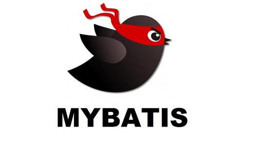
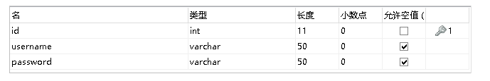
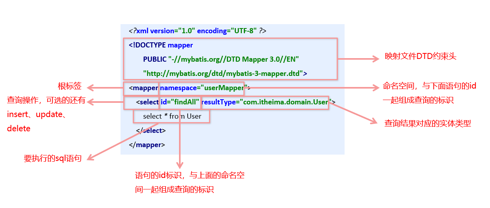
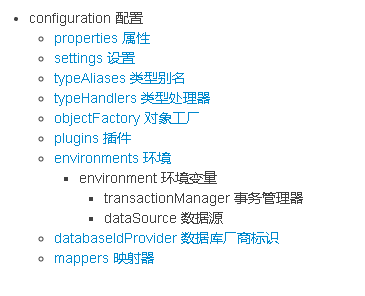
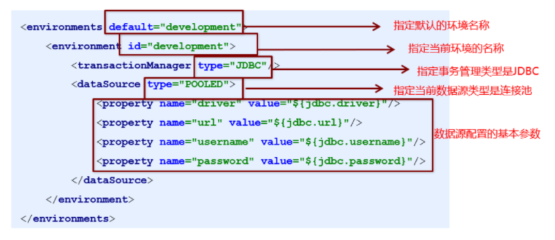
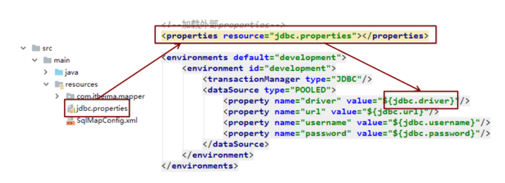
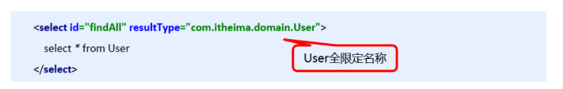
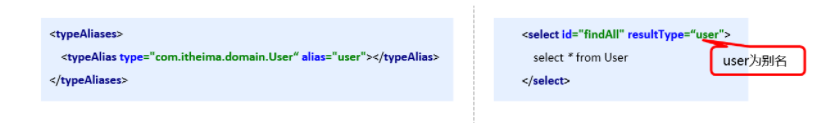
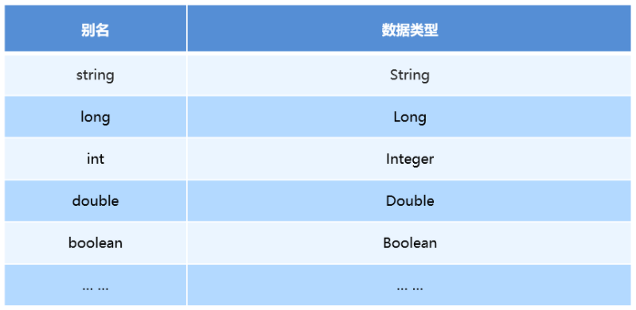
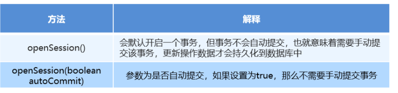

# 咩系Mybatis

mybatis 是一个优秀的**基于java的持久层框架**，它**内部封装了jdbc**，使开发者**只需要关注sql语句本身**，而不需要花费精力去处理加载驱动、创建连接、创建statement等繁杂的过程。

mybatis通过xml或注解的方式将要执行的各种 statement配置起来，并通过java对象和statement中sql的动态参数进行映射生成最终执行的sql语句。最后mybatis框架执行sql并将结果映射为java对象并返回。

采用[ORM思想](https://baike.baidu.com/item/%E5%AF%B9%E8%B1%A1%E5%85%B3%E7%B3%BB%E6%98%A0%E5%B0%84/311152?fr=aladdin&fromtitle=ORM&fromid=3583252)解决了实体和数据库映射的问题，对jdbc 进行了封装，屏蔽了jdbc api 底层访问细节，使我们不用与jdbc api 打交道，就可以完成对数据库的持久化操作。

# 学习Mybatis

**mybatis学习步骤：**

①添加MyBatis的坐标

②创建user数据表

③编写User实体类 

④编写映射文件UserMapper.xml

⑤编写核心文件SqlMapConfig.xml

⑥编写测试类

## 环境搭建

1. 导入mybatis的坐标和其他坐标

   ```xml
   <!--mybatis坐标-->
   <dependency>
       <groupId>org.mybatis</groupId>
       <artifactId>mybatis</artifactId>
       <version>3.4.5</version>
   </dependency>
   <!--mysql驱动坐标-->
   <dependency>    
       <groupId>mysql</groupId>   
       <artifactId>mysql-connector-java</artifactId>    
       <version>5.1.6</version>    
       <scope>runtime</scope>
   </dependency>
   <!--单元测试坐标-->
   <dependency>    
       <groupId>junit</groupId>    
       <artifactId>junit</artifactId>    
       <version>4.12</version>    
       <scope>test</scope>
   </dependency>
   <!--日志坐标-->
   <dependency>    
       <groupId>log4j</groupId>    
       <artifactId>log4j</artifactId>    
       <version>1.2.12</version>
   </dependency>
   ```

   

2. 创建user数据库

   

3. 编写user实体

   ```java
   public class User {    
   	private int id;    
   	private String username;    
   	private String password;
       //省略get个set方法
   }
   ```

4. 编写usermapper映射文件

   ```xml
   <?xml version="1.0" encoding="UTF-8" ?>
   <!DOCTYPE mapper PUBLIC "-//mybatis.org//DTD Mapper 3.0//EN" "http://mybatis.org/dtd/mybatis-3-mapper.dtd">
   <mapper namespace="UserMapper">
   <!--    这里的findAll是查询方法名字 resultType是返回类型（class）如果不在一个包就要写包路径-->
       <select id="findAll" resultType="User">
           select * from user
       </select>
   </mapper>
   ```

5. 编写mybatis核心文件

   ```xml
   <?xml version="1.0" encoding="UTF-8"?>
   <!DOCTYPE configuration
           PUBLIC "-//mybatis.org//DTD Config 3.0//EN"
           "http://mybatis.org/dtd/mybatis-3-config.dtd">
   <configuration>
   
       <!-- 环境配置：事务管理器和数据源配置 -->
       <environments default="development">
           <environment id="development">
               <transactionManager type="JDBC" />
               <dataSource type="POOLED">
                   <property name="driver" value="com.mysql.jdbc.Driver" />
                   <property name="url" value="jdbc:mysql:///test" />
                   <property name="username" value="root" />
                   <property name="password" value="root" />
               </dataSource>
           </environment>
       </environments>
   
       <!-- 映射器 -->
       <mappers>
           <mapper resource="UserMapper.xml" />
       </mappers>
   </configuration>
   
   ```

## 编写测试代码

```java
import org.apache.ibatis.io.Resources;
import org.apache.ibatis.session.SqlSession;
import org.apache.ibatis.session.SqlSessionFactory;
import org.apache.ibatis.session.SqlSessionFactoryBuilder;
import org.junit.jupiter.api.Test;

import java.io.IOException;
import java.io.InputStream;
import java.util.List;
public class MybatisTest {
    @Test
    public  void hi() {
        //加载核心配置文件
        InputStream resourceAsStream = null;
        try {
            resourceAsStream = Resources.getResourceAsStream("SqlMapConfig.xml");
        } catch (IOException e) {
            e.printStackTrace();
        }
//获得sqlSession工厂对象
        SqlSessionFactory sqlSessionFactory = new
                SqlSessionFactoryBuilder().build(resourceAsStream);
//获得sqlSession对象
        SqlSession sqlSession = sqlSessionFactory.openSession();
//执行sql语句
        List<User> userList = sqlSession.selectList("UserMapper.findAll");
//打印结果
        for (User user:userList
             ) {
            System.out.println(user);

        }
        System.out.println("user:"+userList);
//释放资源
        sqlSession.close();
    }

}
```

# 映射文件（Mapper）概述




# MyBatis的增删改查操作

```xml
<mapper namespace="userMapper">    
	<insert id="add" parameterType="com.itheima.domain.User">        
		insert into user values(#{id},#{username},#{password})    
	</insert>
</mapper>
```

```java
InputStream resourceAsStream = Resources.getResourceAsStream("SqlMapConfig.xml");
SqlSessionFactory sqlSessionFactory = new 
                        SqlSessionFactoryBuilder().build(resourceAsStream);
SqlSession sqlSession = sqlSessionFactory.openSession();
int insert = sqlSession.insert("userMapper.add", user);
System.out.println(insert);
//提交事务
sqlSession.commit();
sqlSession.close();
```

**插入操作注意问题**

• 插入语句使用insert标签

• 在映射文件中使用parameterType属性指定要插入的数据类型

•Sql语句中使用#{实体属性名}方式引用实体中的属性值

•插入操作使用的API是sqlSession.insert(“命名空间.id”,实体对象);

•插入操作涉及数据库数据变化，所以要使用sqlSession对象显示的提交事务，即sqlSession.commit() 

```xml
<mapper namespace="userMapper">
    <update id="update" parameterType="com.itheima.domain.User">
        update user set username=#{username},password=#{password} where id=#{id}
    </update>
</mapper>
```

```java
InputStream resourceAsStream = Resources.getResourceAsStream("SqlMapConfig.xml");
SqlSessionFactory sqlSessionFactory = new SqlSessionFactoryBuilder().build(resourceAsStream);
SqlSession sqlSession = sqlSessionFactory.openSession();
int update = sqlSession.update("userMapper.update", user);
System.out.println(update);
sqlSession.commit();
sqlSession.close();
```

**修改操作注意问题**

• 修改语句使用update标签

• 修改操作使用的API是sqlSession.update(“命名空间.id”,实体对象);

```xml
<mapper namespace="userMapper">
    <delete id="delete" parameterType="java.lang.Integer">
        delete from user where id=#{id}
    </delete>
</mapper>

```

```java
InputStream resourceAsStream = Resources.getResourceAsStream("SqlMapConfig.xml");
SqlSessionFactory sqlSessionFactory = new SqlSessionFactoryBuilder().build(resourceAsStream);
SqlSession sqlSession = sqlSessionFactory.openSession();
int delete = sqlSession.delete("userMapper.delete",3);
System.out.println(delete);
sqlSession.commit();
sqlSession.close();
```

**删除操作注意问题**

• 删除语句使用delete标签

•Sql语句中使用#{任意字符串}方式引用传递的单个参数

•删除操作使用的API是sqlSession.delete(“命名空间.id”,Object);

# 核心文件解析（mybatis配置xml）



## **1)environments标签**



其中，**事务管理器（transactionManager）类型有两种**：

•JDBC：这个配置就是直接使用了JDBC 的提交和回滚设置，它依赖于从数据源得到的连接来管理事务作用域。

•MANAGED：这个配置几乎没做什么。它从来不提交或回滚一个连接，而是让容器来管理事务的整个生命周期（比如 JEE 应用服务器的上下文）。 默认情况下它会关闭连接，然而一些容器并不希望这样，因此需要将 closeConnection 属性设置为 false 来阻止它默认的关闭行为。

其中，**数据源（dataSource）类型有三种**：

•UNPOOLED：这个数据源的实现只是每次被请求时打开和关闭连接。

•POOLED：这种数据源的实现利用“池”的概念将 JDBC 连接对象组织起来。

•JNDI：这个数据源的实现是为了能在如 EJB 或应用服务器这类容器中使用，容器可以集中或在外部配置数据源，然后放置一个 JNDI 上下文的引用。

## **2)mapper标签**

该标签的作用是**加载映射的**，加载方式有如下几种：

•使用相对于类路径的资源引用，例如：

<mapper resource="org/mybatis/builder/AuthorMapper.xml"/>

•使用完全限定资源定位符（URL），例如：

<mapper url="file:///var/mappers/AuthorMapper.xml"/>

•使用映射器接口实现类的完全限定类名，例如：

<mapper class="org.mybatis.builder.AuthorMapper"/>

•将包内的映射器接口实现全部注册为映射器，例如：

<package name="org.mybatis.builder"/>

## **3)Properties标签**

实际开发中，习惯将数据源的配置信息单独抽取成一个properties文件，该标签可以加载额外配置的properties文件



## **4)typeAliases标签**

类型别名是为Java 类型设置一个短的名字。原来的类型名称配置如下



也可以自定义别名，配置typeAliases，为com.itheima.domain.User定义别名为user



mybatis框架为我们预设了一些别名



# Mybatis相关API

## 6.1 SqlSession工厂构建器SqlSessionFactoryBuilder

常用API：SqlSessionFactory build(InputStream inputStream)

通过加载mybatis的核心文件的输入流的形式构建一个SqlSessionFactory对象

```
String resource = "org/mybatis/builder/mybatis-config.xml"; 
InputStream inputStream = Resources.getResourceAsStream(resource); 
SqlSessionFactoryBuilder builder = new SqlSessionFactoryBuilder(); 
SqlSessionFactory factory = builder.build(inputStream);
```

其中， Resources 工具类，这个类在 org.apache.ibatis.io 包中。Resources 类帮助你从类路径下、文件系统或一个 web URL 中加载资源文件。

## 6.2 SqlSession工厂对象SqlSessionFactory

SqlSessionFactory 有多个个方法创建SqlSession 实例。常用的有如下两个：



## 6.3 SqlSession会话对象

SqlSession 实例在 MyBatis 中是非常强大的一个类。在这里你会看到所有执行语句、提交或回滚事务和获取映射器实例的方法。

执行语句的方法主要有：

```java
<T> T selectOne(String statement, Object parameter) 
<E> List<E> selectList(String statement, Object parameter) 
int insert(String statement, Object parameter) 
int update(String statement, Object parameter) 
int delete(String statement, Object parameter)
```

操作事务的方法主要有：

```java
void commit()  
void rollback() 
```

# 项目地址

> demo项目地址[git@github.com:TsinghuaDream/mybatisdemo.git]()

# 补充，springboot mybatis的分页和自动生成mapper

## 1.添加项目依赖

```xml
<parent>
        <groupId>org.springframework.boot</groupId>
        <artifactId>spring-boot-starter-parent</artifactId>
        <version>2.1.3.RELEASE</version>
        <relativePath/> <!-- lookup parent from repository -->
    </parent>
    <dependencies>
        <!--SpringBoot通用依赖模块-->
        <dependency>
            <groupId>org.springframework.boot</groupId>
            <artifactId>spring-boot-starter-web</artifactId>
        </dependency>
        <dependency>
            <groupId>org.springframework.boot</groupId>
            <artifactId>spring-boot-starter-actuator</artifactId>
        </dependency>
        <dependency>
            <groupId>org.springframework.boot</groupId>
            <artifactId>spring-boot-starter-aop</artifactId>
        </dependency>
        <dependency>
            <groupId>org.springframework.boot</groupId>
            <artifactId>spring-boot-starter-test</artifactId>
            <scope>test</scope>
        </dependency>
        <!--MyBatis分页插件-->
        <dependency>
            <groupId>com.github.pagehelper</groupId>
            <artifactId>pagehelper-spring-boot-starter</artifactId>
            <version>1.2.10</version>
        </dependency>
        <!--集成druid连接池-->
        <dependency>
            <groupId>com.alibaba</groupId>
            <artifactId>druid-spring-boot-starter</artifactId>
            <version>1.1.10</version>
        </dependency>
        <!-- MyBatis 生成器 -->
        <dependency>
            <groupId>org.mybatis.generator</groupId>
            <artifactId>mybatis-generator-core</artifactId>
            <version>1.3.3</version>
        </dependency>
        <!--Mysql数据库驱动-->
        <dependency>
            <groupId>mysql</groupId>
            <artifactId>mysql-connector-java</artifactId>
            <version>8.0.15</version>
        </dependency>
    </dependencies>
```

## 2.修改配置文件

```yml
server:
  port: 8080

spring:
  datasource:
    url: jdbc:mysql://localhost:3306/mall?useUnicode=true&characterEncoding=utf-8&serverTimezone=Asia/Shanghai
    username: root
    password: root
#mapper的存储位置
mybatis:
  mapper-locations:
  	#相对路径
    - classpath:mapper/*.xml
    #绝对路径
    - classpath*:com/**/mapper/*.xml
```

## 3.项目结构

