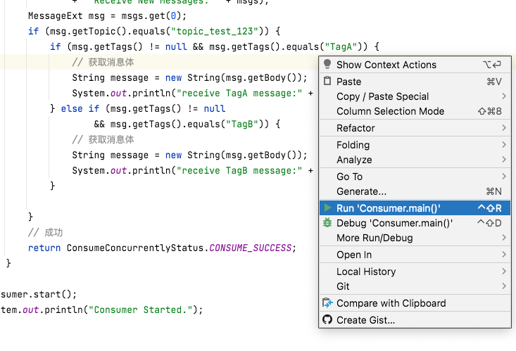

# 文档

[官方中文文档](https://github.com/apache/rocketmq/tree/master/docs/cn)

[官方英文文档](https://rocketmq.apache.org/docs/quick-start/)

[官方下载地址](https://rocketmq.apache.org/dowloading/releases/)

# 什么是MQ？

基于大家都是运维同学，就举个不恰当但有点关联的例子：

小明是小华的哥哥，小明的爸爸让小明拿书给小华读，小华读完了一本就再管小明要。

小华读一本书有时快，有时慢，取决于书的难度和厚度，所以时间不固定找小明要书，小明为此烦透了，毕竟谁都不喜欢被打扰～

但是，书还是要给，于是他买了一个书架，把他觉得适合小华读的书都放在书架里，小华读完了就自己拿下一本。

书架就可以理解为最简单的消息队列，小明一本一本拿就是最简单的队列模式（Queue），小华就是生产者程序，小明就是消费者程序。


于是小华就解脱了～吗

没有，很快家里迎来了三胎小红，小华又接到任务，去买书提供给小红。

于是，小华把书架又把适合小红看的书放进书架，小明和小红都从这个书架拿适合自己的书，而且偶尔还能看看对方的书。

这就是发布-订阅模式，书架变成了主题，小明和小红是订阅者，小华是发布者。

把消息发送到mq中，订阅者自行订阅～ 不太准确，根据官方文档大致了解即可。

# 什么是maven？

可以把它理解为一个工具箱，在蛮荒没有打火机，你要取火只能自己钻木之类的费时费力的操作，但如果有了打火机是不是很方便呢？

写代码也是，maven仓库存放着别人写好的代码包，也就是你的工具包，**也就是jar包**，所以当你导入别人的maven项目的时候，等它把包下载好先，你总不能用一个没有油的打火机壳打火吧～

那么问题来了，怎么去仓库找到我的打火机呢？总得有个说明吧——pom.xml 就是说明文件，有了它maven就会帮你去仓库给你拿打火机，（在idea中 你只要保存它一次，他就会帮你重新拿一次）。

✨✨✨✨✨✨✨✨**这里要注意，你的rocketMQ版本跟拿的jar包得是配套的.** 这里我用的是4.9.0版本的rocketMQ，所以我用4.3.0的jar包。

在这个文件写你要的工具，记得把我的打火机删了

```xml
<project xmlns="http://maven.apache.org/POM/4.0.0" xmlns:xsi="http://www.w3.org/2001/XMLSchema-instance"
  xsi:schemaLocation="http://maven.apache.org/POM/4.0.0 http://maven.apache.org/xsd/maven-4.0.0.xsd">
  <modelVersion>4.0.0</modelVersion>

  <groupId>com.my.maven</groupId>
  <artifactId>rocketmq</artifactId>
  <version>0.0.1-SNAPSHOT</version>
  <packaging>jar</packaging>

  <name>rocketmq</name>
  <url>http://maven.apache.org</url>

  <properties>
    <project.build.sourceEncoding>UTF-8</project.build.sourceEncoding>
  </properties>
<!--这里写我要的工具所在的组和它的id，以及版本号—— 比如“门口小卖部里的6.6.6版本的打火机”-->
  <dependencies>
<!-- 写代码的时候，把这个火机依赖删了 *****************-->
    <dependency>
      <groupId>门口小卖铺</groupId>
      <artifactId>打火机</artifactId>
      <version>6.6.6</version>
    </dependency>
<!-- 写代码的时候，把这个火机依赖删了 *****************-->
    
    
<!--    同理，我要org.apache.rocketmq里的rocketmq-client，版本号是4.3.0，作用是帮助我拿到快速操作mq的工具-->
    <dependency>
      <groupId>org.apache.rocketmq</groupId>
      <artifactId>rocketmq-client</artifactId>
      <version>4.3.0</version>
    </dependency>
  </dependencies>
</project>
```


# 代码_来自官方

很多语言，比如c吧，都有一个入口函数，也就是主函数main。

这里的案例创建两个main函数，一个生产者，一个消费者，根据注解，把的信息填进注解对应的双引号里：

```java
//第5-6行
DefaultMQProducer producer = new
            DefaultMQProducer("please_rename_unique_group_name");//把双引号里的改成你的rocketmq创建的group name
//改成
DefaultMQProducer producer = new
            DefaultMQProducer("test_group_1");//test_group_1是我新建的组名，你们填你们自己的，后面也一样
```

**在maven包下载完成后，依次启动**

```java
//product 
public class SyncProducer {
    public static void main(String[] args) throws Exception {
        //Instantiate with a producer group name.
        DefaultMQProducer producer = new
            DefaultMQProducer("please_rename_unique_group_name");//把双引号里的改成你的rocketmq创建的group name
        // Specify name server addresses.
        producer.setNamesrvAddr("localhost:9876");//这里填你的rocketmq占用的端口
        //Launch the instance.
        producer.start();
        for (int i = 0; i < 100; i++) {
            //Create a message instance, specifying topic, tag and message body.
            Message msg = new Message("TopicTest" /* Topic */,//你的topic
                "TagA" /* Tag */,
                ("Hello RocketMQ " +
                    i).getBytes(RemotingHelper.DEFAULT_CHARSET) /* Message body */
            );
            //Call send message to deliver message to one of brokers.
            SendResult sendResult = producer.send(msg);
            System.out.printf("%s%n", sendResult);
        }
        //Shut down once the producer instance is not longer in use.
        producer.shutdown();
    }
}
```

```java
//consumer
public class Consumer {

    public static void main(String[] args) throws InterruptedException, MQClientException {

        // Instantiate with specified consumer group name.
        DefaultMQPushConsumer consumer = new DefaultMQPushConsumer("please_rename_unique_group_name");
         
        // Specify name server addresses.This sever runs on  localhost(本地) port 9876  
        consumer.setNamesrvAddr("localhost:9876");
        
        // Subscribe one more more topics to consume.
        consumer.subscribe("TopicTest", "*");//你要消费的topics
        // Register callback to execute on arrival of messages fetched from brokers.
        consumer.registerMessageListener(new MessageListenerConcurrently() {

            @Override
            public ConsumeConcurrentlyStatus consumeMessage(List<MessageExt> msgs,
                ConsumeConcurrentlyContext context) {
                System.out.printf("%s Receive New Messages: %s %n", Thread.currentThread().getName(), msgs);
                return ConsumeConcurrentlyStatus.CONSUME_SUCCESS;
            }
        });

        //Launch the consumer instance.
        consumer.start();

        System.out.printf("Consumer Started.%n");
    }
}
```

**右键，run它就好了。**



本案例**前提是你java1.8的环境配置完成了，maven的话idea内置了，还要会rocketmq的基本操作，比如新建组，新建topic，查看它运行在什么端口之类的**

