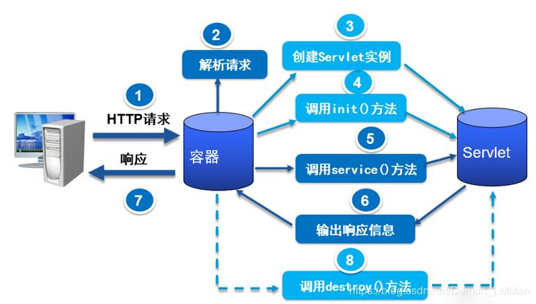
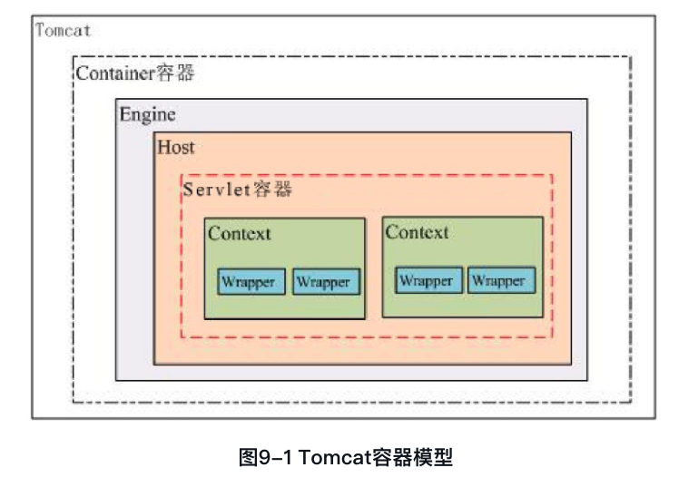

> Servlet与Servlet容器的关系有点像枪和子弹的关系，枪是为子弹而生，而子弹又让枪有了杀伤力。从技术角度来说是为了解耦，**通过标准化接口来相互协作**。既然接口是连接Servlet与Servlet容器的关键，那我们就从它们的接口说起。

tomcat中管理servlet的是context容器，而一个context容器对应一个web工程，从tomcat配置文件中可以很容易看出。

# Servlet容器的启动过程

