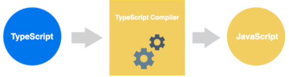
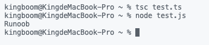

# 快速入门

```shell
#配置镜像地址
npm config set registry https://registry.npm.taobao.org
```

```shell
#下载typescript
npm install -g typescript
```

```shell
#检查
$ tsc -v
Version 3.2.2
```

```shell
#新建和app.js文件，并编辑以下代码
var message:string = "Hello World" 
console.log(message)
```

```shell
# 编译
tsc app.ts
```

```shell
# 编译成js
var message = "Hello World";
console.log(message);
```

```shell
# 跑js
$ node app.js 
Hello World›
```





# Vs code


# TypeScript 基础语法

```shell
# 同时编译多个ts文件
tsc file1.ts file2.ts file3.ts
```

**tsc常用编译参数：**

| 序号 | 编译参数说明                                                 |
| :--: | :----------------------------------------------------------- |
|  1.  | **--help**显示帮助信息                                       |
|  2.  | **--module**载入扩展模块                                     |
|  3.  | **--target**设置 ECMA 版本                                   |
|  4.  | **--declaration**额外生成一个 .d.ts 扩展名的文件。`tsc ts-hw.ts --declaration`以上命令会生成 ts-hw.d.ts、ts-hw.js 两个文件。 |
|  5.  | **--removeComments**删除文件的注释                           |
|  6.  | **--out**编译多个文件并合并到一个输出的文件                  |
|  7.  | **--sourcemap**生成一个 sourcemap (.map) 文件。sourcemap 是一个存储源代码与编译代码对应位置映射的信息文件。 |
|  8.  | **--module noImplicitAny**在表达式和声明上有隐含的 any 类型时报错 |
|  9.  | **--watch**在监视模式下运行编译器。会监视输出文件，在它们改变时重新编译。 |

**TypeScript 保留关键字**

|          |            |            |          |
| -------- | ---------- | ---------- | -------- |
| break    | as         | catch      | switch   |
| case     | if         | throw      | else     |
| var      | number     | string     | get      |
| module   | type       | instanceof | typeof   |
| public   | private    | enum       | export   |
| finally  | for        | while      | void     |
| null     | super      | this       | new      |
| in       | return     | true       | false    |
| any      | extends    | static     | let      |
| package  | implements | interface  | function |
| new      | try        | yield      | const    |
| continue | do         |            |          |

**空白和换行**

TypeScript 会**忽略程序中出现的空格、制表符和换行符。**

空格、制表符通常用来缩进代码，使代码易于阅读和理解。

🌟**TypeScript 区分大小写**

TypeScript 区分大写和小写字符。

**🌟注释问题**

**TypeScript 支持两种类型的注释**

- **单行注释 ( // )** − 在 // 后面的文字都是注释内容。
- **多行注释 (/\* \*/)** − 这种注释可以跨越多行。

# TypeScript与面向对象

面向对象是一种对现实世界理解和抽象的方法。

TypeScript 是一种面向对象的编程语言。

面向对象主要有两个概念：对象和类。

- **对象**：对象是类的一个实例（**对象不是找个女朋友**），有状态和行为。例如，一条狗是一个对象，它的状态有：颜色、名字、品种；行为有：摇尾巴、叫、吃等。
- **类**：类是一个模板，它描述一类对象的行为和状态。
- **方法**：方法是类的操作的实现步骤。

# 举个例子

首先，我写一个ts文件,test.ts

```typescript
class Site { 
    name():void { 
       console.log("Runoob") 
    } 
 } 
 var obj = new Site(); 
 obj.name();
```

然后我编译它变成js文件

```shell
tsc test.ts
```

然后我编译生成的js文件

```shell
node test.js
```

最后：



呐🌟

# 基础类型

typescript 包含以下数据类型：布尔值、数值、字符串、`null`、`undefined` 以及 ES6 中的新类型 **Symbol**和 ES10 中的新类型**BigInt**,共7种。

数据类型就不介绍了，说一下怎么定义吧。

## 布尔值

布尔值是最基础的数据类型，在 TypeScript 中，使用 `boolean` 定义布尔值类型：

```ts
// 编译通过
// 后面约定，未强调编译错误的代码片段，默认为编译通过
let isDone: boolean = false;


//注意，使用构造函数 Boolean 创造的对象不是布尔值：
//而是一个布尔对象
let createdByNewBoolean: boolean = new Boolean(1);
// Type 'Boolean' is not assignable to type 'boolean'.
// 'boolean' is a primitive, but 'Boolean' is a wrapper object. Prefer using 'boolean' when possible.
```

直接调用 `Boolean` 也可以返回一个 `boolean` 类型，也就是布尔值：

```ts
let createdByBoolean: boolean = Boolean(1);
```

🌟🌟在 TypeScript 中，`boolean` 是 JavaScript 中的基本类型，而 `Boolean` 是 JavaScript 中的构造函数。其他基本类型（除了 `null` 和 `undefined`）一样，不再赘述。

## 数值

使用`number` 定义数值类型：

```ts
let decLiteral: number = 6;
let hexLiteral: number = 0xf00d;
// ES6 中的二进制表示法
let binaryLiteral: number = 0b1010;
// ES6 中的八进制表示法
let octalLiteral: number = 0o744;
let notANumber: number = NaN;
let infinityNumber: number = Infinity;
```

编译结果：

```js
var decLiteral = 6;
var hexLiteral = 0xf00d;
// ES6 中的二进制表示法
var binaryLiteral = 10;
// ES6 中的八进制表示法
var octalLiteral = 484;
var notANumber = NaN;
var infinityNumber = Infinity;
```

其中 `0b1010` 和 `0o744` 是 ES6 中的二进制和八进制表示法，它们会被编译为十进制数字。

## 字符串

使用 `string` 定义字符串类型：

```ts
let myName: string = 'Tom';
let myAge: number = 25;

// 模板字符串
let sentence: string = `Hello, my name is ${myName}.
I'll be ${myAge + 1} years old next month.`;
```

```js
var myName = 'Tom';
var myAge = 25;
// 模板字符串
var sentence = "Hello, my name is " + myName + ".\nI'll be " + (myAge + 1) + " years old next month.";
```

其中 ``用来定义 [ES6 中的模板字符串，`${expr}用来在模板字符串中嵌入表达式。

## 空值

JavaScript 没有空值（Void）的概念，在 TypeScript 中，可以用 `void` 表示没有任何返回值的函数：

```ts
function alertName(): void {
    alert('My name is Tom');
}
```

声明一个 `void` 类型的变量没有什么用，因为你只能将它赋值为 `undefined` 和 `null`（只在 --strictNullChecks 未指定时）：

```ts
let unusable: void = undefined;
```

## Null 和 Undefined

在 TypeScript 中，可以使用 `null` 和 `undefined` 来定义这两个原始数据类型：

```ts
let u: undefined = undefined;
let n: null = null;
```

与 `void` 的区别是，`undefined` 和 `null` **是所有类型的子类型**。也就是说 `undefined` 类型的变量，可以赋值给 `所有类型`的变量：

```ts
// 这样不会报错
let num: number = undefined;
// 这样也不会报错
let u: undefined;
let num: number = u;
```

🌟🌟🌟即便同为表达空，但是 `void` 类型的变量不能赋值给 `number` 类型的变量：

```ts
let u: void;
let num: number = u;
// Type 'void' is not assignable to type 'number'.
```

# 🌟任意值

任意值（Any）用来表示允许赋值为任意类型。与之对应的，既然存在任意值，那么如果是一个普通类型，在赋值过程中改变类型是不被允许的：

```ts
let myFavoriteNumber: string = 'seven';
myFavoriteNumber = 7;
// 报错：index.ts(2,1): error TS2322: Type 'number' is not assignable to type 'string'.
```

但如果是 `any` 类型，则允许被赋值为任意类型。

```ts
let myFavoriteNumber: any = 'seven';
myFavoriteNumber = 7;
myFavoriteNumber = true;

console.log(myFavoriteNumber);
//通过,结果为true
```

**变量如果在声明的时候，未指定其类型，那么它会被识别为任意值类型**：

```ts
let something;
something = 'seven';
something = 7;
//此处setName为定义，只是展示，这段是错误代码
something.setName('Tom');
```

等价于

```ts
let something: any;
something = 'seven';
something = 7;

something.setName('Tom');
```

⚠️注意，仅适用于未初始化未定义类型的变量，如果你初始化了，就会走类型推断，就不是任意值了！

```ts
let something = 8;
something = 'seven';
// error ,something 已经被推断为 number。
something = 7;
```

# 类型推断

如果没有明确的指定类型，那么 TypeScript 会依照类型推论（Type Inference）的规则推断出一个类型。

以下代码虽然没有指定类型，但是会在编译的时候报错：

```ts
let myFavoriteNumber = 'seven';
myFavoriteNumber = 7;

// index.ts(2,1): error TS2322: Type 'number' is not assignable to type 'string'.
```

事实上，它等价于：

```ts
let myFavoriteNumber: string = 'seven';
myFavoriteNumber = 7;

// index.ts(2,1): error TS2322: Type 'number' is not assignable to type 'string'.
```

**昨日重现🌟如果定义的时候没有赋值，不管之后有没有赋值，都会被推断成 `any` 类型而完全不被类型检查**：

```ts
let myFavoriteNumber;
myFavoriteNumber = 'seven';
myFavoriteNumber = 7;
```

# 联合类型

没想到吧，类型还能联合🧸，联合类型（Union Types）**表示取值可以为多种类型中的一种**，世界变化万千，最后留下的只有唯一真我。

```ts
let myFavoriteNumber: string | number;//这里的|是‘或’的表达方式
myFavoriteNumber = 'seven';
myFavoriteNumber = 7;
// 通过
```

```ts
//含义是，允许 myFavoriteNumber 的类型是 string 或者 number，但是不能是其他类型。
let myFavoriteNumber: string | number;
myFavoriteNumber = true;

// index.ts(2,1): error TS2322: Type 'boolean' is not assignable to type 'string | number'.
// Type 'boolean' is not assignable to type 'number'.
//报错，因为这个值是字符串和数值的联合类型，但是不能赋给它其他类型的值。
```

**访问联合类型的属性和方法：**

当 TypeScript 不确定一个联合类型的变量到底是哪个类型的时候，我们**只能访问此联合类型的所有类型里共有的属性或方法**：

```ts
function getLength(something: string | number): number {
    return something.length;
}

// index.ts(2,22): error TS2339: Property 'length' does not exist on type 'string | number'.
// Property 'length' does not exist on type 'number'.
//length 不是 string 和 number 的共有属性，所以会报错。知道为什么吗？翻翻JavaScript中string和number的方法表就知道了🌟
```

访问 `string` 和 `number` 的共有属性是没问题的：

```ts
function getString(something: string | number): string {
    return something.toString();
}
//toString() 是公共方法
```

🌟也是坑，联合类型的变量在被赋值的时候，会根据类型推论的规则推断出一个类型：

```ts
let myFavoriteNumber: string | number;
myFavoriteNumber = 'seven';
console.log(myFavoriteNumber.length); // 5
myFavoriteNumber = 7;
console.log(myFavoriteNumber.length); // 编译时报错
// index.ts(5,30): error TS2339: Property 'length' does not exist on type 'number'.
```

上例中，第二行的 `myFavoriteNumber` 被推断成了 `string`，访问它的 `length` 属性不会报错。

而第四行的 `myFavoriteNumber` 被推断成了 `number`，访问它的 `length` 属性时就报错了。

# 对象的类型——接口

接口懂咩，这是一个重要概念，它是对行为的抽象，而具体如何行动需要由类（classes）去实现（implement）。简单的说，就是**只规范不定义**，我规定人要有名字和年龄，这个就是接口；你叫小李，年龄32就是真实的实体，也就是对象。

```ts
interface Person {
    name: string;
    age: number;
}

let tom: Person = {
    name: '小李',
    age: 32
};
```

## 可选属性

有时我们希望不要完全匹配一个形状，那么可以用可选属性：

```ts
interface Person {
    name: string;
    age?: number;
}

let tom: Person = {
    name: 'Tom'
};
```

```ts
interface Person {
    name: string;
    age?: number;
}

let tom: Person = {
    name: 'Tom',
    age: 25
};
```

上面都可以，我加了？，就表示可选，你只必须实现名字，年龄可选实现或不实现。

## 任意属性

有时候我们希望一个接口允许有**任意的属性**，可以使用如下方式：

```ts
interface Person {
    name: string;
    age?: number;
    [propName: string]: any;
}

let tom: Person = {
    name: 'Tom',
    gender: 'male'
};
```

⚠️：**一旦定义了任意属性，那么确定属性和可选属性的类型都必须是它的类型的子集**：举个例子

```ts
interface Person {
    name: string;
    age?: number;
    [propName: string]: string;
}

let tom: Person = {
    name: 'Tom',
    age: 25,
    gender: 'male'
};

// index.ts(3,5): error TS2411: Property 'age' of type 'number' is not assignable to string index type 'string'.
// index.ts(7,5): error TS2322: Type '{ [x: string]: string | number; name: string; age: number; gender: string; }' is not assignable to type 'Person'.
//   Index signatures are incompatible.
//     Type 'string | number' is not assignable to type 'string'.
//       Type 'number' is not assignable to type 'string'.
```

✨✨上面报错，因为我任意属性是string类型，那么name和ege都得是string，这是一个坑点。

那么，如果我又要任意属性，又要不同类型呢？这是很普遍的需求，ts也准备好了，虽然显得很憨😓。

**一个接口中只能定义一个任意属性。**如果接口中有多个类型的属性，则可以在任意属性中使用联合类型，因为要求只是确定属性和可选属性是任意属性的子集，只要我子集够多，那么就不存在限制问题：

```ts
interface Person {
    name: string;
    age?: number;
    [propName: string]: string | number;
}

let tom: Person = {
    name: 'Tom',
    age: 25,
    gender: 'male'
};
```

## 只读属性

有时候我们希望**对象中的一些字段只能在创建的时候被赋值**，也就是以前学的finaly之类的“定值”，那么可以用 `readonly` 定义只读属性：

```ts
interface Person {
    readonly id: number;//只读
    name: string;
    age?: number;
    [propName: string]: any;
}

let tom: Person = {
    id: 89757,//修改只读属性导致报错
    name: 'Tom',
    gender: 'male'
};

tom.id = 9527;

// index.ts(14,5): error TS2540: Cannot assign to 'id' because it is a constant or a read-only property.
//报错事因为我定义了只读，你去改它
```

# 举个🌰

 

```ts
///<reference path="../plugins/typescript/typings/jquery.d.ts" />

//Class Types(implements)

 interface IClock {
    currentTime: Date;
    setTime(d: Date);
}
  
//--实现IClock接口
class Clock implements  IClock{
    
    currentTime:Date;
    constructor(h: number, m: number) { }//--构造函数方法
    setTime(d:Date){
        this.currentTime=d;   
    }
}
 //--------------------------------------------------
interface IClock1 {
     new (hour: number, minute: number);
}
class Clock1  {
    currentTime: Date;
    constructor(h: number, m: number) { }
}
 
var cs: IClock1 = Clock1;
var newClock = new cs(7, 30);

console.log(newClock); 
```


# 数组的类型

# 函数的类型

# 类型断言

# 声明

# 内置对象

剩下的明天补充！
