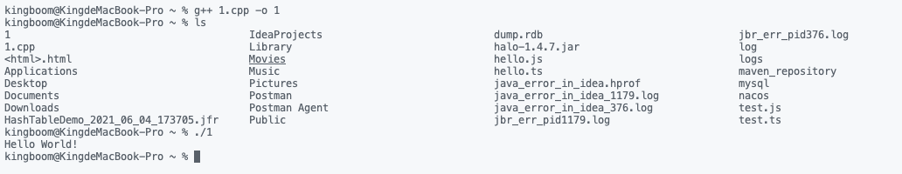

# 1.快速入门

如果是macbook 需要下载xcode获取g++解析器。

1. 新建hello.cpp文件

   ```sh
   touch hello.cpp
   ```

2. 编写c++代码

   ```c++
   #include <iostream>
   
   int main()
   {
       std::cout << "Hello World!\n";
       return 0;
   }
   ```

3. 编译它

   ```sh
   g++ hello.cpp -o hello
   ```

4. 启动它

   ```sh
   ./hello
   ```

   🌟：like this

   

# 2. vscode

# 3. 
