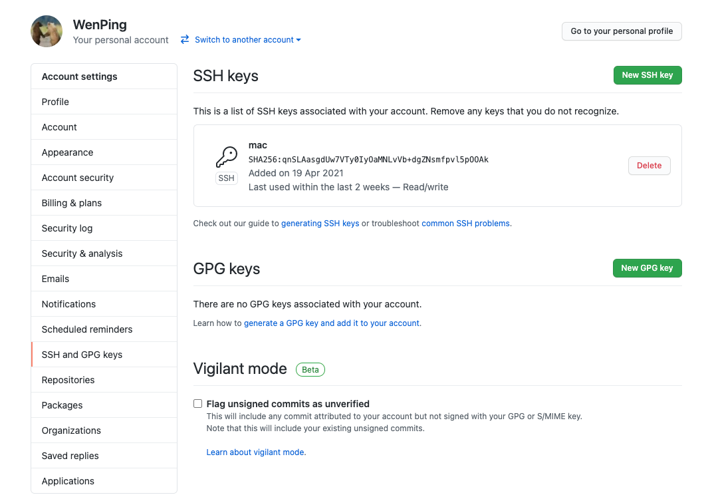
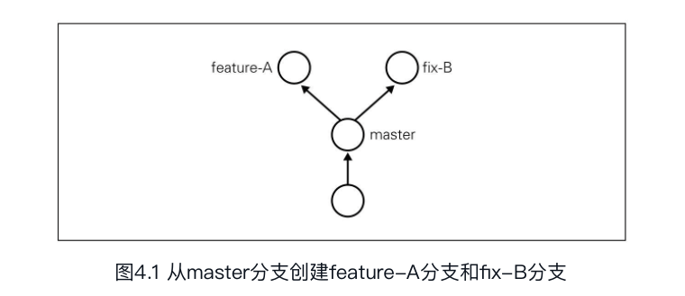
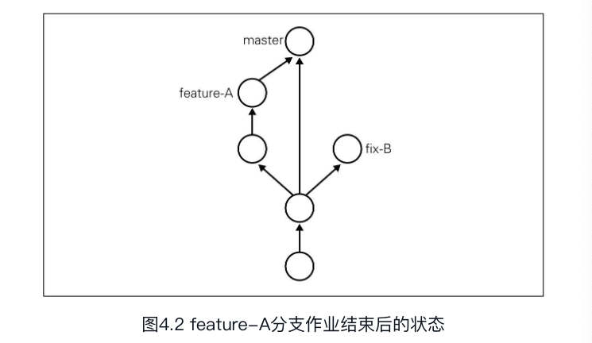
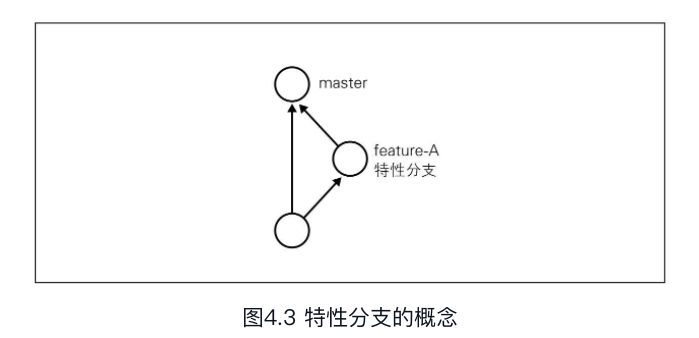

# Git初始配置

```shell
#用户名
git config --global user.name "Firstname Lastname" 
#邮箱
git config --global user.email "Email"
#颜色，提高可读性
git config --global color.ui.auto
```

```shell
#查看本地git密钥
cat ~/.ssh/id_rsa.pub
#创建SSH KEY
ssh-keygen -t rsa -C "your_email@example.com"
#然后复制密钥到Settings中的SSH Keys菜单，点击new SSH Key，会出现Title和Key两个输入框。在Title中输入适当的密钥名称。Key部分请粘贴id_rsa.pub文件里的内容。
```



```shell
#测试配置是否成功
ssh -T git@github.com
```

# 基本操作

```shell
#舒适化项目
mkdir git-tutorial
cd git-tutorial
git init
#查看仓库的状态,这个很常用
git status
#向暂存区中添加文件,暂存区市提交之前的一个临时区域
git add
#保存仓库的历史记录
git commit 可以将当前暂存区中的文件实际保存到仓库的历史记录中。
git commit -m "第一次提交" -m参数后的"第一次提交是对这个提交的概述"
备注：如果不加-m会转到编辑器，编辑器格式如下
●第一行：用一行文字简述提交的更改内容
●第二行：空行
●第三行以后：记述更改的原因和详细内容
#查看提交日志
git log 可以查看以往仓库中提交的日志。包括可以查看什么人什么时候进行了提交或合并。
补充： git log --pretty=short 这样开发人员就能轻松地把握多个提交
			git log README.md在git log命令后加上目录名，便会只显示该目录下的日志。
			git log -p README.md显示提交带来的改动，可以加上-p参数，文件前后差别就会显示.
#查看更改前后的差别
git diff 可以查看工作树、暂存区、最新提交之间的差别。
git diff HEAD 查看本次提交和上次提交之间的差别，等确认完毕后再进行提交。
```

**补充：在执行git commit命令之前先执行git diff HEAD命令，查看本次提交与上次提交之间有什么差别，等确认完毕后再进行提交。这里的HEAD是指向当前分支中最新一次提交的指针。**

# 分支操作

当出现多个并行作业时，我们会使用分支。这类并行开发等过程，往往存在多个最新代码状态。



不同分支中，可以同时进行完全不同的作业。等作业完成之后再与master分支合并。



```shell
#显示分支一览图
git branch

#创建、切换分支
git checkout -b #当我们需要以当前分支为基础，创建新的分支
	#切换到feature-A分支并进行提交
	git checkout -b feature-A #执行左边的命令，创建并切换到名为feature-A的分支
	#也可以连续执行两条命令 git branch feature-A;git checkout feature-A
	
#在已有分支上切换
git checkout master
git checkout - #连字符代替分支名，就可以切换至上一个分支，当然，将“-”改成feature-A同样可以切换到feature-A分支。
```

## 特性分支

git与subversion(SVN)等集中型版本管理系统不同，**它创建分支不需要连接中央仓库，所以能够相对轻松地创建分支。**
特性分支顾名思义，是集中实现单一特性(主题)，除此之外不进行任何作业的分支。在日常开发中，往往会创建数个特性分支，同时在此之外再保留一个随时发布的稳定版本，稳定版本的角色通常由master分支担当。



/Users/kingboom/Library/Application Support/JetBrains/IntelliJIdea2021.1/idea.vmoptions
