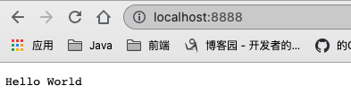
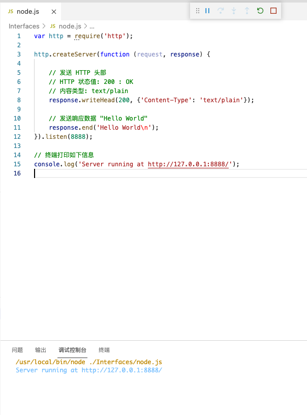

# 快速入门

http fs child_process

## “hello world”

1. **引入  required 模块：**我们可以使用 **require** 指令来载入 Node.js 模块。
2. **创建服务器：**服务器可以监听客户端的请求，类似于 Apache 、Nginx 等 HTTP 服务器。
3. **接收请求与响应请求** 服务器很容易创建，客户端可以使用浏览器或终端发送 HTTP 请求，服务器接收请求后返回响应数据。

### 引入  required 模块

使用 **require** 指令来**载入 http 模块**，并将实例化的 HTTP 赋值给变量 http，实例如下:

```javascript
var http = require("http");
```

### 创建服务器

接下来我们使用 http.createServer() 方法创建服务器，并使用 listen 方法绑定 8888 端口。 函数通过 request, response 参数来接收和响应数据。

实例如下，在你项目的根目录下创建一个叫 server.js 的文件，并写入以下代码：

```javascript
var http = require('http');

http.createServer(function (request, response) {

    // 发送 HTTP 头部 
    // HTTP 状态值: 200 : OK
    // 内容类型: text/plain
    response.writeHead(200, {'Content-Type': 'text/plain'});

    // 发送响应数据 "Hello World"
    response.end('Hello World\n');
}).listen(8888);

// 终端打印如下信息
console.log('Server running at http://127.0.0.1:8888/');
```

### 跑起来

```sh
node server.js
```





## NPM

NPM是随同NodeJS一起安装的**包管理工具**(这个熟吧，brew)

- 允许用户从NPM服务器下载别人编写的第三方包到本地使用。
- 允许用户从NPM服务器下载并安装别人编写的命令行程序到本地使用。
- 允许用户将自己编写的包或命令行程序上传到NPM服务器供别人使用。

### 使用淘宝镜像

大家都知道国内直接使用 npm 的官方镜像是非常慢的，这里推荐使用淘宝 NPM 镜像。

```sh
$ npm install -g cnpm --registry=https://registry.npm.taobao.org
```

然后 就可以使用cnpm安装模块了！

```sh
$ cnpm install [name]
```

### 使用 npm 命令安装模块

npm 安装 Node.js 模块语法格式如下：

```sh
$ npm install <Module Name>
```

以下实例，我们使用 npm 命令安装常用的 Node.js web框架模块 **express**:

```sh
$ npm install express
```

安装好之后，express 包就放在了工程目录下的 node_modules 目录中，因此在代码中只需要通过 **require('express')** 的方式就好，无需指定第三方包路径。

```javascript
var express = require('express');
```

### 全局安装与本地安装

```sh
npm install express          # 本地安装
npm install express -g   # 全局安装
```

✨✨✨如果报错：npm err! Error: connect ECONNREFUSED 127.0.0.1:8087 

跑这个

```sh
$ npm config set proxy null
```

### 本地安装

- 1. **将安装包放在 ./node_modules 下（运行 npm 命令时所在的目录）**，如果没有 node_modules 目录，会在当前执行 npm 命令的目录下生成 node_modules 目录。
- 2. **可以通过 require() 来引入本地安装的包。**

### 全局安装

- 1. **将安装包放在 /usr/local 下或者你 node 的安装目录。**
- 2. **可以直接在命令行里使用。**

如果你希望具备两者功能，则需要在两个地方安装它或使用 **npm link**。

⚠️⚠️⚠️⚠️⚠️：一般情况下我们选择安装到./node_modules目录下，因为我们方便我们写代码引入，如果是测试的话，建议全局安装！

### 使用 npm 命令卸载模块

```sh
$ npm uninstall express
```

然后到 /node_modules/ 目录下查看包是否还存在：

```sh
$ npm ls
```

### 使用 npm 命令更新模块

```sh
$ npm update express
```

### 使用 npm 命令搜索模块

```sh
$ npm search express
```

### 做为开源者创建发布模块

创建模块，package.json 文件是必不可少的。我们可以使用 NPM 生成 package.json 文件，生成的文件包含了基本的结果。

```sh
$ npm init
This utility will walk you through creating a package.json file.
It only covers the most common items, and tries to guess sensible defaults.

See `npm help json` for definitive documentation on these fields
and exactly what they do.

Use `npm install <pkg> --save` afterwards to install a package and
save it as a dependency in the package.json file.

Press ^C at any time to quit.
name: (node_modules) runoob                   # 模块名
version: (1.0.0) 
description: Node.js 测试模块(www.runoob.com)  # 描述
entry point: (index.js) 
test command: make test
git repository: https://github.com/runoob/runoob.git  # Github 地址
keywords: 
author: 
license: (ISC) 
About to write to ……/node_modules/package.json:      # 生成地址

{
  "name": "runoob",
  "version": "1.0.0",
  "description": "Node.js 测试模块(www.runoob.com)",
  ……
}


Is this ok? (yes) yes
```

在 npm 资源库中注册用户（使用邮箱注册）：

```sh
$ npm adduser
Username: mcmohd
Password:
Email: (this IS public) mcmohd@gmail.com
```

发布模块：

```sh
$ npm publish
```

# Node.js REPL(交互式解释器)

Node.js REPL(Read Eval Print Loop:交互式解释器) 表示一个电脑的环境，类似 Window 系统的终端或 Unix/Linux shell，我们可以在终端中输入命令，并接收系统的响应。

Node 自带了交互式解释器，可以执行以下任务：

- **读取** - 读取用户输入，解析输入的 Javascript 数据结构并存储在内存中。
- **执行** - 执行输入的数据结构
- **打印** - 输出结果
- **循环** - 循环操作以上步骤直到用户两次按下 **ctrl-c** 按钮退出。

Node 的交互式解释器可以很好的调试 Javascript 代码。

我们可以输入以下命令来启动 Node 的终端：

```sh
$ node
> 
```

## REPL 命令

- **ctrl + c** - 退出当前终端。
- **ctrl + c 按下两次** - 退出 Node REPL。
- **ctrl + d** - 退出 Node REPL.
- **向上/向下 键** - 查看输入的历史命令
- **tab 键** - 列出当前命令
- **.help** - 列出使用命令
- **.break** - 退出多行表达式
- **.clear** - 退出多行表达式
- **.save \*filename\*** - 保存当前的 Node REPL 会话到指定文件
- **.load \*filename\*** - 载入当前 Node REPL 会话的文件内容。

# Node.js 回调函数

Node.js 异步编程的直接体现就是回调。

异步编程依托于回调来实现，但不能说使用了回调后程序就异步化了。

回调函数在完成任务后就会被调用，Node 使用了大量的回调函数，Node 所有 API 都支持回调函数。

例如，我们可以一边读取文件，一边执行其他命令，在文件读取完成后，我们将文件内容作为回调函数的参数返回。这样在执行代码时就没有阻塞或等待文件 I/O 操作。这就大大提高了 Node.js 的性能，可以处理大量的并发请求。

回调函数一般作为函数的最后一个参数出现：

```js
function foo1(name, age, callback) { }
function foo2(value, callback1, callback2) { }
```

## 阻塞代码实例

创建一个input.txt

```tex
大家晚上好！
```

创建 main.js 文件, 代码如下：

```js
var fs = require("fs");

var data = fs.readFileSync('input.txt');

console.log(data.toString());
console.log("程序执行结束!");
```

执行：

```sh
$ node main.js
```

这样便读取了。

## 非阻塞代码实例

一样，创建一个input.txt文件。

然后创建main.js文件：

```js
var fs = require("fs");

fs.readFile('input.txt', function (err, data) {
    if (err) return console.error(err);
    console.log(data.toString());
});

console.log("程序执行结束!");
```


第一个实例在文件读取完后才执行程序。 第二个实例我们不需要等待文件读取完，这样就可以在读取文件时同时执行接下来的代码，大大提高了程序的性能。

因此，**阻塞是按顺序执行的，而非阻塞是不需要按顺序的**，所以如果需要处理回调函数的参数，我们就需要写在回调函数内。

⚠️⚠️⚠️：回调函数，需要两个或两个以上参数，而回调函数一般放最后

**简单一点理解就是：使用回调函数，便该线程独占，如果后续还有程序则另起线程运行，互不影响！**

# 事件循环

Node.js 是单进程单线程应用程序，但是因为 **V8 引擎**提供的异步执行回调接口，通过这些接口可以处理大量的并发，所以性能非常高。

Node.js 几乎每一个 API 都是支持回调函数的。

Node.js 基本上所有的事件机制都是用设计模式中观察者模式实现。

Node.js 单线程类似进入一个while(true)的事件循环，直到没有事件观察者退出，每个异步事件都生成一个事件观察者，如果有事件发生就调用该回调函数.

# 模块调用

通过exports 公开接口

```js
exports.world = function() {
  console.log('Hello World');
}
```

通过require 用于从外部获取一个模块的接口

```js
var hello = require('./hello');
hello.world();
```

但有时候我不想暴露我所有的代码，只想把一个对象封装：

```js
//hello.js 
function Hello() { 
    var name; 
    this.setName = function(thyName) { 
        name = thyName; 
    }; 
    this.sayHello = function() { 
        console.log('Hello ' + name); 
    }; 
}; 
module.exports = Hello;
```

然后再获取就是得到这个对象了：

```js
//main.js 
var Hello = require('./hello'); 
hello = new Hello(); 
hello.setName('BYVoid'); 
hello.sayHello(); 
```

✨✨✨require方法接受以下几种参数的传递：

- http、fs、path等，原生模块。
- ./mod或../mod，相对路径的文件模块。
- /pathtomodule/mod，绝对路径的文件模块。
- mod，非原生模块的文件模块。

## 备注

不建议同时使用 exports 和 module.exports。

如果先使用 exports 对外暴露属性或方法，再使用 module.exports 暴露对象，会使得 exports 上暴露的属性或者方法失效。

原因在于，exports 仅仅是 module.exports 的一个引用。在 nodejs 中，是这么设计 require 函数的：

```js
function require(...){
  var module = {exports: {}};

  ((module, exports) => {
    function myfn () {}
    // 这个myfn就是我们自己的代码
    exports.myfn = myfn; // 这里是在原本的对象上添加了一个myfn方法。
    module.exports = myfn;// 这个直接把当初的对象进行覆盖。
  })(module,module.exports)
  return module.exports;
}
```

