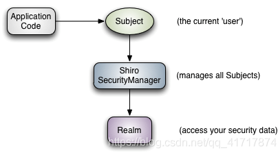

# 1. shiro功能

Authentication：身份认证 / 登录，验证用户是不是拥有相应的身份；
Authorization：授权，即权限验证，验证某个已认证的用户是否拥有某个权限；即判断用户是否能做事情，常见的如：验证某个用户是否拥有某个角色。或者细粒度的验证某个用户对某个资源是否具有某个权限；
Session Manager：会话管理，即用户登录后就是一次会话，在没有退出之前，它的所有信息都在会话中；会话可以是普通 JavaSE 环境的，也可以是如 Web 环境的；
Cryptography：加密，保护数据的安全性，如密码加密存储到数据库，而不是明文存储；
Web Support：Web 支持，可以非常容易的集成到 Web 环境；
Caching：缓存，比如用户登录后，其用户信息、拥有的角色 / 权限不必每次去查，这样可以提高效率；
Concurrency：shiro 支持多线程应用的并发验证，即如在一个线程中开启另一个线程，能把权限自动传播过去；
Testing：提供测试支持；
Run As：允许一个用户假装为另一个用户（如果他们允许）的身份进行访问；
Remember Me：记住我，这个是非常常见的功能，即一次登录后，下次再来的话不用登录了。
**记住一点，Shiro 不会去维护用户、维护权限；这些需要我们自己去设计 / 提供；然后通过相应的接口注入给 Shiro 即可，最常见方法是构建在role表中**



以上是从应用程序层面观察shiro，应用程序提供主体（常见即是用户名和密码），然后进入安全管理器判断主体权限，安全处理器通过查看域获取安全数据（用户，角色，权限等）。


然后是内部的分析：

- Subject：主体，可以看到主体可以是任何可以与应用交互的 “用户”；


- SecurityManager：相当于 SpringMVC 中的 DispatcherServlet 或者 Struts2 中的 FilterDispatcher；是 Shiro 的心脏；所有具体的交互都通过 SecurityManager 进行控制；它管理着所有 Subject、且负责进行认证和授权、及会话、缓存的管理。


- Authenticator：认证器，负责主体认证的，这是一个扩展点，如果用户觉得 Shiro 默认的不好，可以自定义实现；其需要认证策略（Authentication Strategy），即什么情况下算用户认证通过了；


- Authrizer：授权器，或者访问控制器，用来决定主体是否有权限进行相应的操作；即控制着用户能访问应用中的哪些功能；


- Realm：可以有 1 个或多个 Realm，可以认为是安全实体数据源，即用于获取安全实体的；可以是 JDBC 实现，也可以是 LDAP 实现，或者内存实现等等；由用户提供；注意：Shiro 不知道你的用户 / 权限存储在哪及以何种格式存储；所以我们一般在应用中都需要实现自己的 Realm；


- SessionManager：如果写过 Servlet 就应该知道 Session 的概念，Session 呢需要有人去管理它的生命周期，这个组件就是 SessionManager；而 Shiro 并不仅仅可以用在 Web 环境，也可以用在如普通的 JavaSE 环境、EJB 等环境；所有呢，Shiro 就抽象了一个自己的 Session 来管理主体与应用之间交互的数据；这样的话，比如我们在 Web 环境用，刚开始是一台 Web 服务器；接着又上了台 EJB 服务器；这时想把两台服务器的会话数据放到一个地方，这个时候就可以实现自己的分布式会话（如把数据放到 Memcached 服务器）；


- SessionDAO：DAO 大家都用过，数据访问对象，用于会话的 CRUD，比如我们想把 Session 保存到数据库，那么可以实现自己的 SessionDAO，通过如 JDBC 写到数据库；比如想把 Session 放到 Memcached 中，可以实现自己的 Memcached SessionDAO；另外 SessionDAO 中可以使用 Cache 进行缓存，以提高性能；


- CacheManager：缓存控制器，来管理如用户、角色、权限等的缓存的；因为这些数据基本上很少去改变，放到缓存中后可以提高访问的性能


- Cryptography：密码模块，Shiro 提高了一些常见的加密组件用于如密码加密 / 解密的。
  

# 2. 身份验证

身份验证，即在应用中谁能证明他就是他本人。一般提供如他们的身份 ID 一些标识信息来表明他就是他本人，如提供身份证，用户名 / 密码来证明。

在 shiro 中，用户需要提供 principals （身份）和 credentials（证明）给 shiro，从而应用能验证用户身份：

principals：身份，即主体的标识属性，可以是任何东西，如用户名、邮箱等，唯一即可。一个主体可以有多个 principals，但只有一个 Primary principals，一般是用户名 / 密码 / 手机号。

credentials：证明 / 凭证，即只有主体知道的安全值，如密码 / 数字证书等。


上图便是身份验证的流程图：

1. 首先调用 Subject.login(token) 进行登录，其会自动委托给 Security Manager，调用之前必须通过 SecurityUtils.setSecurityManager() 设置；

2. **SecurityManager 负责真正的身份验证逻辑**；它会委托给 Authenticator 进行身份验证；

3. **Authenticator 才是真正的身份验证者**，Shiro API 中核心的身份认证入口点，此处可以自定义插入自己的实现；

4. **Authenticator 可能会委托给相应的 AuthenticationStrategy 进行多 Realm 身份验证，默认 ModularRealmAuthenticator 会调用 AuthenticationStrategy 进行多 Realm 身份验证；**

5. **Authenticator 会把相应的 token 传入 Realm，从 Realm 获取身份验证信息，如果没有返回 / 抛出异常表示身份验证失败了**。此处可以配置多个 Realm，将按照相应的顺序及策略进行访问。

## 2.1 Realm

Realm：域，Shiro 从从 Realm 获取安全数据（如用户、角色、权限），就是说 SecurityManager 要验证用户身份，那么它需要从 Realm 获取相应的用户进行比较以确定用户身份是否合法；也需要从 Realm 得到用户相应的角色 / 权限进行验证用户是否能进行操作；可以把 Realm 看成 DataSource，即安全数据源。

单Realm的配置：继承AutorizingRealm 重写它的部分方法

```java
public class MyRealm extends AuthorizingRealm {
    /**
     * 获取角色与权限
     *doGetAuthorizationInfo执行时机有三个，如下：
     *  1、subject.hasRole(“admin”) 或 subject.isPermitted(“admin”)：自己去调用这个是否有什么角色或者是否有什么权限的时候；
     *  2、@RequiresRoles("admin") ：在方法上加注解的时候；
     *  3、@shiro.hasPermission name = "admin"/@shiro.hasPermission："dustin:test"在页面上加shiro标签的时候，即进这个页面的时候扫描到有这个标签的时候。
     * @param principals
     * @return
     */
    @Override
    protected AuthorizationInfo doGetAuthorizationInfo(PrincipalCollection principals) {
        return null;
    }

    /**
     * 登录信息验证
     
     * 1.doGetAuthenticationInfo执行时机如下
     * 当调用Subject currentUser = SecurityUtils.getSubject();
     * currentUser.login(token);
     * @param token
     * @return
     * @throws AuthenticationException
     */
    @Override
    protected AuthenticationInfo doGetAuthenticationInfo(AuthenticationToken token) throws AuthenticationException {

        String username = (String)token.getPrincipal();
       String password = new String((char[])token.getCredentials());

        if(!"zhang".equals(username)) {
            throw new UnknownAccountException(); //如果用户名错误
        }
        if(!"123".equals(password)) {
            throw new IncorrectCredentialsException(); //如果密码错误
        }


       return new SimpleAuthenticationInfo(username, password, getName());
    }

		//
    @Override
    public void clearCachedAuthorizationInfo(PrincipalCollection principals) {
        super.clearCachedAuthorizationInfo(principals);
    }

    @Override
    public void clearCachedAuthenticationInfo(PrincipalCollection principals) {
        super.clearCachedAuthenticationInfo(principals);
    }

    @Override
    public void clearCache(PrincipalCollection principals) {
        super.clearCache(principals);
    }

    public void clearAllCachedAuthorizationInfo() {
        getAuthorizationCache().clear();
    }

    public void clearAllCachedAuthenticationInfo() {
        getAuthenticationCache().clear();
    }

    public void clearAllCache() {
        clearAllCachedAuthenticationInfo();
        clearAllCachedAuthorizationInfo();

    }
}
```

# 3. 授权

```java
//@RequiresRoles 通过权限名实现授权
@GetMapping("/delete")
@RequiresRoles("admin")
public String delete(){
    return "delete";
}
//@RequiresPermissions 通过用户权限信息实现授权
@GetMapping("/select")
@RequiresPermissions("select")
public String select(){
    return "select";
}
```

# 4. 加密

在涉及到密码存储问题上，应该加密或者生成密码摘要存储，而不是存储明文密码。为避免数据泄露对用户造成很大的损失，应该加密或者生成不可逆的摘要方式存储。

Shiro 提供了base64 和 16 进制字符串编码、 解码的 API 支持，方便一些编码解码操作。Shiro 内部的一些数据的存储表示都使用了 base64 和 16 进制字符串。

```javascript
String str = "likang";
String base64Encoded = Base64.encodeToString(str.getBytes());
String str2 = Base64.decodeToString(base64Encoded);
Assert.assertEquals(str, str2);
```

通过如上方式可以进行 base64 编码 / 解码操作，更多 API 请参考其 Javadoc。

```javascript
String str3 = "likang";
String base64Encoded2 = Hex.encodeToString(str3.getBytes());
String str4 = new String(Hex.decode(base64Encoded2.getBytes()));
Assert.assertEquals(str3, str4);
```

通过如上方式可以进行 16 进制字符串编码 / 解码操作，更多 API 请参考其 Javadoc。


**5.2 散列算法**

散列算法：一般用于生成数据的摘要信息，是一种不可逆的算法，一般适合存储密码之类的数据，**常见的散列算法如 MD5、SHA 等**。一般进行散列时最好提供一个 salt（盐），比如加密密码 “admin”，产生的散列值是 “21232f297a57a5a743894a0e4a801fc3”，可以到一些 md5 解密网站很容易的通过散列值得到密码 “admin”，即如果直接对密码进行散列相对来说破解更容易，此时我们可以加一些只有系统知道的干扰数据，如用户名和 ID（即盐）；这样散列的对象是 “密码 + 用户名 +ID”，这样生成的散列值相对来说更难破解。

```javascript
String str = "likang";
String salt = "123";
//还可以转换为 toBase64()/toHex()
String md5 = new Md5Hash(str, salt).toString();
System.out.println(md5);
```

如上代码通过盐 “123”MD5 散列 “likang”。另外散列时还可以指定散列次数，如 2 次表示：md5(md5(str))：“new Md5Hash(str, salt, 2).toString()”。

```javascript
String str = "likang";
String salt = "123";
String sha1 = new Sha256Hash(str, salt).toString();
```

使用 SHA256 算法生成相应的散列数据，另外还有如 SHA1、SHA512 算法。

**Shiro 还提供了通用的散列支持:**

```javascript
String str = "likang";
String salt = "123";
//内部使用MessageDigest
String simpleHash = new SimpleHash("SHA-1", str, salt).toString();
```

通过调用 SimpleHash 时指定散列算法，其内部使用了 Java 的    MessageDigest 实现。

为了方便使用，Shiro 提供了 HashService，默认提供了DefaultHashService 实现。

```javascript
//默认算法SHA-512
DefaultHashService hashService = new DefaultHashService(); 
hashService.setHashAlgorithmName("SHA-512");
//私盐，默认无
hashService.setPrivateSalt(new SimpleByteSource("123")); 
//是否生成公盐，默认false
hashService.setGeneratePublicSalt(true);
//用于生成公盐。默认就这个
hashService.setRandomNumberGenerator(new SecureRandomNumberGenerator());
//生成Hash值的迭代次数
hashService.setHashIterations(1); 
HashRequest request = new HashRequest.Builder()
        .setAlgorithmName("MD5").setSource(ByteSource.Util.bytes("liakng"))
        .setSalt(ByteSource.Util.bytes("123")).setIterations(2).build();
String hex = hashService.computeHash(request).toHex();
```

**说明：**

- 首先创建一个 DefaultHashService，默认使用 SHA-512 算法；
- 以通过 hashAlgorithmName 属性修改算法；
- 可以通过 privateSalt 设置一个私盐，其在散列时自动与用户传入的公盐混合产生一个新盐；
- 可以通过 generatePublicSalt 属性在用户没有传入公盐的情况下是否生成公盐；
- 可以设置 randomNumberGenerator 用于生成公盐；
- 可以设置 hashIterations 属性来修改默认加密迭代次数；
- 需要构建一个 HashRequest，传入算法、数据、公盐、迭代次数。

SecureRandomNumberGenerator 用于生成一个随机数：

```javascript
SecureRandomNumberGenerator randomNumberGenerator = new SecureRandomNumberGenerator();
randomNumberGenerator.setSeed("123".getBytes());
String hex = randomNumberGenerator.nextBytes().toHex();
```


**5.3 加密、解密**

Shiro 还提供对称式加密 和 解密算法的支持，如 AES、Blowfish 等；

**AES 算法实现：**

```javascript
AesCipherService aesCipherService = new AesCipherService();
//设置key长度
aesCipherService.setKeySize(128); 
//生成key
Key key = aesCipherService.generateNewKey();
String text = "likang";
//加密
String encrptText = aesCipherService.encrypt(text.getBytes(), key.getEncoded()).toHex();
//解密
String text2 = new String(aesCipherService.decrypt(Hex.decode(encrptText), key.getEncoded()).getBytes());
Assert.assertEquals(text, text2);
```

**PasswordService和CredentialsMatcher**

Shiro 提供了 PasswordService 及 CredentialsMatcher 用于提供加密密码及验证密码服务。

```javascript
public interface PasswordService {
    //输入明文密码得到密文密码
    String encryptPassword(Object var1) throws IllegalArgumentException;
    //明文密码和密文是否匹配
    boolean passwordsMatch(Object var1, String var2);
}
public interface CredentialsMatcher {
    ////匹配用户输入的token的凭证（未加密）与系统提供的凭证（已加密）
    boolean doCredentialsMatch(AuthenticationToken var1, AuthenticationInfo var2);
}
```

Shiro 默认提供了 PasswordService 实现 DefaultPasswordService；CredentialsMatcher 实现 PasswordMatcher 及 HashedCredentialsMatcher。
