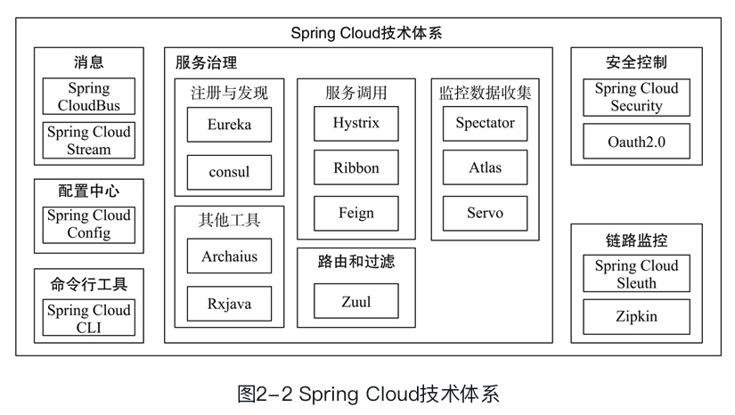
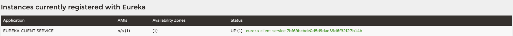
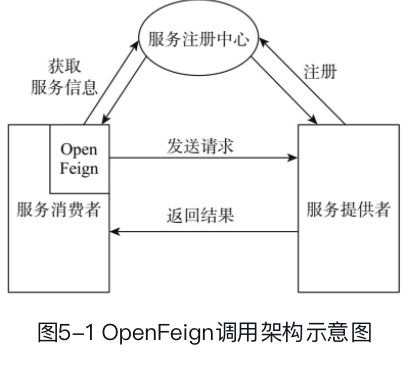
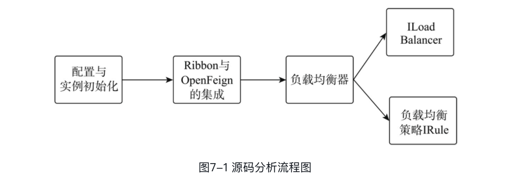
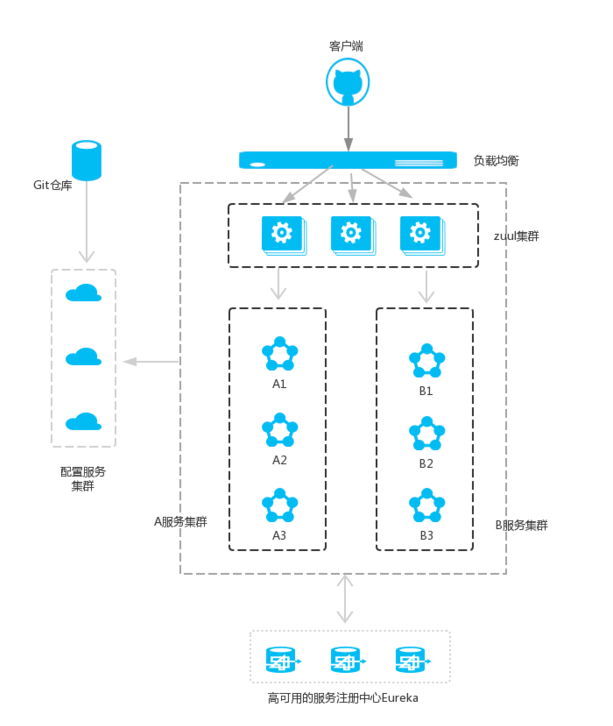
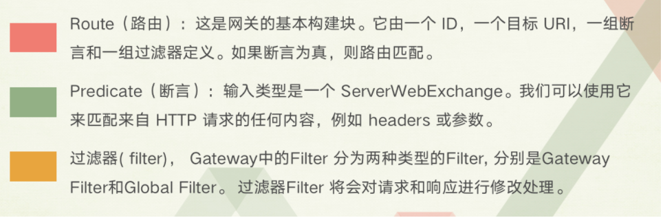

# 总览spingcloud



Spring Cloud包含的组件众多，各个组件都有各自不同的特色和优点，为用户提供丰富的选择：

- **服务注册与发现组件**：Eureka、Zookeeper和Consul等。本书将会重点讲解Eureka, Eureka是一个REST风格的服务注册与发现的基础服务组件。
- **服务调用组件**：Hystrix、Ribbon和OpenFeign；其中Hystrix能够使系统在出现依赖服务失效的情况下，通过隔离系统依赖服务的方式，防止服务级联失败，同时提供失败回滚机制，使系统能够更快地从异常中恢复；**Ribbon用于提供客户端的软件负载均衡算法**，还提供了一系列完善的配置项如连接超时、重试等；OpenFeign是一个声明式RESTful网络请求客户端，它使编写Web服务客户端变得更加方便和快捷。
- **路由和过滤组件**：包括Zuul和Spring Cloud Gateway。Spring Cloud Gateway提供了一个构建在Spring生态之上的API网关，其旨在提供一种简单而有效的途径来发送API，并为他们提供横切关注点，如：安全性、监控指标和弹性。
- **配置中心组件**：Spring Cloud Config实现了配置集中管理、动态刷新等配置中心的功能。配置通过Git或者简单文件来存储，支持加解密。
- **消息组件**：Spring Cloud Stream和Spring Cloud Bus。Spring Cloud Stream对于分布式消息的各种需求进行了抽象，包括发布订阅、分组消费和消息分区等功能，实现了微服务之间的异步通信。Spring Cloud Bus主要提供了服务间的事件通信（如刷新配置）。
- **安全控制组件**：Spring Cloud Security基于OAuth2.0开放网络的安全标准，提供了微服务环境下的单点登录、资源授权和令牌管理等功能。
- **链路监控组件**：Spring Cloud Sleuth提供了全自动、可配置的数据埋点，以收集微服务调用链路上的性能数据，并可以结合Zipkin进行数据存储、统计和展示。

除了上述组件之外，Spring Cloud还提供了命令行工具Spring Cloud Cli和集群工具Spring CloudCluster。Spring Cloud Cli提供了以命令行和脚本的方式来管理微服务及Spring Cloud组件的方式，Spring Cloud Cluster提供了集群选主、分布式锁和一次性令牌等分布式集群需要的技术组件。

# 1.服务注册于发现Eureka


Spring Cloud Netflix Eureka是Spring Cloud提供用于服务发现和注册的基础组件，是搭建SpringCloud微服务架构的前提之一。Eureka作为一个开箱即用的基础组件，屏蔽了底层Server和Client交互的细节，使得开发者能够将精力更多地放在业务逻辑上，加快微服务架构的实施和项目的开发。

在Netflix中，Eureka是一个RESTful风格的服务注册与发现的基础服务组件。Eureka由两部分组成，一个是Eureka Server，提供服务注册和发现功能，即我们上面所说的服务器端；另一个是EurekaClient，它简化了客户端与服务端之间的交互。Eureka Client会定时将自己的信息注册到EurekaServer中，并从Server中发现其他服务。**Eureka Client中内置一个负载均衡器，用来进行基本的负载均衡。**

## 1. 搭建服务注册中心

```xml
    <dependencies>
        <dependency>
            <groupId>org.springframework.cloud</groupId>
            <artifactId>spring-cloud-starter-netflix-eureka-server</artifactId>
        </dependency>
        <dependency>
            <groupId>org.springframework.boot</groupId>
            <artifactId>spring-boot-starter-actuator</artifactId>
        </dependency>
        <dependency>
            <groupId>org.springframework.boot</groupId>
            <artifactId>spring-boot-starter-web</artifactId>
        </dependency>
    </dependencies>
```

```java
//启动类添加注解@EnableEurekaServer
@SpringBootApplication
//会为项目自动配置必须的配置类，标识该服务为注册中心
@EnableEurekaServer
public class Chapter4EurekaServerApplication {

    public static void main(String[] args) {
        SpringApplication.run(Chapter4EurekaServerApplication.class, args);
    }
}
```

```yml
server:
  port: 8761

eureka:
  instance:
  	# 设个id，（可选）InstanceId是Eureka服务的唯一标记，主要用于区分同一服务集群的不同实例。
    instance-id: ${spring.application.name}:${vcap.application.instance_id:${spring.application.instance_id:${random.value}}}
    hostname: localhost
  client:
  	# 表明该服务不会向Eureka Server注册自己的信息
    register-with-eureka: false
    # 表明该服务不会向Eureka Server获取注册信息
    fetch-registry: false
    # Eureka Server注册中心的地址，用于client与server进行交流
    service-url:
      defaultZone: http://${eureka.instance.hostname}:${server.port}/eureka/
spring:
  application:
    name: eureka-service
info:
  app:
    name: Eureka-Server
```

一般来讲，一个**Eureka服务实例默认注册的InstanceId是它的主机名（即一个主机只有一个服务）**。**但是这样会引发一个问题，一台主机不能启动多个属于同一服务的服务实例。**为了解决这种情况，spring-cloud-netflix-eureka提供了一个合理的实现，如上面代码中的InstanceId设置样式。通过设置random.value可以使得每一个服务实例的InstanceId独一无二，从而可以唯一标记它自身。

Eureka Serve**r既可以独立部署，也可以集群部署**。在集群部署的情况下，Eureka Server间会进行**注册表信息同步**的操作，**这时被同步注册表信息的Eureka Server将会被其他同步注册表信息的EurekaServer称为peer。**

请注意，上述配置中的service-url指向的注册中心为实例本身。通常来讲，一个Eureka Server也是一个Eureka Client，它会尝试注册自己，所以**需要至少一个注册中心的URL来定位对等点peer**。如果不提供这样一个注册端点，注册中心也能工作，但是会在日志中打印无法向peer注册自己的信息。在独立（Standalone）Eureka Server的模式下，Eureka Server一般会关闭作为客户端注册自己的行为。

**Eureka Server与Eureka Client之间的联系主要通过心跳的方式实现。** **心跳（Heartbeat）**即EurekaClient定时向Eureka Server汇报本服务实例当前的状态，维护本服务实例在注册表中租约的有效性。

Eureka Server需要随时维持最新的服务实例信息，所以在注册表中的每个服务实例都需要定期发送心跳到Server中以使自己的注册保持最新的状态（数据一般直接保存在内存中）。为了避免EurekaClient在每次服务间调用都向注册中心请求依赖服务实例的信息，Eureka Client将定时从EurekaServer中拉取注册表中的信息，并将这些信息缓存到本地，用于服务发现。

启动Eureka Server后，应用会有一个主页面用来展示当前注册表中的服务实例信息并同时暴露一些基于HTTP协议的端点在/eureka路径下，这些端点将由Eureka Client用于注册自身、获取注册表信息以及发送心跳等。

> 总结的说呢，就是eureka客户端定时向eureka发送本服务实例当前的状态以维护表中租约的有效期，然后eureka各服务间调用需要获取依赖服务的实例信息才能通过eureka转发，然后为了避免每次服务间调用都向注册中心请求依赖服务实例的信息，eureka客户端又定时从eureka拉取注册表中的信息，并将其缓存到本地用于服务发现。

## 2. 搭建eureka服务提供者

在Spring Cloud的Finchley版本中，只要引入spring-cloud-starter-netflix-eureka-client的依赖，应用就会自动注册到Eureka Server

```xml
<dependencies>
    <dependency>
        <groupId>org.springframework.boot</groupId>
        <artifactId>spring-boot-starter-web</artifactId>
    </dependency>
    <dependency>
        <groupId>org.springframework.cloud</groupId>
        <artifactId>spring-cloud-starter-netflix-eureka-client</artifactId>
    </dependency>

    <dependency>
        <groupId>org.springframework.boot</groupId>
        <artifactId>spring-boot-starter-test</artifactId>
        <scope>test</scope>
    </dependency>
</dependencies>
```

```java
//为服务提供者添加一个提供服务的接口
@RestController
public class SayHelloController {

    @RequestMapping(value = "/hello/{name}")
    public String sayHello(@PathVariable("name") String name) {
        return "Hello, ".concat(name).concat("!");
    }

}
```

```yml
eureka:
  instance:
  #配置随机的instance-id 为了集群部署
    instance-id: ${spring.application.name}:${vcap.application.instance_id:${spring.application.instance_id:${random.value}}}
  #需要在配置文件中添加Eureka Server的地址，以注册到指定eureka
  client:
    service-url:
      defaultZone: http://localhost:8761/eureka/

server:
  port: 8760
spring:
  application:
    name: eureka-client-service
```



## 3. 搭建eureka服务调用者

```xml
<dependencies>
        <dependency>
            <groupId>org.springframework.cloud</groupId>
            <artifactId>spring-cloud-starter-netflix-eureka-client</artifactId>
        </dependency>
        <dependency>
            <groupId>org.springframework.boot</groupId>
            <artifactId>spring-boot-starter-web</artifactId>
        </dependency>

        <dependency>
            <groupId>org.springframework.boot</groupId>
            <artifactId>spring-boot-starter-actuator</artifactId>
        </dependency>

        <dependency>
            <groupId>org.springframework.boot</groupId>
            <artifactId>spring-boot-starter-test</artifactId>
            <scope>test</scope>
        </dependency>

</dependencies>
```

```java
@RestController
@Configuration
public class AskController {

    @Value("${spring.application.name}")
    private String name;

    @Autowired
    RestTemplate restTemplate;

    @RequestMapping(value = "/ask")
    public String ask() {
        String askHelloFromService = restTemplate.getForEntity("http://EUREKA-CLIENT-SERVICE/hello/{name}", String.class, name).getBody();
        return askHelloFromService;
    }
		//负载均衡调用服务
    @Bean
    @LoadBalanced
    public RestTemplate restTemplate() {
        return new RestTemplate();
    }

}
```

```yml
eureka:
  instance:
    instance-id: ${spring.application.name}:${vcap.application.instance_id:${spring.application.instance_id:${random.value}}}
  client:
    service-url:
      defaultZone: http://localhost:8761/eureka/

server:
  port: 8765
spring:
  application:
    name: eureka-client
```

启动访问：http://localhost:8765/ask

> 总结地说，服务调用通过RestTemplate调用注册到eureka上的属于eureka-client-service中的“/hello/{name}”服务。

## 4. 与服务注册中心交换信息

DiscoveryClient来源于spring-cloud-client-discovery，是Spring Cloud中定义用来服务发现的公共接口，在Spring Cloud的各类服务发现组件中（如Netflix Eureka或Consul）都有相应的实现。它提供从服务注册中心根据serviceId获取到对应服务实例信息的能力。**当一个服务实例拥有DiscoveryClient的具体实现时，就可以从服务注册中心中发现其他的服务实例。**

```java
//在Eureka Client中注入DiscoveryClient，并从Eureka Server获取服务实例的信息。
@RestController
public class ServiceInstanceRestController {
    @Autowired
    private DiscoveryClient discoveryClient;

    @RequestMapping("/service-instances/{applicationName}")
    public List<ServiceInstance> serviceInstancesByApplicationName(
            @PathVariable String applicationName) {
        return this.discoveryClient.getInstances(applicationName);
    }
}
```

启动应用，访问地址：http://localhost:8765/service-instances/EUREKA-CLIENT-SERVICE，获取应用名为EUREKA-CLIENT-SERVICE的服务实例元数据

```txt
[{"uri":"http://169.254.233.58:8760","metadata":{"management.port":"8760"},"host":"169.254.233.58","port":8760,"secure":false,"instanceInfo":{"instanceId":"eureka-client-service:7bf69bcbde0d5d9dae39d6f32f27b14b","app":"EUREKA-CLIENT-SERVICE","appGroupName":null,"ipAddr":"169.254.233.58","sid":"na","homePageUrl":"http://169.254.233.58:8760/","statusPageUrl":"http://169.254.233.58:8760/actuator/info","healthCheckUrl":"http://169.254.233.58:8760/actuator/health","secureHealthCheckUrl":null,"vipAddress":"eureka-client-service","secureVipAddress":"eureka-client-service","countryId":1,"dataCenterInfo":{"@class":"com.netflix.appinfo.InstanceInfo$DefaultDataCenterInfo","name":"MyOwn"},"hostName":"169.254.233.58","status":"UP","overriddenStatus":"UNKNOWN","leaseInfo":{"renewalIntervalInSecs":30,"durationInSecs":90,"registrationTimestamp":1623651420811,"lastRenewalTimestamp":1623652261060,"evictionTimestamp":0,"serviceUpTimestamp":1623651420812},"isCoordinatingDiscoveryServer":false,"metadata":{"management.port":"8760"},"lastUpdatedTimestamp":1623651420812,"lastDirtyTimestamp":1623651420723,"actionType":"ADDED","asgName":null},"serviceId":"EUREKA-CLIENT-SERVICE","scheme":null}]
```

Eureka中标准元数据有主机名、IP地址、端口号、状态页url和健康检查url等，这些元数据都会保存在Eureka Server的注册表中，Eureka Client根据服务名读取这些元数据，来发现和调用其他服务实例。

# 2.声明式RESTful客户端：Spring Cloud OpenFeign

OpenFeign是一个**声明式RESTful网络请求客户端**，使得编写Web服务客户端更加方便和快捷。只需要使用OpenFeign提供的注解修饰定义网络请求的接口类，就可以使用该接口的实例发送RESTful风格的网络请求。OpenFeign还可以集成Ribbon和Hytrix来提供负载均衡和网络断路器的功能。



**如图所示，服务消费者通过Open Feign发送请求，OpenFeign向服务注册中心获取关于服务者的信息，然后向服务提供者发送网络请求（获取资源的get，新建或更新资源的post，更新资源的put和删除资源的delete）**

## 1.搭建服务提供者

Spring Cloud OpenFeign是声明式RESTful网络请求客户端，所以对服务提供者的实现方式没有任何影响。也就是说，服务提供者**只需要提供对外的网络请求接口就可**，至于其具体实现既可以使用Spring MVC，也可以使用Jersey。**只需要确保该服务提供者被注册到服务注册中心上**即可。

```java
@RestController
public class FeignServiceController {

    private static final Logger logger = LoggerFactory.getLogger(FeignServiceController.class);

    private static String DEFAULT_SERVICE_ID = "application";
    private static String DEFAULT_HOST = "localhost";
    private static int DEFAULT_PORT = 8080;


    @RequestMapping(value = "/instance/{serviceId}", method = RequestMethod.GET)
    public Instance getInstanceByServiceId(@PathVariable("serviceId") String serviceId) {
        logger.info("Get Instance by serviceId {}", serviceId);
        return new Instance(serviceId, DEFAULT_HOST, DEFAULT_PORT);
    }

    @RequestMapping(value = "/instance/{serviceId}", method = RequestMethod.DELETE)
    public String deleteInstanceByServiceId(@PathVariable("serviceId") String serviceId) {

        logger.info("Delete Instance by serviceId {}", serviceId);
        return "Instance whose serviceId is " + serviceId + " is deleted";

    }

    @RequestMapping(value = "/instance", method = RequestMethod.POST)
    public String createInstance(@RequestBody Instance instance) {

        logger.info("Create Instance whose serviceId is {}", instance.getServiceId());
        return "Instance whose serviceId is" + instance.getServiceId() + " is created";
    }

    @RequestMapping(value = "/instance/{serviceId}", method = RequestMethod.PUT)
    public String updateInstanceByServiceId(@RequestBody Instance instance, @PathVariable("serviceId") String serviceId) {
        logger.info("Update Instance whose serviceId is {}", serviceId);
        return "Instance whose serviceId is " + serviceId + " is updated";
    }

}
```

## 2. 搭建服务消费者

**启动类加上@EnableFeignClients,important**

```java
@SpringBootApplication
@EnableFeignClients
public class Chapter5FeignClientApplication {
    public static void main(String[] args) {
        SpringApplication.run(Chapter5FeignClientApplication.class, args);
    }
}
```

**定义一个FeignServiceClient接口，通过@FeignClient注解来指定调用的远程服务名称。**

```java
@FeignClient("feign-service")
public interface FeignServiceClient {

    @RequestMapping(value = "/instance/{serviceId}", method = RequestMethod.GET)
    public Instance getInstanceByServiceId(@PathVariable("serviceId") String serviceId);

    @RequestMapping(value = "/instance/{serviceId}", method = RequestMethod.DELETE)
    public String deleteInstanceByServiceId(@PathVariable("serviceId") String serviceId);

    @RequestMapping(value = "/instance", method = RequestMethod.POST)
    public String createInstance(@RequestBody Instance instance);

    @RequestMapping(value = "/instance/{serviceId}", method = RequestMethod.PUT)
    public String updateInstanceByServiceId(@RequestBody Instance instance, @PathVariable("serviceId") String serviceId);
}
```

如上面代码片段所显示的，如果你调用FeignServiceClient对象的getInstanceByServiceId方法，那么OpenFeign就会向feign-service服务的**/instance/{serviceId}**接口发送网络请求。

```java
@RestController
@RequestMapping("/feign-client")
public class FeignClientController {

    @Autowired
    FeignServiceClient feignServiceClient;
		//这段代码意思就是访问该消费者端口的/feign-client/instance/{serviceId}即可直接调用feign-service端的/instance/{serviceId}。
    @RequestMapping(value = "/instance/{serviceId}", method = RequestMethod.GET)
    public Instance getInstanceByServiceId(@PathVariable("serviceId") String serviceId) {
        return feignServiceClient.getInstanceByServiceId(serviceId);
    }

    @RequestMapping(value = "/instance/{serviceId}", method = RequestMethod.DELETE)
    public String deleteInstanceByServiceId(@PathVariable("serviceId") String serviceId) {
        return feignServiceClient.deleteInstanceByServiceId(serviceId);
    }

    @RequestMapping(value = "/instance", method = RequestMethod.POST)
    public String createInstance(@RequestBody Instance instance) {
        return feignServiceClient.createInstance(instance);
    }

    @RequestMapping(value = "/instance/{serviceId}", method = RequestMethod.PUT)
    public String updateInstanceByServiceId(@RequestBody Instance instance, @PathVariable("serviceId") String serviceId) {
        return feignServiceClient.updateInstanceByServiceId(instance, serviceId);
    }

}
```

## 3. Decoder与Encoder的定制化

Encoder用于将Object对象转化为HTTP的请求Body，而Decoder用于将网络响应转化为对应的Object对象。对于二者，OpenFeign都提供了默认的实现，但是使用者可以根据自己的业务来选择其他的编解码方式。只需要**在自定义配置类中给出Decoder和Encoder的自定义Bean实例**，那么OpenFeign就可以根据配置，自动使用我们提供的自定义实例进行编解码操作。

## 4. 请求/响应压缩

可以通过下面的属性配置来让OpenFeign在发送请求时进行GZIP压缩：

```yml
feign:
	compression:
		request:
			enabled: true
		response:
			enabled: true
```

OpenFeign的压缩配置属性和一般的Web Server配置类似。这些属性允许选择性地压缩某种类型的请求并设置最小的请求阈值，配置如下所示：

```yml
feign:
	compression:
		request:
			enabled: true
			mime-types: text/xml,application/xml,application/json
			min-request-size: 2048
```

你也可以使用FeignContentGzipEncodingInterceptor来实现请求的压缩，需要在自定义配置文件中初始化该类型的实例，供OpenFeign使用，具体实现如下所示：

```java
public class FeignContentGzipEncodingAutoConfiguration {
  @Bean
  public FeignContentGzipEncodingInterceptor feignContentGzip EncodingInterceptor(FeignClientEncodingProperties properties){
    return new FeignContentGzipEncodingInterceptor(properties);
  }
}
```


# 3.断路器: Hystrix

在分布式系统下，微服务之间不可避免地会发生相互调用，但是没有一个系统能够保证自身运行的绝对正确。微服务在调用过程中，很可能会面临依赖服务失效的问题，这些问题的发生有很多原因，有可能是因为微服务之间的网络通信出现较大的延迟，或者是被调用的微服务发生了调用异常，还有可能是因为依赖的微服务负载过大无法及时响应请求等。因此希望有一个公共组件能够在服务通过网络请求访问其他微服务时，对延迟和失败提供强大的容错能力，为服务间调用提供保护和控制。Hystrix是Netflix的一个开源项目，它能够在依赖服务失效的情况下，通过隔离系统依赖服务的方式，防止服务级联失败；同时Hystrix提供失败回滚机制，使系统能够更快地从异常中恢复。

```yml
eureka:
  instance:
    instance-id: ${spring.application.name}:${vcap.application.instance_id:${spring.application.instance_id:${random.value}}}
  client:
    service-url:
      defaultZone: http://localhost:8761/eureka/


spring:
  application:
    name: hystrix-service
server:
  port: 8876


feign:
  hystrix:
    enabled: true
```

Hystrix具有如下的功能：

□ 在通过第三方客户端访问（通常是通过网络）依赖服务出现高延迟或者失败时，为系统提供保护和控制。

□ 在复杂的分布式系统中防止级联失败（服务雪崩效应）。

□ 快速失败（Fail fast）同时能快速恢复。

□ 提供失败回滚（Fallback）和优雅的服务降级机制。

□ 提供近实时的监控、报警和运维控制手段。

## 1.创建Hystrix服务

```xml
<dependency>
    <groupId>org.springframework.cloud</groupId>
    <artifactId>spring-cloud-starter-hystrix</artifactId>
</dependency>
```

```java
//启动类加上@EnableHystrix注解
@SpringBootApplication
@EnableDiscoveryClient
@EnableHystrix
public class ServiceRibbonApplication {

	public static void main(String[] args) {
		SpringApplication.run(ServiceRibbonApplication.class, args);
	}
  //注入可以进行负载均衡的RestTemplate
	@Bean
	@LoadBalanced
	RestTemplate restTemplate() {
		return new RestTemplate();
	}
}
```

```java
//通过@HystrixCommand注解为getInstanceByServiceIdWithRestTemplate方法指定回滚的方法instanceInfoGetFail，该方法返回了全是error的实体类信息。在getInstanceByServiceIdWithRestTemplate方法中通过restTemplate调用feign-service服务的相关的接口，期望返回结果，通过@HystrixCommand注解将该方法纳入到Hystrix的监控中。
@Service
public class InstanceService {

    private static String DEFAULT_SERVICE_ID = "application";
    private static String DEFAULT_HOST = "localhost";
    private static int DEFAULT_PORT = 8080;


    private static Logger logger = LoggerFactory.getLogger(InstanceService.class);

    @Autowired
    RestTemplate restTemplate;
    @Autowired
    InstanceClient instanceClient;


    @HystrixCommand(fallbackMethod = "instanceInfoGetFail",
            threadPoolProperties = {
                    @HystrixProperty(name = "allowMaximumSizeToDivergeFromCoreSize", value = "true"),
                    @HystrixProperty(name = "maximumSize", value = "20")
            }

    )
    public Instance getInstanceByServiceIdWithRestTemplate(String serviceId) {
        Instance instance = restTemplate.getForEntity("http://FEIGN-SERVICE/feign-service/instance/{serviceId}", Instance.class, serviceId).getBody();
        return instance;
    }


    @HystrixCommand(fallbackMethod = "instanceInfoGetFailObservable",
            observableExecutionMode = ObservableExecutionMode.LAZY
    )
    public Observable<Instance> getInstanceByServiceIdObservable(String serviceId) {
        return Observable.create(
                subscriber -> {
                    if (!subscriber.isUnsubscribed()) {
                        subscriber.onNext(restTemplate.getForEntity("http://FEIGN-SERVICE/feign-service/instance/{serviceId}", Instance.class, serviceId).getBody());
                        subscriber.onCompleted();
                    }

                }

        );
    }


    public Instance getInstanceByServiceIdCustom(String serviceId) {

        CustomHystrixCommand customHystrixCommand = new CustomHystrixCommand(restTemplate, serviceId);
        return customHystrixCommand.execute();
        // 异步操作 # customHystrixCommand.queue() 返回Future<R>
    }


    public Instance getInstanceByServiceIdCustomObservable(String serviceId) {


        CustomHystrixObservableCommand command1 = new CustomHystrixObservableCommand(restTemplate, serviceId);
        Observable<Instance> observable1 = command1.observe();
        Instance instance = observable1.toBlocking().single();

        CustomHystrixObservableCommand command2 = new CustomHystrixObservableCommand(restTemplate, serviceId);
        Observable<Instance> observable2 = command2.toObservable();

        observable2.subscribe(new Action1<Instance>() {
            @Override
            public void call(Instance instance) {
                System.out.println(instance);
            }
        });

        return instance;

    }

    ;

    public Observable<Instance> instanceInfoGetFailObservable(String serviceId) {
        logger.info("Can not get Instance by serviceId {}", serviceId);
        return Observable.create(
                subscriber -> {
                    if (!subscriber.isUnsubscribed()) {
                        subscriber.onNext(new Instance("error", "error", 0));
                        subscriber.onCompleted();
                    }

                }

        );
    }


    @HystrixCommand(fallbackMethod = "instanceInfoGetFailAsync")
    public Future<Instance> getInstanceByServiceIdAsync(String serviceId) {
        logger.info("Can not get Instance by serviceId {}", serviceId);
        return new AsyncResult<Instance>() {
            @Override
            public Instance invoke() {
                return restTemplate.getForEntity("http://FEIGN-SERVICE/feign-service/instance/{serviceId}", Instance.class, serviceId).getBody();
            }
        };
    }


    @HystrixCommand
    public Future<Instance> instanceInfoGetFailAsync(String serviceId) {
        logger.info("Can not get Instance by serviceId {}", serviceId);
        return new AsyncResult<Instance>() {
            @Override
            public Instance invoke() {
                return new Instance("error", "error", 0);
            }
        };
    }


    public Instance getInstanceByServiceIdWithFeign(String serviceId) {
        Instance instance = instanceClient.getInstanceByServiceId(serviceId);
        return instance;
    }


    private Instance instanceInfoGetFail(String serviceId) {
        logger.info("Can not get Instance by serviceId {}", serviceId);
        return new Instance("error", "error", 0);
    }


    @HystrixCollapser(batchMethod = "getInstanceByServiceIds",
            collapserProperties = {@HystrixProperty(name = "timerDelayInMilliseconds", value = "100")})
    // 如果示范代码没有生效，请缩短请求合并的周期，如缩短到10ms，视运行电脑性能而定
    public Future<Instance> getInstanceByServiceId(String serviceId) {
        return null;
    }

    @HystrixCommand
    public List<Instance> getInstanceByServiceIds(List<String> serviceIds) {
        List<Instance> instances = new ArrayList<>();
        logger.info("start batch!");
        for (String s : serviceIds) {
            instances.add(new Instance(s, DEFAULT_HOST, DEFAULT_PORT));
        }

        return instances;
    }


}
```

```yml
eureka:
  instance:
    instance-id: ${spring.application.name}:${vcap.application.instance_id:${spring.application.instance_id:${random.value}}}
  client:
    service-url:
      defaultZone: http://localhost:8766/eureka/


spring:
  application:
    name: hystrix-service
server:
  port: 8876


feign:
  hystrix:
    enabled: true
```

最后控制器,通过InstanceService调用RestTemplate访问服务提供者FeignService;

```java
@RestController
@RequestMapping("/instance")
public class InstanceController {


    private static final Logger logger = LoggerFactory.getLogger(InstanceController.class);


    @Autowired
    InstanceService instanceService;

    @Autowired
    private RestTemplate restTemplate;

    @RequestMapping(value = "rest-template/{serviceId}", method = RequestMethod.GET)
    public Instance getInstanceByServiceIdWithRestTemplate(@PathVariable("serviceId") String serviceId) {
        logger.info("Get Instance by serviceId {}", serviceId);
        return instanceService.getInstanceByServiceIdWithRestTemplate(serviceId);
    }

    @RequestMapping(value = "feign/{serviceId}", method = RequestMethod.GET)
    public Instance getInstanceByServiceIdWithFeign(@PathVariable("serviceId") String serviceId) {
        logger.info("Get Instance by serviceId {}", serviceId);
        return instanceService.getInstanceByServiceIdWithFeign(serviceId);
    }


    @RequestMapping(value = "async/{serviceId}", method = RequestMethod.GET)
    public Instance getInstanceByServiceIdAsync(@PathVariable("serviceId") String serviceId) throws ExecutionException, InterruptedException {
        logger.info("Get Instance by serviceId {}", serviceId);
        Instance instance = instanceService.getInstanceByServiceIdAsync(serviceId).get();
        return instance;
    }


    @RequestMapping(value = "observable/{serviceId}", method = RequestMethod.GET)
    public Instance getInstanceByServiceIdObservable(@PathVariable("serviceId") String serviceId) throws ExecutionException, InterruptedException {
        logger.info("Get Instance by serviceId {}", serviceId);
        Instance instance = instanceService.getInstanceByServiceIdObservable(serviceId).toBlocking().single();
        return instance;
    }

    @RequestMapping(value = "custom/{serviceId}", method = RequestMethod.GET)
    public Instance getInstanceByServiceIdCustom(@PathVariable("serviceId") String serviceId) {
        Instance instance = instanceService.getInstanceByServiceIdCustom(serviceId);
        return instance;
    }

    @RequestMapping(value = "batch/test1", method = RequestMethod.GET)
    public Instance getInstancesBatch1() throws ExecutionException, InterruptedException {

        HystrixRequestContext context = HystrixRequestContext.initializeContext();
        Future<Instance> future1 = instanceService.getInstanceByServiceId("test1");
        Future<Instance> future2 = instanceService.getInstanceByServiceId("test2");
        Future<Instance> future3 = instanceService.getInstanceByServiceId("test3");
        future1.get();
        future2.get();
        future3.get();
        TimeUnit.MILLISECONDS.sleep(1000);
        Future<Instance> future4 = instanceService.getInstanceByServiceId("test4");
        Instance instance = future4.get();
        context.close();
        return instance;
    }


    @RequestMapping(value = "batch/test2", method = RequestMethod.GET)
    public Instance getInstancesBatch2() throws ExecutionException, InterruptedException {

        HystrixRequestContext context = HystrixRequestContext.initializeContext();
        CustomCollapseCommand c1 = new CustomCollapseCommand("test1");
        CustomCollapseCommand c2 = new CustomCollapseCommand("test2");
        CustomCollapseCommand c3 = new CustomCollapseCommand("test3");
        CustomCollapseCommand c4 = new CustomCollapseCommand("test4");

        Future<Instance> future1 = c1.queue();
        Future<Instance> future2 = c2.queue();
        Future<Instance> future3 = c3.queue();

        future1.get();
        future2.get();
        future3.get();
        TimeUnit.MILLISECONDS.sleep(1000);
        Future<Instance> future4 = c4.queue();
        Instance instance = future4.get();
        context.close();
        return instance;
    }

}
```

测试：访问http://localhost:8876/instance/rest-template/my-application接口。结果如下所示：[插图]访问成功执行，返回预期结果。关闭feign-service，再次访问http://localhost:8876/instance/rest-template/my-application接口。结果如下所示：[插图]这说明在feign-service服务不可用时，系统执行失败回滚方法，返回“error”结果。


## 2.Feign中使用断路器

Feign是自带断路器的，在D版本的Spring Cloud中，它没有默认打开。需要在配置文件中配置打开它，在配置文件加以下代码：

> feign.hystrix.enabled=true

**只需要在FeignClient的InstanceClient接口**的注解中**加上fallback的指定类**就行了：

```java
@FeignClient(value = "feign-service", fallback = InstanceClientFallBack.class)
public interface InstanceClient {

    @RequestMapping(value = "/instance/{serviceId}", method = RequestMethod.GET)
    public Instance getInstanceByServiceId(@PathVariable("serviceId") String serviceId);
}
```

InstanceClientFallBack需要实现InstanceClient 接口，并提供相关回滚方法，并注入到Ioc容器中，代码如下：

```java
@Component
public class InstanceClientFallBack implements InstanceClient {

    private static Logger logger = LoggerFactory.getLogger(InstanceClientFallBack.class);

    @Override
    public Instance getInstanceByServiceId(String serviceId) {
        logger.info("Can not get Instance by serviceId {}", serviceId);
        return new Instance("error", "error", 0);
    }
}
```

然后在InstanceService添加相关的服务，直接调用instanceClient的getInstanceByServiceId方法。

```java
@Autowired
    InstanceClient instanceClient;
  public Instance getInstanceByServiceIdWithFeign(String serviceId) {
        Instance instance = instanceClient.getInstanceByServiceId(serviceId);
        return instance;
    }
```

写个通过feign访问feign-service的控制器

```java
  @RequestMapping(value = "feign/{serviceId}", method = RequestMethod.GET)
    public Instance getInstanceByServiceIdWithFeign(@PathVariable("serviceId") String serviceId) {
        logger.info("Get Instance by serviceId {}", serviceId);
        return instanceService.getInstanceByServiceIdWithFeign(serviceId);
    }
```

测试：依次启动eureka-server、feign-service以及本服务。访问http://localhost:8876/instance/feign/my-application接口。结果如下所示：访问成功执行，返回预期的结果。关闭feign-service，再次访问http://localhost:8876/instance/feign/my-application接口。结果如下所示：这说明OpenFeign中的失败回滚发挥了作用。

# 4. 客户端负载均衡器：Spring Cloud Netflix Ribbon

Ribbon是管理HTTP和TCP服务客户端的负载均衡器。Ribbon具有一系列带有名称的客户端（NamedClient），也就是带有名称的Ribbon客户端（Ribbon Client）。每个客户端由可配置的组件构成，负责一类服务的调用请求。Spring Cloud通过RibbonClientConfiguration为每个Ribbon客户端创建一个ApplicationContext上下文来进行组件装配。Ribbon作为Spring Cloud的负载均衡机制的实现，可以与OpenFeign和RestTemplate进行无缝对接，让二者具有负载均衡的能力。



## 1. 负载均衡

当系统面临大量的用户访问，负载过高的时候，通常会增加服务器数量来进行横向扩展，多个服务器的负载需要均衡，以免出现服务器负载不均衡，部分服务器负载较大，部分服务器负载较小的情况。通过负载均衡，使得集群中服务器的负载保持在稳定高效的状态，从而提高整个系统的处理能力。

系统的负载均衡分为**软件负载均衡**和**硬件负载均衡**。软件负载均衡使用独立的负载均衡程序或系统自带的负载均衡模块完成对请求的分配派发。硬件负载均衡通过特殊的硬件设备进行负载均衡的调配。

软负载均衡一般分为两种类型，**基于DNS的负载均衡**和**基于IP的负载均衡**。**利用DNS实现负载均衡，就是在DNS服务器配置多个A记录，不同的DNS请求会解析到不同的IP地址。**大型网站一般使用DNS作为第一级负载均衡。基于IP的负载均衡根据请求的IP进行负载均衡。LVS就是具有代表性的基于IP的负载均衡实现。

但是目前来说，大家最为熟悉的，最为主流的负载均衡技术还是**反向代理负载均衡**。所有主流的Web服务器都热衷于支持基于反向代理的负载均衡。它的核心工作是**代理，根据一定规则，将HTTP请求转发到服务器集群的单一服务器上。**

Ribbon使用的是**客户端负载均衡**。客户端负载均衡和服务端负载均衡最大的区别在于服务端地址列表的存储位置，**在客户端负载均衡中，所有的客户端节点都有一份自己要访问的服务端地址列表，这些列表统统都是从服务注册中心获取的**；而在服务端负载均衡中，**客户端节点只知道单一服务代理的地址，服务代理则知道所有服务端的地址。**在Spring Cloud中我们如果想要使用客户端负载均衡，方法很简单，**使用@LoadBalanced注解即可**，这样客户端在发起请求的时候会根据负载均衡策略从服务端列表中选择一个服务端，向该服务端发起网络请求，从而实现负载均衡。

## 2. 创建Ribbon服务器

Spring Cloud为客户端负载均衡创建了特定的**注解@LoadBalanced**，我们只需要使用该注解修饰创建RestTemplate实例的@Bean函数，Spring Cloud就会让RestTemplate使用相关的负载均衡策略，默认情况下是使用Ribbon。除了@LoadBalanced之外，Ribbon还提供**@RibbonClient注解**。**该注解可以为Ribbon客户端声明名称和自定义配置。name属性可以设置客户端的名称，configuration属性则会设置Ribbon相关的自定义配置类**：

```java
//在控制器配置@RibbonClient，并指定配置类RibbonConfiguration.class
@RestController
@RibbonClient(value = "trade", configuration = RibbonConfiguration.class)
public class TestController {
    @Autowired
    RestTemplate restTemplate;
		//启动负载均衡
    @LoadBalanced
    @Bean
    RestTemplate restTemplate() {
        return new RestTemplate();
    }

    @GetMapping("/test")
    public String test() {
        Order order = this.restTemplate.getForObject("http://trade/order", Order.class);
        return String.format("the order id is %s, content is %s!", order.getId(), order.getContent());
    }
}
```

```java
//配置类
public class RibbonConfiguration {

    @Autowired
    IClientConfig ribbonClientConfig;

    // 使用该IPing会导致ZoneAwareLoadbalancer中的uplist为0，从而导致no instance
//    @Bean
//    public IPing ribbonPing() {
//        return new PingUrl();
//    }

    @Bean
    public IRule ribbonRule() {
        // 负载均衡规则，改为随机
        return new RandomRule();
    }
}
```

使用者可以通过配置类创建组件实例来覆盖Ribbon提供的默认组件实例。如上代码所示，RibbonConfiguration配置类重载了IPing和IRule两个组件的实例，**通过@Bean函数创建了PingUrl实例和AvailabilityFilteringRule实例，来替换Ribbon默认提供的NoOpPing实例和ZoneAvoidanceRule实例。**通过这种方式，使用者可以依据自己的需求，更改Ribbon的组件实例，这也是Ribbon高可扩展性和高可修改性的体现。

使用者可以在application.yml文件中对Ribbon进行配置，比如设置服务端列表或者使用Eureka来获取服务端列表。

```yml
#禁掉eureka指定负载均衡服务器
trade:
  eureka:
    enabled: false

  listOfServers: 127.0.0.1:8081,127.0.0.1:8082
  ServerListRefreshInterval: 15000
```

除了和RestTemplate进行配套使用之外，**Ribbon还默认被集成到了OpenFeign中，当使用@FeignClient时，OpenFeign默认使用Ribbon来进行网络请求的负载均衡。**

## 3. 进阶应用

Ribbon的API使用、与Netty的结合使用和只读数据库负载均衡的实现。


# 5. API网关:Spring Cloud Gateway

在单体应用程序架构下，客户端（Web或移动端）通过向服务端发起一次网络调用来获取数据。负载均衡器将请求路由给N个相同的应用程序实例中的一个。然后应用程序会查询各种数据库表处理业务逻辑，并将响应返回给客户端。微服务架构下，单体应用被切割成多个微服务，**如果将所有的微服务直接对外暴露，势必会出现安全方面的各种问题。**

客户端可以直接向每个微服务发送请求，其问题主要包括：

​	□ 客户端需求和每个微服务暴露的细粒度API不匹配。

​	□ 部分服务使用的协议不是Web友好协议。可能使用Thrift二进制RPC，也可能使用AMQP消息传递协议。

​	□ 微服务难以重构。如果合并两个服务，或者将一个服务拆分成两个或更多服务，这类重构非常困难。





## 1. 创建网关服务

```xml
<?xml version="1.0" encoding="UTF-8"?>
<project xmlns="http://maven.apache.org/POM/4.0.0" xmlns:xsi="http://www.w3.org/2001/XMLSchema-instance"
         xsi:schemaLocation="http://maven.apache.org/POM/4.0.0 http://maven.apache.org/xsd/maven-4.0.0.xsd">
    <modelVersion>4.0.0</modelVersion>

    <groupId>com.blueskykong</groupId>
    <artifactId>chapter8-gateway-server</artifactId>
    <version>0.0.1-SNAPSHOT</version>
    <packaging>jar</packaging>

    <name>chapter8-gateway-server</name>
    <description>chapter8-gateway-server</description>

    <parent>
        <groupId>org.springframework.boot</groupId>
        <artifactId>spring-boot-starter-parent</artifactId>
        <version>2.0.1.RELEASE</version>
        <relativePath/><!-- lookup parent from repository -->
    </parent>

    <properties>
        <project.build.sourceEncoding>UTF-8</project.build.sourceEncoding>
        <project.reporting.outputEncoding>UTF-8</project.reporting.outputEncoding>
        <java.version>1.8</java.version>
        <spring-cloud.version>Finchley.RC1</spring-cloud.version>
    </properties>

    <dependencies>
        <dependency>
            <groupId>org.springframework.cloud</groupId>
            <artifactId>spring-cloud-starter-netflix-hystrix</artifactId>
            <optional>true</optional>
        </dependency>
        <dependency>
            <groupId>org.springframework.cloud</groupId>
            <artifactId>spring-cloud-starter-netflix-eureka-client</artifactId>
        </dependency>
        <dependency>
            <groupId>org.springframework.boot</groupId>
            <artifactId>spring-boot-starter-actuator</artifactId>
        </dependency>
        <dependency>
            <groupId>org.springframework.boot</groupId>
            <artifactId>spring-boot-starter-webflux</artifactId>
        </dependency>
        <dependency>
            <groupId>org.springframework.cloud</groupId>
            <artifactId>spring-cloud-starter-gateway</artifactId>
            <version>2.0.0.RELEASE</version>
        </dependency>
        <dependency>
            <groupId>org.springframework.cloud</groupId>
            <artifactId>spring-cloud-gateway-webflux</artifactId>
        </dependency>
        <dependency>
            <groupId>org.isomorphism</groupId>
            <artifactId>token-bucket</artifactId>
            <version>1.7</version>
        </dependency>

        <dependency>
            <groupId>com.github.vladimir-bukhtoyarov</groupId>
            <artifactId>bucket4j-core</artifactId>
            <version>4.0.0</version>
        </dependency>
        <dependency>
            <groupId>org.projectlombok</groupId>
            <artifactId>lombok</artifactId>
        </dependency>

        <dependency>
            <groupId>io.projectreactor</groupId>
            <artifactId>reactor-test</artifactId>
            <scope>test</scope>
        </dependency>
        <dependency>
            <groupId>org.assertj</groupId>
            <artifactId>assertj-core</artifactId>
            <scope>test</scope>
        </dependency>
        <dependency>
            <groupId>org.springframework.boot</groupId>
            <artifactId>spring-boot-starter-data-redis-reactive</artifactId>
        </dependency>
        <dependency>
            <groupId>org.jetbrains.kotlin</groupId>
            <artifactId>kotlin-stdlib</artifactId>
            <optional>true</optional>
        </dependency>
        <dependency>
            <groupId>org.jetbrains.kotlin</groupId>
            <artifactId>kotlin-reflect</artifactId>
            <optional>true</optional>
        </dependency>
        <dependency>
            <groupId>com.google.code.gson</groupId>
            <artifactId>gson</artifactId>
            <version>2.8.2</version>
            <scope>compile</scope>
        </dependency>
    </dependencies>

    <build>
        <plugins>
            <plugin>
                <groupId>org.springframework.boot</groupId>
                <artifactId>spring-boot-maven-plugin</artifactId>
            </plugin>
            <plugin>
                <groupId>org.jetbrains.kotlin</groupId>
                <artifactId>kotlin-maven-plugin</artifactId>
                <configuration>
                    <args>
                        <arg>-Xjsr305=strict</arg>
                    </args>
                    <jvmTarget>1.8</jvmTarget>
                </configuration>
                <executions>
                    <execution>
                        <id>compile</id>
                        <phase>compile</phase>
                        <goals>
                            <goal>compile</goal>
                        </goals>
                        <configuration>
                            <sourceDirs>
                                <source>src/main/java</source>
                                <source>src/main/kotlin</source>
                            </sourceDirs>
                        </configuration>
                    </execution>
                    <execution>
                        <id>test-compile</id>
                        <phase>test-compile</phase>
                        <goals>
                            <goal>test-compile</goal>
                        </goals>
                        <configuration>
                            <sourceDirs>
                                <source>src/test/java</source>
                                <source>src/test/kotlin</source>
                            </sourceDirs>
                        </configuration>
                    </execution>
                </executions>
            </plugin>
            <plugin>
                <groupId>org.apache.maven.plugins</groupId>
                <artifactId>maven-compiler-plugin</artifactId>
                <configuration>
                    <compilerArgs>
                        <arg>-parameters</arg>
                    </compilerArgs>
                </configuration>
                <executions>
                    <!-- Replacing default-compile as it is treated specially by maven -->
                    <execution>
                        <id>default-compile</id>
                        <phase>none</phase>
                    </execution>
                    <!-- Replacing default-testCompile as it is treated specially by maven -->
                    <execution>
                        <id>default-testCompile</id>
                        <phase>none</phase>
                    </execution>
                    <execution>
                        <id>java-compile</id>
                        <phase>compile</phase>
                        <goals>
                            <goal>compile</goal>
                        </goals>
                    </execution>
                    <execution>
                        <id>java-test-compile</id>
                        <phase>test-compile</phase>
                        <goals>
                            <goal>testCompile</goal>
                        </goals>
                    </execution>
                </executions>
            </plugin>
            <plugin>
                <artifactId>maven-deploy-plugin</artifactId>
                <configuration>
                    <skip>true</skip>
                </configuration>
            </plugin>
        </plugins>
    </build>

    <dependencyManagement>
        <dependencies>
            <dependency>
                <groupId>org.springframework.cloud</groupId>
                <artifactId>spring-cloud-dependencies</artifactId>
                <version>Finchley.RELEASE</version>
                <type>pom</type>
                <scope>import</scope>
            </dependency>
        </dependencies>
    </dependencyManagement>

</project>

```

### 1. 配置路由断言

**路由断言有多种类型，根据请求的时间、Host地址、路径和请求方法等。如下定义的是一个基于路径的路由断言匹配,也可以通过配置问价配置路由断言。**

```java
/**
 * 配置路由断言
 * */
@EnableAutoConfiguration
@Import(AdditionalRoutes.class)
@Configuration
public class RouteConfiguration {
	//根据路径
    @Bean
    public RouteLocator customRouteLocator(RouteLocatorBuilder builder) {
        //@formatter:off
        return builder.routes()
                .route("image_png", r -> r.path("/image/png")
                        .filters(f ->
                                f.addResponseHeader("X-TestHeader", "foobar"))
                        .uri("http://httpbin.org:80")
                )
                .route(r -> r.path("/image/webp")
                        .filters(f ->
                                f.addResponseHeader("X-AnotherHeader", "baz"))
                        .uri("http://httpbin.org:80")
                ).route("read_body_pred", r -> r.path("/test10/test2").and().readBody(String.class,
                        s -> {
                            JsonObject jsonObject = (JsonObject) new Gson().fromJson(s, JsonObject.class);
                            jsonObject.entrySet().size();
                            String val = jsonObject.get("key").getAsString();

                            return val.equalsIgnoreCase("hello");
//                            return s.get("key").getAsString().equals("hello");
                        }).filters(f -> f.addResponseHeader("X-TestHeader", "read_body_pred"))
                                .uri("http://httpbin.org")
                ).route("modify_request_body", r -> r.path("/modify/test2")
                        .filters(f -> f.addRequestHeader("X-TestHeader", "rewrite_request_upper")
                                .modifyRequestBody(String.class, String.class,
                                        (exchange, s) -> Mono.just(s.toUpperCase())).modifyResponseBody(String.class, String.class,
                                        (exchange, s) -> Mono.just("12345"))
                        ).uri("http://localhost:8005/body")
                )
                .route(r -> r.order(-1)
                        .path("/test40/**").filters(f -> f.stripPrefix(2).filter(new ThrottleGatewayFilterFactory(1, 1, 5, TimeUnit.SECONDS)))
                        .uri("http://baidu.com")
                        .id("ThrottleGatewayFilterFactory_test")
                ).route(r -> r.path("/test5/**").and().header("X-Next-Url", ".+")
                        .filters(f -> f.requestHeaderToRequestUri("X-Next-Url"))
                        .uri("http://baidu.com"))
                .route(r -> r.path("/test6/**").and().query("url")
                        .filters(f -> f.changeRequestUri(e -> Optional.of(URI.create(
                                e.getRequest().getQueryParams().getFirst("url")))))
                        .uri("http://example.com"))
                .route(r -> r.path("/customer/**")
                        .filters(f -> f.stripPrefix(2)
                                .filter(new RateLimitByIpGatewayFilter(10, 1, Duration.ofSeconds(1))))
                        .uri("http://baidu.com")
                        .order(0)
                        .id("throttle_customer_service"))
                .build();
        //@formatter:on
    }
	//根据host
    @Bean
    public RouteLocator routeLocator(RouteLocatorBuilder builder) {
        return builder.routes()
                .route(r -> r.host("**.changeuri.org").and().header("X-Next-Url")
                        .filters(f -> f.requestHeaderToRequestUri("X-Next-Url"))
                        .uri("http://example.com"))
                .route(r -> r.host("**.changeuri.org").and().query("url")
                        .filters(f -> f.changeRequestUri(e -> Optional.of(URI.create(
                                e.getRequest().getQueryParams().getFirst("url")))))
                        .uri("http://example.com"))
                .build();
    }
	//路径
    @Bean
    public RouterFunction<ServerResponse> testFunRouterFunction() {
        RouterFunction<ServerResponse> route = RouterFunctions.route(
                RequestPredicates.path("/testfun"),
                request -> ServerResponse.ok().body(BodyInserters.fromObject("hello")));
        return route;
    }
	//访问时间
    @Bean
    public KeyResolver userKeyResolver() {
        return exchange -> Mono.just(exchange.getRequest().getQueryParams().getFirst("user"));
    }
  
    @Bean(name = RemoteAddrKeyResolver.BEAN_NAME)
    public RemoteAddrKeyResolver remoteAddrKeyResolver() {
        return new RemoteAddrKeyResolver();
    }
		
    @Bean
    public RouteLocator retryRouteLocator(RouteLocatorBuilder builder) {
        return builder.routes()
                .route("retry_java", r -> r.path("/test/**")
                        .filters(f -> f.stripPrefix(1)
                                .retry(config -> config.setRetries(2).setStatuses(HttpStatus.INTERNAL_SERVER_ERROR)))
                        .uri("lb://user"))
                .build();
    }


    static class Hello {
        String message;

        public Hello() {
        }

        public Hello(String message) {
            this.message = message;
        }

        public String getMessage() {
            return message;
        }

        public void setMessage(String message) {
            this.message = message;
        }
    }
}
```

### 2. 配置过滤器

```java
public class ThrottleGatewayFilterFactory implements GatewayFilter {
    private static final Log log = LogFactory.getLog(ThrottleGatewayFilterFactory.class);

    private TokenBucket tokenBucket;

    public ThrottleGatewayFilterFactory(int capacity, int refillTokens,
                                        int refillPeriod, TimeUnit refillUnit) {
        this.tokenBucket = TokenBuckets.builder()
                .withCapacity(capacity)
                .withFixedIntervalRefillStrategy(refillTokens, refillPeriod, refillUnit)
                .build();
    }
		//token过滤
    @Override
    public Mono<Void> filter(ServerWebExchange exchange, GatewayFilterChain chain) {

        //TODO: get a token bucket for a key
        log.info("TokenBucket capacity: " + tokenBucket.getCapacity());
        boolean consumed = tokenBucket.tryConsume();
        if (consumed) {
            return chain.filter(exchange);
        }
        exchange.getResponse().setStatusCode(HttpStatus.TOO_MANY_REQUESTS);
        return exchange.getResponse().setComplete();
    }
}
```

### 3. 配置自定义路由器

除了通过Gateway提供的API自定义路由，还可以通过配置进行定义，如下所示：

```yml
spring:
  cloud:
    gateway:
      locator:
        enabled: true
      #全局过滤器为所有的响应加上头部X-Response-Default-Foo: Default-Bar。
      default-filters:
      - AddResponseHeader=X-Response-Default-Foo, Default-Bar
      - RemoveRequestHeader=Origin
      routes:
      # =====================================
      #还定义了id为route_retry的路由，优先级比较低。符合路由断言条件/test/**的请求将会转发到 //user
      - id: route_retry
        uri: lb://user
        predicates:
        - Path=/test/**
        filters:
        - Retry
      # =====================================
      - id: service_to_consul
        uri: lb://user
        order: 8000
        predicates:
        - Path=/test2/**
        filters:
        - StripPrefix=1
      - id: netty_route
        uri: http://baidu.com
        order: 8000
        predicates:
        - Path=/test100/**
        filters:
        - name: RequestRateLimiter
          args:
            key-resolver: "#{@remoteAddrKeyResolver}"
            redis-rate-limiter.replenishRate: 2
            redis-rate-limiter.burstCapacity: 1
        - StripPrefix=1
      - id: remoteaddr_route
        uri: http://example.org
        predicates:
        - RemoteAddr=192.168.1.1/32
      - id: websocket_test
        uri: ws://localhost:9000
        order: 9000
        predicates:
        - Path=/engine.io
      # =====================================
      - id: default_path_to_httpbin
        uri: localhost:9090
        order: 10000
        predicates:
        - Path=/**
        filters:
        - AddRequestParameter=foo, bar
      - id: hytstrix_route
        uri: lb://user
        order: 6000
        predicates:
        - Path=/user/**
        filters:
        - StripPrefix=1
        - name: Hystrix
          args:
            name: fallbackcmd
            fallbackUri: forward:/fallbackcontroller?a=123
      # =========
      - id: weight_route1
        uri: http://blueskykong.com
        order: 6000
        predicates:
        - Weight=group3, 1
        - Path=/weight/**
        filters:
        - StripPrefix=2
      - id: weight_route2
        uri: http://baidu.com
        order: 6000
        predicates:
        - Path=/weight/**
        - Weight=group3, 4
        filters:
        - StripPrefix=1
      - id: request_header
        uri: http://baidu.com
        order: 6000
        predicates:
        - Path=/header/**
        - Header=X-Next-Url, .+
        filters:
        - RequestHeaderToRequestUri=X-Next-Url
```

测试：http://localhost:9090/test2/test 他就会调用eureka里面名称为user的/test服务

# 6.配置中心

应用服务除了实现系统功能，还需要连接资源和其他应用，经常有很多需要在外部配置的数据用于调整应用的行为，如切换不同的数据库，设置功能开关等。随着微服务数量的不断增加，需要系统具备可伸缩和可扩展性，除此之外就是能够管理相当多的服务实例的配置数据。在应用的开发阶段，配置信息由各个服务自治管理，但是到了生产环境之后会给运维带来很大的麻烦，特别是微服务的规模比较大，配置的更新更为麻烦。为此，系统需要建立一个统一的配置管理中心，常见的配置中心的实现方法有：

1）硬编码，缺点是需要修改代码，风险大。

2）放在xml等配置文件中，和应用一起打包，缺点是更新需要重新打包和重启。

3）文件系统，缺点是依赖操作系统等。

4）读取系统的环境变量，缺点是有大量的配置需要人工设置到环境变量中，不便于管理，且依赖平台。

5）云端存储，缺点是与其他应用耦合。

业界关于分布式配置中心有多种开源的组件，如携程开源的Apollo、百度的Disconf、淘宝的Diamond等。Spring Cloud中提供了分布式配置中心Spring Cloud Config，为外部配置提供了客户端和服务器端的支持**。基于Config服务器，就可以集中管理各种环境下的各种应用的配置信息。**客户端和服务器端与Spring中的Environment和PropertySource概念相匹配，所**以这不仅适用于所有的Spring应用，而且对于任意语言的应用都能够适用。**一个应用可能有多个环境，从开发到测试，再到生产环境，开发者可以管理这些不同环境下的配置，而且能够确保应用在环境迁移后有完整的配置能够正常运行。**Config服务端默认的存储实现是Git，这能够很容易地支持配置环境的标签版本，而且有各种工具方便地管理这些配置内容。**Config配置服务还支持多种仓库的实现方式，如本地文件系统、SVN等。

## 基础应用

在配置中心的基础应用案例中，将会包括两个部分：**配置服务器和配置客户端**。**Config Server即配置服务器**，为配置客户端提供其对应的配置信息，配置信息的来源为配置仓库，启动时需要拉取配置仓库的信息，缓存到本地仓库中；**Config Client即配置客户端**，只会在本地配置必要的信息，如指定获取配置的Config Server地址，启动时从配置服务器获取配置信息，并支持动态刷新配置仓库中的属性值。

### 1.配置配置中心服务


# 7. 消息驱动: SpringCloud Stream

Spring Cloud Stream是Spring Cloud微服务框架中**构建消息驱动能力的组件。**Stream**可以进行基于消息队列的消息通信**，它**使用Spring Integration连接消息中间件以实现消息事件驱动。**基于Stream，开发者可以实现与消息队列相关的消息驱动型应用，Spring Cloud的消息总线Bus就是基于Stream实现的。

