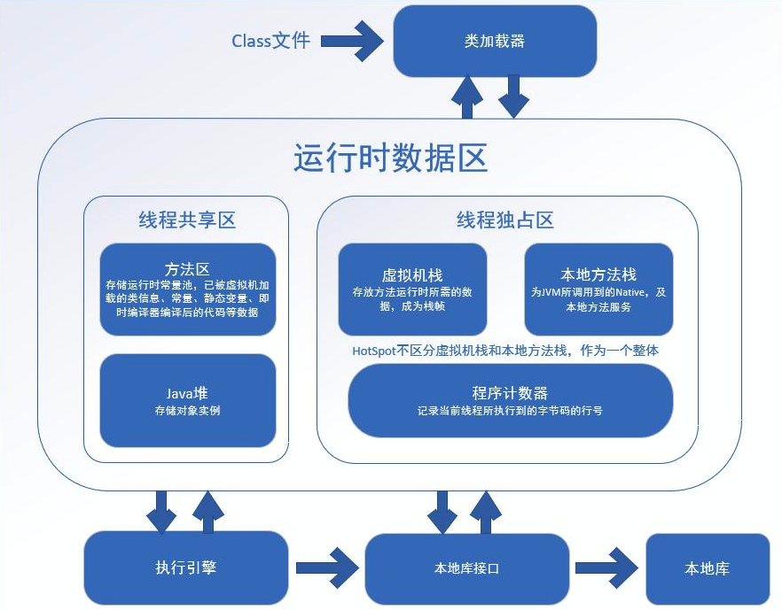
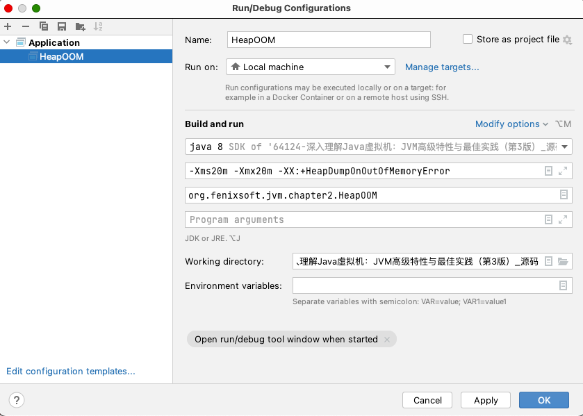
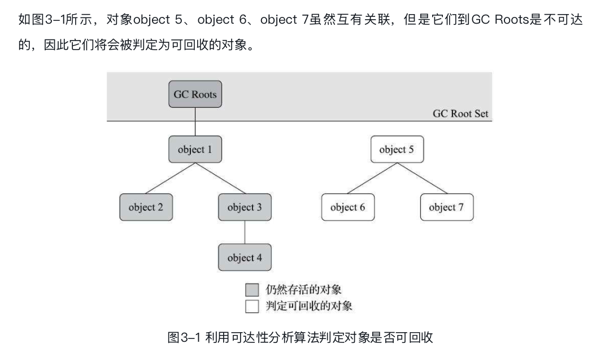

# 1 编译JDK

想要窥探Java虚拟机内部的实现原理，**最直接的一条路径就是编译一套自己的JDK，通过阅读和跟踪调试JDK源码来了解Java技术体系的运作**，虽然这样门槛会比阅读资料更高一点，但肯定也会比阅读各种文章、书籍来得更加贴近本质。

1. 获取源码

   去https://hg.openjdk.java.net/jdk/jdk12/下载OpenJDK 12，然后解压它。

2. 系统需求

   建议在Linux或者MacOS上构建OpenJDK,这两个系统在准备构建工具链和依赖项上要比在windows或者Solaris平台上要容易许多。

   **无论在什么平台下进行编译，都建议读者认真阅读一遍源码中的doc/building.html文档，编译过程中需要注意的细节较多，如果读者是第一次编译OpenJDK，那有可能会在一些小问题上耗费许多时间。**

3. 构建编译环境
4. 进行编译
5. 在ide工具中进行源码调试

# 2 JVM中内存管理

## 2.1 运行时数据区域

根据《Java虚拟机规范》的规定，Java虚拟机所管理的内存将会包括以下几个**运行时数据区域**：



### 2.1.1 程序计数器内存区

程序计数器（Program Counter Register）是一块较小的内存空间，它可以看作是当前线程所执行的**字节码的行号指示器**。

字节码解释器工作时就是**通过改变这个计数器的值来选取下一条需要执行的字节码指令**，**它是程序控制流的指示器**，分支、循环、跳转、异常处理、线程恢复等基础功能都需要依赖这个计数器来完成。

由于**Java虚拟机的多线程是通过线程轮流切换、分配处理器执行时间的方式来实现的**，**在任何一个确定的时刻，一个处理器（对于多核处理器来说是一个内核）都只会执行一条线程中的指令。**因此，**为了线程切换后能恢复到正确的执行位置，每条线程都需要有一个独立的程序计数器，各条线程之间计数器互不影响，独立存储，我们称这类内存区域为“线程私有”的内存。**

> 如果线程正在执行的是一个Java方法，这个计数器记录的是正在执行的虚拟机字节码指令的地址；如果正在执行的是本地（Native）方法，这个计数器值则应为空（Undefined）。此内存区域是唯一一个在《Java虚拟机规范》中没有规定任何OutOfMemoryError(爆内存或者内存越界)情况的区域。

简练的说，就是每个线程拥有一个程序计数器，程序计数器保证线程切换后恢复到上次中断的位置，线程执行时，它来指示线程的分支、循环、跳转、异常处理等工作。（你可以把它看作你实习时的leader）

### 2.1.2 虚拟机栈

与程序计数器一样，Java虚拟机栈（Java Virtual Machine Stack）也是**线程私有（一个线程一个，数据不共享）**的，它的生命周期与线程相同。

虚拟机栈描述的是**Java方法执行的线程内存模型**：每个方法被执行的时候，Java虚拟机都会同步创建一个栈帧（Stack Frame）用于存储**局部变量表、操作数栈、动态连接、方法出口等信息**。每一个方法被调用直至执行完毕的过程，就对应着一个栈帧在虚拟机栈中从入栈到出栈的过程。

**局部变量表**存放了编译期可知的各种Java虚拟机基本数据类型（boolean、byte、char、short、int、float、long、double）、对象引用（reference类型，它并不等同于对象本身，可能是一个指向对象起始地址的引用指针，也可能是指向一个代表对象的句柄或者其他与此对象相关的位置）和returnAddress类型（指向了一条字节码指令的地址）。

这些数据类型在局部变量表中的存储空间以局部变量槽（Slot）来表示，其中64位长度的long和double类型的数据会占用两个变量槽，其余的数据类型只占用一个。局部变量表所需的内存空间在编译期间完成分配，当进入一个方法时，这个方法需要在栈帧中分配多大的局部变量空间是完全确定的，在方法运行期间不会改变局部变量表的大小。（这里的大小指的是变量槽的数量而不是准确的存储空间）

在《Java虚拟机规范》中，对这个内存区域规定了**两类异常状况**：如果**线程请求的栈深度大于虚拟机所允许的深度**，将抛出StackOverflowError异常；如果Java虚拟机栈容量可以动态扩展，当**栈扩展时无法申请到足够的内存**会抛出OutOfMemoryError异常。

简单的说，虚拟机栈就是把线程需要执行的方法们按照顺序垒成栈，每个栈桢对应一个方法，栈桢中存储了局部变量表、操作数栈、动态连接、方法出口等信息。

### 2.1.3 本地方法栈

本地方法栈（Native Method Stacks）与虚拟机栈所发挥的作用是非常相似的，其区别只是虚拟机栈为**虚拟机执行Java方法（也就是字节码）服务**，而**本地方法栈则是为虚拟机使用到的本地（Native）方法服务**。虚拟机栈一样，本地方法栈也会在栈深度溢出或者栈扩展失败时分别抛出StackOverflowError和OutOfMemoryError异常。

### 2.1.4 Java堆

Java堆是被所有线程共享的一块内存区域，在虚拟机启动时创建。此内存区域的唯一目的就是存放对象实例，**Java世界里所有的对象实例都在这里分配内存**。

**Java堆是垃圾收集器管理的内存区域**，因此一些资料中它也被称作“GC堆”（Garbage CollectedHeap，幸好国内没翻译成“垃圾堆”）。

Java堆既可以被实现成固定大小的，也可以是可扩展的，不过当前主流的Java虚拟机都是按照可扩展来实现的（通过参数-Xmx和-Xms设定）。如果在Java堆中没有内存完成实例分配，并且堆也无法再扩展时，Java虚拟机将会抛出**OutOfMemoryError异常**。

### 2.1.5 方法区

方法区（Method Area）与Java堆一样，是各个线程**共享的内存区域**，它用于**存储（已被虚拟机加载）的类型信息、常量、静态变量、即时编译器编译后的代码缓存**等数据。虽然《Java虚拟机规范》中把方法区描述为堆的一个逻辑部分，但是它却有一个别名叫作“非堆”（Non-Heap），目的是与Java堆区分开来。

> 在以往，方法区以永久代存在，而Java8之后，永久代概念完全废弃，改用与JRockit、J9一样在本地内存中实现的元空间（Meta-space）来代替，把JDK 7中永久代还剩余的内容（主要是类型信息）全部移到元空间中。

《Java虚拟机规范》对方法区的约束是非常宽松的，除了和Java堆一样**不需要连续的内存和可以选择固定大小或者可扩展**外，甚至**还可以选择不实现垃圾收集**。相对而言，垃圾收集行为在这个区域的确是比较少出现的，但并非数据进入了方法区就如永久代的名字一样“永久”存在了。这区域的内存回收目标主要是针对常量池的回收和对类型的卸载，一般来说这个区域的回收效果比较难令人满意，尤其是类型的卸载，条件相当苛刻，但是这部分区域的回收有时又确实是必要的。以前Sun公司的Bug列表中，曾出现过的若干个严重的Bug就是由于低版本的HotSpot虚拟机对此区域未完全回收而导致内存泄漏。

根据《Java虚拟机规范》的规定，如果**方法区无法满足新的内存分配需求**时，**将抛出OutOfMemoryError异常**。

- 通俗地说，方法区跟堆有共性，但它存储的是**（已被虚拟机加载）的类型信息、常量、静态变量、即时编译器编译后的代码缓存**等数据，而Java堆存的是**对象实例**；而且Java堆是**GC管理的内存区域**，而方法区甚至**可以不实现垃圾收集**。它和堆的关系大概可以理解为亲兄弟，大同小异；

### 2.1.6 运行时常量池

运行时常量池（Runtime Constant Pool）是方法区的一部分，Class文件中除了有类的版本、字段、方法、接口等描述信息外，还有一项信息是**常量池表（Constant Pool Table），用于存放编译期生成的各种字面量与符号引用，这部分内容将在类加载后存放到方法区的运行时常量池中**。

Java虚拟机对于Class文件每一部分（自然也包括常量池）的格式都有严格规定，如每一个字节用于存储哪种数据都必须符合规范上的要求才会被虚拟机认可、加载和执行，但对于运行时常量池，《Java虚拟机规范》并没有做任何细节的要求，不同提供商实现的虚拟机可以按照自己的需要来实现这个内存区域，不过一般来说，除了保存Class文件中描述的符号引用外，还会把由符号引用翻译出来的直接引用也存储在运行时常量池中。

运行时常量池相对于Class文件常量池的另外一个重要特征是**具备动态性**，Java语言并不要求常量一定只有编译期才能产生，也就是说，并非预置入Class文件中常量池的内容才能进入方法区运行时常量池，**运行期间也可以将新的常量放入池中**，这种特性被开发人员利用得比较多的便是String类的intern()方法。

既然运行时常量池是方法区的一部分，自然受到方法区内存的限制，当**常量池无法再申请到内存时会抛出OutOfMemoryError异常。**

### 2.1.7 直接内存

直接内存（Direct Memory）并不是虚拟机运行时数据区的一部分，也不是《Java虚拟机规范》中定义的内存区域。

在JDK 1.4中新加入了NIO（New Input/Output）类，引入了一种基于通道（Channel）与缓冲区（Buffer）的I/O方式，它可以**使用Native函数库直接分配堆外内存**，然后通过一个存储在Java堆里面的**DirectByteBuffer对象作为这块内存的引用进行操作**。这样能在一些场景中显著提高性能，因为避免了在Java堆和Native堆中来回复制数据。（原因是，分配堆外内存，然后使用java堆里面的DirectByteBuffer对象作为这块内存的引用进行操作，就只是需要调用Java堆，如果不分配堆外内存的话，那就需要频繁使用Native函数库去获取数据生成对象放到Java堆中）

当然这个便利自然是有隐患，就是本机内存的合理使用，当我们配置虚拟机参数时忽略了直接内存，而代码又采用了NIO类，那么便容易使得各个内存区域总和大于物理内存限制（包括物理的和操作系统级的限制），从而导致动态扩展时出现OutOfMemoryError异常。

### 2.1.8 总结

- jvm内存区有线程共享的方法区和堆，它们的特性类似亲兄弟，大同小异。还有线程私有的虚拟机栈、本地方法栈和程序计数器。程序计数器用于记录线程恢复点和指示线程工作；虚拟机栈用于把线程运行时需要执行的方法垒成栈，每个方法是一个栈桢，栈桢中记录着方法的局部变量表、操作数栈、动态连接、方法出口等信息；本地方法栈则是垒的线程需要执行的本地方法们，也就是native方法；Java堆存的则是对象实例，它是gc管理的主要区域；方法区则是用于存储已被虚拟机加载的类信息，常量，静态变量，即使编译器编译后的代码等数据；运行时常量池是方法区的一部分，专门用来接收运行时生成的常量；直接内存则是为NIO提供的本地内存。
- 引发OutOfMemoryError异常的情况有栈内存不足；堆内存不足；方法区内存不足；常量池无法申请到内存；直接内存不足；

## 2.2 测试、分析、优化内存溢出异常

### 2.2.1 idea修改jvm配置

Run - Edit Configurations - Modify options



### 2.2.2 测试实现Java堆溢出

```java
import java.util.ArrayList;
import java.util.List;

/**
 * VM Args：-Xms20m -Xmx20m -XX:+HeapDumpOnOutOfMemoryError
 *
 * @author zzm
 */
public class HeapOOM {

    static class OOMObject {
    }

    public static void main(String[] args) {
        List<OOMObject> list = new ArrayList<OOMObject>();

        while (true) {
//            list.add(new OOMObject());
            list.add(new OOMObject());
        }
    }
}
```

jvm options: -Xms20m -Xmx20m -XX:+HeapDumpOnOutOfMemoryError

**参数-XX:+HeapDumpOnOutOf-MemoryError可以让虚拟机在出现内存溢出异常的时候Dump出当前的内存堆转储快照以便进行事后分析**

```shell
java.lang.OutOfMemoryError: Java heap space
Dumping heap to java_pid74524.hprof ...
Heap dump file created [27906457 bytes in 0.157 secs]
Exception in thread "main" java.lang.OutOfMemoryError: Java heap space
	at java.util.Arrays.copyOf(Arrays.java:3210)
	at java.util.Arrays.copyOf(Arrays.java:3181)
	at java.util.ArrayList.grow(ArrayList.java:267)
	at java.util.ArrayList.ensureExplicitCapacity(ArrayList.java:241)
	at java.util.ArrayList.ensureCapacityInternal(ArrayList.java:233)
	at java.util.ArrayList.add(ArrayList.java:464)
	at org.fenixsoft.jvm.chapter2.HeapOOM.main(HeapOOM.java:21)
```

Java堆内存的OutOfMemoryError异常是实际应用中最常见的内存溢出异常情况。出现Java堆内存溢出时，异常堆栈信息“java.lang.OutOfMemoryError”会跟随进一步提示“Java heap space”。

### 2.2.3 分析

要解决这个内存区域的异常，常规的处理方法是首先通过内存映像分析工具（如Eclipse MemoryAnalyzer）对Dump出来的堆转储快照进行分析。第一步首先应确认内存中导致OOM的对象是否是必要的，也就是要先分清楚到底是出现了内存泄漏（Memory Leak）还是内存溢出（MemoryOverflow）。

- 内存泄漏（Memory Leak）：是指程序中已动态分配的堆内存由于某种原因程序未释放或无法释放，造成系统内存的浪费，导致程序运行速度减慢甚至系统崩溃等严重后果。
- *内存溢出*(Out Of Memory，简称OOM)是指应用系统中存在无法回收的内存或使用的内存过多，最终使得程序运行要用到的内存大于能提供的最大内存。

### 2.2.4 处理异常

如果是内存泄漏，可进一步通过工具查看泄漏对象到GC Roots的引用链，找到泄漏对象是通过怎样的引用路径、与哪些GC Roots相关联，才导致垃圾收集器无法回收它们，根据泄漏对象的类型信息以及它到GC Roots引用链的信息，一般可以比较准确地定位到这些对象创建的位置，进而找出产生内存泄漏的代码的具体位置。

如果不是内存泄漏，换句话说就是内存中的对象确实都是必须存活的，那就应当检查Java虚拟机的堆参数（-Xmx与-Xms）设置，与机器的内存对比，看看是否还有向上调整的空间。再从代码上检查是否存在某些对象生命周期过长、持有状态时间过长、存储结构设计不合理等情况，尽量减少程序运行期的内存消耗。

# 3 垃圾收集器和内存分配策略

- 哪些内存需要回收？

- 什么时候回收？

- 如何回收？

## 3.1 引用计数算法

在对象中添加一个引用计数器，每当有一个地方引用它时，计数器值就加一；当引用失效时，计数器值就减一；任何时刻计数器为零的对象就是不可能再被使用的。

客观地说，引用计数算法（Reference Counting）虽然占用了一些额外的内存空间来进行计数，但它的原理简单，判定效率也很高，在大多数情况下它都是一个不错的算法。也有一些比较著名的应用案例，例如微软COM（Component Object Model）技术、使用ActionScript 3的FlashPlayer、Python语言以及在游戏脚本领域得到许多应用的Squirrel中都使用了引用计数算法进行内存管理。**但是，在Java领域，至少主流的Java虚拟机里面都没有选用引用计数算法来管理内存，主要原因是，这个看似简单的算法有很多例外情况要考虑，必须要配合大量额外处理才能保证正确地工作，譬如单纯的引用计数就很难解决对象之间相互循环引用的问题。**

## 3.2 可达性分析算法

当前主流的商用程序语言（Java、C#，上溯至前面提到的古老的Lisp）的内存管理子系统，都是通过可达性分析（Reachability Analysis）算法来判定对象是否存活的。**这个算法的基本思路就是通过一系列称为“GC Roots”的根对象作为起始节点集，从这些节点开始，根据引用关系向下搜索，搜索过程所走过的路径称为“引用链”（Reference Chain），如果某个对象到GC Roots间没有任何引用链相连，或者用图论的话来说就是从GC Roots到这个对象不可达时，则证明此对象是不可能再被使用的。**



在Java技术体系里面，固定可作为GC Roots的对象包括以下几种：

- 在虚拟机栈（栈帧中的本地变量表）中引用的对象，譬如各个线程被调用的方法堆栈中使用到的参数、局部变量、临时变量等。
- 在方法区中类静态属性引用的对象，譬如Java类的引用类型静态变量。
- 在方法区中常量引用的对象，譬如字符串常量池（String Table）里的引用。
- 在本地方法栈中JNI（即通常所说的Native方法）引用的对象。
- Java虚拟机内部的引用，如基本数据类型对应的Class对象，一些常驻的异常对象（比如NullPointExcepiton、OutOfMemoryError）等，还有系统类加载器。
- 所有被同步锁（synchronized关键字）持有的对象。
- 反映Java虚拟机内部情况的JMXBean、JVMTI中注册的回调、本地代码缓存等。

除了这些固定的GC Roots集合以外，根据用户所选用的垃圾收集器以及当前回收的内存区域不同，还可以有其他对象“临时性”地加入，共同构成完整GC Roots集合。譬如后文将会提到的分代收集和局部回收（Partial GC），如果只针对Java堆中某一块区域发起垃圾收集时（如最典型的只针对新生代的垃圾收集），必须考虑到内存区域是虚拟机自己的实现细节（在用户视角里任何内存区域都是不可见的），更不是孤立封闭的，所以某个区域里的对象完全有可能被位于堆中其他区域的对象所引用，这时候就需要将这些关联区域的对象也一并加入GC Roots集合中去，才能保证可达性分析的正确性。

目前最新的几款垃圾收集器无一例外都具备了局部回收的特征，为了避免GC Roots包含过多对象而过度膨胀，它们在实现上也做出了各种优化处理。

## 3.3 引用

无论是通过引用计数算法判断对象的引用数量，还是通过可达性分析算法判断对象是否引用链可达，判定对象是否存活都和“引用”离不开关系。

在JDK 1.2版之前，Java里面的引用是很传统的定义：如果reference类型的数据中存储的数值代表的是另外一块内存的起始地址，就称该reference数据是代表某块内存、某个对象的引用。这种定义并没有什么不对，只是现在看来有些过于狭隘了，一个对象在这种定义下只有“被引用”或者“未被引用”两种状态，对于描述一些“食之无味，弃之可惜”的对象就显得无能为力。譬如我们希望能描述一类对象：当内存空间还足够时，能保留在内存之中，如果内存空间在进行垃圾收集后仍然非常紧张，那就可以抛弃这些对象——很多系统的缓存功能都符合这样的应用场景。

锁 sycnize **空中楼阁 不落实处**

