**打工n年都不懂网络数据到底咋传的？让我教你吧晓🔥汁！**

# 1.HTTP（from 图解http）

HTTP协议（HyperText Transfer Protocol，超文本传输协议）是因特网上应用最为广泛的一种网络传输协议，所有的WWW文件都必须遵守这个标准。

HTTP是一个基于TCP/IP通信协议来传递数据（HTML 文件, 图片文件, 查询结果等）。

## 1.1 HTTP工作原理

HTTP协议工作于客户端-服务端架构上。**浏览器作为HTTP客户端**通过**URL**向**HTTP服务端即WEB服务器**发送所有请求。

Web服务器有：Apache服务器，IIS服务器（Internet Information Services）等。

Web服务器根据接收到的请求后，向客户端发送响应信息。

HTTP默认端口号为80，但是你也可以改为8080或者其他端口。（这个默认端口适用于我们做简单的测试使用，springboot会使用server.port变更端口以接收http请求）

**HTTP三点注意事项：**

- HTTP是无连接：**无连接的含义是限制每次连接只处理一个请求。服务器处理完客户的请求，并收到客户的应答后，即断开连接。采用这种方式可以节省传输时间。**
- HTTP是媒体独立的：**这意味着，只要客户端和服务器知道如何处理的数据内容，任何类型的数据都可以通过HTTP发送。客户端以及服务器指定使用适合的MIME-type内容类型。**
- HTTP是无状态：**HTTP协议是无状态协议。无状态是指协议对于事务处理没有记忆能力。缺少状态意味着如果后续处理需要前面的信息，则它必须重传，这样可能导致每次连接传送的数据量增大。另一方面，在服务器不需要先前信息时它的应答就较快。**

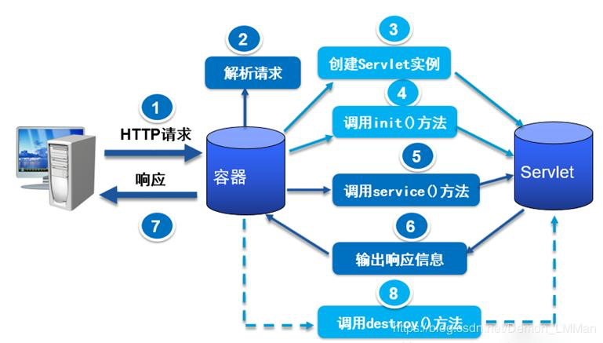

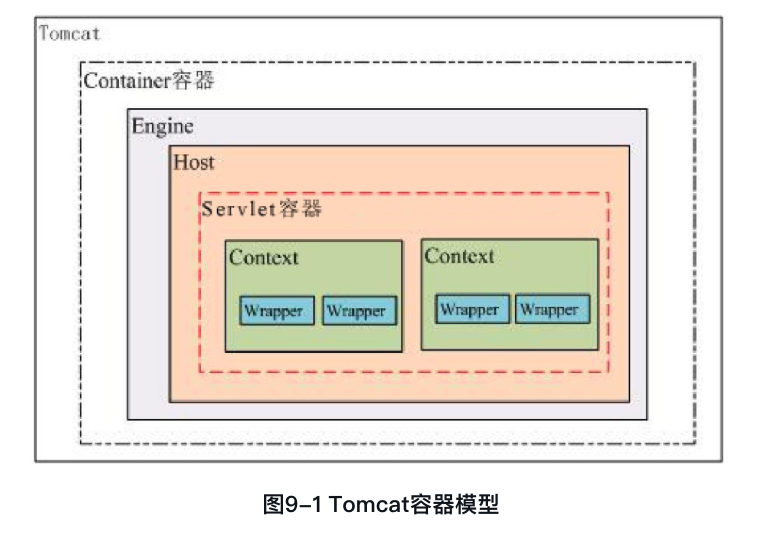

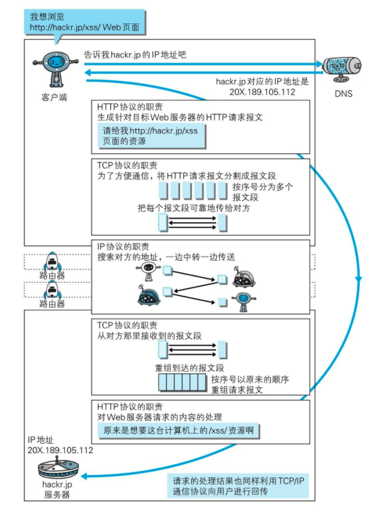

以上三个图生动形象地说明了http的指责和其它协议族的配合；

## 1.2 uri和url

uri(Uniform Resource Identifier):

- Uniform规定统一的格式可方便处理多种不同类型的资源，而不用根据上下文环境来识别资源指定的访问方式。另外，加入新增的协议方案（如http：或ftp:mailto:、telnet:、file:等）。
- Resource资源的定义是“可标识的任何东西”。不仅是文档文件，图像或服务（例如当天的天气预报）等能够区别于其他类型的，全都可作为资源。另外，资源不仅可以是单一的，也可以是多数的集合体。
- Identifier表示可标识的对象。也称为标识符。

URI用字符串标识某一互联网资源，而URL表示资源的地点（互联网上所处的位置）。可见**URL是URI的子集**。(uri更为精确，url只是资源地址，所以是子集哟)

URI的格式：

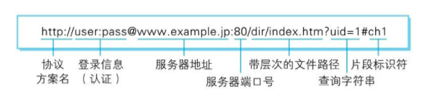

**协议方案名**也可使用data：或javascript：这类指定数据或脚本程序的方案名。

**登录信息（认证）**指定用户名和密码作为从服务器端获取资源时必要的登录信息（身份认证）。**此项是可选项。**

**服务器地址**使用绝对URI必须指定待访问的服务器地址。地址可以是类似hackr.jp这种DNS可解析的名称，或是192.168.1.1这类IPv4地址名，还可以是[0:0:0:0:0:0:0:1]这样用方括号括起来的IPv6地址名。

**服务器端口号**指定服务器连接的网络端口号。**此项也是可选项**，若用户省略则自动使用默认端口号。

**带层次的文件路径**指定服务器上的文件路径来定位特指的资源。这与UNIX系统的文件目录结构相似。

**查询字符串**针对已指定的文件路径内的资源，可以使用查询字符串传入任意参数。**此项可选。**

**片段标识符**使用片段标识符通常可标记出已获取资源中的子资源（文档内的某个位置）。但在RFC中并没有明确规定其使用方法。**该项也为可选项。**

## 1.3 HTTP请求方法

| 序号 | 方法    | 描述                                                         |
| :--- | :------ | :----------------------------------------------------------- |
| 1    | GET     | 请求指定的页面信息，并返回实体主体。                         |
| 2    | HEAD    | 类似于 GET 请求，只不过返回的响应中没有具体的内容，用于获取报头 |
| 3    | POST    | 向指定资源提交数据进行处理请求（例如提交表单或者上传文件）。数据被包含在请求体中。POST 请求可能会导致新的资源的建立和/或已有资源的修改。 |
| 4    | PUT     | 从客户端向服务器传送的数据取代指定的文档的内容。             |
| 5    | DELETE  | 请求服务器删除指定的页面。                                   |
| 6    | CONNECT | HTTP/1.1 协议中预留给能够将连接改为管道方式的代理服务器。    |
| 7    | OPTIONS | 允许客户端查看服务器的性能。                                 |
| 8    | TRACE   | 回显服务器收到的请求，主要用于测试或诊断。                   |
| 9    | PATCH   | 是对 PUT 方法的补充，用来对已知资源进行局部更新 。           |
| 10   | TRACE   | 追踪路径                                                     |

常用为：get post put delete;

## 1.4 使用Cookie的状态管理

HTTP是无状态协议，它不对之前发生过的请求和响应的状态进行管理。也就是说，无法根据之前的状态进行本次的请求处理。**假设要求登录认证的Web页面本身无法进行状态的管理（不记录已登录的状态），那么每次跳转新页面就要再次登录，或者要在每次请求报文中附加参数来管理登录状态。**不可否认，无状态协议当然也有它的优点。由于不必保存状态，自然可减少服务器的CPU及内存资源的消耗。从另一侧面来说，也正是因为HTTP协议本身是非常简单的，所以才会被应用在各种场景里。

保留无状态协议这个特征的同时又要解决类似的矛盾问题，于是引入了Cookie技术。**Cookie技术通过在请求和响应报文中写入Cookie信息来控制客户端的状态。**

Cookie会根据**从服务器端发送的响应报文内的一个叫做Set-Cookie的首部字段信息，通知客户端保存Cookie。**当下次客户端再往该服务器发送请求时，**客户端会自动在请求报文中加入Cookie值后发送出去。**

服务器端发现客户端发送过来的Cookie后，会去检查究竟是从哪一个客户端发来的连接请求，然后对比服务器上的记录，最后得到之前的状态信息。

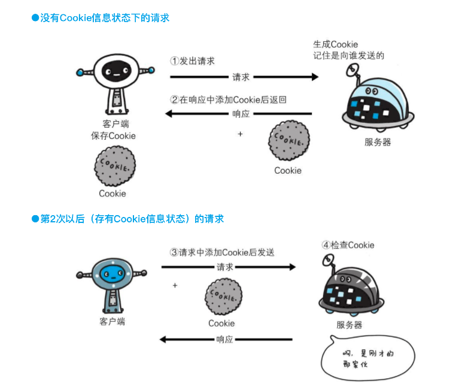

举个例子：

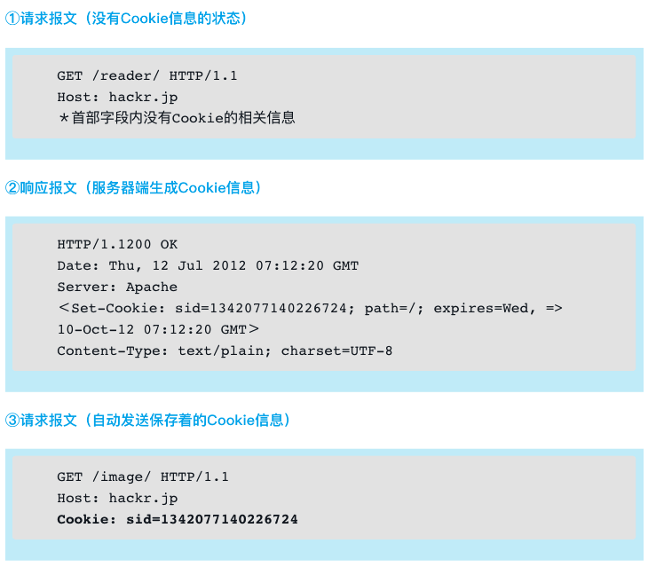

## 1.5 HTTP报文

用于HTTP协议交互的信息被称为HTTP报文。请求端（客户端）的HTTP报文叫做请求报文，响应端（服务器端）的叫做响应报文。**HTTP报文本身是由多行（用CR+LF作换行符）数据构成的字符串文本。**

HTTP报文大致可分为报文首部和报文主体两块。两者由最初出现的空行（CR+LF）来划分。**通常，并不一定要有报文主体。**

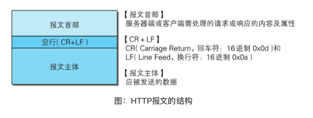

**客户端请求消息**

**客户端发送一个HTTP请求到服务器的请求消息包括以下格式：请求行（request line）、请求头部（header）、空行和请求数据四个部分组成，下图给出了请求报文的一般格式。**


**服务器响应消息**

HTTP响应也由四个部分组成，分别是：状态行、消息报头、空行和响应正文。

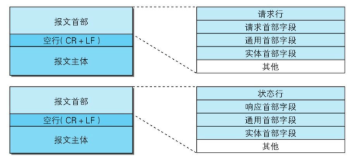

举个例子：

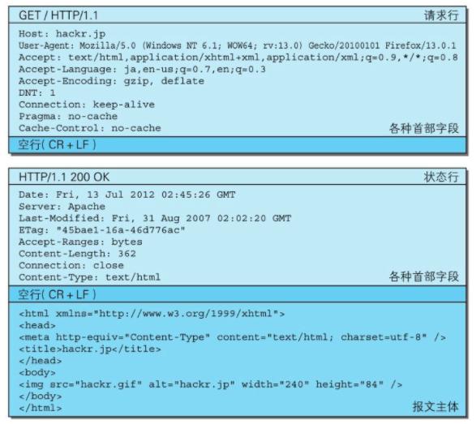

**请求行**包含用于请求的方法，请求URI和HTTP版本。

**状态行**包含表明响应结果的状态码，原因短语和HTTP版本。

**首部字段**包含表示请求和响应的各种条件和属性的各类首部。一般有4种首部，分别是：**通用首部、请求首部、响应首部和实体首部。**

**其他**可能包含HTTP的RFC里未定义的首部（Cookie等）。

## 1.6 编码提升传输速率

HTTP在传输数据时可以按照数据原貌直接传输，但也可以在传输过程中通过编码提升传输速率。**通过在传输时编码，能有效地处理大量的访问请求。但是，编码的操作需要计算机来完成，因此会消耗更多的CPU等资源。**

### 1.6.1 报文主体和实体主体

●报文（message）是HTTP通信中的基本单位，由8位组字节流（octet sequence，其中octet为8个比特）组成，通过HTTP通信传输。

●实体（entity）作为请求或响应的有效载荷数据（补充项）被传输，其内容由实体首部和实体主体组成。

HTTP报文的主体用于传输请求或响应的实体主体。**通常，报文主体等于实体主体。只有当传输中进行编码操作时，实体主体的内容发生变化，才导致它和报文主体产生差异。**报文和实体这两个术语在之后会经常出现，请事先理解两者的差异。

### 1.6.2 压缩传输的内容编码

向待发送邮件内增加附件时，为了使邮件容量变小，我们会先用ZIP压缩文件之后再添加附件发送。HTTP协议中有一种被称为**内容编码的功能**也能进行类似的操作。

**内容编码指明应用在实体内容上的编码格式，并保持实体信息原样压缩。内容编码后的实体由客户端接收并负责解码。**

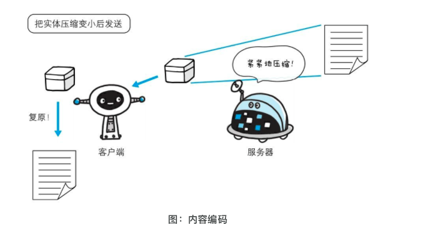

●gzip（GNU zip）

●compress（UNIX系统的标准压缩）

●deflate（zlib）

●identity（不进行编码）

### 1.6.3 分割发送的分块传输编码

在HTTP通信过程中，请求的编码实体资源尚未全部传输完成之前，浏览器无法显示请求页面。在传输大容量数据时，通过把数据分割成多块，能够让浏览器逐步显示页面。这种把实体主体分块的功能称为**分块传输编码（Chunked Transfer Coding）**。

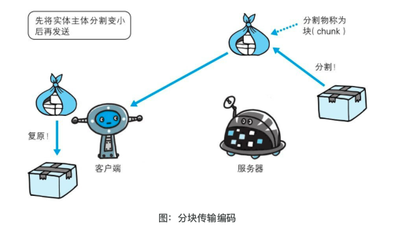

分块传输编码会将实体主体分成多个部分（块）。每一块都会用十六进制来标记块的大小，而实体主体的最后一块会使用“0(CR+LF)”来标记。使用分块传输编码的实体主体会由接收的客户端负责解码，恢复到编码前的实体主体。**HTTP/1.1中存在一种称为传输编码（Transfer Coding）的机制，它可以在通信时按某种编码方式传输，但只定义作用于分块传输编码中。**

## 1.7 发送多种数据的多部分对象集合

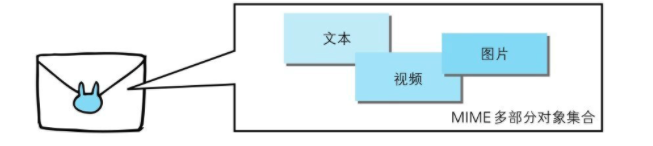

HTTP协议中采纳了多部分对象集合，发送的一份报文主体内可含有多类型实体。**通常是在图片或文本文件等上传时使用。**多部分对象集合包含的对象如下。

● multipart/form-data在Web表单文件上传时使用。

● multipart/byteranges状态码206（Partial Content，部分内容）响应报文包含了多个范围的内容时使用。

● multipart/form-data

● multipart/byteranges

在HTTP报文中使用多部分对象集合时，需要在首部字段里加上Content-type。

## 1.8 HTTP状态码

当浏览者访问一个网页时，浏览者的浏览器会向网页所在服务器发出请求。**当浏览器接收并显示网页前**，此网页所在的服务器会**返回一个包含HTTP状态码的信息头（server header）用以响应浏览器的请求。**

HTTP状态码的英文为HTTP Status Code。

下面是常见的HTTP状态码：

- 200 - 请求成功
- 301 - 资源（网页等）被永久转移到其它URL
- 404 - 请求的资源（网页等）不存在
- 500 - 内部服务器错误

| 分类 | 分类描述                                         |
| :--- | :----------------------------------------------- |
| 1**  | 信息，服务器收到请求，**需要请求者继续执行操作** |
| 2**  | 成功，操作被成功接收并处理                       |
| 3**  | 重定向，需要进一步的操作以完成请求               |
| 4**  | 客户端错误，请求包含语法错误或无法完成请求       |
| 5**  | 服务器错误，服务器在处理请求的过程中发生了错误   |

详细一点吧：

### 1.8.1 2xx成功

- **200 OK**

  表示从客户端发来的请求在服务器端被正常处理了。

- 204 No Content

  该状态码代表服务器接收的请求已成功处理，**但在返回的响应报文中不含实体的主体部分。**一般在只需要从客户端往服务器发送信息，而服务器不需要发送新信息内容更新页面的情况下使用。

- 206 Partial Content

  该状态码表示客户端进行了范围请求，而服务器成功执行了这部分的GET请求。响应报文中包含由Content-Range指定**范围的实体内容。**一般用在请求到中途补充实体内容的情况下。

### 1.2.2 3xx重定向

- 301 Moved Permanently


永久性重定向。该状态码表示请求的资源已被分配了新的URI，以后应使用资源现在所指的URI。也就是说，如果已经把资源对应的URI保存为书签了，这时应该按Location首部字段提示的URI重新保存。

- 302 Found


临时性重定向。该状态码表示请求的资源已被分配了新的URI，希望用户（本次）能使用新的URI访问。和301 Moved Permanently状态码相似，但302状态码代表的资源不是被永久移动，只是临时性质的。换句话说，已移动的资源对应的URI将来还有可能发生改变。比如，用户把URI保存成书签，但不会像301状态码出现时那样去更新书签，而是仍旧保留返回302状态码的页面对应的URI。

- 303 See Other

  

该状态码表示由于请求对应的资源存在着另一个URI，应使用GET方法定向获取请求的资源。303状态码和302 Found状态码有着相同的功能，但303状态码明确表示客户端应当采用GET方法获取资源，这点与302状态码有区别。比如，当使用POST方法访问CGI程序，其执行后的处理结果是希望客户端能以GET方法重定向到另一个URI上去时，返回303状态码。虽然302 Found状态码也可以实现相同的功能，但这里使用303状态码是最理想的。

> 当301、302、303响应状态码返回时，几乎所有的浏览器都会把POST改成GET，并删除请求报文内的主体，之后请求会自动再次发送。301、302标准是禁止将POST方法改变成GET方法的，但实际使用时大家都会这么做。

就到这里吧！

## 1.9 用单台虚拟主机实现多个域名

就是http允许单台物理服务器存放多个虚拟主机，也就是多个域名，但是由于ip相同，所以在发送HTTP请求时，**必须在Host首部内完整指定主机名或域名的URI。**

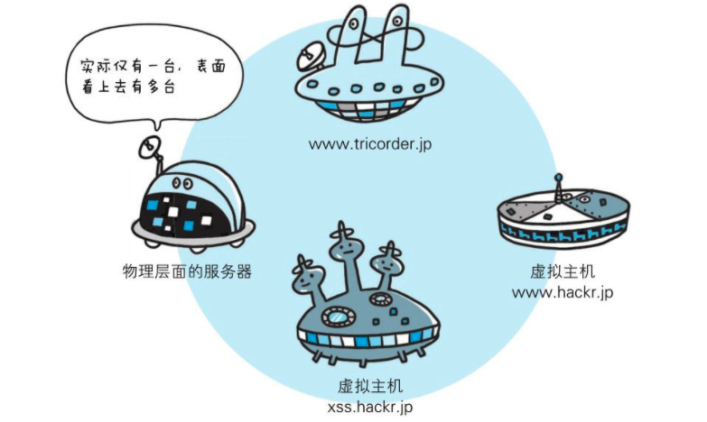

## 1.10 通信数据转发程序：代理、网关、隧道

HTTP通信时，除客户端和服务器以外，还有一些用于通信数据转发的应用程序，例如代理、网关和隧道。它们可以配合服务器工作。

**这些应用程序和服务器可以将请求转发给通信线路上的下一站服务器，并且能接收从那台服务器发送的响应再转发给客户端。**

- 代理

  代理是一种**有转发功能的应用程序**，它扮演了位于**服务器和客户端“中间人”的角色**，接收由客户端发送的请求并转发给服务器，同时也接收服务器返回的响应并转发给客户端。(ngix)

- 网关

  网关是**转发其他服务器通信数据的服务器**，接收从客户端发送来的请求时，通过路由转发实现通信，它就像自己拥有资源的源服务器一样对请求进行处理。

- 隧道

  隧道是在相隔甚远的客户端和服务器两者之间进行中转，并保持双方通信连接的应用程序。

### 1.10.1 代理


代理不改变请求URI，会直接发送给前方持有资源的目标服务器。

**持有资源实体的服务器被称为源服务器。**从源服务器返回的响应经过代理服务器后再传给客户端。

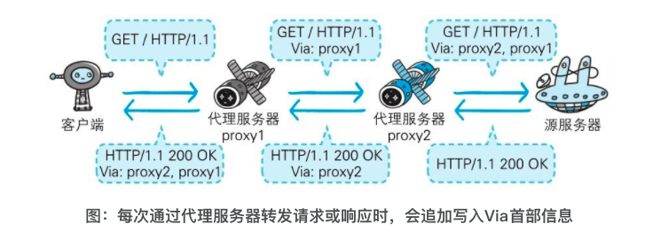

在HTTP通信过程中，可级联多台代理服务器。**请求和响应的转发会经过数台类似锁链一样连接起来的代理服务器**。转发时，需要附加Via首部字段以标记出经过的主机信息。

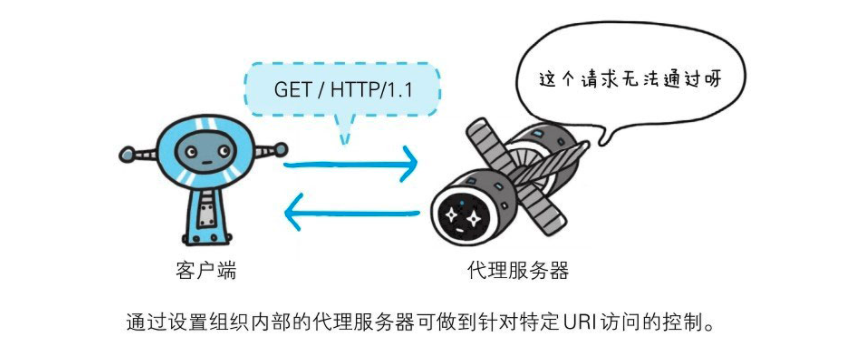

🌟**使用代理服务器的理由有：**利用缓存技术减少网络带宽的流量，组织内部针对特定网站的访问控制，以获取访问日志为主要目的，等等。

代理有多种使用方法，**按两种基准分类。一种是是否使用缓存，另一种是是否会修改报文。**

- 缓存代理

  代理转发响应时，缓存代理（Caching Proxy）会预先将资源的副本（缓存）保存在代理服务器上。

  当代理再次接收到对相同资源的请求时，就可以不从源服务器那里获取资源，而是将之前缓存的资源作为响应返回。

- 透明代理

  转发请求或响应时，不对报文做任何加工的代理类型被称为透明代理（Transparent Proxy）。反之，对报文内容进行加工的代理被称为非透明代理。

### 1.10.2 网关


网关的工作机制和代理十分相似。而**网关能使通信线路上的服务器提供非HTTP协议服务**。利用网关能提高通信的安全性，因为可以**在客户端与网关之间的通信线路上加密以确保连接的安全。**比如，网关可以连接数据库，使用SQL语句查询数据。另外，在Web购物网站上进行信用卡结算时，网关可以和信用卡结算系统联动。

### 1.10.3 隧道

隧道可按要**求建立起一条与其他服务器的通信线路**，届时使用SSL等加密手段进行通信。**隧道的目的是确保客户端能与服务器进行安全的通信。**

**隧道本身不会去解析HTTP请求。也就是说，请求保持原样中转给之后的服务器。隧道会在通信双方断开连接时结束。**

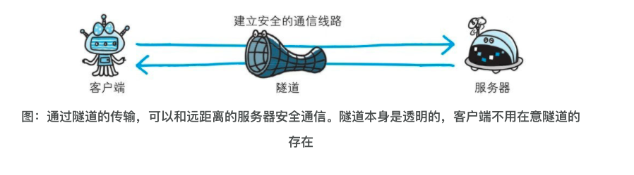

常用于做vpn。

### 补充：缓存

缓存可用于代理服务器和客户端，缓存有缓存有效期，当使用缓存时会向源服务器确认缓存是否有效。

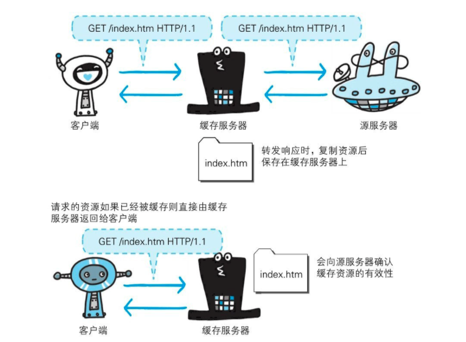

## 1.11 HTTP首部字段

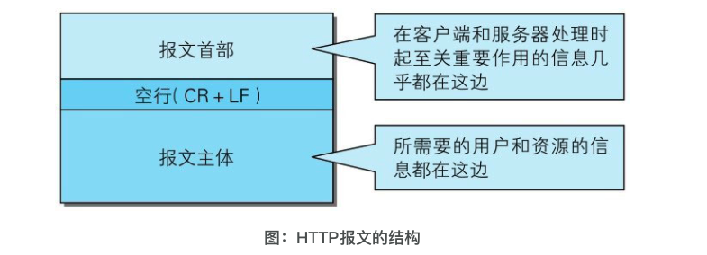

HTTP首部字段传递重要信息，是构成HTTP报文的要素之一。在客户端与服务器之间以HTTP协议进行通信的过程中，无论是请求还是响应都会使用首部字段，它能起到**传递额外重要信息的作用**。**使用首部字段是为了给浏览器和服务器提供报文主体大小、所使用的语言、认证信息等内容。**

- 4种HTTP首部字段类型

  - 通用首部字段（General Header Fields）请求报文和响应报文两方都会使用的首部。

  - 请求首部字段（Request Header Fields）从客户端向服务器端发送请求报文时使用的首部。补充了请求的附加内容、客户端信息、响应内容相关优先级等信息。

  - 响应首部字段（Response Header Fields）从服务器端向客户端返回响应报文时使用的首部。补充了响应的附加内容，也会要求客户端附加额外的内容信息。

  - 实体首部字段（Entity Header Fields）针对请求报文和响应报文的实体部分使用的首部。补充了资源内容更新时间等与实体有关的信息。

    通用首部字段：

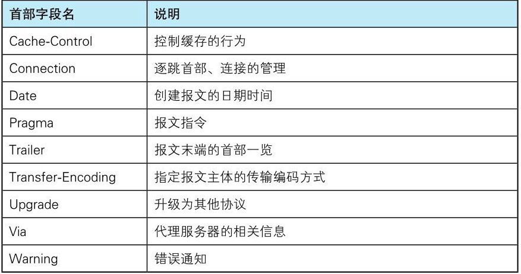

​		请求首部字段：

​                  			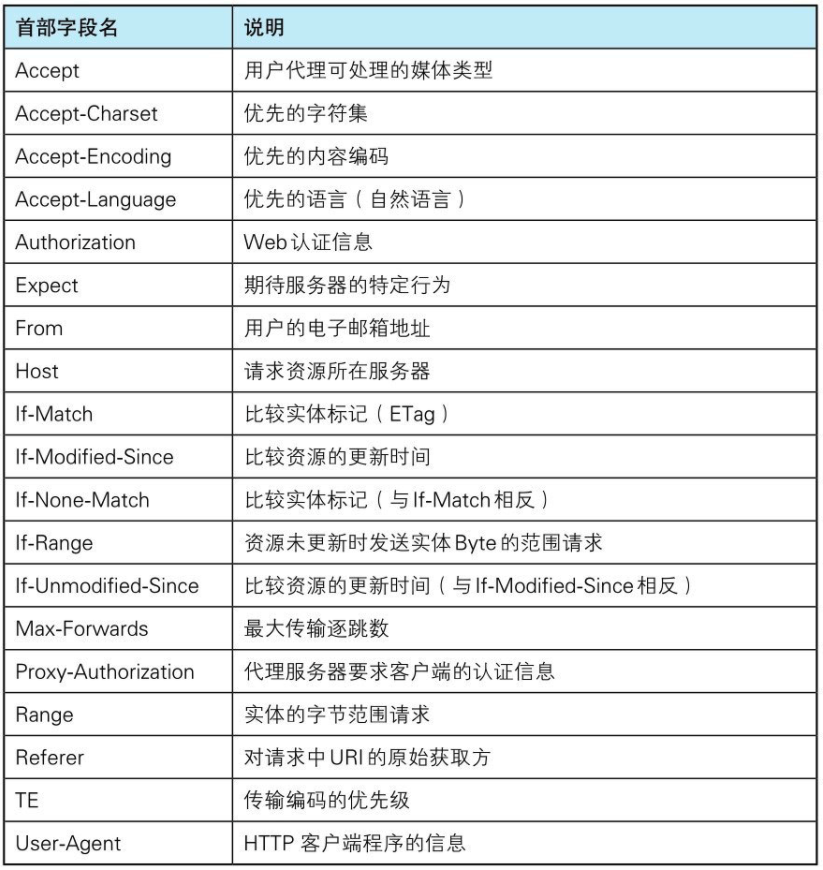

响应首部字段：
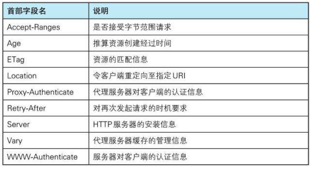

实体首部字段：

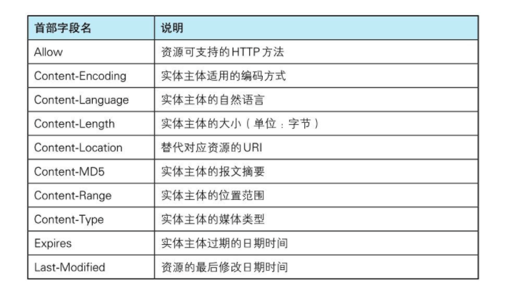

🌟还有非http/1.1首部字段

在HTTP协议通信交互中使用到的首部字段，不限于RFC2616中定义的**47种首部字段**。**还有Cookie、Set-Cookie和Content-Disposition等在其他RFC中定义的首部字段**，它们的使用频率也很高。这些非正式的首部字段统一归纳在RFC4229 HTTP Header Field Registrations中。

### 1.11.1 为Cookie服务的首部字段

我们作为后端，cookie的思想得明确！

Cookie的工作机制是用户识别及状态管理。Web网站为了管理用户的状态会通过Web浏览器，把一些数据临时写入用户的计算机内。接着当用户访问该Web网站时，可通过通信方式取回之前存放的Cookie。

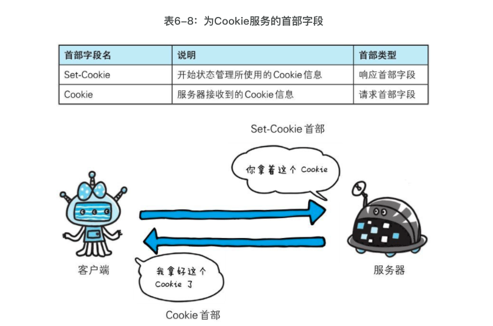

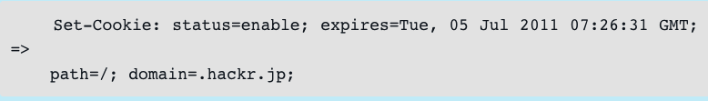

当服务器准备开始管理客户端的状态时，会事先告知各种信息。

下面的表格列举了**Set-Cookie的字段值。**

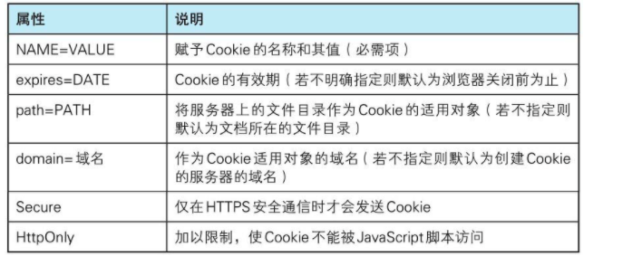

Cookie的**secure属性**

用于**限制Web页面仅在HTTPS安全连接时，才可以发送Cookie。**发送Cookie时，指定secure属性的方法如下所示。

```http
Set-Cookie: name=value; secure
```

以上例子仅当在https://www.example.com/（HTTPS）安全连接的情况下才会进行Cookie的回收。也就是说，即使域名相同，http://www.example.com/（HTTP）也不会发生Cookie回收行为。当省略secure属性时，不论HTTP还是HTTPS，都会对Cookie进行回收。

**HttpOnly属性**

Cookie的HttpOnly属性是Cookie的扩展功能，它使JavaScript脚本无法获得Cookie。其主要目的为防止跨站脚本攻击（Cross-site scripting,XSS）对Cookie的信息窃取。发送指定HttpOnly属性的Cookie的方法如下所示。

```http
Set-Cookie: name=value; HttpOnly
```

通过上述设置，通常从Web页面内还可以对Cookie进行读取操作。但使用JavaScript的document.cookie就无法读取附加HttpOnly属性后的Cookie的内容了。因此，也就无法在XSS中利用JavaScript劫持Cookie了。虽然是独立的扩展功能，但Internet Explorer 6 SP1以上版本等当下的主流浏览器都已经支持该扩展了。另外顺带一提，该扩展并非是为了防止XSS而开发的

**Cookie**

```http
Cookie: status=enable
```

首部字段Cookie会告知服务器，当客户端想获得HTTP状态管理支持时，就会在请求中包含从服务器接收到的Cookie。**接收到多个Cookie时，同样可以以多个Cookie形式发送。**🌟多个cookie哦！

## 1.12 🌟HTTPS 确保web安全的https

在http协议中有可能存在信息窃听或者身份伪装等安全问题。使用http通信机制可以有效地防止这些问题。

### 1.12.1 HTTP的缺点

HTTP主要有这些不足，例举如下。

●通信使用明文（不加密），内容可能会被窃听

●不验证通信方的身份，因此有可能遭遇伪装

●无法证明报文的完整性，所以有可能已遭篡改

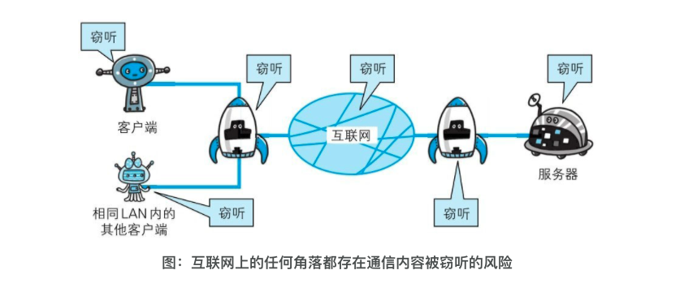

🌟简单的说，就是容易被抓包，被拦截，被篡改再发送！这一部分暂时略过；

### 1.12.2 HTTP+加密+认证+完整性保护=HTTPS

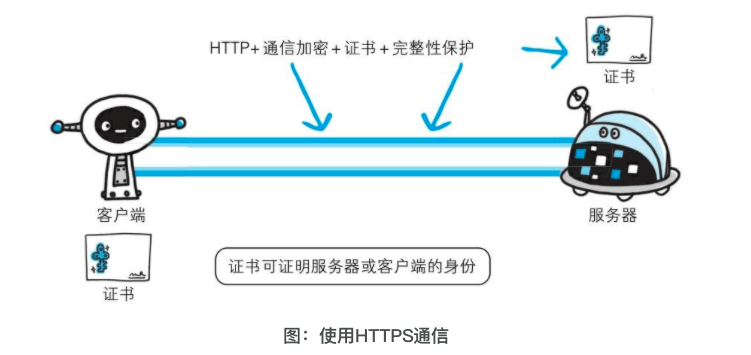

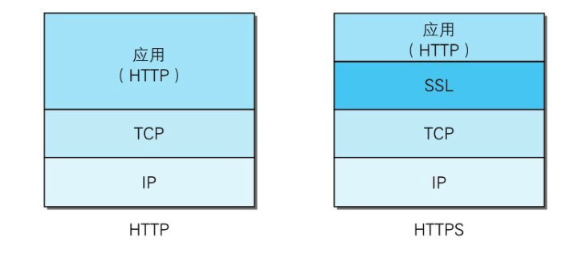

介绍就到这里吧！
