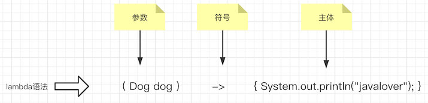

# 函数式接口概述

**有且只有一个抽象方法 即无内容方法**

用@Functionallnterface判断是不是函数式接口

```java
// Java8之前：旧的写法
Runnable runnable = new Runnable() {
  @Override
  public void run() {
    System.out.println("old run");
  }
};
Thread t = new Thread(runnable);

// Java8之后：新的写法
Runnable runnable1 = ()->{
  System.out.println("lambda run");
};
Thread t1 = new Thread(runnable1);
```



**lamda可以直接将代码块传递给对象或方法**

```java
public static String processFile() throws IOException {
    // Java7新增的语法，try(){}，可自动关闭资源，减少了代码的臃肿
    try( BufferedReader bufferedReader = 
        new BufferedReader(new  FileReader("D:\\JavaProject\\JavaBasicDemo\\test.txt"))){
        return bufferedReader.readLine();//核心代码行 读取第一行并返回
    }
}
//编写函数式接口
@FunctionalInterface
interface FileReadInterface{
  	// 这里接受一个BufferedReader对象，返回一个String对象
    String process(BufferedReader reader) throws IOException;
}
// 读取一行
FileReadInterface fileReadInterface = reader -> reader.readLine();
// 读取两行
FileReadInterface fileReadInterface2 = reader -> reader.readLine() + reader.readLine();
// 参数为第二步我们自己手写的函数式接口
public static String processFile(FileReadInterface fileReadInterface) throws IOException {
        try( BufferedReader bufferedReader =
                 new BufferedReader(new FileReader("./test.txt"))){
					// 这里我们不再自己定义行为，而是交给函数式接口的抽象方法来处理，然后通过lambda表达式的传入来实现多个行为
          return fileReadInterface.process(bufferedReader);
        }
    }
public class FileReaderDemo {
    public static void main(String[] args) throws IOException {
				// 第三步： 
      	// lambda表达式1 传给 函数式接口：只读取一行
      	FileReadInterface fileReadInterface = reader -> reader.readLine();
				// lambda表达式2 传给 函数式接口：只读取两行
      	FileReadInterface fileReadInterface2 = reader -> reader.readLine() + reader.readLine();
      	// 最后一步： 不同的函数式接口的实现，表现出不同的行为
        String str1 = processFile(fileReadInterface);
        String str2 = processFile(fileReadInterface2);
        System.out.println(str1);
        System.out.println(str2);
    }
  
  	// 第四步： 读取文件方法，接受函数式接口作为参数
    public static String processFile(FileReadInterface fileReadInterface) throws IOException {
        try( BufferedReader bufferedReader =
                 new BufferedReader(new FileReader("./test.txt"))){
					// 调用函数式接口中的抽象方法来处理数据					
          return fileReadInterface.process(bufferedReader);
        }
    }
	// 第一步：
  public static String processFile() throws IOException {
        try( BufferedReader bufferedReader =
                 new BufferedReader(new FileReader("./test.txt"))){
          return bufferReader.readLine();
        }
    }


}

// 第二步： 我们手写的函数式接口
@FunctionalInterface
interface FileReadInterface{
    String process(BufferedReader reader) throws IOException;
}

@FunctionalInterface
public interface Function<T, R> {
	// 都是接受一个参数，返回另一个参数
  R apply(T t);
}
```

