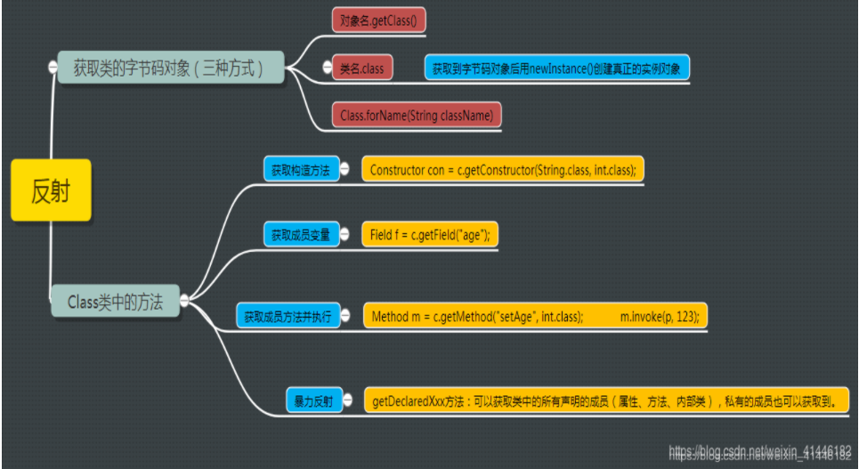

> 在之前的学习应用中并未接触过框架设计，于是便忘却了反射的深究，而今再泛读Java编程思想，来慢慢解读反射；反射在java中使用频率还是比较高的，比如JDK动态代理使用反射获取到目标类所有的接口列表。还有我们熟悉的JDBC获取驱动，Class.forName(“com.mysql.jdbc.Driver”)

# 什么是反射

将类的各个组成部分封装成其他对象，这就是反射机制；

看起来很简单是吗？先说好处，好处在于可以解藕，提升可扩展性；

jvm设计中如何使用反射的呢？

```java
public class Cat implements Animal {
    public String name;
    public int ege;
    public int anInt;
    @Override
    public void use() {
        System.out.println("猫"+Cat.class.getSimpleName()+"是看门的");
    }
}
```

例如这个类，首先编译成字节码文件Cat.class;

然后jvm启动，通过类加载器ClassLoader把Cat.class文件属性加载进内存；变成一个以类名为属性名的Class类对象Class Cat;并进行分类，把成员变量打包成Field[] fields数组，把构造方法打包成Constructor[] cons数组，把成员方法打包成Method[ ] methods数组。

然后执行new一个 Cat对象的时候，就会去内存中找到Class类型名字叫Cat的对象，然后创建对象；

这就是反射，把原本属于Cat的所有组成部分封装成其他对象，后面所有与Cat有关的操作都交给封装后的对象，这就实现了解藕；



# 非反射

RTTI（Run-Time Type Identification)，通过运行时类型信息程序能够使用基类的指针或引用来检查这些指针或引用所指的对象的实际派生类型。

RTTI和反射的区别就在于反射是在运行期间**动态获取class文件**进行读取其中的信息，而普通的RTTI(非反射)就是**在编译器获取class文件信息并加入到类加载器中**；


