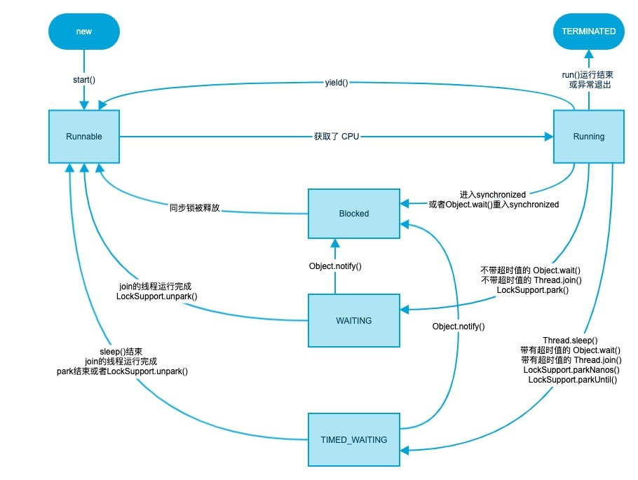

# 1.线程 ioc aop 事务 mapper restful 数据库 mybatis redis

要问的问题：

1、中断这么用

2、http服务是默认占用80端口的，那如果我80端口部署了其它服务呢？

3、

## 1.1 线程的生命周期

- New (新建) new Thread

- Runnable(可运行 ) 调用start方法（可执行的命名是因为，线程不一定一直在运行，它时而会卡一下）

- Blocked(阻塞)遇到synchronized，且有一个线程正在占用； Waiting(等待)Object.wait方法 Thread.join方法或者是java.concurrent中的Lock或者Condition的时候。有几个方法有**超时参数**，调用这些方法线程会进入计时等待(timed waiting)状态，这一状态将保持到超时期满或者接收到适当的通知。带有超时参数的方法有Thread.sleep和记时版的Object.wait、Thread.join、Lock.tryLock以及Condition.await。

  补充：当一个线程阻塞、等待或终止时，可以调度另一个线程运行。当一个线程被重新激活(例如，因为超时期满或成功地获得了一个锁)，调度器检查它是否具有比当前运行线程更高的优先级。如果是，那么调度器就会剥夺某个当前运行的线程的运行权，选择一个新线程运行。



- 终止线程 run方法正常退出，线程自然终止。因为一个没有捕获的异常终止了run方法，使线程意外终止。补充：stop方法可以杀死线程，但已被弃用。

  再补充


## 1.2 线程新建和就绪

```java
public Thread(Runnable target) { //构造新线程，调用指定目标的run()方法
        init(null, target, "Thread-" + nextThreadNum(), 0);
    }
private static synchronized int nextThreadNum() {//给线程命名
        return threadInitNumber++;
    }
private void init(ThreadGroup g, Runnable target, String name,//继续调
                      long stackSize) {
        init(g, target, name, stackSize, null, true);
    }
private void init(ThreadGroup g, Runnable target, String name,//具体创建线程的方法
                      long stackSize, AccessControlContext acc,
                      boolean inheritThreadLocals) {
        if (name == null) {
            throw new NullPointerException("name cannot be null");
        }

        this.name = name;//给线程一个名字

        Thread parent = currentThread();//当前线程做为父线程 这个方法被native关键字修饰，是个c++方法
        SecurityManager security = System.getSecurityManager();
        if (g == null) {
            /* Determine if it's an applet or not */

            /* If there is a security manager, ask the security manager
               what to do. */
            if (security != null) {
                g = security.getThreadGroup();
            }

            /* If the security doesn't have a strong opinion of the matter
               use the parent thread group. */
            if (g == null) {
                g = parent.getThreadGroup();
            }
        }
```

```java
public synchronized void start() {
        /**
         * This method is not invoked for the main method thread or "system"
         * group threads created/set up by the VM. Any new functionality added
         * to this method in the future may have to also be added to the VM.
         *
         * A zero status value corresponds to state "NEW".
         */
        if (threadStatus != 0)
            throw new IllegalThreadStateException();

        /* Notify the group that this thread is about to be started
         * so that it can be added to the group's list of threads
         * and the group's unstarted count can be decremented. */
        group.add(this);//线程池加上我这个线程示例

        boolean started = false;
        try {
            start0();//这也是个本地方法，告诉jvm启动新线程并发执行程序
            started = true;
        } finally {
            try {
                if (!started) {
                    group.threadStartFailed(this);
                }
            } catch (Throwable ignore) {
                /* do nothing. If start0 threw a Throwable then
                  it will be passed up the call stack */
            }
        }
    }
```

```java
//新建线程并启动
public class ThreadNew{
    public static void main(String[] args) {
        Runnable task1 = ()->{
            for (int i = 0; i < 100; i++) {
                System.out.println("hi thread1"+i);
            }
        };
        Runnable task2 = ()->{
            for (int i = 0; i < 100; i++) {
                System.out.println("hi thread"+i);
            }
        };
        new Thread(task1).start();
        new Thread(task2).start();
    }
}
```

**通过以上的源码阅读可以看到，线程的启动其实做了好多事，首先指向当前类下的runable接口并给线程命名（当然说的只是此刻情境下的执行过程，如果是别的线程类构造函数另说），然后把当前线程做为父线程，然后获取java的安全管理器，如果安全管理器没意见的话就把当前线程的线程池赋予新建的线程。这就算新建完成了，线程池，线程名，runabl接口都齐活了。然后调用start方法启动这个线程，先判定线程状态属性是不是0，然后把这个线程加入到线程池，然后调用本地方法start0()，jvm就整了个新线程去跑了！**补充：线程的setName(String s)也可以为线程命名！

## 1.3 守护线程

守护线程就是为其它线程服务的线程，它要启动在被服务线程的前面，当jvm中只存在守护线程的时候，jvm退出！

设置守护线程：t.setDaemon(true);

```java
//java.lang.Thread
void setDaemon(boolean isDaemon)
  //标识该线程为守护线程
```

## 1.4 未捕获异常处理器

线程发生未捕获异常死掉，发送Throwable的栈轨迹和线程名输出到system.err

## 1.5 线程优先级1-10

```java
//设置线程优先级，在1-10之间 java.lang.Thread
void setPriority(int newPriority)
```

## 1.6 线程同步-锁

重入锁，公平锁 死锁

R
