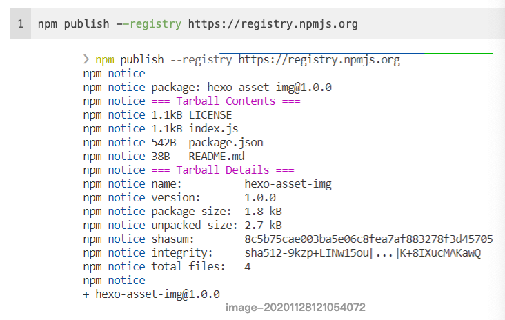

# Java

面向对象1

分支语句和循环语句1

数组1

Debug1

继承1

修饰符1final表示是最终结果 staric表示被类的所有对象共享，可以通过类名调用；

多态？

抽象类：有抽象方法 abstract

接口 interface

内部类 就是在一个类里面的类 分为类里类和类外类 

api math system object arrays 包装类和Date

异常 

集合

File类

递归

字节流 字节缓冲流 字符流

io流

properties集合

多线程

网络编程

lambda

stream流

类加载器/反射/模块化

# web

mysql

前端

tomcat

servlet

http

Filter

Listener

Ajax

Json 

redis

maven

# 框架

spring

springboot

mybatis

springcloud

消息中间件

搜索引擎

Docker 

