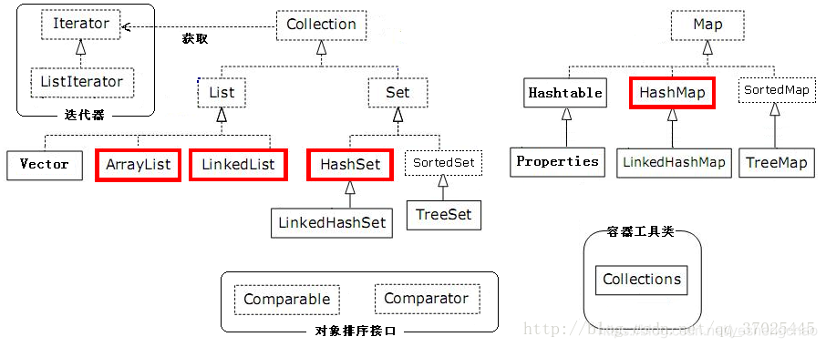
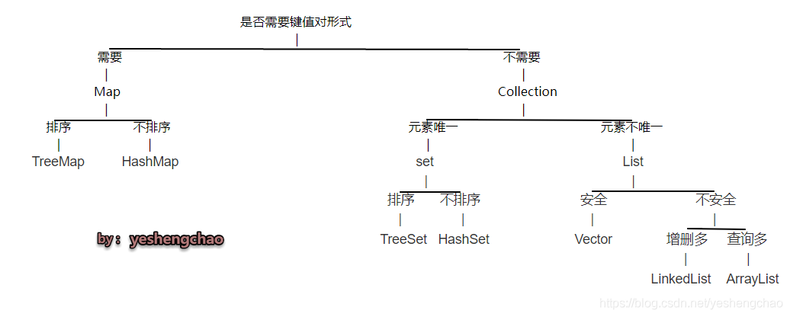

> Java工具包提供了强大的数据结构。在Java中的数据结构主要包括以下几种接口和类：
>
> - 枚举（Enumeration）
> - 位集合（BitSet）
> - 向量（Vector）
> - 栈（Stack）
> - 字典（Dictionary）
> - 哈希表（Hashtable）
> - 属性（Properties）

# 枚举（Enumeration)

枚举（Enumeration）接口虽然它本身不属于数据结构,但它在其他数据结构的范畴里应用很广。 枚举（The Enumeration）接口定义了一种从数据结构中取回连续元素的方式（nextElement( )方法）。

**这种传统接口已被迭代器取代，虽然Enumeration 还未被遗弃，但在现代代码中已经被很少使用了。**尽管如此，它还是使用在诸如Vector和Properties这些传统类所定义的方法中，除此之外，还用在一些API类，并且在应用程序中也广泛被使用。 下表总结了一些Enumeration声明的方法：

| 方法                           | 描述                                                         |
| ------------------------------ | ------------------------------------------------------------ |
| **boolean hasMoreElements( )** | 测试此枚举是否包含更多的元素。                               |
| **Object nextElement( )**      | 如果此枚举对象至少还有一个可提供的元素，则返回此枚举的下一个元素。 |

```java
    //Vector中便用到了枚举接口
		E elementData(int index) {
        return (E) elementData[index];
    }
    public Enumeration<E> elements() {
        return new Enumeration<E>() {
            int count = 0;

            public boolean hasMoreElements() {
                return count < elementCount;
            }

            public E nextElement() {
                synchronized (Vector.this) {
                    if (count < elementCount) {
                        return elementData(count++);
                    }
                }
                throw new NoSuchElementException("Vector Enumeration");
            }
        };
    }
```

```java
//使用枚举接口
import java.util.Vector;
import java.util.Enumeration;
 
public class EnumerationTester {
 
   public static void main(String args[]) {
     	//定个接口
      Enumeration<String> days;
      Vector<String> dayNames = new Vector<String>();
      dayNames.add("Sunday");
      dayNames.add("Monday");
      dayNames.add("Tuesday");
      dayNames.add("Wednesday");
      dayNames.add("Thursday");
      dayNames.add("Friday");
      dayNames.add("Saturday");
     //反射
      days = dayNames.elements();
      while (days.hasMoreElements()){
         System.out.println(days.nextElement()); 
      }
   }
}
```

## 位集合

位集合类实现了一组可以单独设置和清除的位或标志。

该类在**处理一组布尔值**的时候非常有用，你只需要给**每个值赋值一"位"**，然后对位进行适当的设置或清除，就可以对布尔值进行操作了。一个Bitset类创建一种**特殊类型的数组**来保存位值。BitSet中数组大小会随需要增加。这和位向量（vector of bits）比较类似。

## 构造方法

第一个构造方法创建一个默认的对象：

```
BitSet()
```

第二个方法允许用户指定初始大小。所有位初始化为0。

```
BitSet(int size)
```

## 方法

BitSet中实现了Cloneable接口中定义的方法如下表所列：

| 序号 | 方法描述                                                     |
| :--- | :----------------------------------------------------------- |
| 1    | **void and(BitSet set)** 对此目标位 set 和参数位 set 执行逻辑与操作。 |
| 2    | **void andNot(BitSet set)** 清除此 BitSet 中所有的位，其相应的位在指定的 BitSet 中已设置。 |
| 3    | **int cardinality( )** 返回此 BitSet 中设置为 true 的位数。  |
| 4    | **void clear( )** 将此 BitSet 中的所有位设置为 false。       |
| 5    | **void clear(int index)** 将索引指定处的位设置为 false。     |
| 6    | **void clear(int startIndex, int endIndex)** 将指定的 startIndex（包括）到指定的 toIndex（不包括）范围内的位设置为 false。 |
| 7    | **Object clone( )** 复制此 BitSet，生成一个与之相等的新 BitSet。 |
| 8    | **boolean equals(Object bitSet)** 将此对象与指定的对象进行比较。 |
| 9    | **void flip(int index)** 将指定索引处的位设置为其当前值的补码。 |
| 10   | **void flip(int startIndex, int endIndex)** 将指定的 fromIndex（包括）到指定的 toIndex（不包括）范围内的每个位设置为其当前值的补码。 |
| 11   | **boolean get(int index)** 返回指定索引处的位值。            |
| 12   | **BitSet get(int startIndex, int endIndex)** 返回一个新的 BitSet，它由此 BitSet 中从 fromIndex（包括）到 toIndex（不包括）范围内的位组成。 |
| 13   | **int hashCode( )** 返回此位 set 的哈希码值。                |
| 14   | **boolean intersects(BitSet bitSet)** 如果指定的 BitSet 中有设置为 true 的位，并且在此 BitSet 中也将其设置为 true，则返回 true。 |
| 15   | **boolean isEmpty( )** 如果此 BitSet 中没有包含任何设置为 true 的位，则返回 true。 |
| 16   | int length( ) 返回此 BitSet 的"逻辑大小"：BitSet 中最高设置位的索引加 1。 |
| 17   | int nextClearBit(int startIndex) 返回第一个设置为 false 的位的索引，这发生在指定的起始索引或之后的索引上。 |
| 18   | int nextSetBit(int startIndex) 返回第一个设置为 true 的位的索引，这发生在指定的起始索引或之后的索引上。 |
| 19   | void or(BitSet bitSet) 对此位 set 和位 set 参数执行逻辑或操作。 |
| 20   | void set(int index) 将指定索引处的位设置为 true。            |
| 21   | void set(int index, boolean v)  将指定索引处的位设置为指定的值。 |
| 22   | void set(int startIndex, int endIndex) 将指定的 fromIndex（包括）到指定的 toIndex（不包括）范围内的位设置为 true。 |
| 23   | void set(int startIndex, int endIndex, boolean v) 将指定的 fromIndex（包括）到指定的 toIndex（不包括）范围内的位设置为指定的值。 |
| 24   | int size( ) 返回此 BitSet 表示位值时实际使用空间的位数。     |
| 25   | String toString( ) 返回此位 set 的字符串表示形式。           |
| 26   | void xor(BitSet bitSet) 对此位 set 和位 set 参数执行逻辑异或操作。 |

## 举个例子

```java
import java.util.BitSet;
 
public class BitSetDemo {
 
  public static void main(String args[]) {
     BitSet bits1 = new BitSet(16);
     BitSet bits2 = new BitSet(16);
      
     // set some bits
     for(int i=0; i<16; i++) {
        if((i%2) == 0) bits1.set(i);
        if((i%5) != 0) bits2.set(i);
     }
     System.out.println("Initial pattern in bits1: ");
     System.out.println(bits1);
     System.out.println("\nInitial pattern in bits2: ");
     System.out.println(bits2);
 
     // AND bits
     bits2.and(bits1);
     System.out.println("\nbits2 AND bits1: ");
     System.out.println(bits2);
 
     // OR bits
     bits2.or(bits1);
     System.out.println("\nbits2 OR bits1: ");
     System.out.println(bits2);
 
     // XOR bits
     bits2.xor(bits1);
     System.out.println("\nbits2 XOR bits1: ");
     System.out.println(bits2);
  }
}
```

# 向量（Vector）

向量（Vector）类和**传统数组非常相似，Vector对象的元素也能通过索引访问。但是Vector的大小能根据需要动态的变化。**

使用Vector类**最主要的好处就是在创建对象的时候不必给对象指定大小**，**它的大小会根据需要动态的变化，所以当我们需要快速读取且顺序添加的数据的时可以用Vector**。

## 构造方法

Vector 类支持 4 种构造方法。

第一种构造方法创建一个默认的向量，默认大小为 10：

```
Vector()
```

第二种构造方法创建指定大小的向量。

```
Vector(int size)
```

第三种构造方法创建指定大小的向量，并且**增量用 incr 指定**。**增量表示向量每次增加的元素数目**。

```
Vector(int size,int incr)
```

第四种构造方法创建一个包含集合 c 元素的向量：

```
Vector(Collection c)
```

## 方法

除了从父类继承的方法外 Vector 还定义了以下方法：

| 序号 | 方法描述                                                     |
| :--- | :----------------------------------------------------------- |
| 1    | **void add(int index, Object element)   在此向量的指定位置插入指定的元素。** |
| 2    | **boolean add(Object o)   将指定元素添加到此向量的末尾。**   |
| 3    | boolean addAll(Collection c)  将指定 Collection 中的所有元素添加到此向量的末尾，按照指定 collection 的迭代器所返回的顺序添加这些元素。 |
| 4    | boolean addAll(int index, Collection c)  在指定位置将指定 Collection 中的所有元素插入到此向量中。 |
| 5    | void addElement(Object obj)   将指定的组件添加到此向量的末尾，将其大小增加 1。 |
| 6    | **int capacity()  返回此向量的当前容量。**                   |
| 7    | **void clear()  从此向量中移除所有元素。**                   |
| 8    | Object clone()  返回向量的一个副本。                         |
| 9    | boolean contains(Object elem)  如果此向量包含指定的元素，则返回 true。 |
| 10   | boolean containsAll(Collection c)  如果此向量包含指定 Collection 中的所有元素，则返回 true。 |
| 11   | void copyInto(Object[] anArray)   将此向量的组件复制到指定的数组中。 |
| 12   | Object elementAt(int index)  返回指定索引处的组件。          |
| 13   | Enumeration elements()  返回此向量的组件的枚举。             |
| 14   | void ensureCapacity(int minCapacity)  增加此向量的容量（如有必要），以确保其至少能够保存最小容量参数指定的组件数。 |
| 15   | boolean equals(Object o)  比较指定对象与此向量的相等性。     |
| 16   | Object firstElement()  返回此向量的第一个组件（位于索引 0) 处的项）。 |
| 17   | Object get(int index)  返回向量中指定位置的元素。            |
| 18   | int hashCode()  返回此向量的哈希码值。                       |
| 19   | int indexOf(Object elem)   返回此向量中第一次出现的指定元素的索引，如果此向量不包含该元素，则返回 -1。 |
| 20   | int indexOf(Object elem, int index)   返回此向量中第一次出现的指定元素的索引，从 index 处正向搜索，如果未找到该元素，则返回 -1。 |
| 21   | void insertElementAt(Object obj, int index)  将指定对象作为此向量中的组件插入到指定的 index 处。 |
| 22   | boolean isEmpty()  测试此向量是否不包含组件。                |
| 23   | Object lastElement()  返回此向量的最后一个组件。             |
| 24   | int lastIndexOf(Object elem)   返回此向量中最后一次出现的指定元素的索引；如果此向量不包含该元素，则返回 -1。 |
| 25   | int lastIndexOf(Object elem, int index)  返回此向量中最后一次出现的指定元素的索引，从 index 处逆向搜索，如果未找到该元素，则返回 -1。 |
| 26   | Object remove(int index)   移除此向量中指定位置的元素。      |
| 27   | boolean remove(Object o)  移除此向量中指定元素的第一个匹配项，如果向量不包含该元素，则元素保持不变。 |
| 28   | boolean removeAll(Collection c)  从此向量中移除包含在指定 Collection 中的所有元素。 |
| 29   | void removeAllElements()  从此向量中移除全部组件，并将其大小设置为零。 |
| 30   | boolean removeElement(Object obj)  从此向量中移除变量的第一个（索引最小的）匹配项。 |
| 31   | void removeElementAt(int index)  删除指定索引处的组件。      |
| 32   | protected void removeRange(int fromIndex, int toIndex) 从此 List 中移除其索引位于 fromIndex（包括）与 toIndex（不包括）之间的所有元素。 |
| 33   | boolean retainAll(Collection c)  在此向量中仅保留包含在指定 Collection 中的元素。 |
| 34   | Object set(int index, Object element)  用指定的元素替换此向量中指定位置处的元素。 |
| 35   | void setElementAt(Object obj, int index)  将此向量指定 index 处的组件设置为指定的对象。 |
| 36   | void setSize(int newSize)   设置此向量的大小。               |
| 37   | int size()   返回此向量中的组件数。                          |
| 38   | List subList(int fromIndex, int toIndex)  返回此 List 的部分视图，元素范围为从 fromIndex（包括）到 toIndex（不包括）。 |
| 39   | Object[] toArray()  返回一个数组，包含此向量中以恰当顺序存放的所有元素。 |
| 40   | Object[] toArray(Object[] a)  返回一个数组，包含此向量中以恰当顺序存放的所有元素；返回数组的运行时类型为指定数组的类型。 |
| 41   | String toString()  返回此向量的字符串表示形式，其中包含每个元素的 String 表示形式。 |
| 42   | void trimToSize()   对此向量的容量进行微调，使其等于向量的当前大小。 |

## 代码测试

```java
package code3;

import java.util.*;

public class VectorDemo {

    public static void main(String args[]) {
        // initial size is 3, increment is 2
        Vector v = new Vector(3, 2);
        System.out.println("Initial size: " + v.size());
        System.out.println("Initial capacity: " +
                v.capacity());
        v.addElement(new Integer(1));
        v.addElement(new Integer(2));
        v.addElement(new Integer(3));
        v.addElement(new Integer(4));
        System.out.println("Capacity after four additions: " +
                v.capacity());

        v.addElement(new Double(5.45));
        System.out.println("Current capacity: " +
                v.capacity());
        v.addElement(new Double(6.08));
        v.addElement(new Integer(7));
        System.out.println("Current capacity: " +
                v.capacity());
        v.addElement(new Float(9.4));
        v.addElement(new Integer(10));
        System.out.println("Current capacity: " +
                v.capacity());
        v.addElement(new Integer(11));
        v.addElement(new Integer(12));
        System.out.println("First element: " +
                (Integer)v.firstElement());
        System.out.println("Last element: " +
                (Integer)v.lastElement());
        if(v.contains(new Integer(3)))
            System.out.println("Vector contains 3.");
        // enumerate the elements in the vector.
        Enumeration vEnum = v.elements();
        System.out.println("\nElements in vector:");
        while(vEnum.hasMoreElements())
            System.out.print(vEnum.nextElement() + " ");
        System.out.println();
    }
}
```

# 栈(Stack)

栈（Stack）实现了一个后进先出（LIFO）的数据结构，**是Vector的一个子类**，它实现了一个标准的后进先出的栈。堆栈只定义了默认构造函数，用来创建一个空栈。 堆栈除了包括由Vector定义的所有方法，也定义了自己的一些方法。

## 构造方法

```java
Stack()//构造一个空栈
```

## 方法

除了由Vector定义的所有方法，自己也定义了一些方法：

| 序号 | 方法描述                                                     |
| :--- | :----------------------------------------------------------- |
| 1    | boolean empty()  测试堆栈是否为空。                          |
| 2    | **Object peek( ) 查看堆栈顶部的对象，但不从堆栈中移除它**。  |
| 3    | **Object pop( ) 移除堆栈顶部的对象，并作为此函数的值返回该对象。** |
| 4    | **Object push(Object element) 把项压入堆栈顶部。**           |
| 5    | int search(Object element) 返回对象在堆栈中的位置，以 1 为基数。 |

## 代码测试

```java
import java.util.*;
 
public class StackDemo {
 
    static void showpush(Stack<Integer> st, int a) {
        st.push(new Integer(a));
        System.out.println("push(" + a + ")");
        System.out.println("stack: " + st);
    }
 
    static void showpop(Stack<Integer> st) {
        System.out.print("pop -> ");
        Integer a = (Integer) st.pop();
        System.out.println(a);
        System.out.println("stack: " + st);
    }
 
    public static void main(String args[]) {
        Stack<Integer> st = new Stack<Integer>();
        System.out.println("stack: " + st);
        showpush(st, 42);
        showpush(st, 66);
        showpush(st, 99);
        showpop(st);
        showpop(st);
        showpop(st);
        try {
            showpop(st);
        } catch (EmptyStackException e) {
            System.out.println("empty stack");
        }
    }
}
```

# 字典(Dictionary)

字典（Dictionary） 类是一个抽象类，它**定义了键映射到值的数据结构。当你想要通过特定的键而不是整数索引来访问数据的时候，这时候应该使用Dictionary。**由于Dictionary类是抽象类，所以**它只提供了键映射到值的数据结构，而没有提供特定的实现。**Dictionary类已经过时了,简单的说就是被map取代。在实际开发中，你可以实现Map接口来获取键/值的存储功能。

# Map接口

Map 接口中键和值一一映射. 可以通过键来获取值。

- 给定一个键和一个值，你可以将该值存储在一个 Map 对象。之后，你可以通过键来访问对应的值。
- 当访问的值不存在的时候，方法就会抛出一个 NoSuchElementException 异常。
- 当对象的类型和 Map 里元素类型不兼容的时候，就会抛出一个 ClassCastException 异常。
- 当在不允许使用 Null 对象的 Map 中使用 Null 对象，会抛出一个 NullPointerException 异常。
- 当尝试修改一个只读的 Map 时，会抛出一个 UnsupportedOperationException 异常。

## 方法

| 序号 | 方法描述                                                     |
| :--- | :----------------------------------------------------------- |
| 1    | void clear( )  从此映射中移除所有映射关系（可选操作）。      |
| 2    | boolean containsKey(Object k) 如果此映射包含指定键的映射关系，则返回 true。 |
| 3    | boolean containsValue(Object v) 如果此映射将一个或多个键映射到指定值，则返回 true。 |
| 4    | Set entrySet( ) 返回此映射中包含的映射关系的 Set 视图。      |
| 5    | boolean equals(Object obj) 比较指定的对象与此映射是否相等。  |
| 6    | **Object get(Object k) 返回指定键所映射的值；如果此映射不包含该键的映射关系，则返回 null。** |
| 7    | **int hashCode( ) 返回此映射的哈希码值。**                   |
| 8    | boolean isEmpty( ) 如果此映射未包含键-值映射关系，则返回 true。 |
| 9    | **Set keySet( ) 返回此映射中包含的键的 Set 视图。**          |
| 10   | **Object put(Object k, Object v) 将指定的值与此映射中的指定键关联（可选操作）。** |
| 11   | **void putAll(Map m) 从指定映射中将所有映射关系复制到此映射中（可选操作）。** |
| 12   | Object remove(Object k) 如果存在一个键的映射关系，则将其从此映射中移除（可选操作）。 |
| 13   | int size( ) 返回此映射中的键-值映射**关系数**。              |
| 14   | Collection values( ) 返回此映射中包含的值的 Collection 视图。 |

## 代码测试

```java
import java.util.*;

public class CollectionDemo {

    public static void main(String[] args) {
        Map m1 = new HashMap();
        m1.put("Zara", "8");
        m1.put("Mahnaz", "31");
        m1.put("Ayan", "12");
        m1.put("Daisy", "14");
        Set a = m1.keySet();
        System.out.println(m1.size());
        System.out.println(a);
        System.out.println();
        System.out.println(" Map Elements");
        System.out.print("\t" + m1);
    }
}
```

# Hashtable

Hashtable是原始的java.util的一部分， 是一个Dictionary具体的实现 。然而，**Java 2 重构的Hashtable实现了Map接口**，因此，Hashtable现在集成到了集合框架中。它**和HashMap类很相似**，但是它**支持同步**。

像HashMap一样，Hashtable在哈希表中存储键/值对。当使用一个哈希表，要指定用作键的对象，以及要链接到该键的值。然后，**该键经过哈希处理(Hashtable重写了hashCode方法)，所得到的散列码被用作存储在该表中值的索引。**

## 构造方法

Hashtable定义了四个构造方法。第一个是默认构造方法：

```
Hashtable()
```

第二个构造函数创建指定大小的哈希表：

```
Hashtable(int size)
```

第三个构造方法创建了一个指定大小的哈希表，并且通过fillRatio指定填充比例。

填充比例必须介于0.0和1.0之间，它决定了哈希表在重新调整大小之前的充满程度：

```
Hashtable(int size,float fillRatio)
```

第四个构造方法创建了一个以M中元素为初始化元素的哈希表。

哈希表的容量被设置为M的两倍。

```
Hashtable(Map m)
```

## 方法

Hashtable中除了从Map接口中定义的方法外，还定义了以下方法：

| **序号** | **方法描述**                                                 |
| :------- | :----------------------------------------------------------- |
| 1        | **void clear( )**  将此哈希表清空，使其不包含任何键。        |
| 2        | **Object clone( )** 创建此哈希表的浅表副本。                 |
| 3        | **boolean contains(Object value)**  测试此映射表中是否存在与指定值关联的键。 |
| 4        | **boolean containsKey(Object key)** 测试指定对象是否为此哈希表中的键。 |
| 5        | **boolean containsValue(Object value)** 如果此 Hashtable 将一个或多个键映射到此值，则返回 true。 |
| 6        | **Enumeration elements( )** 返回此哈希表中的值的枚举。       |
| 7        | **Object get(Object key)**  **返回指定键所映射到的值**，如果此映射不包含此键的映射，则返回 null. 更确切地讲，如果此映射包含满足 (key.equals(k)) 的从键 k 到值 v 的映射，则此方法返回 v；否则，返回 null。 |
| 8        | **boolean isEmpty( )** 测试此哈希表是否没有键映射到值。      |
| 9        | **Enumeration keys( )**  返回此哈希表中的**键的枚举**。      |
| 10       | **Object put(Object key, Object value)** **将指定 key 映射到此哈希表中的指定 value。** |
| 11       | **void rehash( )** 增加此哈希表的容量并在内部对其进行重组，以便更有效地容纳和访问其元素。 |
| 12       | **Object remove(Object key)** 从哈希表中移除该键及其相应的值。 |
| 13       | **int size( )**  返回此哈希表中的**键的数量**。              |
| 14       | **String toString( )** 返回此 Hashtable 对象的字符串表示形式，其形式为 ASCII 字符 ", " （逗号加空格）分隔开的、括在括号中的一组条目。 |

## 代码测试

```java
import java.util.*;

public class HashTableDemo {

   public static void main(String args[]) {
      // Create a hash map
      Hashtable balance = new Hashtable();
      Enumeration names;
      String str;
      double bal;

      balance.put("Zara", new Double(3434.34));
      balance.put("Mahnaz", new Double(123.22));
      balance.put("Ayan", new Double(1378.00));
      balance.put("Daisy", new Double(99.22));
      balance.put("Qadir", new Double(-19.08));

      // Show all balances in hash table.
      names = balance.keys();
      while(names.hasMoreElements()) {
         str = (String) names.nextElement();
         System.out.println(str + ": " +
         balance.get(str));
      }
      System.out.println();
      // Deposit 1,000 into Zara's account
      bal = ((Double)balance.get("Zara")).doubleValue();
      balance.put("Zara", new Double(bal+1000));
      System.out.println("Zara's new balance: " +
      balance.get("Zara"));
   }
}
```

# 属性(Peoperties)

Properties **继承于 Hashtable**。表示一个**持久的属性集**.属性列表中**每个键及其对应值都是一个字符串。**

Properties 类被许多 Java 类使用。例如，在获取环境变量时它就作为 System.getProperties() 方法的返回值。

Properties 定义如下实例变量.这个变量持有一个 Properties 对象相关的默认属性列表。

## 构造方法

```
Properties defaults;
```

Properties类定义了两个构造方法. 第一个构造方法没有默认值。

```
Properties()
```

第二个构造方法使用propDefault 作为默认值。两种情况下，属性列表都为空：

```
Properties(Properties propDefault)
```

## 方法

除了从 Hashtable 中所定义的方法，Properties 还定义了以下方法：

| **序号** | **方法描述**                                                 |
| :------- | :----------------------------------------------------------- |
| 1        | **String getProperty(String key)**  **用指定的键在此属性列表中搜索属性。** |
| 2        | **String getProperty(String key, String defaultProperty)** 用指定的键在属性列表中搜索属性。 |
| 3        | **void list(PrintStream streamOut)**  将属性列表输出到指定的输出流。 |
| 4        | **void list(PrintWriter streamOut)** 将属性列表输出到指定的输出流。 |
| 5        | **void load(InputStream streamIn) throws IOException**  从输入流中读取属性列表（键和元素对）。 |
| 6        | **Enumeration propertyNames( )** 按简单的面向行的格式从输入字符流中读取属性列表（键和元素对）。 |
| 7        | **Object setProperty(String key, String value)**  调用 Hashtable 的方法 put。 |
| 8        | **void store(OutputStream streamOut, String description)**  以适合使用 load(InputStream)方法加载到 Properties 表中的格式，将此 Properties 表中的属性列表（键和元素对）写入输出流。 |

## 代码测试

```java
import java.util.*;
 
public class PropDemo {
 
   public static void main(String args[]) {
      Properties capitals = new Properties();
      Set states;
      String str;
      
      capitals.put("Illinois", "Springfield");
      capitals.put("Missouri", "Jefferson City");
      capitals.put("Washington", "Olympia");
      capitals.put("California", "Sacramento");
      capitals.put("Indiana", "Indianapolis");
 
      // Show all states and capitals in hashtable.
      states = capitals.keySet(); // get set-view of keys
      Iterator itr = states.iterator();//get Iterator ergodic states(set)
      while(itr.hasNext()) {
         str = (String) itr.next();
         System.out.println("The capital of " +
            str + " is " + capitals.getProperty(str) + ".");
      }
      System.out.println();
 
      // look for state not in list -- specify default
      str = capitals.getProperty("Florida", "Not Found");
      System.out.println("The capital of Florida is "
          + str + ".");
   }
}
```

Java 中的 **Iterator** (迭代器)功能比较简单，并且只能单向移动：

-  (1) 使用方法 iterator() 要求容器返回一个 Iterator。第一次调用 Iterator 的 next() 方法时，它返回序列的第一个元素。注意：iterator() 方法是 java.lang.Iterable 接口,被 Collection 继承。
-  (2) 使用 next() 获得序列中的下一个元素。
-  (3) 使用 hasNext() 检查序列中是否还有元素。
-  (4) 使用 remove() 将迭代器新返回的元素删除。

# 集合框架


Java 集合框架主要包括两种类型的容器，一种是集合（Collection），存储一个元素集合，另一种是图（Map），存储键/值对映射。Collection 接口又有 3 种子类型，List、Set 和 Queue，再下面是一些抽象类，最后是具体实现类，常用的有 ArrayList、LinkedList、HashSet、LinkedHashSet、HashMap、LinkedHashMap 等等

集合框架是一个用来代表和操纵集合的统一架构。所有的集合框架都包含如下内容：

- **接口：**是代表集合的抽象数据类型。例如 Collection、List、Set、Map 等。之所以定义多个接口，是为了以不同的方式操作集合对象
- **实现（类）：**是集合接口的具体实现。从本质上讲，它们是可重复使用的数据结构，例如：ArrayList、LinkedList、HashSet、HashMap。
- **算法：**是实现集合接口的对象里的方法执行的一些有用的计算，例如：搜索和排序。这些算法被称为多态，那是因为相同的方法可以在相似的接口上有着不同的实现。

## 集合接口

集合框架定义了一些接口。本节提供了每个接口的概述：

| 序号 | 接口描述                                                     |
| :--- | :----------------------------------------------------------- |
| 1    | Collection 接口 Collection 是最基本的集合接口，**一个 Collection 代表一组 Object**，即 Collection 的元素, Java不提供直接继承自Collection的类，只提供继承于的子接口(如List和set)。**Collection 接口存储一组不唯一，无序的对象。** |
| 2    | List 接口 **List接口是一个有序的 Collection**，使用此接口能够精确的控制每个元素插入的位置，能够通过索引(元素在List中位置，类似于数组的下标)来访问List中的元素，第一个元素的索引为 0，而且允许有相同的元素。List 接口存储一组不唯一，有序（插入顺序）的对象。 |
| 3    | Set 具有与 Collection 完全一样的接口，只是行为上不同，Set 不保存重复的元素。**Set 接口存储一组唯一，无序的对象。** |
| 4    | SortedSet 继承于Set保存有序的集合。                          |

### Set和List的区别

- Set 接口实例存储的是无序的，不重复的数据。List 接口实例存储的是有序的，可以重复的元素。
- **Set检索效率低下，删除和插入效率高**，插入和删除不会引起元素位置改变 **<实现类有HashSet,TreeSet>**。
- List和数组类似，可以动态增长，根据实际存储的数据的长度自动增长List的长度。**查找元素效率高，插入删除效率低**，因为会引起其他元素位置改变 **<实现类有ArrayList,LinkedList,Vector>** 。

| 1    | Map Map 接口存储一组键值对象，提供key（键）到value（值）的映射。 |
| :--- | :----------------------------------------------------------- |
| 2    | Map.Entry 描述在一个Map中的一个元素（键/值对）。是一个 Map 的内部接口。 |
| 3    | SortedMap 继承于 Map，**使 Key 保持在升序排列。**            |
| 4    | Enumeration 这是一个传统的接口和定义的方法，通过它可以枚举（一次获得一个）对象集合中的元素。**这个传统接口已被迭代器取代。** |

## 集合实现类

Java提供了一套实现了Collection接口的标准集合类。其中一些是具体类，这些类可以直接拿来使用，而另外一些是抽象类，提供了接口的部分实现。

| 序号 | 类描述                                                       |
| :--- | :----------------------------------------------------------- |
| 1    | AbstractCollection  实现了大部分的集合接口。                 |
| 2    | AbstractList  继承于AbstractCollection 并且实现了大部分List接口。 |
| 3    | AbstractSequentialList  继承于 AbstractList ，提供了对数据元素的链式访问而不是随机访问。 |
| 4    | **LinkedList**该类实现了List接口，**允许有null（空）元素**。主要用于创建**链表数据结构**，该类没有同步方法，如果多个线程同时访问一个List，则必须自己实现访问同步，解决方法就是在创建List时候构造一个同步的List。例如：`List list=Collections.synchronizedList(newLinkedList(...));`**LinkedList 查找效率低。** |
| 5    | **ArrayList** 该类也是实现了List的接口，**实现了可变大小的数组**，**随机访问和遍历元素时，提供更好的性能**。该类也是非同步的,在多线程的情况下不要使用。**ArrayList 增长当前长度的50%，插入删除效率低。** |
| 6    | AbstractSet  继承于AbstractCollection 并且实现了大部分Set接口。 |
| 7    | **HashSet**该类实现了Set接口，**不允许出现重复元素，不保证集合中元素的顺序，允许包含值为null的元素，但最多只能一个。** |
| 8    | LinkedHashSet 具有可预知迭代顺序的 `Set` 接口的哈希表和链接列表实现。 |
| 9    | TreeSet 该类实现了Set接口，可以实现排序等功能。              |
| 10   | AbstractMap  实现了大部分的Map接口。                         |
| 11   | **HashMap** HashMap 是一个散列表，它**存储的内容是键值对(key-value)映射**。 该类实现了Map接口，根据键的HashCode值存储数据，**具有很快的访问速度，最多允许一条记录的键为null**，**不支持线程同步**。 |
| 12   | TreeMap 继承了AbstractMap，并且使用一颗树。                  |
| 13   | WeakHashMap 继承AbstractMap类，使用弱密钥的哈希表。          |
| 14   | LinkedHashMap 继承于HashMap，使用元素的自然顺序对元素进行排序. |
| 15   | IdentityHashMap 继承AbstractMap类，比较文档时使用引用相等。  |

| 序号 | 类描述                                                       |
| :--- | :----------------------------------------------------------- |
| 1    | Vector 该类和ArrayList非常相似，但是该类是同步的，可以用在多线程的情况，该类允许设置默认的增长长度，默认扩容方式为原来的2倍。 |
| 2    | Stack 栈是Vector的一个子类，它实现了一个标准的后进先出的栈。 |
| 3    | Dictionary Dictionary 类是一个抽象类，用来存储键/值对，作用和Map类相似,**已过时**。 |
| 4    | Hashtable Hashtable 是 Dictionary(字典) 类的子类，位于 java.util 包中。 |
| 5    | Properties Properties 继承于 Hashtable，表示一个持久的属性集，属性列表中每个键及其对应值都是一个字符串。 |
| 6    | BitSet 一个Bitset类创建一种特殊类型的数组来保存位值。BitSet中数组大小会随需要增加。 |

# 总结各集合框架适用场景



Java中的集合分为**单列集合Collection**和**双列集合Map。**

List(有序,可重复)
            ArrayList
                底层数据结构是数组,查询快,增删慢
                线程不安全,效率高
            **Vector**
                底层数据结构是数组,查询快,增删慢
                线程安全,效率低
            LinkedList
                底层数据结构是链表,查询慢,增删快
                线程不安全,效率高
 Set(无序,唯一)
            HashSet
                底层数据结构是哈希表。             
                LinkedHashSet
                    底层数据结构由链表和哈希表组成。
                    由链表保证元素有序。
                    由哈希表保证元素唯一。
            TreeSet
                底层数据结构是红黑树。(是一种自平衡的二叉树)
                    根据比较的返回值是否是0来决定保证元素唯一性
                    两种排序方式
                        自然排序(元素具备比较性)
                            让元素所属的类实现Comparable接口
                        比较器排序(集合具备比较性)
                            让集合接收一个Comparator的实现类对象

Map(双列集合)
        注：Map集合的数据结构仅仅针对键有效，与值无关。存储的是键值对形式的元素，键唯一，值可重复。      
        HashMap
            底层数据结构是哈希表。线程不安全，效率高
                哈希表依赖两个方法：hashCode()和equals()
                执行顺序：
                    首先判断hashCode()值是否相同
                        是：继续执行equals(),看其返回值
                            是true:说明元素重复，不添加
                            是false:就直接添加到集合
                        否：就直接添加到集合
                最终：
                    自动生成hashCode()和equals()即可
            LinkedHashMap
                底层数据结构由链表和哈希表组成。
                    由链表保证元素有序。
                    由哈希表保证元素唯一。
        Hashtable
            底层数据结构是哈希表。线程安全，效率低
                哈希表依赖两个方法：hashCode()和equals()
                执行顺序：
                    首先判断hashCode()值是否相同
                        是：继续执行equals(),看其返回值
                            是true:说明元素重复，不添加
                            是false:就直接添加到集合
                        否：就直接添加到集合
                最终：
                    自动生成hashCode()和equals()即可
        TreeMap
            底层数据结构是红黑树。(是一种自平衡的二叉树)
                根据比较的返回值是否是0来决定保证元素唯一性
                    两种排序方式
                        自然排序(元素具备比较性)
                            让元素所属的类实现Comparable接口
                        比较器排序(集合具备比较性)
                            让集合接收一个Comparator的实现类对象

**那么到底什么时候需要用什么样的集合呢？**
画一张图总结下，“安全”为线程安全，排序为排序算法；



