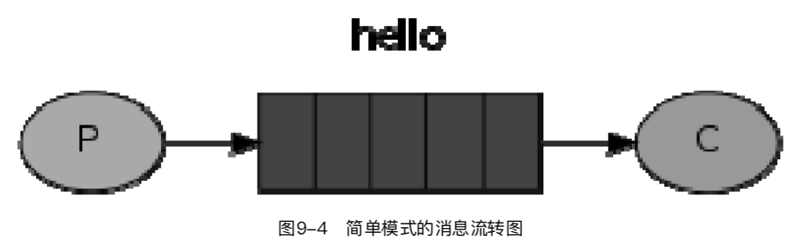
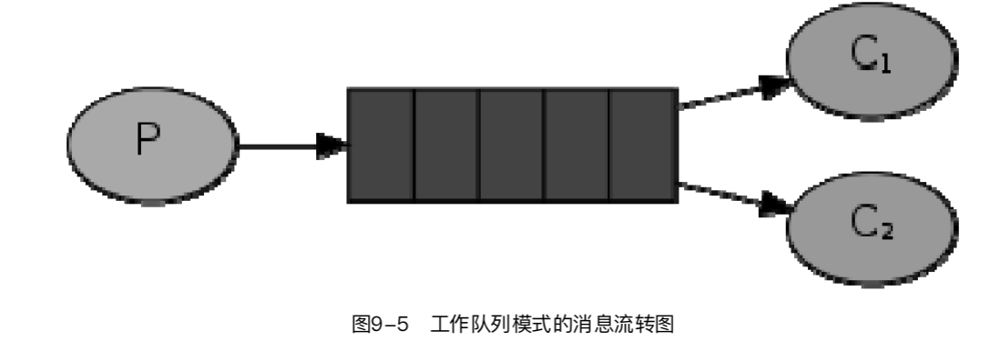
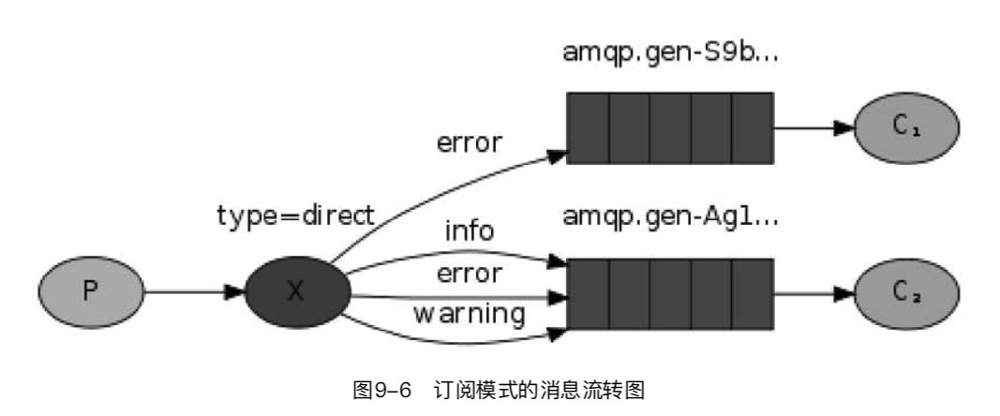
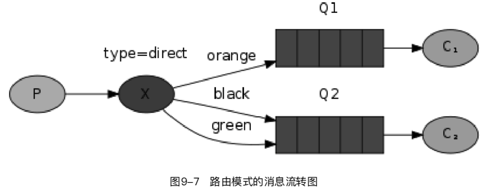
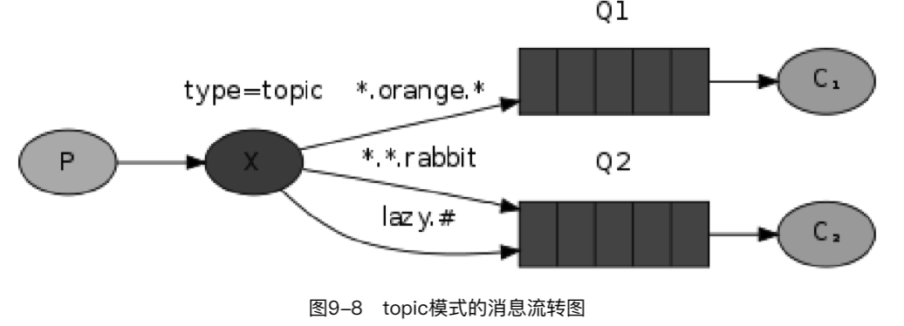
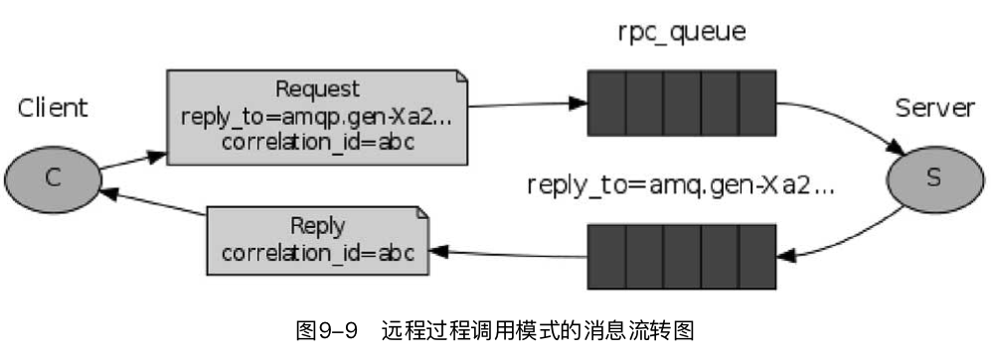
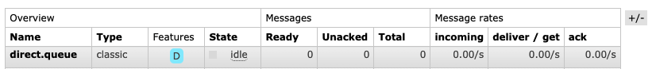
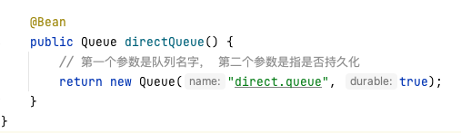

# 消息中间件概述

MQ全称为Message Queue，**消息队列是应用程序和应用程序之间的通信方法**。

- 为什么使用MQ

在项目中，可将一些**无需即时返回且耗时**的操作提取出来，进行**异步处理**，而这种异步处理的方式大大的节省了服务器的请求响应时间，从而**提高**了**系统**的**吞吐量**。


- 开发中消息队列通常有如下应用场景：

1、任务**异步**处理

将不需要同步处理的并且耗时长的操作由消息队列通知消息接收方进行异步处理。提高了应用程序的响应时间。

2、应用程序**解耦合**

MQ相当于一个中介，生产方通过MQ与消费方交互，它将应用程序进行解耦合。

3、**削峰填谷**

如订单系统，在下单的时候就会往数据库写数据。但是数据库只能支撑每秒1000左右的并发写入，并发量再高就容易宕机。低峰期的时候并发也就100多个，但是在高峰期时候，并发量会突然激增到5000以上，这个时候数据库肯定卡死了。


消息被MQ保存起来了，然后系统就可以按照自己的消费能力来消费，比如每秒1000个数据，这样慢慢写入数据库，这样就不会卡死数据库了。


但是使用了MQ之后，限制消费消息的速度为1000，但是这样一来，高峰期产生的数据势必会被积压在MQ中，高峰就被“削”掉了。但是因为消息积压，在高峰期过后的一段时间内，消费消息的速度还是会维持在1000QPS，直到消费完积压的消息,这就叫做“填谷”


## RabbitMQ的几种角色


- Message
   消息，消息是不具名的，它由消息头和消息体组成。消息体是不透明的，而消息头则由一系列的可选属性组成，这些属性包括routing-key（路由键）、priority（相对于其他消息的优先权）、delivery-mode（指出该消息可能需要持久性存储）等。

- Publisher
   消息的生产者，也是一个向交换器发布消息的客户端应用程序。

- Exchange
   交换器，用来接收生产者发送的消息并将这些消息路由给服务器中的队列。

- Binding
   绑定，用于消息队列和交换器之间的关联。一个绑定就是基于路由键将交换器和消息队列连接起来的路由规则，所以可以将交换器理解成一个由绑定构成的路由表。

- Queue
   消息队列，用来保存消息直到发送给消费者。它是消息的容器，也是消息的终点。一个消息可投入一个或多个队列。消息一直在队列里面，等待消费者连接到这个队列将其取走。

- Connection
   网络连接，比如一个TCP连接。

- Channel
   信道，多路复用连接中的一条独立的双向数据流通道。信道是建立在真实的TCP连接内地虚拟连接，AMQP 命令都是通过信道发出去的，不管是发布消息、订阅队列还是接收消息，这些动作都是通过信道完成。因为对于操作系统来说建立和销毁 TCP 都是非常昂贵的开销，所以引入了信道的概念，以复用一条 TCP 连接。

- Consumer
   消息的消费者，表示一个从消息队列中取得消息的客户端应用程序。

- Virtual Host
   虚拟主机，表示一批交换器、消息队列和相关对象。虚拟主机是共享相同的身份认证和加密环境的独立服务器域。每个 vhost 本质上就是一个 mini 版的 RabbitMQ 服务器，拥有自己的队列、交换器、绑定和权限机制。vhost 是 AMQP 概念的基础，必须在连接时指定，RabbitMQ 默认的 vhost 是 / 。

- Broker
   表示消息队列服务器实体。

- > 需要指出的是，生产者、消费者、代理不需要待在同一个设备上。事实上，大多数应用确实不会将它们放在同一台机器上。

## RabbitMQ的六大模式

RabbitMQ有以下几种工作模式 ：
1、Work queues
2、Publish/Subscribe
3、Routing
4、Topics
5、Header
6、RPC

### 1. 简单队列模式

在使用RabbitMQ消息队列的时候，最容易理解的就是**点对点消息发送**。我们可以这样理解这种模式，比如张三给李四发送信息，首先张三编辑短信，编辑完成后发送到信息中转站，然后由中转站转发送到李四的手机里。这种模式多用于聊天场景。

**一个消息生产者，一个消息消费者，一个队列。也称为点对点模式。**



### 2. 工作队列模式

在发送消息时，还有这样一种场景，就是**将一个消息发送给多个消费者**。如果没有消息队列，我们就只能利用HTTP或者其他方式对多个消费者请求数据；如果使用消息队列，我们只需要将消息推送到工作队列中就可以解决问题。工作队列（又称任务队列，Task Queues）是为了避免等待一些占用大量资源、时间的操作。当我们把任务（Task）当作消息发送到队列中时，一个运行在后台的工作者（Worker）进程就会取出任务，然后进行处理。当你运行多个工作者（Workers）时，任务就会在它们之间共享。这个概念在网络应用中是非常有用的，**多用于资源调度或抢红包等场景，它可以在短暂的HTTP请求中处理一些复杂的任务。**

**一个消息生产者，采用默认交换器，一个消息队列，多个消费者。同样也称为点对点模式**。



### 3.订阅模式

生产者（Producer）只需要**把消息发送给一个交换机（Exchange）**。**交换机非常简单，它一边从生产者接收消息，一边把消息推送到队列。交换机必须知道如何处理它接收到的消息，是应该推送到指定的队列，还是推送到多个队列，或者直接忽略消息。这些规则是通过交换机类型（ExchangeType）来定义的。有几个可供选择的交换机类型：直连（Direct）交换机、主题（Topic）交换机、头（Headers）交换机和扇型（Fanout）交换机。**可能到这里还是不好理解订阅模式与工作队列模式的区别，其实最简单的区别就是如果**订阅模式有多个消费者，那么所有消费者都会收到消息，而工作队列模式只有一个消费者进行消费。订阅模式多用于广告、群聊等功能。**

**无选择接收消息，一个消息生产者，一个交换器，多个消息队列，多个消费者。称为发布/订阅模式**



### 4.路由模式

**在发布/订阅模式的基础上，有选择的接收消息，也就是通过 routing 路由进行匹配条件是否满足接收消息。**生产者将消息发送到交换机，在绑定队列和交换机的时候有一个**路由key，生产者发送的消息会指定路由key，消息只会发送到key相同的队列**，接着监听该队列消费者的消费信息。**路由模式多用于项目中的报错信息。**



### 5.topic（主题）模式

topic模式与路由模式大致相同，不同的是topic模式通过匹配符订阅多个主题的消息，比如：•　*（星号）用来表示一个单词。•　#（井号）用来表示任意数量（零个或多个）单词。topic模式的消息流转图如图9-8所示。



### 6.（RPC）远程过程调用

RPC是指远程过程调用。也就是说有两台服务器A和B，一个应用部署在A服务器上，想要调用B服务器上应用提供的函数／方法，由于不在一个内存空间，因此不能直接调用，需要通过网络来表达调用的语义和传达调用的数据。

**客户端发送请求消息，服务器回复响应的消息。为了接收响应的消息，我们需要在请求消息中发送一个回调队列。**这是一个特殊的模式，比之其他五种它含有响应信息和回调队列。



## Spring Boot使用RabbitMQ 简单模式

（1）加入RabbitMQ依赖。

（2）配置RabbitMQ服务信息。

（3）编写消费者和生产者。

### 1.加入RabbitMQ依赖

```xml
<dependency>
   <groupId>org.springframework.boot</groupId>
   <artifactId>spring-boot-starter-amqp</artifactId>
</dependency>
```

### 2.配置 RabbitMQ服务信息

```properties
#rabbitmq ip
spring.rabbitmq.host=127.0.0.1
#rabbitmq port
spring.rabbitmq.port=5672
#rabbitmq name and password
spring.rabbitmq.username=guest
spring.rabbitmq.password=guest
```

### 3.编写消费者和生产者

一般来说，消息队列发送的数据都是实体对象，这里创建一个商品实体类Goods进行数据传输。

```java
#实现Serializable实现序列化方便传输
public class Goods implements Serializable {


    private static final long serialVersionUID = 6629065135155452917L;

    private Long goodsId;
    private String goodsName;
    private String goodsIntroduce;
    private Double goodsPrice;

    public Long getGoodsId() {
        return goodsId;
    }

    public void setGoodsId(Long goodsId) {
        this.goodsId = goodsId;
    }

    public String getGoodsName() {
        return goodsName;
    }

    public void setGoodsName(String goodsName) {
        this.goodsName = goodsName;
    }

    public String getGoodsIntroduce() {
        return goodsIntroduce;
    }

    public void setGoodsIntroduce(String goodsIntroduce) {
        this.goodsIntroduce = goodsIntroduce;
    }

    public Double getGoodsPrice() {
        return goodsPrice;
    }

    public void setGoodsPrice(Double goodsPrice) {
        this.goodsPrice = goodsPrice;
    }

    public Goods(Long goodsId, String goodsName, String goodsIntroduce, Double goodsPrice) {
        this.goodsId = goodsId;
        this.goodsName = goodsName;
        this.goodsIntroduce = goodsIntroduce;
        this.goodsPrice = goodsPrice;
    }

    public Goods() {
    }

    @Override
    public String toString() {
        return "Goods{" +
                "goodsId=" + goodsId +
                ", goodsName='" + goodsName + '\'' +
                ", goodsIntroduce='" + goodsIntroduce + '\'' +
                ", goodsPrice=" + goodsPrice +
                '}';
    }
}
```

接下来配置rabbitmq发送配置

```java
@Configuration
public class DirectConfig {
    public static final String DIRECT_QUEUE = "direct.queue";

    @Bean
    public Queue directQueue() {
        // 第一个参数是队列名字， 第二个参数是指是否持久化
        return new Queue("direct.queue", true);
    }
}
```

然后创建一个消息发送者DirectSender类

```java
@Component
public class DirectSender {
    private static final Logger log = LoggerFactory.getLogger(DirectSender.class);

    @Autowired
    private AmqpTemplate amqpTemplate;

    public void sendDirectQueue() {
        Goods goods = new Goods(System.currentTimeMillis(),"测试商品","这是一个测试的商品",98.6);
        log.info("简单消息已经发送");
        // 第一个参数是指要发送到哪个队列里面， 第二个参数是指要发送的内容
        this.amqpTemplate.convertAndSend(DirectConfig.DIRECT_QUEUE, goods);
    }
}
```

为了简洁 我们直接就在一个项目中创建消息接收类DirectReceiver

```java
@Component
public class DirectReceiver {
    private static final Logger log = LoggerFactory.getLogger(DirectReceiver.class);

    // queues是指要监听的队列的名字
    @RabbitListener(queues = DirectConfig.DIRECT_QUEUE)
    public void receiverDirectQueue(Goods goods) {
        log.info("简单消息接受成功，参数是：" + goods.toString());
    }
}
```

然后构建一个控制器测试

```java
@RestController
public class DirectController {
    @Autowired
    private DirectSender directSender;

    @GetMapping("directTest")
    public void directTest() {
        directSender.sendDirectQueue();
    }
}
```

测试访问

http://localhost:8080/directTest

```sh
2021-06-29 14:21:04.014  INFO 81786 --- [nio-8080-exec-1] com.springboot.sender.DirectSender       : 简单消息已经发送
2021-06-29 14:21:04.054  INFO 81786 --- [Container#0-173] com.springboot.receiver.DirectReceiver   : 简单消息接受成功，参数是：Goods{goodsId=1624947664013, goodsName='测试商品', goodsIntroduce='这是一个测试的商品', goodsPrice=98.6}
```

再查看我们的rabbitmq管理页面



队列已经在管理页面展示了，队列名我们在配置类已经设置了的；



## Spring Boot使用RabbitMQ Topic模式

Topic转发模式是通过设置主题的方式来进行消息发送和接收的，这里需要使用到Route-key，创建一个TopicConfig类配置主题和交换机，首先是配置类：

``` java
@Configuration
public class TopicConfig {
    public static final String TOPIC_QUEUE1 = "topic.queue1";
    public static final String TOPIC_QUEUE2 = "topic.queue2";
    public static final String TOPIC_EXCHANGE = "topic.exchange";
		//构建两个队列
    @Bean
    public Queue topicQueue1() {
        return new Queue(TOPIC_QUEUE1);
    }
    @Bean
    public Queue topicQueue2() {
        return new Queue(TOPIC_QUEUE2);
    }
  	//定义交换机
    @Bean
    public TopicExchange topicExchange() {
        return new TopicExchange(TOPIC_EXCHANGE);
    }
  	//定义队列约束
    @Bean
    public Binding topicBinding1() {
        return BindingBuilder.bind(topicQueue1()).to(topicExchange()).with("topic.messge");
    }
    @Bean
    public Binding topicBinding2() {
        return BindingBuilder.bind(topicQueue2()).to(topicExchange()).with("topic.#");
    }
}
```

生产者发送消息还是使用convertAndSend()方法，不过需要在参数内设置Route-key：

```java
@Component
public class FanoutSender {
    private static final Logger log = LoggerFactory.getLogger(FanoutSender.class);
    @Autowired
    private AmqpTemplate amqpTemplate;

    public void sendFanoutQueue() {
        Goods goods = new Goods(System.currentTimeMillis(),"测试商品","这是一个测试的商品",98.6);
        log.info("sendFanoutQueue已发送消息");
        this.amqpTemplate.convertAndSend(FanoutConfig.FANOUT_EXCHANGE, "", goods );
    }
}
```

