# 全注解下的spring ioc

spring最成功的便是其提出的两个理念 **（ IOC和AOP) 控制反转和面向切面编程**。

其中ioc容器思想是spring的核心，而spring是基于注解开发的spring ioc ,所以重点分析全注解下的spring ioc。

IoC是一种通过描述来生成或者获取对象的技术，而这个技术不是Spring甚至不是Java独有的。对于Java初学者更多的时候所熟悉的是**使用new关键字来创建对象**，而在**Spring**中则不是，它是**通过描述来创建对象**。只是Spring Boot并不建议使用XML，而是通过注解的描述生成对象。

一个系统可以生成各种对象，并且这些对象都需要进行管理。值得一提的事，对象之间并不孤立，它们之间还可能存在依赖的关系。例如，一个班级是由多个老师和同学组成，那么班级就依赖于多个老师和同学。为了解藕，spring还提供了依赖注入的功能，使得我们能够通过描述来管理各个对象之间的关系。

而为了描述上述班级、同学和老师这三个对象关系，我们需要一个容器。在spring中把每一个需要管理的对象称为spring bean，而spring管理这些bean的容器，被我们称为spring ioc容器（或者简称ioc容器）。ioc容器需要具备两个基本功能：

- **通过描述管理bean，包括发布和获取bean；**

- **通过描述完成bean之间的依赖关系。**

## ioc容器分析

ioc是一个管理bean的容器，在spring的定义中，它要求**所有的ioc容器都需要实现接口beanfactory**，它是一个顶级容器接口。

beanfactory接口源码分析：

```java
package org.springframework.beans.factory;

import org.springframework.beans.BeansException;
import org.springframework.core.ResolvableType;
public interface BeanFactory {
     // 前缀
    String FACTORY_BEAN_PREFIX = "&";

    // 多个getBean方法
    Object getBean(String name) throws BeansException;

    <T> T getBean(String name, Class<T> requiredType) throws BeansException;

    <T> T getBean(Class<T> requiredType) throws BeansException;

    Object getBean(String name, Object... args) throws BeansException;

    <T> T getBean(Class<T> requiredType, Object... args) throws BeansException;

    // 是否包含Bean
    boolean containsBean(String name);

    // Bean是否单例
    boolean isSingleton(String name) throws NoSuchBeanDefinitionException;

    // Bean是否原型
    boolean isPrototype(String name) throws NoSuchBeanDefinitionException;

    // 是否类型匹配
    boolean isTypeMatch(String name, ResolvableType typeToMatch) 
    throws NoSuchBeanDefinitionException;

    boolean isTypeMatch(String name, Class<?> typeToMatch) 
    throws NoSuchBeanDefinitionException;

    // 获取Bean的类型
    Class<?> getType(String name) throws NoSuchBeanDefinitionException;

    // 获取Bean的别名
    String[] getAliases(String name);
}
```

​		首先我们看到了多个getBean方法，这也是IoC容器最重要的方法之一，它的意义是从IoC容器中获取Bean**<u>。而从多个getBean方法中可以看到有按类型（by type）获取Bean的，也有按名称（by name）获取Bean的，这就意味着在Spring IoC容器中，允许我们按类型或者名称获取Bean</u>**。

​		由于BeanFactory的功能还不够强大，因此Spring在BeanFactory的基础上，还设计了一个**更为高级的接口ApplicationContext**。

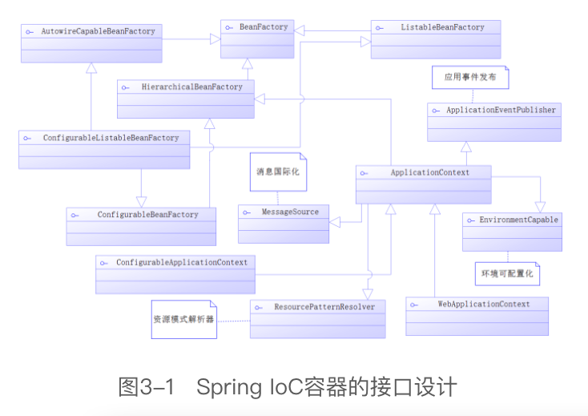

​		**ApplicationContext接口**通过继承上级接口，进而继承BeanFactory接口，但是在BeanFactory的基础上，扩展了消息国际化接口（MessageSource）、环境可配置接口（EnvironmentCapable）、应用事件发布接口（ApplicationEventPublisher）和资源模式解析接口（ResourcePatternResolver），所以它的功能会更为强大。

​		在Spring Boot当中我们主要是通过注解来装配Bean到SpringIoC容器中，为了贴近Spring Boot的需要，这里不再介绍与XML相关的IoC容器，而主要介绍一个基于注解的IoC容器，它就是**AnnotationConfigApplicationContext**，从名称就可以看出它是一个基于注解的IoC容器。之所以研究它，是因为SpringBoot装配和获取Bean的方法与它如出一辙。


## 装配Bean

在spring中允许我们**通过xml或者Java配置文件装配bean**，但是由于spring boot是基于注解的方式，因此下面主要**基于注解的方式来介绍spring的用法**，以满足spring boot开发者的需要。

### 自动扫描装配Bean
如果一个个的bean使用注解@Bean注入spring ioc容器中，那将是一件很麻烦的事情。好在spring还允许我们进行扫描装配bean到ioc容器中，对于**扫描装配而言使用的注解是@Component和@componentScan**
**@Component是标明哪个类被扫描进入spring ioc容器，而@ComponentScan则是标明采用何种策略去扫描装配Bean**。

```java
@Componente
public class User{
	@Value("1")
	private Long id;
	@Value("user_name_1")
	private String userName;
	@Value("note_1")
	private String note;
	/** some code about getter and setter**/
}
```

这里的注解**@Component表明这个类将被Spring IoC容器扫描装配**，其中配置的“user”则是作为Bean的名称，当然你也可以不配置这个字符串，那么IoC容器就会把类名第一个字母作为小写，其他不变作为Bean名称放入到IoC容器中；**注解@Value则是指定具体的值，使得Spring IoC给予对应的属性注入对应的值**。为了让Spring IoC容器装配这个类，需要改造类AppConfig，如代码清单3-6所示。

```java
@Configuration
@ComponentScan
public class AppConfig{}
```

这里加入@ComponentScan,意味着它会进行扫描，但是它只会扫描类AppConfig所在的当前包和其子包，之前把User.java移到包com.springboot.chapter3.config就是这个原因。这样就可以删掉之前使用@Bean标注的创建对象方法。然后进行测试，测试代码如下：

```java
ApplicationContext ctx = new AnnotationConfigApplicationContext(AppConfig.class);
User user = ctx.getBean(User.class);
log.info(user.getId());
```

这里加入了**@ComponentScan**，意味着它会进行扫描，但是它只会扫描类AppConfig所在的当前包和其子包，为了更加合理，**@ComponentScan还允许我们自定义扫描的包**。

@ComponentScan源码分析

```java
package org.springframework.context.annotation;

import java.lang.annotation.Documented;
import java.lang.annotation.ElementType;
import java.lang.annotation.Repeatable;
import java.lang.annotation.Retention;
import java.lang.annotation.RetentionPolicy;
import java.lang.annotation.Target;
import org.springframework.beans.factory.support.BeanNameGenerator;
import org.springframework.core.annotation.AliasFor;

@Retention(RetentionPolicy.RUNTIME)
@Target({ElementType.TYPE})
@Documented
//在一个类中可重复定义
@Repeatable(ComponentScans.class)
public @interface ComponentScan {
    //定义扫描的包
    @AliasFor("basePackages")
    String[] value() default {};
		//定义扫描的包
    @AliasFor("value")
    String[] basePackages() default {};
		//定义扫描的类
    Class<?>[] basePackageClasses() default {};
		//bean name 生成器
    Class<? extends BeanNameGenerator> nameGenerator() default BeanNameGenerator.class;
		//作用域解析器
    Class<? extends ScopeMetadataResolver> scopeResolver() default AnnotationScopeMetadataResolver.class;
		//作用域代理模式
    ScopedProxyMode scopedProxy() default ScopedProxyMode.DEFAULT;
		//资源匹配模式
    String resourcePattern() default "**/*.class";
		//是否启用默认的过滤器
    boolean useDefaultFilters() default true;
		//当满足过滤器的条件时扫描
    ComponentScan.Filter[] includeFilters() default {};
  	//当不满足过滤器的条件时扫描
    ComponentScan.Filter[] excludeFilters() default {};
		//是否延迟初始化
    boolean lazyInit() default false;
		//定义过滤器
    @Retention(RetentionPolicy.RUNTIME)
    @Target({})
    public @interface Filter {
      	//过滤器类型，可以按注解类型或正则式等过滤
        FilterType type() default FilterType.ANNOTATION;
				//定义过滤的类
        @AliasFor("classes")
        Class<?>[] value() default {};
				//定义过滤的类
        @AliasFor("value")
        Class<?>[] classes() default {};
				//匹配方式
        String[] pattern() default {};
    }
```

@SpringBootApplication源码

```java
//
// Source code recreated from a .class file by IntelliJ IDEA
// (powered by FernFlower decompiler)
//

package org.springframework.boot.autoconfigure;

import java.lang.annotation.Documented;
import java.lang.annotation.ElementType;
import java.lang.annotation.Inherited;
import java.lang.annotation.Retention;
import java.lang.annotation.RetentionPolicy;
import java.lang.annotation.Target;
import org.springframework.beans.factory.support.BeanNameGenerator;
import org.springframework.boot.SpringBootConfiguration;
import org.springframework.boot.context.TypeExcludeFilter;
import org.springframework.context.annotation.ComponentScan;
import org.springframework.context.annotation.Configuration;
import org.springframework.context.annotation.FilterType;
import org.springframework.context.annotation.ComponentScan.Filter;
import org.springframework.core.annotation.AliasFor;

@Target({ElementType.TYPE})
@Retention(RetentionPolicy.RUNTIME)
@Documented
@Inherited
@SpringBootConfiguration
@EnableAutoConfiguration
//自定义拦截器 排除扫描类
@ComponentScan(
    excludeFilters = {@Filter(
    type = FilterType.CUSTOM,
    classes = {TypeExcludeFilter.class}
), @Filter(
    type = FilterType.CUSTOM,
    classes = {AutoConfigurationExcludeFilter.class}
)}
)
public @interface SpringBootApplication {
    //通过类型排除自动配置类
    @AliasFor(
        annotation = EnableAutoConfiguration.class
    )
    Class<?>[] exclude() default {};
  
		//通过名称排除自动配置类
    @AliasFor(
        annotation = EnableAutoConfiguration.class
    )
    String[] excludeName() default {};
		//定义扫描包
    @AliasFor(
        annotation = ComponentScan.class,
        attribute = "basePackages"
    )
    String[] scanBasePackages() default {};
		//定义被扫描的类
    @AliasFor(
        annotation = ComponentScan.class,
        attribute = "basePackageClasses"
    )
    Class<?>[] scanBasePackageClasses() default {};

    @AliasFor(
        annotation = ComponentScan.class,
        attribute = "nameGenerator"
    )
    Class<? extends BeanNameGenerator> nameGenerator() default BeanNameGenerator.class;

    @AliasFor(
        annotation = Configuration.class
    )
    boolean proxyBeanMethods() default true;
}

```

显然，通过它就能够定义扫描哪些包。但是这里需要特别注意的是，它提供的exclude和excludeName两个方法是**对于其内部的自动配置类**才会生效的。为了能够排除其他类，还可以再加入@ComponentScan以达到我们的目的。例如，**扫描User而不扫描UserService**，可以把启动配置文件写成：

```java
@SpringBootApplication
@ComponentScan(basePackages = {"com.springboot.chapter3"},
              excludeFilters = {@Filter(classes = Service.class)})
```


### 自定义第三方Bean

现实的Java的应用往往需要**引入许多来自第三方的包**，并且很有可能**希望把第三方包的类对象也放入到Spring IoC容器**中，这时@Bean注解就可以发挥作用了。例如，要引入一个DBCP数据源，我们先在pom.xml上加入项目所需要DBCP包和数据库MySQL驱动程序的依赖.

```xml
<dependency>
			<groupId>org.apache.commons</groupId>
			<artifactId>commons-dbcp2</artifactId>
</dependency>
<dependency>
			<groupId>mysql</groupId>
			<artifactId>mysql-connector-java</artifactId>
<dependency>
```

这样DBCP和数据库驱动就被加入到了项目中，接着将使用它提供的机制来生成数据源。（也就是数据库连接）

```java
@Bean(name = "dataSource")
public DataSource getDataSource(){
  Properties props = new Properties();
  props.setProperty("driver","com.mysql.jdbc.Driver");
  props.setProperty("url","jdbc:mysql://localhost:3306/chapter3");
  props.setProperty("username","root");
  props.setProperty("password","root");
  DataSource dataSource = null;
  try{
    dataSource = BasicDataSourceFactory.createDataSource(props);
  }catch(Exception e){
    e.printStackTrace();
  }
  return dataSource;	
}
```

这里通过@Bean定义了**其配置项name为“dataSource”**，那么**Spring就会把它返回的对象用名称“dataSource”保存在IoC容器中**。当然，你也可以不填写这个名称，那么**它就会用你的方法名称作为Bean名称保存到IoC容器**中。通过这样，就可以将第三方包的类装配到Spring IoC容器中了。

### 依赖注入

> spring ioc的两个作用
>
> - **通过描述管理bean，包括发布和获取bean；**
>
> - **通过描述完成bean之间的依赖关系。**

前面讨论了如何将bean发布到ioc容器中，而本节讨论如何获取，以及bean之间的依赖，在spring ioc中，我们称之为依赖注入(Dependency Injection,DI)。

举个例子：人类有时候利用动物去完成一些事，比如狗用来看门，牛用来耕地......于是做一些事情就依赖于那些可爱的动物们。我们用代码来演示这种依赖关系和依赖注入实现：

```java
//构建一个动物接口和一个人类接口
package com.example.ioc;

public interface Animal {
    public void use();
}
package com.example.ioc;

public interface Person {
    public void service();
    public void setAnimal(Animal animal);
}
//实现它们
package com.example.ioc;

import org.springframework.stereotype.Component;

@Component//这个注解还记得么，作用是将bean发布到ioc中
public class Dog implements Animal{
    @Override
    public void use() {
        System.out.println("狗"+Dog.class.getSimpleName()+"是看门的");
    }
}
package com.example.ioc;

import org.springframework.beans.factory.annotation.Autowired;
import org.springframework.stereotype.Component;

@Component
public class BussinessPerson implements Person{
    @Autowired//这个便是注入bean了，ioc容器会找到实现了Animal接口的类直接注入，之前是用new的方法实现的。
    private Animal animal;
    @Override
    public void service() {
        this.animal.use();
    }

    @Override
    public void setAnimal(Animal animal) {
        this.animal = animal;
    }
}


//对了别忘了配置类哦
package com.example.ioc;

import org.springframework.context.annotation.ComponentScan;
import org.springframework.context.annotation.Configuration;

@Configuration
@ComponentScan//还记得吗，总扫描仪和配置类
public class AppConfig {
}


//测试代码
package com.example.ioc;

import org.junit.jupiter.api.Test;
import org.springframework.boot.test.context.SpringBootTest;
import org.springframework.context.ApplicationContext;
import org.springframework.context.annotation.AnnotationConfigApplicationContext;

@SpringBootTest
class IocApplicationTests {

    @Test
    void contextLoads() {
        ApplicationContext ctx = new AnnotationConfigApplicationContext(AppConfig.class);
        Person person = ctx.getBean(BussinessPerson.class);
        person.service();
    }

}
```

#### @Autowried注解

@Autowired是我们使用得最多的注解之一，它注入的机制最基本的一条是根据类型（by type），我们回顾IoC容器的顶级接口BeanFactory，就可以知道IoC容器是通过getBean方法获取对应Bean的，而getBean又支持根据类型（by type）或者根据名称（byname）。再回到上面的例子，我们只是创建了一个动物——狗，而实际上动物还可以有鱼（Fish），鱼可以做酸辣鱼来为人类果腹，于是我们又创建了一个鱼的类:

```java
package com.example.ioc;

import org.springframework.stereotype.Component;
@Component
public class Fish implements Animal{
    @Override
    public void use() {
        System.out.println("试一下咯");
    }
}
```

再运行测试类，发现报错

```shell
Error creating bean with name 'bussinessPerson': Unsatisfied dependency expressed through field 'animal'; nested exception is org.springframework.beans.factory.NoUniqueBeanDefinitionException: No qualifying bean of type 'com.example.ioc.Animal' available: expected single matching bean but found 2: dog,fish
```

从日志可以看出，spring ioc容器在以类型注入时有时只能注入一个同类型实现类；那么如果我们一定有猫有狗有鱼怎么办呢，我们可以把属性名称转化为fish：

```java
@Autowired
private Animal animal;
//上面改成下面
@Autowired
private Animal fish;
```

因为@Autowired提供这样的规则，首先它会根据类型找到对应的Bean，如果对应类型的Bean不是唯一的，那么**它会根据其属性名称和Bean的名称进行匹配**。如果匹配得上，就会使用该Bean；如果还无法匹配，就会抛出异常。

这里还要注意的是@Autowired是一个默认必须找到对应Bean的注解，**如果不能确定其标注属性一定会存在并且允许这个被标注的属性为null**，那么你可以配置@Autowired属性required为false，例如，像下面一样：

```java
@Autowired(required = false)
```

同样，它除了可以标注属性外，**还可以标注方法**，如setAnimal方法，如下所示：

```java
@Override
@Autowired
public void setAnimal(Animal animal){
	this.animal = animal;
}
```

这样它也会使用setAnimal方法从IoC容器中找到对应的动物进行注入，甚至我们还可以使用在方法的参数上，后面会再谈到它。

#### 取消歧视性--@Primary&@Quelifier

还是之前的问题，当我有两个动物实现了anima接口，这时候如果这样注入

```java
@Autowired
private Animal animal;
```

那么ioc容器就不知道你到底要把谁注入进去；

之前我们解决方法是给这个接口改名，利用@Autowired可以根据属性名选择相应的bean注入；

```java
@Autowired
private Animal dog;
```

产生注入失败的问题根本是**按类型（by type）查找**，正如动物可以有多种类型，这样会造成Spring IoC容器注入的困扰，我们把这样的一个问题称为歧义性。所以通过改变属性名在某种意义上就背离了按照类型查找的初衷，而spring为我们准备了两个注解专门负责解决歧义性。

首先是@Primary,它是一个修改优先权的注解，而当我们有猫有狗的时候，假设这次需要使用猫，那么只需要在猫类的定义上加入@Primary：

```java
@Component
@Primary
public class Cat implements Animal{
    @Override
    public void use() {
        System.out.println("猫"+Cat.class.getSimpleName()+"是抓鱼的");
    }
}
```

@Primary的作用是告诉spring ioc容器，当发现多个同类型bean的时候，优先将该类注入。于是，再测试的时候就发现系统选用猫为你服务。

因为当Spring进行注入的时候**虽然它发现存在多个动物**，但因为Cat被标注为了**@Primary**，所以优**先采用Cat的实例进行了注入**，这样就**通过优先级的变换**使得IoC容器知道**注入哪个具体的实例**来满足依赖注入。

然而，如果我们给每个实现了动物接口的类都加上@Primary呢，测试发现报错，因为这样就没有最高优先级了亲。

这时**@Quelifier**就出现了：它的配置项**vlue需要一个字符串去定义**，并**与@Autowired组合**，通过类型和名称去找到bean。我们知道bean的名称在ioc容器中是唯一标识，这样就**消除了歧义性**。

这时，你想到了之前介绍的BeanFactory接口中的方法吗？

```java
<T> T getBean(String name,Class<T> requiredType) throws BeanException;
```

通过它就能按照名称和类型的结合找到对象了。

```java
@Autowired
@Qualfier("dog")
private Animal animal = null;
```

> 注意：@Quelifier的优先级高于@Primary，@Primary只是当ioc容器有多个选择的时候提供优先级；

#### 带参数的构造方法类的装配

前面描述的都是类不带参数的构造方法下实现依赖注入。但当**有些类只有带有参数的构造方法，它需要对这个实例进行初始化，**那么上述的方法都不能使用。只能用@Autowired注解对构造方法对参数进行注入，例如，修改类BussinessPerson来满足这个功能：

```java
     private void BussinessPerson(@Autowired @Qualifier("cat") Animal animal)
     {
        this.animal=animal;
    	}
		//代码中取消了@Autowired对属性和方法的标注。在参数上加入了@Autowired和@Qualifier注解，使得它能够注入进来。这里使用@Qualifier是为了避免歧义性。如果你的环境中不是有猫有狗，则可以完全不使用@Qualifier，而单单使用@Autowired就可以了。
```

## 生命周期问题

生命周期永远是技术常见问题，也就是IoC容器如何装配和销毁Bean的过程。

**bean的定义-->bean的初始化-->bean的生存期-->bean的销毁**

我们先分析bean的定义过程

1. spring通过我们的配置，如@ComponentScan定义的扫描路径去找到带有@Component的类，这就是bean的定位过程。
2. 找到bean之后就开始解析，并且将定义的信息保存起来。注意，**此时还没有初始化bean，也就没有bean的实例，它有的仅仅是bean的定义。**
3. 然后就会把bean定义发布到spring ioc容器中。此时呢ioc容器也只有bean的定义，还是没有bean实例生成。

完成了这3步只是一个资源定位并将Bean的定义发布到IoC容器的过程，还没有Bean实例的生成，更没有完成依赖注入。这是必然的啊，依赖注入还记得吗，**注解@Autowried**。

#### 延迟初始化lazyInit = true

**在默认的情况下，Spring会继续去完成Bean的实例化和依赖注入**，这样从IoC容器中就可以得到一个依赖注入完成的Bean。但是，有些Bean会受到变化因素的影响，这时我们倒希望是取出Bean的时候完成初始化和依赖注入，换句话说就是让那些Bean只是将定义发布到IoC容器而不做实例化和依赖注入，当我们取出来的时候才做初始化和依赖注入等操作。

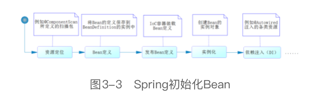

ComponentScan中还有一个**配置项lazyInit**，只可以配置Boolean值，且默认值为false，也就是**默认不进行延迟初始化**，因此在默认的情况下Spring会对Bean进行实例化和依赖注入对应的属性值。为了进行测试，先改造BussinessPerson，然后断点测试。

```java
package com.example.ioc;

import org.springframework.beans.factory.annotation.Autowired;
import org.springframework.beans.factory.annotation.Qualifier;
import org.springframework.stereotype.Component;

@Component
public class BussinessPerson implements Person{

     private Animal animal;
     public BussinessPerson(Animal animal){
         this.animal = animal;
     }
    @Override
    public void service() {
        this.animal.use();
    }

    @Override
    @Autowired @Qualifier("cat")
    public void setAnimal(Animal animal) {
        System.out.println("延迟依赖注入");
        this.animal = animal;
    }

    public int name;
}
```

**我们在容器加载这里就断点了**

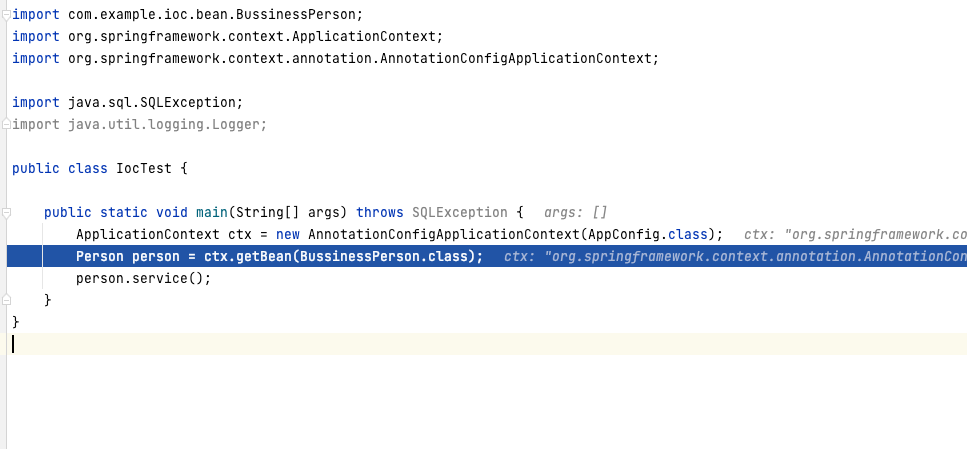

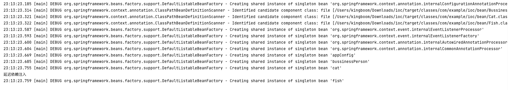

在断点处，我们并没有获取Bean的实例，而日志就已经打出了，可见**它是在Spring IoC容器初始化时就执行了实例化和依赖注入**。为了改变这个情况，我们在**配置类AppConfig的@ComponentScan中加入lazyInit配置，以实现延迟实例化和依赖注入**：

```java
@Configuration
@ComponentScan(basePackages = "com.example.*",lazyInit = true)
public class AppConfig {
}
```

再测试，发现容器的bean都没有实例化和依赖注入

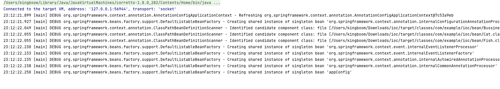

**这就是我们做好的配置生效，只有在bean被用到的时候再给它实例化并注入**

#### 生命周期图


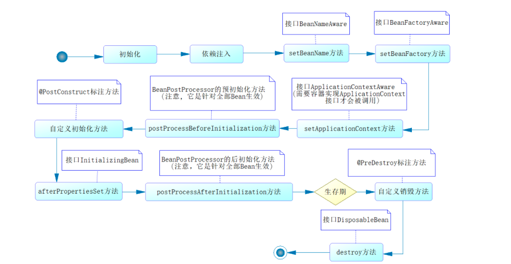		

​															spring bean的生命周期

#### 代码测试

为了验证这个生命周期图，我们用代码来展示：

```java
//加入生命周期接口和自定义
package com.example.ioc.bean;

import com.example.ioc.Animal;
import com.example.ioc.Person;
import org.springframework.beans.BeansException;
import org.springframework.beans.factory.*;
import org.springframework.beans.factory.annotation.Autowired;
import org.springframework.beans.factory.annotation.Qualifier;
import org.springframework.context.ApplicationContext;
import org.springframework.context.ApplicationContextAware;
import org.springframework.stereotype.Component;

import javax.annotation.PostConstruct;
import javax.annotation.PreDestroy;

@Component
public class BussinessPerson implements Person, BeanNameAware, BeanFactoryAware, ApplicationContextAware, InitializingBean, DisposableBean {

    private Animal animal = null;

    @Override
    public void service() {
        this.animal.use();
    }

    @Override
    @Autowired @Qualifier("cat")
    public void setAnimal(Animal animal) {
        System.out.println("初始化和依赖注入");
        this.animal = animal;
    }

    @Override
    public void setBeanFactory(BeanFactory beanFactory) throws BeansException {
        System.out.println("["+this.getClass().getSimpleName()+"]调用BeanFactoryAware的setBeanFactory");
    }

    @Override
    public void setBeanName(String s) {
        System.out.println("["+this.getClass().getSimpleName()+"]调用BeanNameAware的setBeanName");
    }

    @Override
    public void destroy() throws Exception {
        System.out.println("["+this.getClass().getSimpleName()+"]调用DisposableBean方法");
    }

    @Override
    public void afterPropertiesSet() throws Exception {
        System.out.println("["+this.getClass().getSimpleName()+"]调用InitializingBean的afterPropertiesSet方法");
    }

    @Override
    public void setApplicationContext(ApplicationContext applicationContext) throws BeansException {
        System.out.println("["+this.getClass().getSimpleName()+"]调用ApplicationContextAware的setApplicationContext");
    }
    @PostConstruct
    public void init(){
        System.out.println("["+this.getClass().getSimpleName()+"]调用@PostConstruct定义的初始化方法");
    }
    @PreDestroy
    public void destroy1(){
        System.out.println("["+this.getClass().getSimpleName()+"]调用@PostConstruct定义的自定义销毁方法");
    }

}
```

这样，这个Bean就**实现了生命周期中单个Bean可以实现的所有接口**，并且通过注解@PostConstruct定义了初始化方法，通过注解@PreDestroy定义了销毁方法。为了**测试Bean的后置处理器**，这里创建一个类BeanPostProcessorExample：

```java
package com.example.ioc;

import org.springframework.beans.BeansException;
import org.springframework.beans.factory.config.BeanPostProcessor;
import org.springframework.stereotype.Component;

public class BeanPostProcessorExample implements BeanPostProcessor {
    @Override
    public Object postProcessAfterInitialization(Object bean, String beanName) throws BeansException {
        System.out.println("BeanPostProcessor调用"+"postProcessAfterInitialization方法，参数【"+bean.getClass().getSimpleName()+"]["+beanName+"]");
    return bean;
    }
    
    public Object postProcessBeforeInitialization(Object bean, String beanName) throws BeansException {
        System.out.println("BeanPostProcessor调用"+"postProcessBeforeInitialization方法，参数【"+bean.getClass().getSimpleName()+"]["+beanName+"]");
        return bean;
    }
    
}
```

到这bean需要的所有接口我们都弄好了，最后开始测试：

```java
package com.example.ioc;

import com.example.ioc.bean.BussinessPerson;
import org.junit.jupiter.api.Test;
import org.springframework.boot.test.context.SpringBootTest;
import org.springframework.context.ApplicationContext;
import org.springframework.context.annotation.AnnotationConfigApplicationContext;

@SpringBootTest
class IocApplicationTests {

    @Test
    void contextLoads() {
        AnnotationConfigApplicationContext ctx = new AnnotationConfigApplicationContext(AppConfig.class);
//        Person person = ctx.getBean(BussinessPerson.class);
//        person.service();
        ctx.close();
    }

}
```

从日志可以看出，对于**Bean后置处理器（BeanPostProcessor）而言，它对所有的Bean都起作用**，而**其他的接口则是对于单个Bean起作用**。我们还可以注意到BussinessPerson执行的流程是上面画出的流程。有时候Bean的定义可能使用的是第三方的类，此时可以使用注解@Bean来配置自定义初始化和销毁方法，如下所示：


## 条件装配Bean(@Conditional)

有时候某些客观的因素会使一些Bean无法进行初始化，例如，在数据库连接池的配置中漏掉一些配置会造成数据源不能连接上。在这样的情况下，IoC容器如果还进行数据源的装配，则系统将会抛出异常，导致应用无法继续。这时倒是希望IoC容器不去装配数据源。

针对这种情况，spring准备了@Conditional注解，使用它需要配合另外一个接口Condition（org.springframework.context.annotation.Condition）来完成对应的功能。

> @Conditional注解用于满足接口Condition设定的条件时才进行bean初始化

## Bean的作用域@Scope

顶级接口BeanFactory中有isSingleton和isPrototype方法。

**isSingleton**方法如果返回true，则Bean在IoC容器中以**单例存在**，这也是Spring IoC容器的默认值；

如果**isPrototype**方法返回true，则当我们**每次获取Bean的时候，IoC容器都会创建一个新的Bean**，这显然存在很大的不同，这便是Spring Bean的作用域的问题。

一般的容器中，Bean都会存在**单例（Singleton）和原型（Prototype）**两种作用域，Java EE广泛地使用在互联网中，而在Web容器中，则存在**页面（page）、请求（request）、会话（session）和应用（application）4种作用域**。

| 作用域类型    | 使用范围       | 作用域描述                                               |
| ------------- | -------------- | -------------------------------------------------------- |
| singleton     | 所有spring应用 | 默认值，ioc容器只存在单例                                |
| prototype     | 所有spring应用 | 每当从ioc容器取出一个bean，则创建一个新的bean            |
| session       | spring web应用 | http会话                                                 |
| application   | spring web应用 | web工程生命周期                                          |
| request       | spring web应用 | web工程单次请求（request）                               |
| globalSession | Spring web应用 | 在一个全局的http session中，一个bean对应一个实例。不常用 |

在spring mvc中有多种作用域可以定义，例如ConfigurableBeanFactory中的单例(SCOPE_SINGLETON)和原型(SCOPE_PROTOTYPE)，又如WebApplicationContext的请求（SCOPE_REQUEST）、会话（SCOPE_SESSION）和应用（SCOPE_APPLICATION）。

测试代码：

```java
//bean
package com.example.ioc.bean;

import org.springframework.stereotype.Component;

@Component
public class ScopeBean {

}
//测试类
package com.example.ioc;

import com.example.ioc.bean.BussinessPerson;
import com.example.ioc.bean.ScopeBean;
import org.junit.jupiter.api.Test;
import org.springframework.boot.test.context.SpringBootTest;
import org.springframework.context.ApplicationContext;
import org.springframework.context.annotation.AnnotationConfigApplicationContext;

@SpringBootTest
class IocApplicationTests {

    @Test
    void contextLoads() {
        AnnotationConfigApplicationContext ctx = new AnnotationConfigApplicationContext(AppConfig.class);
        ScopeBean scopeBean1 = ctx.getBean(ScopeBean.class);
        ScopeBean scopeBean2 = ctx.getBean(ScopeBean.class);
        System.out.println(scopeBean1 == scopeBean2);

    }

}
//结果为true 说明scopeBean1和scopeBean2是一个bean实例
//将bean作用域设置为原型
package com.example.ioc.bean;

import org.springframework.beans.factory.config.ConfigurableBeanFactory;
import org.springframework.context.annotation.Configuration;
import org.springframework.context.annotation.Scope;
import org.springframework.stereotype.Component;

@Component
@Scope(ConfigurableBeanFactory.SCOPE_PROTOTYPE)
public class ScopeBean {

}
//再测试结果为false
```

## 环境变化bean@Profile

在Spring中存在两个参数可以提供给我们配置，以修改启动Profile机制，一个是spring.profiles.active，另一个是spring.profiles.default。在这两个属性都没有配置的情况下，Spring将不会启动Profile机制，这就意味着被@Profile标注的Bean将不会被Spring装配到IoC容器中。Spring是先判定是否存在spring.profiles.active配置后，再去查找spring.profiles.default配置的，所以spring.profiles.active的优先级要大于spring.profiles.default。

> @Profile(dev)
>
> @Profile(test)
>
> spring.profiles.active=dev

## 表达式语言Spring EL

```java
@Value("${database.driverName}")
String driver
//这里的@Value中的${......}代表占位符，它会读取上下文的属性值装配到属性中
```

```java
@Value("#{T(System).currentTimeMillis()}")
private Long initTime = null;
//这里采用#{......}代表启用Spring表达式，它将具有运算的功能；T(.....)代表的是引入类；System是java.lang.*包的类，这是Java默认加载的包，因此可以不必写全限定名，如果是其他的包，则需要写出全限定名才能引用类；currentTimeMillis是它的静态（static）方法，也就是我们调用一次System.currentTimeMillis()方法来为这个属性赋值。
```

```java
@Value("#{3.14}")
//也可以直接赋值

//还可以获取其他Spring Bean的属性来给当前的Bean属性赋值
@Value("#{beanName.str}")
private String otherBeanProp = null;
//将它大写
@Value("#{beanName.str?.toUpperCase()}")
private String otherBeanProp = null;//?，这个符号的含义是判断这个属性是否为空。如果不为空才会去执行toUpperCase方法，进而把引用到的属性转换为大写，赋予当前属性

//还可以运算
@Value("#{beanName.d > 1000 ? '大于' : '小于'}")
```


# 面向切面AOP

## 概述aop

通过**预编辑方式**和**运行期动态代理**实现**程序功能的统一维护**的一种技术。通俗的说就是实现将某些通用的业务织入约定的流程中，以实现解藕，这种织入就是动**态代理增强机制**。**这种在运行时，动态地将代码切入到类的指定方法、指定位置上的编程思想就是面向切面的编程。**

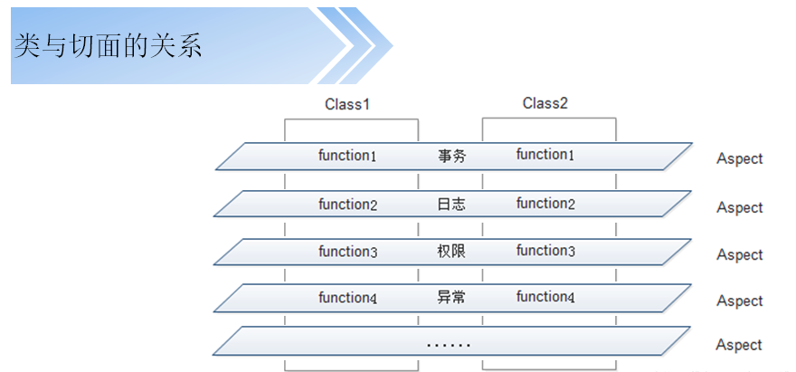

举个不恰当的例子，就像你用抖音拍那些道具小视频，相机里的你就相当于是代理了你。而那些道具呢，只要用抖音拍的都可以自动生成，这就是增强，或者说织入。

作为面向对象的延续，也是spring的重要内容，是函数式编程的一种衍生范型，利用aop可以对**业务逻辑的各个部分进行隔离**，从而使得业务逻辑各部分之间的耦合度降低，提高程序的可重用性，同时提高了开发的效率。总之除了提高了程序复杂度之外基本都是优点。

## AOP底层实现

实际上，AOP 的底层是通过 Spring 提供的的**动态代理技术实现**的。在运行期间，Spring通过动态代理技术动态的生成代理对象，代理对象方法执行时进行增强功能的介入，在去调用目标对象的方法，从而完成功能的增强。AOP中的代理 是由AOP框架动态生成的一个对象，该对象可以作为目标对象使用。Spring 中的AOP有两种，JDK动态代理，CGLIB代理。

JDK的动态代理：基于接口的动态代理技术，通过**反射机制**，定义一个**代理接口对象**去代理这个类执行方法，然后实现切面编程就简单了，直接给代理接口对象new个增强类的对象，然后在代理接口对象中直接调用增强类对象的方法，就成功织入了。Proxy

cglib 代理：基于父类的动态代理技术，是一个高性能开源的代码生成包，它采用非常底层的字节码技术，对指定的目标类生成一个子类，并**对子类进行增强**。Enhancer

 

## JDK动态代理aop代码


```java
//被代理类接口
public interface TargetInterface {
    public void method();
}
```

```java
//被代理类
public class Target implements TargetInterface {
    @Override
    public void method() {
        System.out.println("Target running....");
    }
}
```

```java
//动态代理代码
Target target = new Target(); //创建目标对象
//创建代理对象
TargetInterface proxy = (TargetInterface) Proxy.newProxyInstance(target.getClass()
.getClassLoader(),target.getClass().getInterfaces(),new InvocationHandler() {
            @Override
            public Object invoke(Object proxy, Method method, Object[] args) 
            throws Throwable {
                System.out.println("前置增强代码...");
                Object invoke = method.invoke(target, args);
                System.out.println("后置增强代码...");
                return invoke;
            }
        }
);

//测试代理效果
proxy.method();
```

## cglib 的动态代理代码

```java
//	被代理类
public class Target {
    public void method() {
        System.out.println("Target running....");
    }
}
```

```java
//动态代理代码
//创建代理类CglibProxy，该代理类需要实现MethodInterceptor接口，并实现接口中的intercept()方法。
Target target = new Target(); //创建目标对象
Enhancer enhancer = new Enhancer();   //创建增强器
enhancer.setSuperclass(Target.class); //设置父类
enhancer.setCallback(new MethodInterceptor() { //设置回调
    @Override
    public Object intercept(Object o, Method method, Object[] objects, 
    MethodProxy methodProxy) throws Throwable {
        System.out.println("前置代码增强....");
        Object invoke = method.invoke(target, objects);
        System.out.println("后置代码增强....");
        return invoke;
    }
});
Target proxy = (Target) enhancer.create(); //创建代理对象

//测试
proxy.method();
```

## AOP术语和流程

**一些术语：**

- 连接点（join point）：对应的是**具体被拦截的对象**，因为**Spring只能支持方法**，所以被拦截的对象往往就是指特定的方法，例如，我们前面提到的HelloServiceImpl的sayHello方法就是一个连接点，AOP将通过动态代理技术把它织入对应的流程中。

- 切点（point cut）：有时候，我们的切面不单单应用于单个方法，也可能是**多个类的不同方法**，这时，可以**通过正则式和指示器的规则去定义，从而适配连接点。切点就是提供这样一个功能的概念。**

- 通知（advice）：就是按照约定的流程下的方法，分为**前置通知（beforeadvice）、后置通知（after advice）、环绕通知（around advice）、事后返回通知（afterReturning advice）和异常通知（afterThrowing advice）**，它会根据约定织入流程中，需要弄明白它们在流程中的顺序和运行的条件。

- 目标对象（target）：即**被代理对象**，例如，约定编程中的HelloServiceImpl实例就是一个目标对象，它被代理了。

- 引入（introduction）：是指**引入新的类和其方法**，增强现有Bean的功能。

- 织入（weaving）：它是一个通过**动态代理技术**，为原有服务对象**生成代理对象**，然后将与切点定义匹配的**连接点拦截**，并**按约定将各类通知织入约定流程的过程**。

- 切面（aspect）：是一个可以定义切点、各类通知和引入的内容，Spring AOP将通过它的信息来**增强Bean的功能或者将对应的方法织入流程**。

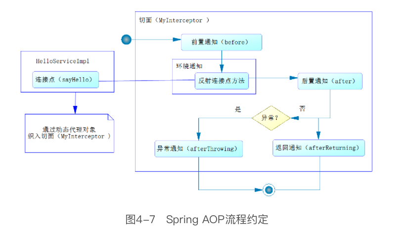

## AOP开发

这里我们采用@AspectJ的注解方式讨论AOP的开发。因为Spring AOP只能对方法进行拦截，所以首先要确定需要拦截什么方法，让它能织入约定的流程中。当然更要先导包...

```xml
<dependency>
       <groupId>org.aspectj</groupId>
       <artifactId>aspectjweaver</artifactId>
       <version>1.8.7</version>
</dependency>
```


### 1、确定连接点

也就是确定被拦截的方法，定位我们需要在什么地方AOP。我们假设有一个UserService接口，他有一个printUser方法,并实现它。

```java
public interface UserService {
    public void printUser(User user);
}
```

```java
public class UserServiceImpl implements UserService{
    @Override
    public void printUser(User user) {
        if(user == null){
            throw new RuntimeException("检查用户参数是否为空");
        }
        System.out.println("id = " + user.getId());
        System.out.println("name = "+ user.getName());
        System.out.println("ege = "+ user.getEge());
    }
}
```

这里我们将printUser作为连接点进行AOP编程；

### 2、开发切面@Aspect

也就是定义被织入的方法或方法们；

```java
package com.example.aop.aop;

import org.aspectj.lang.annotation.*;

@Aspect//Spring是以@Aspect作为切面声明
public class MyAspect {
  //@Before、@After、@AfterReturning和@AfterThrowing等几个注解，通过我们之前AOP概念和流程的介绍，相信大家也知道它们就是定义流程中的方法，然后即将由Spring AOP将其织入约定的流程中.
    @Before("execution(* com.example.aop.aop.UserServiceImpl.printUser(..))")
        public void before(){
            System.out.println("before...");
        }
    @After("execution(* com.example.aop.aop.UserServiceImpl.printUser(..))")
    public void after(){
        System.out.println("after ...");
    }
    @AfterReturning("execution(* com.example.aop.aop.UserServiceImpl.printUser(..))")
    public void afterReturning(){
        System.out.println("afterReturning...");
    }
    @AfterThrowing("execution(* com.example.aop.aop.UserServiceImpl.printUser(..))")
    public void afterThrowing(){
        System.out.println("afterThrowing ...");
    }
}
```

### 3、定义切点@Pointcut配置通知

定义一个正则式，这个正则式的作用就是定义在哪启用AOP，毕竟不是所有的功能都是需要启用AOP的，也就是Spring会通过这个正则式去匹配、去确定对应的方法（连接点）是否启用切面编程，但是我们可以看到我们每个方法都定义了相同的正则式"execution(* com.example.aop.aop.UserServiceImpl.printUser(..))"，但我们还要每次都写，这样很冗余，为了**简便**我们可以使用spring定义的切点概念，**切点的作用就是向Spring描述哪些类的哪些方法需要启用AOP编程**。改进代码如下：

```java
@Aspect
public class MyAspect {
    @Pointcut("execution(* com.example.aop.aop.UserServiceImpl.printUser(..))")
    public void poinCut(){}
    @Before("poinCut()")
        public void before(){
            System.out.println("before...");
        }
    @After("poinCut()")
    public void after(){
        System.out.println("after ...");
    }
    @AfterReturning("poinCut()")
    public void afterReturning(){
        System.out.println("afterReturning...");
    }
    @AfterThrowing("poinCut()")
    public void afterThrowing(){
        System.out.println("afterThrowing ...");
    }
}
```

- execution表示在执行的时候，拦截里面的正则匹配的方法；　　

- *表示任意返回类型的方法；

- com.springboot.chapter4.aspect.service.impl.UserServiceImpl 指定目标对象的全限定名称；

- printUser指定目标对象的方法；

- (..)表示任意参数进行匹配。

> 除此正则表达式之外还能使用AspectJ的指示器

### 4、调用服务测试aop

开发一个控制器去调用服务：

```java
package com.example.aop.aop;

import org.springframework.beans.factory.annotation.Autowired;
import org.springframework.stereotype.Controller;
import org.springframework.web.bind.annotation.RequestMapping;
import org.springframework.web.bind.annotation.ResponseBody;
//定义控制器
@Controller
//动议类请求路径
@RequestMapping("/user")
public class UserController {
    //注入用户服务
    @Autowired
    private UserService userService;
    //定义请求
    @RequestMapping("/print")
    //转换成json
    @ResponseBody
    public User printUser(int id,String name,int ege){
        User user=new User();
        user.setId(id);
        user.setName(name);
        user.setEge(ege);
        userService.printUser(user);//若user=null 执行afterthrowing方法
        return user;//加入断点
    }

}
```

```java
//修改启动类，加入切面
	package com.example.aop;

import com.example.aop.aop.MyAspect;
import org.springframework.boot.SpringApplication;
import org.springframework.boot.autoconfigure.SpringBootApplication;
import org.springframework.context.annotation.Bean;
//指定扫描包
@SpringBootApplication(scanBasePackages = {"com.example.aop.aop"})
public class AopApplication {
    //定义切面
    @Bean(name="myAspect")
    public MyAspect initMyAspect(){
        return new MyAspect();
    }
    //启动程序
    public static void main(String[] args) {
        SpringApplication.run(AopApplication.class, args);
    }

}
```

启动后浏览器访问http://localhost:8080/user/print?id=1&name=user_name_1&ege=2323，测试通过。

### 5、加入环绕通知@Around

环绕通知（Around）是所有通知中最为强大的通知，一般而言，使用它的场景是在你需要**大幅度修改原有目标对象的服务逻辑时**，否则都尽量使用其他的通知。**环绕通知是一个取代原有目标对象方法的通知，当然它也提供了回调原有目标对象方法的能力。**

```java
 @Around("poinCut()")
    public void around(ProceedingJoinPoint joinPoint) throws Throwable {
        System.out.println("around before ...");
        joinPoint.proceed();
        System.out.println("around after ...");
    }
```

从监控的信息可以看到对于环绕通知的参数（joinPoint），它是一个被Spring封装过的对象，但是我们可以明显地看到它里面的属性，**带有原有目标对象的信息**，这样就可以**通过它的proceed方法回调原有目标对象的方法**。

### 6、引入@DeclareParents

在测试AOP的时候，我们打印了用户信息，如果用户信息为空，则抛出异常。事实上，我们还可以检测用户信息是否为空，如果为空则不再打印，这样就没有异常产生了。但现有的UserService接口并没有提供这样的功能，这里假定UserService这个服务并不是自己所提供，而是别人提供的，我们不能修改它，这时Spring还允许增强这个接口的功能，我们可以为这个接口**引入新的接口**，例如，要引入一个用户检测的接口UserValidator。

```java
//写个新接口和实现类
package com.example.aop.aop;

public interface UserValidator {
    public boolean validate(User user);
}
package com.example.aop.aop;

public class UserValidatorImol implements UserValidator{
    @Override
    public boolean validate(User user) {
        System.out.println("引入新接口" + UserValidator.class.getSimpleName());
        return user != null;
    }
}
```

```java
//在切面引入新接口
@DeclareParents(value = "com.example.aop.aop.UserServiceImpl+",defaultImpl = UserValidatorImpl.class)
    public UserValidator userValidator;
```

**@DeclareParents**，它的作用是引入新的类来增强服务，它有两个必须配置的属性value和defaultImpl。

- value：指向你要增强功能的目标对象，这里是要增强UserServiceImpl对象，因此可以看到配置为com.springboot.chapter4.aspect.service.impl.UserServiceImpl+。

- defaultImpl：引入增强功能的类，这里配置为UserValidatorImpl，用来提供校验用户是否为空的功能。

```java
//最后测试
package com.example.aop.aop;

import org.springframework.beans.factory.annotation.Autowired;
import org.springframework.stereotype.Controller;
import org.springframework.web.bind.annotation.RequestMapping;
import org.springframework.web.bind.annotation.ResponseBody;
//定义控制器
@Controller
//动议类请求路径
@RequestMapping("/user")
public class UserController {
    //注入用户服务
    @Autowired
    private UserService userService;
    //定义请求
    @RequestMapping("/print")
    //转换成json
    @ResponseBody
    public User printUser(int id,String name,int ege){
        User user=new User();
        user.setId(id);
        user.setName(name);
        user.setEge(ege);
//        userService.printUser(user);//若user=null 执行afterthrowing方法
        UserValidator userValidator = (UserValidator) userService;//强制转换
      //强转的目的，就是为了让UserValidator和UserService一起服务代理对象
        if(userValidator.validate(user)){
            userService.printUser(user);
        }
        return user;//加入断点
    }
}
//启动项目然后访问 http://localhost:8080/user/print?id=1&name=user_name_1&ege=2323
//测试通过，引入成功
```

那么它原理是什么呢？是因为动态代理实现的原理，它第二个参数是接口数组，也就是说这里生产代理对象时，Spring会把UserService和UserValidator两个接口传递进去，让代理对象下挂到这两个接口下，这样这个代理对象就能够相互转换并且使用它们的方法了。

> TargetInterface proxy = (TargetInterface) Proxy.newProxyInstance(target.getClass()
> .getClassLoader(),target.getClass().getInterfaces(),new InvocationHandler()

**总结：当引入新的接口时，首先用@DeclareParents在切面内引入新接口，然后在控制器做强制转换，将其转换为连接点接口类型。然后代理对象就可以调用引入的接口的方法了。**

### 7、通知获取参数

如果要给除了环绕通知外的通知传递参数的话，用JoinPoint类型参数配合切点的正则表达式就可以了

```java
 @Before("poinCut()&&args(user)")
        public void before(JoinPoint point,User user){
            Object[] args = point.getArgs();//数组去接收获取到的参数
            System.out.println(args[0]+"before...");//打印出来
        }
//测试 http://localhost:8080/user/print?id=1&name=user_name_1&ege=2323
//User(id=1, name=user_name_1, ege=2323)before...
```

### 8、织入

织入**是一个生成动态代理对象并且将切面和目标对象方法编织成为约定流程的过程。**对于流程上的通知，上面已经有了比较完善的说明，而上面我们都是采用接口+实现类的模式，这是Spring推荐的方式，本书也遵循这样的方式。但是对于是否拥有接口则不是Spring AOP的强制要求，对于动态代理的也有多种实现方式，我们之前谈到的JDK只是其中的一种，业界比较流行的还有CGLIB、Javassist、ASM等。Spring采用了JDK和CGLIB，对于JDK而言，它是要求被代理的目标对象必须拥有接口，而对于CGLIB则不做要求。因此在默认的情况下，Spring会按照这样的一条规则处理，即当你需要使用AOP的类拥有接口时，它会以JDK动态代理运行，否则以CGLIB运行。

而在项目中使用cglib动态代理的话，就直接注入服务类，然后调用服务类方法就好，spring帮助我们实现了织入。

```java
package com.example.aop.aop;

import org.springframework.beans.factory.annotation.Autowired;
import org.springframework.stereotype.Controller;
import org.springframework.web.bind.annotation.RequestMapping;
import org.springframework.web.bind.annotation.ResponseBody;
//定义控制器
@Controller
//动议类请求路径
@RequestMapping("/user")
public class UserController {
    //注入用户服务
//    @Autowired
//    private UserService userService;

    @Autowired
    private UserServiceImpl userServiceImpl;

//    private UserValidator userValidator;
    //定义请求
    @RequestMapping("/print")
    //转换成json
    @ResponseBody
    public User printUser(int id,String name,int ege){
        User user=new User();
        user.setId(id);
        user.setName(name);
        user.setEge(ege);
//        userService.printUser(user);//若user=null 执行afterthrowing方法
//        UserValidator userValidator = (UserValidator) userService;//强制转换
//        if(userValidator.validate(user)){
//            userService.printUser(user);
//        }
        userServiceImpl.printUser(user);
        return user;//加入断点
    }

}
//around before ...
//User(id=1, name=user_name_1, ege=2323)before...
//id = 1
//name = user_name_1
//ege = 2323
//afterReturning...
//after ...
//around after ...
```

总结：cglib实现引入的话，在代码层面会比jdk动态代理更简单，但是耦合度高于jdk动态代理，故而不建议使用。

## 多个切面

实际应用中我们可能不仅仅一个切面，那么多个切面咋整呢？

```java
@SpringBootApplication(scanBasePackages = {"com.example.aop.aop"})
public class AopApplication {
    //定义切面
    @Bean(name="myAspect")
    public MyAspect initMyAspect(){
        return new MyAspect();
    }
    @Bean(name="myAspect1")
    public MyAspect1 initMyAspect1(){
        return new MyAspect1();
    }
    //启动程序
    public static void main(String[] args) {
        SpringApplication.run(AopApplication.class, args);
    }

}
```

其实只需要修改启动类的定义切面即可，但是spring默认是无序的，当我们需要**有序执行切面**怎么实现呢？

**spring提供了@Order注解和Ordered接口，我们可以使用它们的任意一个置顶切面顺序。**

```java
//@Order
@Order(1)
public class MyAspect{
  ...
}
@Order(2)
public class MyAspect1{
  ...
}
//这样就会先执行切面MyAspect再执行MyAspect1
```

```java
//Order interface
@Aspect
public class MyAspect implement Ordered{
  @Override
  public int getOrder(){
    return 1;
  }
  ...
}
//这样执行切面就会依照gerOrder方法返回值由小到大执行
```

# 数据库事务处理机制分析

在互联网数据库的使用中，对于那些电商和金融网站，最关注的内容毫无疑问就是数据库事务，因为对于热门商品的交易和库存以及金融产品的金额，是不允许发生错误的。但是它们面临的问题是，热门商品或者金融产品上线销售瞬间可能面对的**高并发场景**。因为存在高并发，所以数据库的数据将在一个多事务的场景下运行，在没有采取一定手段的情况下就会造成数据的不一致。与此同时，网站也面临巨大的性能压力。面对这样的高并发场景，掌握数据库事务机制是至关重要的，它能够帮助我们**在一定程度上保证数据的一致性，并且有效提高系统性能，避免系统产生宕机，这对于互联网企业应用的成败是至关重要的**。

no talk，just code；

```properties
//配置数据库
# 应用名称
spring.application.name=transaction
# 应用服务 WEB 访问端口
server.port=8080
spring.datasource.url=jdbc:mysql://localhost:3306/transaction?useUnicode=true&characterEncoding=UTF-8&useJDBCCompliantTimezoneShift=true&useLegacyDatetimeCode=false&serverTimezone=Asia/Shanghai
spring.datasource.driver-class-name= com.mysql.cj.jdbc.Driver
spring.datasource.password=Xwp774683321
spring.datasource.username=root
#最大等待连接中的数量，设0为没有限制
spring.datasource.tomcat.max-idle=10
#最大连接活动数
spring.datasource.tomcat.max-active=50
#最大等待毫秒数，单位为ms，超过则出现错误信息
spring.datasource.tomcat.max-wait=10000
#数据库连接池初始化连接数
spring.datasource.tomcat.initial-size=5
#日志配置
logging.level.root=DEBUG
logging.level.org.springframework=DEBUG
logging.level.org.org.mybatis=debug
```

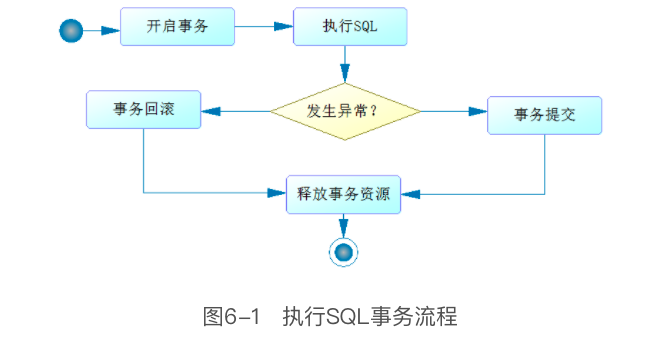

## 声明式事务的使用

对于事务，需要通过标注告诉Spring在什么地方启用数据库事务功能。对于声明式事务，是使用**@Transactional**进行标注的，这个注解可以标注在类或者方法上。

当它标注在类上时，代表这个类所有公共（public）非静态的方法都将启用事务功能。在@Transactional中，还允许配置许多的属性，如**事务的隔离级别和传播行为**；又如**异常类型**，从而确定方法发生什么异常下回滚事务或者发生什么异常下不回滚事务等。

有了@Transactional的配置，Spring就会知道在哪里启动事务机制，其约定流程如下：

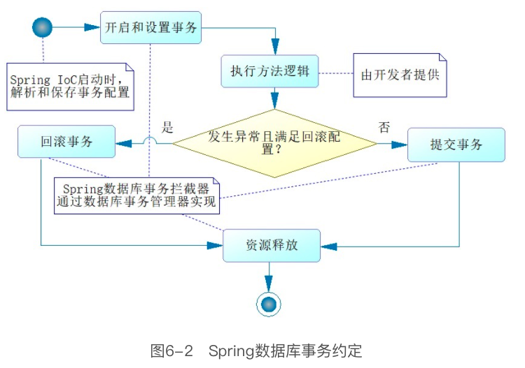

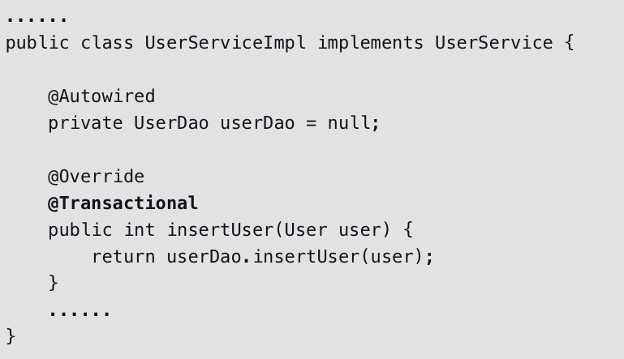

这里仅仅是使用一个@Transactional注解，标识insertUser方法需要启动事务机制，那么Spring就会按照图6-2那样，把insertUser方法织入约定的流程中，这样对于数据库连接的闭合、事务提交与回滚都不再需要我们编写任何代码了，可见这是十分便利的。从代码中，可以看到只需要完成对应的业务逻辑便可以了，这样就可以大幅减少代码，同时代码也具备更高的可读性和可维护性。

## @Transational源码分析

```java
@Target({ElementType.TYPE, ElementType.METHOD})
@Retention(RetentionPolicy.RUNTIME)
@Inherited
@Documented
public @interface Transactional {
  	//通过bean name 指定事务管理器
    @AliasFor("transactionManager")
    String value() default "";
		//同value属性
    @AliasFor("value")
    String transactionManager() default "";
		
    String[] label() default {};
		//指定传播行为
    Propagation propagation() default Propagation.REQUIRED;
		//指定隔离级别
    Isolation isolation() default Isolation.DEFAULT;
		//指定超时时间
    int timeout() default -1;	
    String timeoutString() default "";
		//是否只读事务
    boolean readOnly() default false;
  	//方法在发生指定异常时会滚，默认是所有异常都回滚
    Class<? extends Throwable>[] rollbackFor() default {};
		//方法在发生指定异常名称时回滚，默认是所有异常都回滚
    String[] rollbackForClassName() default {};
		//方法在发生指定异常时不回滚，默认是所有异常都回滚
    Class<? extends Throwable>[] noRollbackFor() default {};
		//方法发生指定异常名称时不回滚，默认是所有异常都回滚
    String[] noRollbackForClassName() default {};
}
```

- value和transactionManager属性是配置一个Spring的事务管理器；

- timeout是事务可以允许存在的时间戳，单位为秒；

- readOnly属性定义的是事务是否是只读事务；

- rollbackFor、rollbackForClassName、noRollbackFor和noRollbackForClassName都是指定异常

- propagation指的是传播行为，isolation则是隔离级别

注：关于注解@Transactional值得注意的是它可以放在接口上，也可以放在实现类上。但是Spring团队推荐放在实现类上，因为放在接口上将使得你的类基于接口的代理时它才生效。我们知道在Spring可以使用JDK动态代理，也可以使用CGLIG动态代理。如果使用接口，那么你将不能切换为CGLIB动态代理，而只能允许你使用JDK动态代理，并且使用对应的接口去代理你的类，这样才能驱动这个注解，这将大大地限制你的使用，因此在实现类上使用@Transactional注解才是最佳的方式，所以将它放置在实现类上吧。

## spring事务管理器

spring中事务管理器的顶层接口为PlatformTransactionManager，spring还为此定义了一系列的接口和类

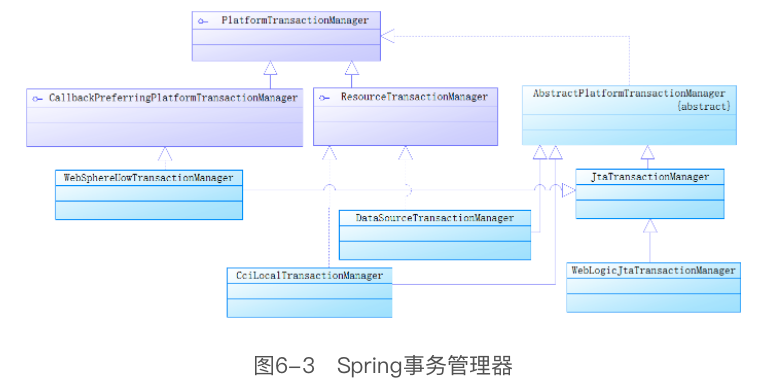

当我们引入其他框架时，还会有其他的事务管理器的类，比方说我们引入Hibernate，那么Spring orm包还会提供HibernateTransactionManager与之对应并给我们使用。因为本书会以MyBatis框架去讨论Spring数据库事务方面的问题，最常用到的事务管理器是DataSourceTransactionManager。从图6-3可以看到它也是一个实现了接口PlatformTransactionManager的类，为此可以看到PlatformTransaction Manager接口的源码：

```java
public interface PlatformTransactionManager extends TransactionManager {
  	//获取事务，它还会设置数据属性
    TransactionStatus getTransaction(@Nullable TransactionDefinition var1) throws TransactionException;
		//提交事务
    void commit(TransactionStatus var1) throws TransactionException;
		//回滚事务
    void rollback(TransactionStatus var1) throws TransactionException;
}
```

Spring在事务管理时，就是将这些方法**按照约定织入对应的流程中**，其中getTransaction方法的参数是一个事务定义器（TransactionDefinition），它是依赖于我们配置的@Transactional的配置项生成的，于是通过它就能够设置事务的属性了，而提交和回滚事务也就可以通过commit和rollback方法来执行。

在Spring Boot中，当你依赖于mybatis-spring-boot-starter之后，它会自动创建一个DataSource- TransactionManager对象，作为事务管理器，如果依赖于spring-boot-starter-data-jpa，则它会自动创建JpaTransactionManager对象作为事务管理器，所以我们一般不需要自己创建事务管理器而直接使用它们即可。

## 代码测试数据库事务

1、建个表

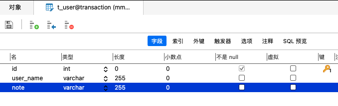

2、pom.xml

```xml
<?xml version="1.0" encoding="UTF-8"?>
<project xmlns="http://maven.apache.org/POM/4.0.0" xmlns:xsi="http://www.w3.org/2001/XMLSchema-instance"
         xsi:schemaLocation="http://maven.apache.org/POM/4.0.0 https://maven.apache.org/xsd/maven-4.0.0.xsd">
    <modelVersion>4.0.0</modelVersion>
    <groupId>com.example</groupId>
    <artifactId>transaction</artifactId>
    <version>0.0.1-SNAPSHOT</version>
    <name>transaction</name>
    <description>Demo project for Spring Boot</description>

    <properties>
        <java.version>1.8</java.version>
        <project.build.sourceEncoding>UTF-8</project.build.sourceEncoding>
        <project.reporting.outputEncoding>UTF-8</project.reporting.outputEncoding>
        <spring-boot.version>2.3.7.RELEASE</spring-boot.version>
    </properties>

    <parent>
        <groupId>org.springframework.boot</groupId>
        <artifactId>spring-boot-starter-parent</artifactId>
        <version>2.3.1.RELEASE</version>
        <relativePath/>
    </parent>

    <dependencies>
        <dependency>
            <groupId>org.springframework.boot</groupId>
            <artifactId>spring-boot-starter</artifactId>
        </dependency>

        <dependency>
            <groupId>org.springframework.boot</groupId>
            <artifactId>spring-boot-starter-web</artifactId>
        </dependency>

        <dependency>
            <groupId>org.springframework.boot</groupId>
            <artifactId>spring-boot-starter-jdbc</artifactId>
        </dependency>

        <dependency>
            <groupId>mysql</groupId>
            <artifactId>mysql-connector-java</artifactId>
            <version>8.0.23</version>
        </dependency>

        <dependency>
            <groupId>org.mybatis.spring.boot</groupId>
            <artifactId>mybatis-spring-boot-starter</artifactId>
            <version>1.3.2</version>
        </dependency>

        <dependency>
            <groupId>org.springframework.boot</groupId>
            <artifactId>spring-boot-starter-test</artifactId>
            <scope>test</scope>
        </dependency>

        <!-- Junit依赖 -->
        <dependency>
            <groupId>junit</groupId>
            <artifactId>junit</artifactId>
            <scope>test</scope>
        </dependency>
        <dependency>
            <groupId>org.projectlombok</groupId>
            <artifactId>lombok</artifactId>
            <version>1.18.18</version>
        </dependency>
        <dependency>
            <groupId>org.junit.jupiter</groupId>
            <artifactId>junit-jupiter</artifactId>
            <scope>test</scope>
        </dependency>
    </dependencies>

    <dependencyManagement>
        <dependencies>
            <dependency>
                <groupId>org.springframework.boot</groupId>
                <artifactId>spring-boot-dependencies</artifactId>
                <version>${spring-boot.version}</version>
                <type>pom</type>
                <scope>import</scope>
            </dependency>
        </dependencies>
    </dependencyManagement>

    <build>
        <plugins>
            <plugin>
                <groupId>org.apache.maven.plugins</groupId>
                <artifactId>maven-compiler-plugin</artifactId>
                <version>3.8.1</version>
                <configuration>
                    <source>1.8</source>
                    <target>1.8</target>
                    <encoding>UTF-8</encoding>
                </configuration>
            </plugin>
            <plugin>
                <groupId>org.springframework.boot</groupId>
                <artifactId>spring-boot-maven-plugin</artifactId>
                <version>2.3.7.RELEASE</version>
                <configuration>
                    <mainClass>com.springboot.transaction.TransactionApplication</mainClass>
                </configuration>
                <executions>
                    <execution>
                        <id>repackage</id>
                        <goals>
                            <goal>repackage</goal>
                        </goals>
                    </execution>
                </executions>
            </plugin>
        </plugins>
    </build>
</project>
```

3、配置文件

```properties
# 应用名称
spring.application.name=transaction
# 应用服务 WEB 访问端口
server.port=8080
spring.datasource.url=jdbc:mysql://localhost:3306/transaction?useUnicode=true&characterEncoding=UTF-8&useJDBCCompliantTimezoneShift=true&useLegacyDatetimeCode=false&serverTimezone=Asia/Shanghai
spring.datasource.driver-class-name= com.mysql.cj.jdbc.Driver
spring.datasource.password=Xwp774683321
spring.datasource.username=root
#最大等待连接中的数量，设0为没有限制
spring.datasource.tomcat.max-idle=10
#最大连接活动数
spring.datasource.tomcat.max-active=50
#最大等待毫秒数，单位为ms，超过则出现错误信息
spring.datasource.tomcat.max-wait=10000
#数据库连接池初始化连接数
spring.datasource.tomcat.initial-size=5
#日志配置，加上更清楚，不加更简洁 respect
#logging.level.root=DEBUG
#logging.level.org.springframework=DEBUG
#logging.level.org.org.mybatis=debug

#mybatis配置
mybatis.mapper-locations=classpath:mappers/*.xml
mybatis.type-aliases-package=com.springboot.transaction.entity
```

4、写个entity

```java
package com.springboot.transaction.entity;

import lombok.Data;
import org.apache.ibatis.type.Alias;

import javax.xml.ws.soap.Addressing;
@Data
@Alias("t_user")
public class User {
    private Long id;
    private String note;
    private String userName;
}
```

5、写个实体类

```java
package com.springboot.transaction.entity;

import lombok.Data;
import org.apache.ibatis.type.Alias;

import javax.xml.ws.soap.Addressing;
@Data
@Alias("t_user")
public class User {
    private Long id;
    private String note;
    private String userName;
}
```

6、写个userMapper.xml

```xml
<?xml version="1.0" encoding="UTF-8" ?>
<!DOCTYPE mapper PUBLIC "-//mybatis.org//DTD Mapper 3.0//EN" "http://mybatis.org/dtd/mybatis-3-mapper.dtd">
<mapper namespace="com.springboot.transaction.dao.UserMapper">
    <select id="getUser" parameterType="long" resultType="t_user">
        select id, user_name as userName, note from t_user where id =#{id}
    </select>
    <insert id="insertUser" useGeneratedKeys="true" keyProperty="id">
        insert into t_user(user_name,note) value (#{userName},#{note})
    </insert>
</mapper>
```

7、写个UserMapper

```java
package com.springboot.transaction.dao;

import com.springboot.transaction.entity.User;
import org.apache.ibatis.annotations.Mapper;

@Mapper
public interface UserMapper {

    User getUser(Long id);

    int insertUser(User user);
}
```

8、写个功能接口并实现它

```java
package com.springboot.transaction.services;

import com.springboot.transaction.entity.User;
@Transactional(isolation = Isolation.READ_COMMITTED,timeout = 1)//像这样
public interface UserService {
    public User getUser(Long id);

    public int insertUser(User user);
}

package com.springboot.transaction.services;

import com.springboot.transaction.dao.UserMapper;
import com.springboot.transaction.entity.User;
import org.springframework.beans.factory.annotation.Autowired;
import org.springframework.stereotype.Service;
import org.springframework.transaction.annotation.Isolation;
import org.springframework.transaction.annotation.Transactional;
@Service
@Transactional(isolation = Isolation.READ_COMMITTED,timeout = 1)//像这样，还可以放接口上哦
public class UserServiceImpl implements UserService {

    @Autowired
    private UserMapper userMapper;

    @Override
    @Transactional(isolation = Isolation.READ_COMMITTED,timeout = 1)//喏，我把事务放在方法这了，也可以放类上面。
    public User getUser(Long id) {
        return userMapper.getUser(id);
    }

    @Override
    @Transactional(isolation = Isolation.READ_COMMITTED,timeout = 1)
    public int insertUser(User user) {
        return userMapper.insertUser(user);
    }
}
```

9、写控制器啦

```java
package com.springboot.transaction.controller;

import com.springboot.transaction.entity.User;
import com.springboot.transaction.services.UserService;
import org.springframework.beans.factory.annotation.Autowired;
import org.springframework.stereotype.Controller;
import org.springframework.web.bind.annotation.RequestMapping;
import org.springframework.web.bind.annotation.ResponseBody;

import java.util.HashMap;
import java.util.Map;

@Controller
@RequestMapping("/user")
public class UserController {
    @Autowired
    private UserService userService;

    @RequestMapping("/getUser")
    @ResponseBody
    public User getUser(Long id){
        return userService.getUser(id);
    }
    @RequestMapping("/insertUser")
    @ResponseBody
    public Map<String,Object> insertUser(String userNmae, String note){
        User user = new User();
        user.setUserName(userNmae);
        user.setNote(note);

        int update = userService.insertUser(user);
        Map<String,Object> result = new HashMap<>();
        result.put("success",update == 1);
        result.put("user",user);
        return result;
    }

}
```

10、启动类

```java
@SpringBootApplication
public class TransactionApplication {

    public static void main(String[] args) throws Exception {
        SpringApplication.run(TransactionApplication.class, args);
    }
}
//http://localhost:8080/user/getUser?id=1 试试查找方法
//{"id":1,"note":"2w","userName":"s"}
```

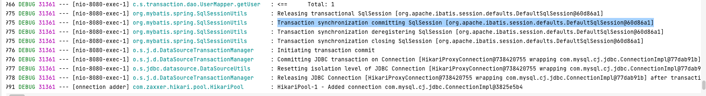

成了！

## 隔离级别分析

数据库事务具有以下4个基本特征，也就是著名的**ACID**。

- Atomic（原子性）：事务中包含的操作**被看作一个整体的业务单元**，这个业务单元中的操作**要么全部成功，要么全部失败，不会出现部分失败、部分成功的场景。**

- Consistency（一致性）：事务在完成时，必须使**所有的数据都保持一致状态**，在数据库中所有的修改都基于事务，保证了数据的完整性。

- Isolation（隔离性）：这是我们讨论的核心内容，正如上述，可能**多个应用程序线程同时访问同一数据**，这样数据库同样的数据就会在各个不同的事务中被访问，这样会产生丢失更新。**为了压制丢失更新的产生**，数据库定义了隔离级别的概念，**通过它的选择，可以在不同程度上压制丢失更新的发生。**因为互联网的应用常常面对高并发的场景，所以隔离性是需要掌握的重点内容。

- Durability（持久性）：事务结束后，**所有的数据会固化到一个地方**，如保存到磁盘当中，即使断电重启后也可以提供给应用程序访问。

重点探究隔离性，当高并发环境则可能出现如下情况：

| 时刻 | 事务1             | 事务2                |
| ---- | ----------------- | -------------------- |
| T1   | 初始库存100       | 初始库存100          |
| T2   | 扣减库存，余99    |                      |
| T3   |                   | 扣减库存，余99       |
| T4   |                   | 提交事务，库存变为99 |
| T5   | 回滚事务，库存100 |                      |

可以看到，T5时刻事务1回滚，导致原本库存为99的变为了100，显然事务2的结果就丢失了，这就是一个错误的值。

对于这样**一个事务回滚另外一个事务提交而引发的数据不一致的情况**，我们称为**第一类丢失更新**。然而它却没有讨论的价值，因为目前大部分数据库已经克服了第一类丢失更新的问题，也就是现今数据库系统已经不会再出现以上的情况了，哈哈哈哈哈。

那么现在如果多个事务并发提交，会出现怎样的不一致呢？

| 时刻 | 事务1                | 事务2              |
| ---- | -------------------- | ------------------ |
| T1   | 初始库存100          | 初始库存100        |
| T2   | 扣减库存，余99       | -                  |
| T3   | -                    | 扣减库存，余99     |
| T4   | -                    | 提交事务，库存为99 |
| T5   | 提交库存，库存变为99 | -                  |

注意T5时刻提交的事务。因为在事务1中，无法感知事务2的操作，这样它就不知道事务2已经修改过了数据，因此它依旧认为只是发生了一笔业务，所以库存变为了99，而这个结果又是一个错误的结果。这样，T5时刻事务1提交的事务，就会引发事务2提交结果的丢失，我们把这样的**多个事务都提交引发的丢失更新称为第二类丢失更新**。

### 详解隔离级别

那么为了压制丢失更新，数据库提出四类隔离级别，在不同程度上压制丢失更新。未提交读、读写提交、可重复读和串行化，它们会在不同的程度上压制丢失更新的情景。

为什么不做全部消除丢失更新呢，而是选择不同程度上压制丢失更新呢？

其实这个问题是从两个角度去看的，一个是**数据的一致性，另一个是性能**。数据库现有的技术完全可以避免丢失更新，但是这样做的代价，就是付出**锁的代价**，在互联网中，系统不单单要考虑数据的一致性，还要考虑系统的性能。试想，在互联网中**使用过多的锁**，一旦出现商品抢购这样的场景，必然会**导致大量的线程被挂起和恢复**，**因为使用了锁之后，一个时刻只能有一个线程访问数据，这样整个系统就会十分缓慢**，当系统被数千甚至数万用户同时访问时，过多的锁就会引发宕机，大部分用户线程被挂起，等待持有锁事务的完成，这样用户体验就会十分糟糕。因为用户等待的时间会十分漫长，一般而言，互联网系统响应超过5 秒，就会让用户觉得很不友好，进而引发用户忠诚度下降的问题。所以选择隔离级别的时候，既需要考虑数据的一致性避免脏数据，又要考虑系统性能的问题。因此数据库的规范就提出了 4 种隔离级别来在不同的程度上压制丢失更新。

- 未读提交

  未提交读（read uncommitted）是最低的隔离级别，其含义是**允许一个事务读取另外一个事务没有提交的数据**。未提交读是一种危险的隔离级别，所以一般在我们实际的开发中应用不广，但是它的**优点在于并发能力高**，**适合那些对数据一致性没有要求而追求高并发的场景**，它的**最大坏处是出现脏读**。

  | 时刻 | 事务1       | 事务2    | 备注                                                         |
  | :--- | ----------- | -------- | ------------------------------------------------------------ |
  | T0   | ...         | ...      | 商品库存初始化为2                                            |
  | T1   | 读取库存为2 |          |                                                              |
  | T2   | 扣减库存    |          | 库存为1                                                      |
  | T3   |             | 扣减库存 | 库存为0，读取事务1未提交的库存数据                           |
  | T4   |             | 提交事务 | 库存保存为0                                                  |
  | T5   | 回滚        |          | 因为第一类丢失更新已客服，所以不会回滚为2。库存为0了。结果错误 |

  T3时刻，因为采用未提交读，所以事务2可以读取事务1未提交的库存数据为1，这里当它扣减库存后则数据为0，然后它提交了事务，库存就变为了0，而事务1在T5时刻回滚事务，因为第一类丢失更新已经被克服，所以它不会将库存回滚到2，那么最后的结果就变为了0，这样就出现了错误。所以它仅适合那些对数据一致性没有要求而追求高并发的场景，那么实际应用这种场景几乎没有！

- 读写提交

  读写提交（read committed）隔离级别，是指**一个事务只能读取另外一个事务已经提交的数据，不能读取未提交的数据**。

  | 时刻 | 事务1       | 事务2    | 备注                                                         |
  | :--- | ----------- | -------- | ------------------------------------------------------------ |
  | T0   | ...         | ...      | 商品库存初始化为2                                            |
  | T1   | 读取库存为2 |          |                                                              |
  | T2   | 扣减库存    |          | 库存为1                                                      |
  | T3   |             | 扣减库存 | 库存为0，读取**不到**事务1未提交的库存数据                   |
  | T4   |             | 提交事务 | 库存保存为1                                                  |
  | T5   | 回滚        |          | 因为第一类丢失更新已客服，所以不会回滚为2。库存为1。结果正确 |

  在T3时刻，由于采用了读写提交的隔离级别，因此事务2不能读取到事务1中未提交的库存1，所以扣减库存的结果依旧为1，然后它提交事务，则库存在T4时刻就变为了1。T5时刻，事务1回滚，因为第一类丢失更新已经克服，所以最后结果库存为1，这是一个正确的结果。但你以为这样就可以保证数据一致性吗，不！

  | 时刻 | 事务1       | 事务2       | 备注                                          |
  | :--- | ----------- | ----------- | --------------------------------------------- |
  | T0   | ...         | ...         | 商品库存初始化为1                             |
  | T1   | 读取库存为1 |             |                                               |
  | T2   | 扣减库存    |             | 事务未提交                                    |
  | T3   |             | 读取库存为1 | 读取**不到**事务1未提交的库存数据，认为可扣减 |
  | T4   | 提交事务    |             | 库存变为0                                     |
  | T5   |             | 扣减库存    | 失败，因为T4时刻已经库存为0了，无法扣减       |

  在T3时刻事务2读取库存的时候，因为事务1未提交事务，所以读出的库存为1，于是事务2认为当前可扣减库存；在T4时刻，事务1已经提交事务，所以在T5时刻，它扣减库存的时候就发现库存为0，于是就无法扣减库存了。这里的问题在于事务2之前认为可以扣减，而到扣减那一步却发现已经不可以扣减，于是库存对于事务2而言是一个可变化的值，这样的现象我们称为**不可重复读**，这就是读写提交的一个不足。为了克服这个不足，数据库的隔离级别还提出了**可重复读的隔离级别**，**它能够消除不可重读的问题**。

- 可重复读

  可重复读的目标是克服读写提交中出现的不可重复读的现象，因为在读写提交的时候，**可能出现一些值的变化，影响当前事务的执行，如上述的库存是个变化的值，**这个时候数据库提出了可重复读的隔离级别。

  | 时刻 | 事务1       | 事务2        | 备注                      |
  | :--- | ----------- | ------------ | ------------------------- |
  | T0   | ...         | ...          | 商品库存初始化为1         |
  | T1   | 读取库存为1 |              |                           |
  | T2   | 扣减库存    |              | 事务未提交                |
  | T3   |             | 尝试读取库存 | 不允许读取，等待事务1提交 |
  | T4   | 提交事务    |              | 库存变为0                 |
  | T5   |             | 扣减库存     | 所存为0，无法扣减，正确； |

  可以看到，事务2在T3时刻尝试读取库存，但是此时这个库存已经被事务1事先读取，所以这个时候数据库就阻塞它的读取，直至事务1提交，事务2才能读取库存的值。此时已经是T5时刻，而读取到的值为0，这时就已经无法扣减了，显然在读写提交中出现的不可重复读的场景被消除了。但是这样也会引发新的问题的出现，这就是**幻读**。假设现在**商品交易正在进行中，而后台有人也在进行查询分析和打印的业务**，让我们看看如表6-7所示可能发生的场景。

  | 时刻 | 事务1           | 事务2              | 备份                                                         |
  | ---- | --------------- | ------------------ | ------------------------------------------------------------ |
  | T1   | 读取库存为50件  |                    | 商品库存100件，已经销售了50件，剩50件                        |
  | T2   |                 | 查询交易记录，50笔 |                                                              |
  | T3   | 扣除库存        |                    |                                                              |
  | T4   | 插入1笔交易记录 |                    |                                                              |
  | T5   | 提交事务        |                    | 库存49件，交易记录51笔                                       |
  | T6   |                 | 打印交易记录，51笔 | 这里与查询不一致，在事务2看来1是虚幻的，**与之前查询的不一致** |

  这便是幻读现象。可重复读和幻读，是读者比较难以理解的内容，这里稍微论述一下。首先**这里的笔数不是数据库存储的值，而是一个统计值，商品库存则是数据库存储的值**，这一点是要注意的。也就是幻读不是针对一条数据库记录而言，而是多条记录，例如，这51笔交易笔数就是多条数据库记录统计出来的。而可重复读是针对数据库的单一条记录，例如，商品的库存是以数据库里面的一条记录存储的，它可以产生可重复读，而不能产生幻读。

- 串行化

  串行化（Serializable）是数据库最高的隔离级别，它会要求所有的SQL都会按照顺序执行，这样就可以克服上述隔离级别出现的各种问题，所以它能够完全保证数据的一致性。但是，效率低下，不实用高并发场景，所以我们要利用合理的隔离级别做事务管理。

- 使用合理的隔离级别

  根据上面的分析，制作一张不同隔离级别实现不同程度上的压制丢失更新表格：

  | 项目类型 | 脏读     | 不可重复读 | 幻读     |
  | -------- | -------- | ---------- | -------- |
  | 未提交读 | 无法压制 | 无法压制   | 无法压制 |
  | 读写提交 | 压制     | 无法压制   | 无法压制 |
  | 可重复读 | 压制     | 压制       | 无法压制 |
  | 串行化   | 压制     | 压制       | 压制     |

  作为互联网开发人员，在开发高并发业务时需要时刻记住隔离级别可能发生的各种概念和相关的现象，这是数据库事务的核心内容之一，也是互联网企业关注的重要内容之一。

  追求更高的隔离级别，它能更好地保证了数据的一致性，但是也要付出锁的代价。有了锁，就意味着性能的丢失，而且隔离级别越高，性能就越是直线地下降。所以我们在选择隔离级别时，要考虑的不单单是数据一致性的问题，还要考虑系统性能的问题。

  例如，一个高并发抢购的场景，如果采用串行化隔离级别，能够有效避免数据的不一致性，但是这样会使得并发的各个线程挂起，因为只有一个线程可以操作数据，这样就会出现大量的线程挂起和恢复，导致系统缓慢。而后续的用户要得到系统响应就需要等待很长的时间，最终因为响应缓慢，而影响他们的忠诚度。

  所以在现实中一般而言，**选择隔离级别会以读写提交为主**，它能够防止脏读，而不能避免不可重复读和幻读。为了克服数据不一致和性能问题，程序开发者还设计了乐观锁，甚至不再使用数据库而使用其他的手段。例如，使用Redis作为数据载体。

  > 对于隔离级别，不同的数据库的支持也是不一样的。例如，Oracle只能支持读写提交和串行化，而MySQL则能够支持4种，对于Oracle默认的隔离级别为读写提交，MySQL则是可重复读，这些需要根据具体数据库来决定。

### 使用隔离级别

```java
@Transactional(isolation = Isolation.SERIALIZABLE)
public int insertUser(User user){
	return userDao.insertUser(user);
}
```

这里我们使用串行化的隔离级别来保证数据的一致性，它将阻塞其他的事务进行并发。

快速开发的时候一个个设置隔离级别太慢了，我们还可以使用配置文件指定默认隔离级别。

```properties
#-1 数据库默认隔离级别
#1 未提交读
#2 读写提交
#4 可重复读
#8 串行化
#tomcat数据源默认隔离级别
spring.datasource.tomcat.default-transaction-isolation=2
#dbcp2数据库连接池默认隔离界别
spring.datasource.dbcp2.default-transaction-isolation=2
```

代码中配置了**tomcat数据源的默认隔离级别**，而**注释的代码则是配置了DBCP2数据源的隔离级别**，注释中已经说明了数字所代表的隔离级别，相信读者也有了比较清晰的认识，这里配置为2，说明将数据库的隔离级别默认为读写提交。

## 传播行为

> 传播行为是方法之间调用事务采取的策略问题。

在绝大部分的情况下，我们会认为数据库事务要么全部成功，要么全部失败。但现实中也许会有特殊的情况。例如，执行一个批量程序，它会处理很多的交易，绝大部分交易是可以顺利完成的，但是也有极少数的交易因为特殊原因不能完成而发生异常，这时**我们不应该因为极少数的交易不能完成而回滚批量任务调用的其他交易，使得那些本能完成的交易也变为不能完成了**。此时，我们真实的需求是，在一个批量任务执行的过程中，调用多个交易时，如果有一些交易发生异常，只是回滚那些出现异常的交易，而不是整个批量任务，这样就能够使得那些没有问题的交易可以顺利完成，而有问题的交易则不做任何事情。

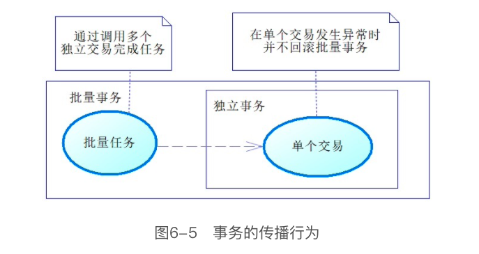

**在Spring中，当一个方法调用另外一个方法时，可以让事务采取不同的策略工作，如新建事务或者挂起当前事务等，这便是事务的传播行为。简单的说，我有个批量插入服务是不是要调用插入服务方法，我的批量插入相当于批量任务，而插入方法是单个交易，那么我这么多次调用插入方法，如果一个出错，按照原有逻辑（要么全部成功，要么全部失败）我这个批处理就全失效了，那么为了实现我这个批量插入服务中其他插入方法成功实现，我就需要定义传播行为，比如把每个插入服务都给它分配一个事务，让他们隔离开来去跑，或者全挂起来，一个个执行。简单的说，就是定义传播行为阻止一颗老鼠屎坏一锅汤！**

### 传播行为的定义

在Spring事务机制中对数据库存在7种传播行为，它通过枚举类Propagation定义，我们先对其源码展开分析：

```java
package org.springframework.transaction.annotation;

public enum Propagation {
  	/**
  	*需要事务，它是默认传播行为，如果当前存在事务，就沿用当前事务
  	*否则新建一个事务运行子方法
  	*/
    REQUIRED(0),
  	//支持事务，如果当前存在事务，就沿用当前事务
  	//如果不存在，就继续采用无事务的方式运行子方法
    SUPPORTS(1),
  	//必须使用事务，如果当前没有事务，就抛出异常
  	//如果存在当前事务，就沿用当前事务
    MANDATORY(2),
  	//无论当前事务是否存在，都会创新新事务运行方法，
  	//这样新事物就可以拥有新的锁和隔离级别等特性，与当前事务相互独立
    REQUIRES_NEW(3),
  	//不支持事务，当前存在事务时，将挂起事务，运行方法
    NOT_SUPPORTED(4),
  	//不支持事务，如果当前方法存在事务，则抛出异常，否则继续使用无事务机制运行
    NEVER(5),
  	//在当前方法调用子方法时，如果子方法发生异常，只回滚子方法执行过的sql，而不回滚当前方法的事务
    NESTED(6);

    private final int value;
 
    private Propagation(int value) {
        this.value = value;
    }

    public int value() {
        return this.value;
    }
}
```

其中REQUIRED，REQUIRES_NEW，NESTED为常用传播行为，我们对这三种传播行为展开分析：

### 使用传播行为

```java
//整个批处理服务接口 并实现
package com.springboot.transaction.services;

import com.springboot.transaction.entity.User;

import java.util.List;
//批量更新用户
public interface UserBatchService {
    public int insertUsers(List<User> userList);
}
```

```java
package com.springboot.transaction.services;

import com.springboot.transaction.entity.User;
import org.springframework.beans.factory.annotation.Autowired;
import org.springframework.stereotype.Service;
import org.springframework.transaction.annotation.Isolation;
import org.springframework.transaction.annotation.Propagation;
import org.springframework.transaction.annotation.Transactional;

import java.util.List;
//批量更新用户
@Service
public class UserBatchServiceImpl implements UserBatchService{
    @Autowired
    private UserService userService;

    @Override
  	//配置隔离级别和传播行为
    @Transactional(isolation = Isolation.READ_COMMITTED,propagation = Propagation.REQUIRED)
    public int insertUsers(List<User> userList) {
        int count =0;
        for (User user:userList
             ) {count+=userService.insertUser(user);

        }
        return count;
    }
}
```

```java
//测试
@RequestMapping("/insertUsers")
    @ResponseBody
    public Map<String, Object> insertUsers(String userName1, String note1, String userName2, String note2){
        User user1 = new User();
        user1.setUserName(userName1);
        user1.setNote(note1);
        User user2 = new User();
        user1.setUserName(userName2);
        user1.setNote(note2);
        List<User> userList = new ArrayList<>();
        userList.add(user1);
        userList.add(user2);
        int inserts = userBatchService.insertUsers(userList);
        Map<String,Object> result = new HashMap<>();
        result.put("success",inserts>0);
        result.put("user",userList);
        System.out.println(result);
        return result;
    }
```

通过日志可见，事务被沿用，说明传播行为定义成功

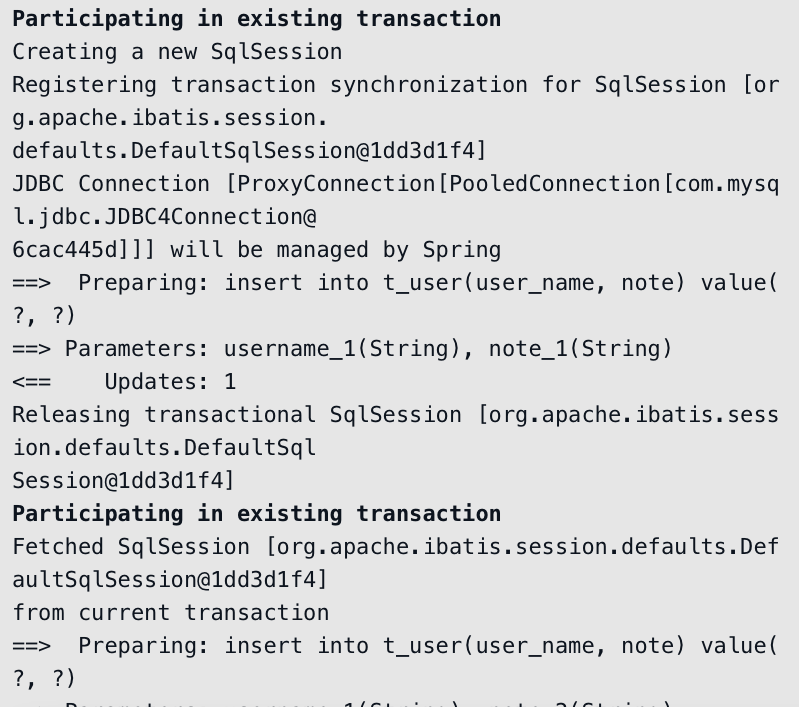

## @Transactional调用失效问题

@Transactional在某些场景下会失效，例如我们的应用使用的是通过UserBactchServiceImpl类去调用UserServiceImpl类的方法，那么如果我们不创建UserBactchServiceImpl类，而只是使用UserServiceImpl类进行批量插入用户，这时注解就会失效，原因就在于spring实现传播行为控制的原理是aop，如果我们自调用，则无法控制传播行为，也就是注解失效；

那么如果我们还是坚持不新建一个服务类呢？那么我们可以通过实现生命周期方法，设置ioc容器，然后调用ioc容器生成的代理对象

# Redis

Redis是一种运行在内存的数据库，支持7种数据类型的存储。Redis是一个开源、使用ANSI C语言编写、遵守BSD协议、支持网络、可基于内存亦可持久化的日志型、键值数据库，并提供多种语言的API。Redis是基于内存的，所以运行速度很快，大约是关系数据库几倍到几十倍的速度。在我的测试中，Redis可以在1 s内完成10万次的读写，性能十分高效。如果我们将常用的数据存储在Redis中，用来代替关系数据库的查询访问，网站性能将可以得到大幅提高。

> 书到这也就看不下去了，作者应该是个老师，理论部分很可观，而落地到技术框架就稍显稚嫩，故而跳过。

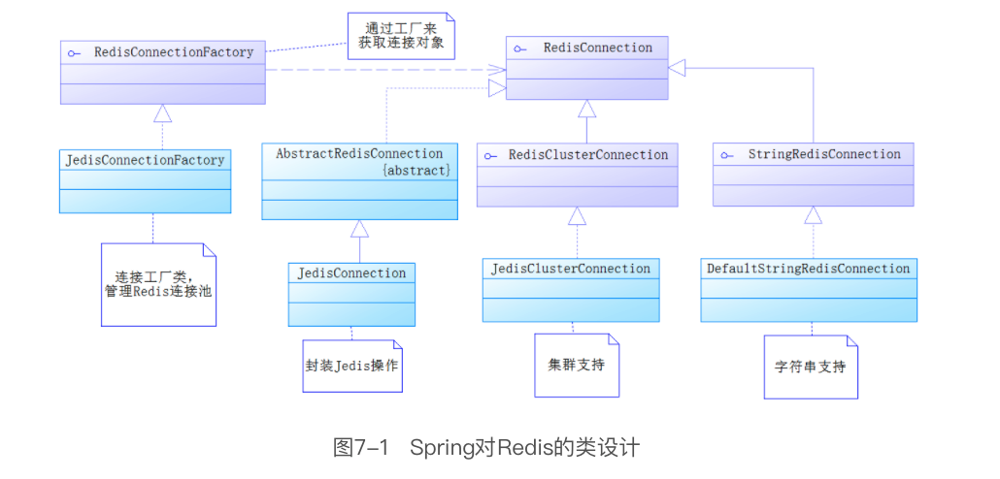

# Spring MVC框架设计

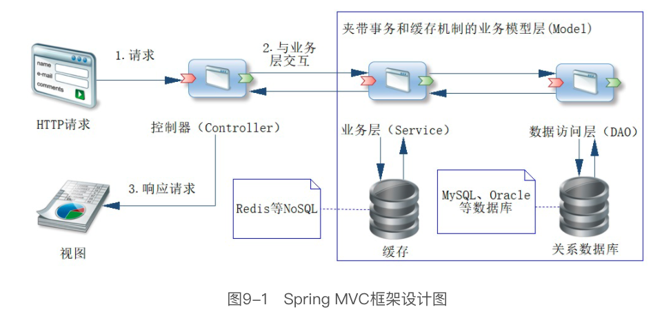

处理请求先到达控制器（Controller），控制器的作用是进行请求分发，这样它会根据请求的内容去访问模型层（Model）；在现今互联网系统中，数据主要从数据库和NoSQL中来，而且对于数据库而言往往还存在事务的机制，为了适应这样的变化，设计者会把模型层再细分为两层，即服务层（Service）和数据访问层（DAO）；当控制器获取到由模型层返回的数据后，就将数据渲染到视图中，这样就能够展现给用户了，但这只是一个最基本概述，我们对其完整设计展开分析。

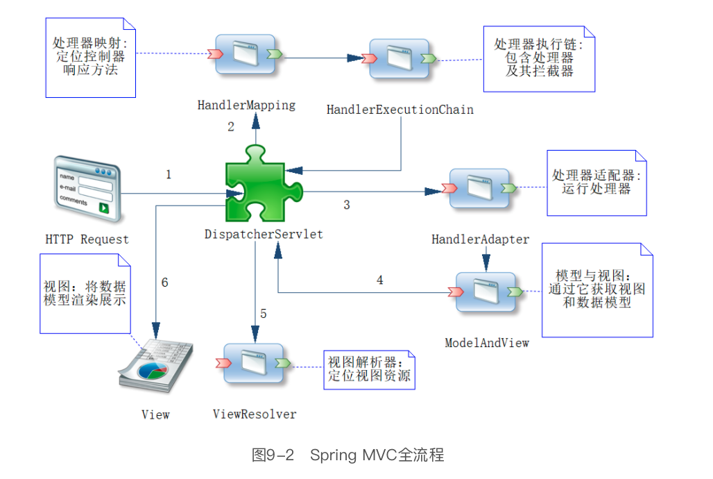

首先，在Web服务器启动的过程中，如果在Spring Boot机制下启用Spring MVC，它就开始初始化一些重要的组件，如DispactherServlet、HandlerAdapter的实现类RequestMappingHandlerAdapter等组件对象。关于这些组件的初始化，我们可以看到spring-webmvc-xxx.jar包的属性文件DispatcherServlet.properties，它定义的对象都是在Spring MVC开始时就初始化，并且存放在Spring IoC容器中。

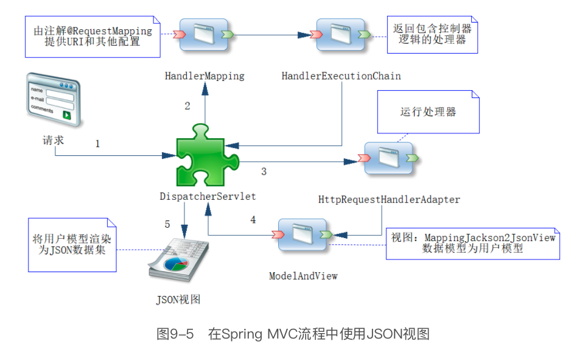

# REST风格架构

REST这个词，是Roy Thomas Fielding在他2000年的博士论文中提出的。Fielding博士是HTTP协议（1.0版和1.1版）的主要设计者、Apache服务器软件的作者之一、Apache基金会的第一任主席。所以，他的这篇论文一经发表，就引起了关注，并且立即对互联网开发产生了深远的影响。Fielding将他对互联网软件的**架构原则**，命名为REST（Representational State Transfer）。**如果一个架构符合REST原则，就称它为REST风格架构。**

## REST名词解释

REST按其英文名称（Representational State Transfer）可翻译为表现层状态转换。

首先需要有资源才能表现，所以第一个名词是“资源”。有了资源也要根据需要以合适的形式表现资源，这就是第二个名词——表现层。最后是资源可以被新增、修改、删除等，也就是第三个名词“状态转换”。这就是REST风格的三个主要的名词。

- 资源：它可以是系统权限用户、角色和菜单等，也可以是一些媒体类型，如文本、图片、歌曲，总之它就是一个具体存在的对象。可以用一个URI（Uniform Resource Identifier，统一资源定位符）指向它，每个资源对应一个特定的URI。要获取这个资源，访问它的URI即可，而在REST中每一个资源都会对应一个独一无二的URI。在REST中，URI也可以称为端点（End Point）。

- 表现层：有了资源还需要确定如何表现这个资源。例如，一个用户可以使用JSON、XML或者其他的形式表现出来，又如可能返回的是一幅图片。在现今的互联网开发中，JSON数据集已经是一种最常用的表现形式，所以全书也是以JSON为中心的。

- 状态转换：现实中资源并不是一成不变的，它是一个变化的过程，一个资源可以经历创建（create）、访问（visit）、修改（update）和删除（delete）的过程。对于HTTP协议，是一个没有状态的协议，这也意味着对于资源的状态变化就只能在服务器端保存和变化，不过好在HTTP中却存在多种动作来对应这些变化。本章后面会具体讲解这些动作和它们的使用。

总结一下**REST风格架构的特点**：

- **服务器存在一系列的资源，每一个资源通过单独唯一的URI进行标识；**

- **客户端和服务器之间可以相互传递资源，而资源会以某种表现层得以展示；**

- **客户端通过HTTP协议所定义的动作对资源进行操作，以实现资源的状态转换。**

## HTTP的动作

上面讲述了REST的关键名词，也谈到了REST风格的资源是通过HTTP的行为去操作资源的。对于资源而言，它存在创建（create）、修改（update）、访问（visit）和删除（delete）的状态转换，这样它就对应于HTTP的行为的5种动作。

- GET（VISIT）：访问服务器资源（一个或者多个资源）。

- POST（CREATE）：提交服务器资源信息，用来创建新的资源。

- PUT（UPDATE）：修改服务器已经存在的资源，使用PUT时需要把资源的所有属性一并提交。

- PATCH（UPDATE）：修改服务器已经存在的资源，使用PATCH时只需要将部分资源属性提交。**目前来说这个动作并不常用也不普及，有些Java类还不能完全支持它，所以在现实中使用它需要慎重。**

- DELETE（DELETE）：从服务器将资源删除。

- HEAD：获取资源的元数据（Content-type）。

- OPTIONS：提供资源可供客户端修改的属性信息。

```properties
#获取用户信息，1是用户编号
GET /user/1
#查询多个用户信息
GET /users/{userName}/{note}
#创建用户
POST /user/{userName}/{sex}/{note}
#修改用户全部属性
PUT /USER/{id}/{userName}/{sex}/{note}
#修改用户名称（部分属性）
PATCH /user/{id}/{userName}
```

注意，在**URI中并没有出现动词**，而对于参数主要通过URI设计去获取。对于**参数数量超过5个的可以考虑使用传递JSON**的方式来传递参数。来些错误示范：

```properties
#不能有动词
GET /user/get/1 
#不要加入版本号，要控制版本号就去设置HTTP请求头 Accept: version = 1.0
GET /V1/user/1
#REST都不推荐使用类似于
PUT  users?userName=user_name&note=note
#如果要传递更新，可以这样写
PUT users/{userNmae}/{note}
```

## 使用Spring MVC开发REST风格端点

- @GetMapping：对应HTTP的GET请求，获取资源。
- @PostMapping：对应HTTP的POST请求，创建资源。
- @PutMapping：对应HTTP的PUT请求，提交所有资源属性以修改资源。
- @PatchMapping：对应HTTP的PATCH请求，提交资源部分修改的属性。
- @DeleteMapping：对应HTTP的DELETE请求，删除服务器端的资源。
- @RequestBody可以将**请求体为JSON的数据转化为复杂的Java对象.**
- @RestController让整个控制器都默认转换为JSON数据集。
- **@PathVariable就能够将URI地址的参数获取**

> 如果是**简单的参数，往往会通过URL直接传递**，在Spring MVC可以使用注解@PathVariable进行获取.
>
> 对于那些复杂的参数，例如，你**需要传递一个复杂的资源需要十几个甚至几十个字段，可以考虑使用请求体JSON的方式提交给服务器，这样就可以使用注解@RequestBody将JSON数据集转换为Java对象。**
>
> 在现今的开发中，**请求数据转化为JSON是最常见的方式**，这个时候可以考虑使用注解@ResponseBody，这样Spring MVC就会通过MappingJackson2HttpMessageConverter最终将数据转换为JSON数据集，而在Spring MVC对REST风格的设计中，甚至可以使用注解@RestController让整个控制器都默认转换为JSON数据集。**实际上有时候还需要转变为其他的数据形式，如URI可能请求的是一幅图片、一段视频等。这显然就是REST的表现形式。为了克服这个问题，Spring提供了一个协商资源的视图解析器——ContentNegotiatingViewResolver，关于它后面讨论。**
>
> 通过**@RequestMapping、@GetMapping等注解就能把URI定位到对应的控制器方法上**，通过注解**@PathVariable就能够将URI地址的参数获取**，通过**@RequestBody可以将请求体为JSON的数据转化为复杂的Java对象**，其他均可以依据Spring MVC的参数规则进行处理。这样就能够进入到对应的控制器，进入控制器后，就可以根据获取的参数来处理对应的逻辑。最后可以得到后台的数据，准备渲染给请求。

## Spring REST风格代码示例

```java
package com.springboot.web.controller;

import com.springboot.web.model.User;
import org.springframework.web.bind.annotation.PathVariable;
import org.springframework.web.bind.annotation.RequestMapping;
import org.springframework.web.bind.annotation.RestController;

@RestController
public class RestfulController {
	@RequestMapping("/user/{id}")
	public Object getUser(@PathVariable("id") Integer id){
		System.out.println("id = " + id );
		User user = new User();
		user.setId(id);
		return user;
	}
	
	@RequestMapping("/user/{id}/{name}")
	public Object getUser(@PathVariable("id") Integer id,@PathVariable("name") String name){
		System.out.println("id = " + id + " || name = " + name);
		User user = new User();
		user.setName(name);
		user.setId(id);
		return user;
	}
}
```

## Spring cloud请求RestTemplate

例如，要完成一个产品交易的系统，显然需要有产品、用户、财务的基础才能完成。为了简化开发人员的复杂度，设计者可以把产品、用户和财务都分别作为一个单独的微服务系统，而交易也是一个独立的微服务系统。这样的分离后，产品、用户、财务和交易之间的资源就相互隔离了，为了使得它们之间能够相互访问，就必须有一套相互交互的机制。例如，交易系统希望得到产品、用户和财务的信息以完成整个交易的过程。应该说现今完成系统的交互方式存在多种，如**WebService**、**远程调用（RPC）**等，但是为了简易，微服务推荐使用的是REST风格来完成系统之间的交互，如图11-3所示。当然这些也会带来很多的问题，如**在并发的过程中导致数据不一致、分布式数据库事务等诸多问题**。虽然现今也有办法对这些问题进行处理，但也比较复杂，这已经不在本书讨论的范围之内，所以就不再深入地讨论这些话题。

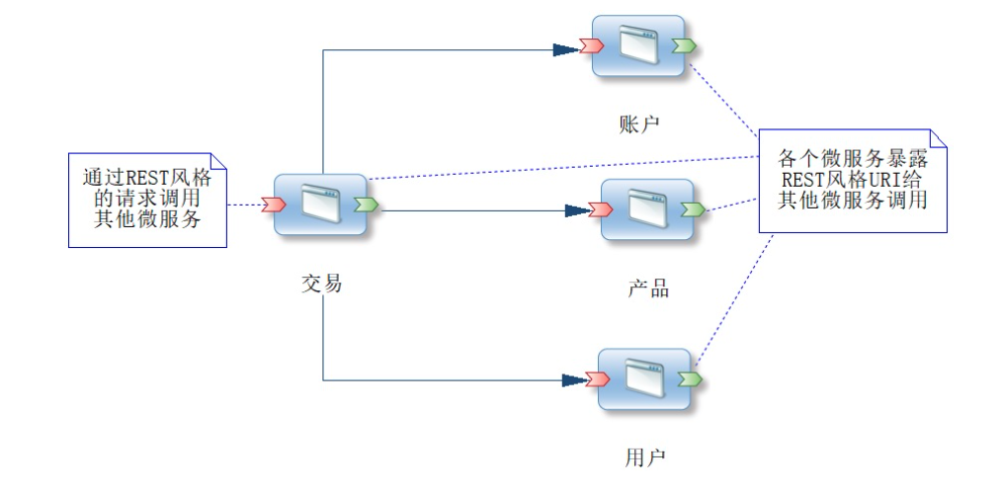

为了能让交易完成，交易系统会通过RestTemplate去请求各个子系统的资源来完成其所需的业务。在Spring 5所推出的新框架WebFlux中，还可以学习到WebClient的集成方式。

### 使用RestTemplate进行HTTP GET请求

```java
public static UserVo getUser(Long id){
  //创建一个RestTemplate对象
  RestTemplate restTem = new RestTemplate();
  UserVo userVo = restTmp1.getForObject(
  "http://localhost:8080/user/{id}",UserVo.class, id);
  //打印用户名称
  System.out.println(userVo.getUserName());
  return userVo;
}
```

RestTemplate中的getForObject方法解析：

**第一个参数URI标明请求服务器什么资源，而{id}则代表参数。**

第二个参数声明为UserVo.class，表示**请求将返回UserVo类的结果**，而实际上服务器只会返回JSON类型的数据给我们，只是RestTemplate内部会将其转变为Java对象，这样使用就很便利了。

第三个参数则是**URI中对应的参数**，只是这里的URI只有一个参数，所以就只有一个id。实际上它是一个可变长参数，如果URI有多个参数，只要按顺序写就可以了。

但是**如果你的参数很多，显然可读性就不是那么好了**。不过放心，Spring已经考虑到了这个问题，我们可以将它们**封装起来**。

下面对用户进行查询，这里涉及用户名称（userName）、备注（note）、开始行数（start）和限制记录数（limit）4个参数

```java
//RestTemplate使用多参数的HTTP GET请求
public static List<User Vo> findUser(String userName,String note,int start,int limit){
  //创建一个RestTemplate对象
  RestTemplate restTem = new RestTemplate();
  //使用Map封装多个参数，以提高可读性
  Map<String,Object> params = new HashMap<String,Object>();
  params.put("userName","userName");
  params.put("note","note");
  params.put("start","start");
  params.put("limit","limit");
  //Map中的key和url中的参数一一对应
  String url = "http://localhost:8080/users/{userName}/{note}/{start}/{limit}";
  //请求后端
  ResponseEntity<List> responseEntity = restTemp1.getForEntity(url,List.class,params);
  List<UserVo> userVoes = responseEntity.getBody();
  return userVoes;
}
```

这里先将参数用一个Map对象封装起来，而Map的键和URI中所定义的参数是保持一致的，这样就能够将参数一一封装到Map中，有效地提高可读性。这里返回的是一个List对象，所以返回类型声明为List，这样RestTemplate就会解析结果返回数据。

### 通过POST请求传递JSON请求体（Body）

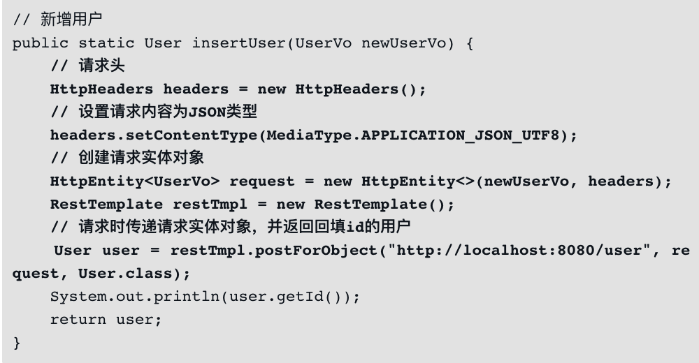

上面的代码先是定义了HTTP头（HttpHeaders），并将其请求体内容设置为JSON类型，然后将它和请求体实体（UserVo对象）绑定到请求实体对象（HttpEntity）上，在RestTemplate的postForObject方法中将请求实体对象传递过去，让后台接收就可以了。

### 使用RestTemplate执行DELETE请求

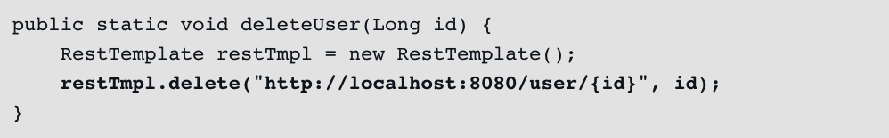

# 一些企业实用技术

## 异步线程池

在实际的场景中，如后台管理系统，有些任务需要操作比较多的数据进行统计分析，典型的如报表，需要去生成。而报表可能需要访问的是亿级数据量并且进行比较复杂的运算，这样报表的生成就需要比较多的时间了。对于系统运维人员，目的只是点击生成报表的按钮，而不需要查看报表。如果请求和生成报表的请求在同一个线程，那么他就需要等待比较长的时间，如图

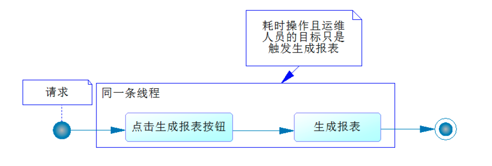

那么我们用异步线程池去优化，线程运维人员的请求是在线程1中运行的，而线程1会启动线程2来运行报表的生成。这样运维人员的请求就不再需要等待报表的生成，并且可以很快结束，这显然才是运维人员真实的需要。

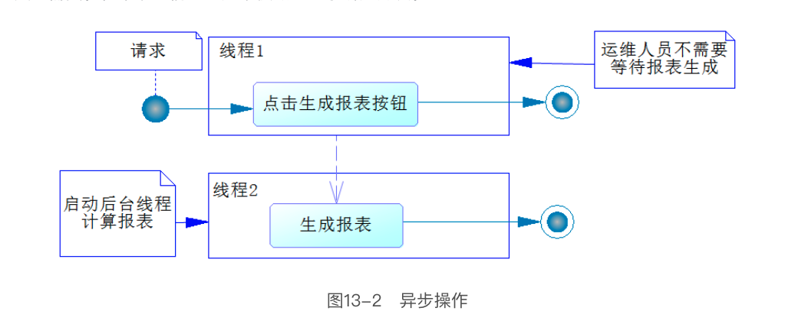

### 定义线程池和开启异步可用AsyncConfigurer

在Spring中存在一个AsyncConfigurer接口，它是一个可以配置异步线程池的接口，它的源码如下

```java
package org.springframework.scheduling.annotation;

import java.util.concurrent.Executor;
import org.springframework.aop.interceptor.AsyncUncaughtExceptionHandler;
import org.springframework.lang.Nullable;

public interface AsyncConfigurer {
  	//返回的是一个自定义线程池，
    //为了使得这个接口更加方便使用，在代码中Spring提供了空实现，所以我们只需要实现AsyncConfigurer接口覆盖掉对应的方法即可
  	@Nullable
    default Executor getAsyncExecutor() {
        return null;
    }
		//异步异常处理器
    @Nullable
    default AsyncUncaughtExceptionHandler getAsyncUncaughtExceptionHandler() {
        return null;
    }
}
```

**@EnableAsync：**如果Java配置文件标注它，那么Spring就会开启异步可用，这样就可以使用注解@Async驱动Spring使用异步调用，其中getAsyncExecutor方法返回的是一个自定义线程池，这样在开启异步时，线程池就会提供空闲线程来执行异步任务。因为线程中的业务逻辑可能抛出异常，所以还有一个处理异常的处理器也定义方法，使得异常可以自定义处理。

**@Async:**驱动spring使用异步调用；

```java 
//使用Java配置定义线程池和启用异步
@Configuration
@EnableAsync//代表开启Spring异步
public class AsyncConfig implements AsyncConfigurer {
    //定义线程池
    @Override
    public Executor getAsyncExecutor(){
        ThreadPoolTaskExecutor taskExecutor = new ThreadPoolTaskExecutor();
        //核心线程数
        taskExecutor.setCorePoolSize(10);
        //线程池最大线程数
        taskExecutor.setMaxPoolSize(30);
        //线程队列最大线程数
        taskExecutor.setQueueCapacity(2000);
        //初始化
        taskExecutor.initialize();
        return taskExecutor;
    }
}
```

当方法被标注@Async时，Spring就会通过这个线程池的空闲线程去运行该方法。在getAsyncExecutor方法中创建了线程池，设置了其核心线程为10、最大线程数为30、线程队列为2000的限制，然后将线程池初始化，这样异步便可用。

```java
//定义异步服务
package com.springboot.chapter13.service;
public interface AsyncService{
  //模拟报表生成的异步方法
  public void generateReport();
  public void sout();
}
//实现异步服务
@Service
public class AsyncServiceImpl implements AsyncService{
    @Override
    @Async//使用线程池的线程去执行这个方法
    public void generateReport() {
        System.out.println("报表线程名称："+"【"+Thread.currentThread().getName()+"】");
    }
  
    @Override
    @Async
    public void sout() {
        System.out.println("新建方法名称："+'【'+Thread.currentThread().getName()+']');
    }
}
```

```java
//控制器
@Controller
@RequestMapping("/async")
public class AsyncCoontroller {
    @Autowired
    private AsyncService asyncService = null;
    @GetMapping("/page")
    public String asyncPage(){
        System.out.println("请求线程名称："+"【"+Thread.currentThread().getName()+"】");
        //调用异步服务
        asyncService.generateReport();
        asyncService.sout();
        return "async";
    }
}
```

访问http://localhost:8080/async/page

结果：

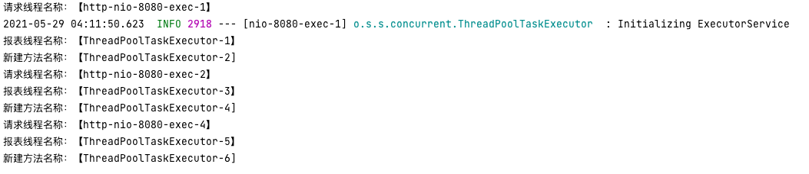

**可见每次访问该api，线程池都会分别给他们取出新的线程；**

## 异步消息//本书中这一章又是错的 害

## 定时任务

在月末、季末和年末需要统计各种各样的报表，月表需要月末跑批量生成，季表需要季末跑批量生成，这样就需要制定不同的定时任务。在Spring中使用定时器是比较简单的，**首先在配置文件中加入@EnableScheduling**，**就能够使用注解驱动定时任务的机制，然后可以通过注解@Scheduled去配置如何定时。**

```java
//首先启动类添加@EnableScheduling
@EnableScheduling
@SpringBootApplication
public class SchedulApplication {

    public static void main(String[] args) {
        SpringApplication.run(SchedulApplication.class, args);
    }
}
```

```java
@Service
//这里的注解@Scheduled配置为按时间间隔执行，每隔1s便执行一次。使用@Async注解代表这需要使用异步线程执行
public class ScheduleServiceImpl {
    //计数器
    int count1 =1;
    int count2 =1;
    //每隔一秒执行一次
    @Scheduled(fixedRate = 1000)

    @Async
    public void job1(){
        System.out.println("【"+Thread.currentThread().getName()+"】"+"【job1】每秒钟执行一次,执行第【"+count1+"】次");
        count1++;
    }

    //每隔一秒执行一次
    @Scheduled(fixedRate = 1000)//配置为按时间间隔执行，每隔1 s便执行一次。单位是毫秒
    //使用异步执行
    @Async//@Async注解代表这需要使用异步线程执行
    public void job2(){
        System.out.println("【"+Thread.currentThread().getName()+"】"+"【job2】每秒执行一次，执行第【"+count2+"】次");
        count2++;
    }
}
```

有些时候，我们需要准确时间去执行定时任务，那就要好好了解这个@Scheduled的配置了；

```java
@Target({ElementType.METHOD, ElementType.ANNOTATION_TYPE})
@Retention(RetentionPolicy.RUNTIME)
@Documented
@Repeatable(Schedules.class)
public @interface Scheduled {
    String CRON_DISABLED = "-";
		//使用表达式的方式定义任务执行时间
    String cron() default "";
		//可以通过它设定区域时间
    String zone() default "";
		//表示上一个任务完成开始到下一个任务开始的间隔，单位为毫秒
    long fixedDelay() default -1L;
		//与fixedDelay相同，只是使用字符串，这样可以使用SpEL来引入配置文件的配置
    String fixedDelayString() default "";
  	//从上一个任务开始到下一个任务开始的间隔，单位为毫秒
    long fixedRate() default -1L;
		//在Spring Ioc容器完成初始化后，只是使用字符串，这样可以使用SpEL来引入配置文件的配置
    String fixedRateString() default "";
		//在spring ioc容器完成初始化后，首次任务执行延迟时间，单位为毫秒
    long initialDelay() default -1L;
		//与initialDelay相同，只是使用字符串，这样就可以使用SpEL来引入配置文件的配置
    String initialDelayString() default "";
}
配置项除了cron外都比较好理解，只有cron是可以通过表达式更为灵活地配置运行的方式。cron有6～7个空格分隔的时间元素，按顺序依次是“秒 分 时 天 月 星期 年”，其中年是一个可以不配置的元素，例如下面的配置：
  0 0 0 ？ * WED
这个配置表示每个星期三中午0点整。这个表达式需要注意的是其中的特殊字符，如?和*，这里因为天和星期会产生定义上的冲突，所以往往会以通配符?表示，它表示不指定值，而*则表示任意的月。
```

| 通配符 | 描述                                 |
| ------ | ------------------------------------ |
| *      | 表示任意值                           |
| ？     | 不指定值，用于处理天和星期配置的冲突 |
| -      | 指定时间区间                         |
| /      | 指定时间间隔执行                     |
| L      | 最后的                               |
| #      | 第几个                               |
| .      | 列举多个项                           |

为了说明cron的使用，下面举个例子：

| 项目类型                  | 描述                                                        |
| ------------------------- | ----------------------------------------------------------- |
| " 0 0 * * ?"              | 每天0点整触发                                               |
| “0 15 23 ？* *”           | 每天23:15触发                                               |
| “0 15 10  * * ？ * ”      | 每天0:15触发                                                |
| “0 30 10 * * ？2018”      | 2018年的每天早上10:30触发                                   |
| “0 * 23 * * ？”           | 每天从23点开始到23:59每分钟一次触发                         |
| "0 30 10 * * ? 2018"      | 2018年的每天早上10:30触发                                   |
| “0 * 23 * * ?"            | 每天从23点开始到23点59每分钟一次触发                        |
| “0 0/3 23 * * ?"          | 每天的20点至20:59和23点至23点59分两个时间段内每3min一次触发 |
| ”0 0-5 21 * * ?"          | 每天21:00至21:05每分钟一次触发                              |
| “0 10,44 14 ? 3 WED"      | 3月点每周三的14:00和14:44触发                               |
| “0 0 23 ？* MON-FRI”      | 每周一到周五的23:00触发                                     |
| "0 30 23 ? * 6L2017-2020" | 2017年至2020年的每月最后一个周五的23:30触发                 |
| "0 15 22 ？* 6#3 "        | 每月第三周周五的22:15触发                                   |

```java
//用代码再举两个例子
    int count3 =1;
    int count4 =1;
    //Spring IoC容器初始化后，第一次延迟3秒，每隔1秒执行一次
    @Scheduled(initialDelay = 3000,fixedRate = 1000)
    @Async
    public void job3(){
        System.out.println("【"+Thread.currentThread().getName()+"】"+"【job3】每秒钟执行一次，执行第【"+count3+"】次");
        count3++;
    }
    //11:00到11：59点每分钟执行一次
    @Scheduled(cron = "0 * 11 * * ?")
    @Async
    public void job4(){
        System.out.println("【"+Thread.currentThread().getName()+"】【job4】每分钟执行一次，执行第【"+count4+"】次");
        count4++;
    }
```

## 热部署

热部署，就是在应用正在运行的时候升级软件，却不需要重新启动应用。在Spring Boot中使用热部署也十分简单，通过Maven导入spring-boot-devtools即可。

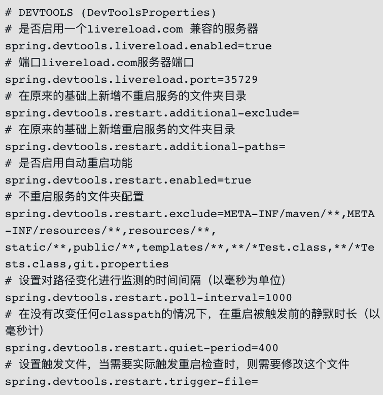

## 测试

引入测试包咯，然后构建测试类，这就不演示了，大家常用的。

## Actuator监控

这个就是引入包，然后进入相应端点监控项目状态；

# Spring Security简介

Spring Security是一个能够为**基于Spring的企业应用系统提供声明式的安全访问控制解决方案的安全框架**。它提供了一组可以在Spring应用上下文中配置的Bean，充分利用了**Spring IoC（Inversion ofControl，控制反转）、DI（Dependency Injection，依赖注入）和AOP（面向切面编程）功能**，为应用系统提供声明式的安全访问控制功能，减少了为企业系统安全控制编写大量重复代码的工作。

•　**身份认证**：Spring Security提供了多粒度的身份认证，最熟悉的就是我们常用的登录功能。

•　**授权**：通俗地说，授权是指权限认证。当你向服务器发起一个请求时，**服务器会对你的权限进行验证，如果权限不足，就可能重定向到特定的界面或返回HTTP响应码。**

•　**加密**：Spring Security提供了多种加密方式供我们使用（如SHA、MD5或Bcrypt），可以根据需求选择。

•　**会话管理**：Spring Security拥有特殊的会话管理机制，会对会话进行保护、定期检测会话是否超时等。

•　**Session管理**：如果有需要的话，那么可以配置Spring Security检测无效的Session ID提交并将用户重定向到一个指定的URL。

•　**支持HTTP/HTTPS**：支持服务器同时使用HTTP和HTTPS，如果需要特殊URL，那么只能使用HTTPS，可以在配置中直接配置进行使用。

•　**支持Basic和Digest认证**：Basic（基本）验证和Digest（摘要）验证是在Web应用中流行的替代身份验证机制。基本验证是指在客户端请求时，提供用户名和密码验证的一种方式，常见的如EUREKA。摘要认证属于基本认证的升级版，将传输的密码加密，解决了HTTP基本认证不安全的问题。

•　**Remember-Me**：Remember-Me身份验证是指网站能够记住一个主体的身份之间的会话。当第一次登录时，服务器发送cookie给浏览器，浏览器将cookie保存一段时间，当再次访问时，如果在会话中发现cookie，则进行自动登录。

•　**提供CSRF解决方案**：CSRF是Cross Site Request Forgery的缩写，CSRF是指跨站请求伪造。是一种通过伪装成受信任用户的请求来利用受信任的网站。Spring Security提供了解决这个问题的方案。

•　**CORS**：Spring Security提供了对CORS（跨域资源共享）的支持。

•　**安全HTTP响应头**：Spring Security支持将各种安全头添加到响应中。

•　**匿名身份验证**：允许未经过身份验证的用户访问。

## 1. 使用Spring Security做权限控制

### 2. Securuty Config

使用Spring Security进行安全管理需要使SecurityConfig继承WebSecurityConfigurerAdapter类，并且使用HttpSecurity的一切安全策略进行配置。本文使用的配置如下。•　authorizeRequests：配置一些资源或链接的权限认证。•　antMatchers：配置哪些资源或链接需要被认证。•　permitAll：设置完全允许访问的资源和链接。•　hasRole：配置需要认证的资源或链接的角色。需要注意，若这里需要配置权限为USER，则用户需要拥有权限ROLE_USER，这就是初始化脚本中权限内容修改的原因。•　formLogin：设置form表单提交配置。•　loginPage：设置一个自定义的登录页面URL。•　failureUrl：设置一个自定义的登录失败的URL。•　successForwardUrl：设置一个登录成功后自动跳转的URL。•　accessDeniedPage：设置拒绝访问的URL。•　logoutSuccessUrl：设置退出登录的URL。

```java
import com.springboot.entity.Menu;
import com.springboot.entity.Role;
import com.springboot.repository.RoleRepository;
import org.springframework.beans.factory.annotation.Autowired;
import org.springframework.context.annotation.Bean;
import org.springframework.security.config.annotation.authentication.builders.AuthenticationManagerBuilder;
import org.springframework.security.config.annotation.web.builders.HttpSecurity;
import org.springframework.security.config.annotation.web.configuration.EnableWebSecurity;
import org.springframework.security.config.annotation.web.configuration.WebSecurityConfigurerAdapter;
import org.springframework.security.crypto.password.NoOpPasswordEncoder;

import java.util.List;


@EnableWebSecurity
public class SecurityConfig extends WebSecurityConfigurerAdapter {
    @Autowired
    private RoleRepository roleRepository;
    @Autowired
    private MyUserDetailsService myUserDetailsService;

    @Override
    protected void configure(HttpSecurity httpSecurity) throws Exception{
        //配置资源文件 其中/css/**，/index可以任意访问，/select需要USER权限，/delete需要ADMIN权限
        httpSecurity
                .authorizeRequests()
                .antMatchers("/css/**", "/index").permitAll()
                .antMatchers("/select").hasRole("USER")
                .antMatchers("/delete").hasRole("ADMIN");
        //动态加载数据库中角色权限
        List<Role> roleList = roleRepository.findAll();
        for(Role role : roleList){
            List<Menu> menuList = role.getMenuList();
            for (Menu menu : menuList){
                //在SpringSecurity校验权限的时候，会自动将权限前面加ROLE_，所以我们需要 将我们数据库中配置的ROLE_截取掉。
                String roleName = role.getRoleName().replace("ROLE_","");
                String menuName = "/" + menu.getMenuName();
                httpSecurity
                        .authorizeRequests()
                        .antMatchers(menuName)
                        .hasRole(roleName);
            }
        }
        //配置登录请求/login 登录失败请求/login_error 登录成功请求/
        httpSecurity
                .formLogin()
                .loginPage("/login")
                .failureUrl("/login_error")
                .successForwardUrl("/");
        //登录异常，如权限不符合 请求/401
        httpSecurity
                .exceptionHandling().accessDeniedPage("/401");
        //注销登录 请求/logout
        httpSecurity
                .logout()
                .logoutSuccessUrl("/logout");
    }

    @Bean
    public static NoOpPasswordEncoder passwordEncoder() {
        return (NoOpPasswordEncoder) NoOpPasswordEncoder.getInstance();
    }


    //根据用户名密码实现登录
    @Autowired
    public void configureGlobal(AuthenticationManagerBuilder authenticationManagerBuilder) throws Exception {
        authenticationManagerBuilder
                .inMemoryAuthentication()
                //.passwordEncoder(new BCryptPasswordEncoder())
                .withUser("test").password("123").roles("USER")
                .and()
                .withUser("admin").password("123").roles("ADMIN","USER");
        authenticationManagerBuilder.userDetailsService(myUserDetailsService);
    }
}
```

### 3. MyUserDetailsService

**使用数据库认证用户需要自定义一个类来实现UserDetailsService重写loadUserByUsername方法进行认证授权;**

# Shiro权限控制

以下是Apache Shiro可以做的一些事情：

•　验证用户身份。

•　为用户执行访问控制，例如确定是否为用户分配了某个安全角色或确定是否允许用户执行某些操作。

•　在任何环境中使用Session API，即使没有Web容器或EJB容器也是如此。

•　在身份验证、访问控制或会话生命周期内对事件做出反应。

•　聚合用户安全数据的一个或多个数据源，并将其全部显示为单个复合用户“视图”。

•　启用单点登录（SSO）功能。

•　无须登录即可为用户关联启用“记住我”服务。

Apache Shiro是一个具有许多功能的**综合应用程序安全框架**

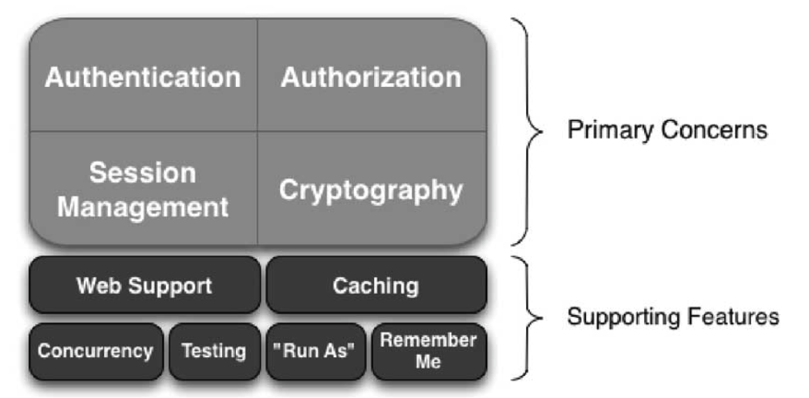

Shiro提供了Shiro开发团队所称的“应用程序安全的4大基石”——身份验证、授权、会话管理和加密。

•　身份认证：其实身份认证可以理解为“登录”。

•　授权：授权是指一些权限的认证，比如管理员可以访问所有页面，但是普通用户只能访问部分页面。

•　会话管理：可以理解为Shiro为我们管理用户的会话（如Session）。

•　加密：使用加密算法来保证数据的安全。

以上是4个主要的功能，还提供了其它功能：

•　Web支持：Shiro的Web支持API可帮助用户轻松保护Web应用程序。

•　缓存：Shiro提供了缓存，可以确保安全操作保持快速高效。

•　并发：Apache Shiro支持具有并发功能的多线程应用程序。

•　测试：存在测试支持以帮助用户编写单元和集成测试，并确保代码按预期受到保护。

•　运行方式：允许用户假定其他用户的身份（如果允许）的功能，有时在管理方案中很有用。

•　记住我：记住用户在会话中的身份，这样他们只需要在强制要求时登录。

## 1. 内容

​	① 认识shiro的整体架构，各组件的概念

​	② shiro认证，授权的过程

​	③ shiro自定义的realm、Filter

​	④ shiro session管理

​	⑤ shiro的缓存管理

​	⑥ shiro继承spring

## 2.shiro整体架构

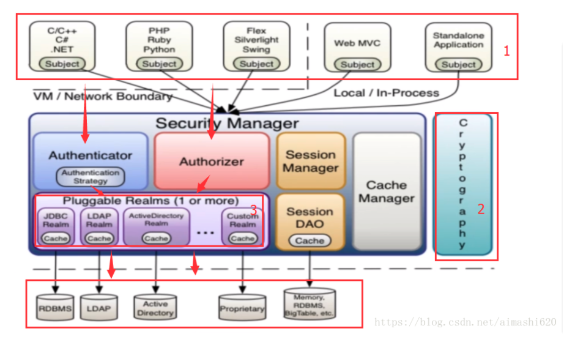

①上面标记为1的是shiro的主体部分subject，可以理解为当前的操作用户

② Security Manager为Shiro的核心，shiro是通过security Manager来提供安全服务的，security Manager管理着Session Manager、Cache Manager等其他组件的实例：Authenticator(认证器，管理我们的登录登出) Authorizer(授权器，负责赋予主体subject有哪些权限) Session Manager(shiro自己实现的一套session管理机制，可以不借助任何web容器的情况下使用session) Session Dao(提供了session的增删改查操作) cache Manager(缓存管理器，用于缓存角色数据和权限数据) Pluggable Realms(shiro与数据库/数据源之间的桥梁，shiro获取认证信息、权限数据、角色数据都是通过Realms来获取) 

③ 上图标记为2的cryptography是用来做加密的，使用它可以非常方便快捷的进行数据加密。

④ 上面箭头的流程可以这样理解：主体提交请求到Security Manager，然后由Security Manager调用Authenticator去做认证，而Authenticator去获取认证数据的时候是通过Realms从数据源中来获取的，然后把从数据源中拿到的认证信息与主体提交过来的认证信息做比对。授权器Authorizer也是一样。

## 2. 使用使用Shiro做权限控制

### 1. 场景及数据库介绍

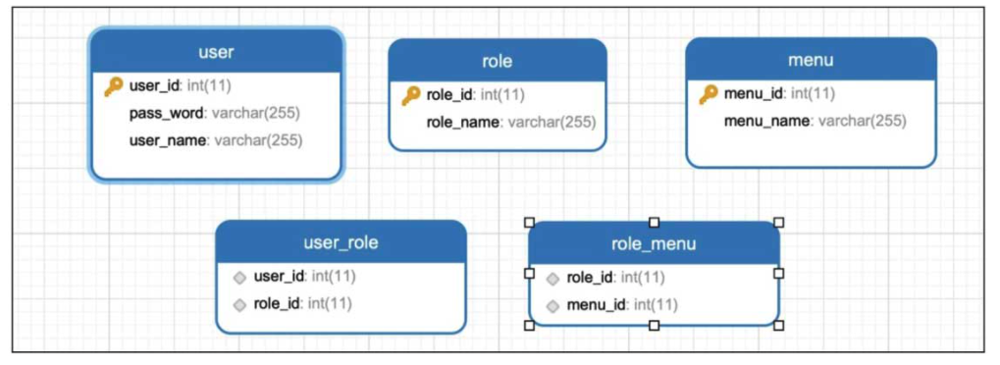

```sql
CREATE TABLE `user` (
  `user_id` int(11) NOT NULL COMMENT '主键',
  `pass_word` varchar(32) DEFAULT NULL COMMENT '密码',
  `user_name` varchar(32) DEFAULT NULL COMMENT '用户名',
   PRIMARY KEY (`user_id`)
) ENGINE=InnoDB DEFAULT CHARSET=utf8 COMMENT='用户表';

CREATE TABLE `role` (
  `role_id` int(11) NOT NULL COMMENT '主键',
  `role_name` varchar(128) DEFAULT NULL COMMENT '角色名称',
   PRIMARY KEY (`role_id`)
) ENGINE=InnoDB DEFAULT CHARSET=utf8 COMMENT='角色表';

CREATE TABLE `menu` (
  `menu_id` int(11) NOT NULL COMMENT '主键',
  `menu_name` varchar(128) DEFAULT NULL COMMENT '菜单名称',
   PRIMARY KEY (`menu_id`)
) ENGINE=InnoDB DEFAULT CHARSET=utf8 COMMENT='菜单角色表';
-- 绑定用户和角色关系
CREATE TABLE `user_role` (
  `user_id` int(11) NOT NULL COMMENT '用户id',
  `role_id` int(11) DEFAULT NULL COMMENT '角色id',
   KEY `user_role_id` (`user_id`,`role_id`)
) ENGINE=InnoDB DEFAULT CHARSET=utf8 COMMENT='用户角色关系表';
-- 绑定角色和菜单关系
CREATE TABLE `role_menu` (
  `role_id` int(11) NOT NULL COMMENT '角色id',
  `menu_id` int(11) DEFAULT NULL COMMENT '菜单id',
   KEY `role_menu_id` (`role_id`,`menu_id`)
) ENGINE=InnoDB DEFAULT CHARSET=utf8 COMMENT='角色和菜单关系表';
```

其中分为两种角色：admin和user，如果用户角色为admin，则可以进行4个菜单的请求（add、delete、update和select，这里只有select和delete），如果用户角色为user，则只可以进行select请求。如果没有权限，就会跳转到401页面，index页面可以不登录访问。为了方便，默认插入了两个用户：root有admin权限；people有user权限。

```sql
-- 构建菜单表
INSERT INTO `menu`(`menu_id`, `menu_name`) VALUES (1, 'add');
INSERT INTO `menu`(`menu_id`, `menu_name`) VALUES (2, 'delete');
INSERT INTO `menu`(`menu_id`, `menu_name`) VALUES (3, 'update');
INSERT INTO `menu`(`menu_id`, `menu_name`) VALUES (4, 'select');
-- 构建角色表
INSERT INTO `role`(`role_id`, `role_name`) VALUES (1, 'admin');
INSERT INTO `role`(`role_id`, `role_name`) VALUES (2, 'user');
-- 绑定角色和菜单关系，角色为admin则拥有4个菜单的请求，角色为2则只有查看权限
INSERT INTO `role_menu`(`role_id`, `menu_id`) VALUES (1, 1);
INSERT INTO `role_menu`(`role_id`, `menu_id`) VALUES (1, 2);
INSERT INTO `role_menu`(`role_id`, `menu_id`) VALUES (1, 3);
INSERT INTO `role_menu`(`role_id`, `menu_id`) VALUES (1, 4);
INSERT INTO `role_menu`(`role_id`, `menu_id`) VALUES (2, 4);
-- 创建用户
INSERT INTO `user`(`user_id`, `pass_word`, `user_name`) VALUES (1, '123', 'root');
INSERT INTO `user`(`user_id`, `pass_word`, `user_name`) VALUES (2, '123', 'people');
-- 绑定用户和角色关系，root给admin权限，people给user权限
INSERT INTO `user_role`(`role_id`, `user_id`) VALUES (1, 1);
INSERT INTO `user_role`(`role_id`, `user_id`) VALUES (2, 2);
```

### 2. 依赖配置

这里需要使用数据库，因此加入了MySQL和JPA的依赖，模板框架使用的是Thymeleaf，同时加入Shiro依赖

```xml
    <dependencies>
        <!--springboot-->
        <dependency>
            <groupId>org.springframework.boot</groupId>
            <artifactId>spring-boot-starter</artifactId>
        </dependency>
        <dependency>
            <groupId>org.springframework.boot</groupId>
            <artifactId>spring-boot-starter-test</artifactId>
            <scope>test</scope>
        </dependency>
        <!-- shiro -->
        <dependency>
            <groupId>org.apache.shiro</groupId>
            <artifactId>shiro-spring</artifactId>
            <version>1.4.0</version>
        </dependency>
        <!-- web -->
        <dependency>
            <groupId>org.springframework.boot</groupId>
            <artifactId>spring-boot-starter-web</artifactId>
        </dependency>
        <!-- thymeleaf -->
        <dependency>
            <groupId>org.springframework.boot</groupId>
            <artifactId>spring-boot-starter-thymeleaf</artifactId>
        </dependency>
        <!-- nekohtml -->
        <dependency>
            <groupId>net.sourceforge.nekohtml</groupId>
            <artifactId>nekohtml</artifactId>
            <version>1.9.15</version>
        </dependency>
        <!-- mysql -->
        <dependency>
            <groupId>mysql</groupId>
            <artifactId>mysql-connector-java</artifactId>
            <scope>runtime</scope>
        </dependency>
        <!-- jpa -->
        <dependency>
            <groupId>org.springframework.boot</groupId>
            <artifactId>spring-boot-starter-data-jpa</artifactId>
        </dependency>
    </dependencies>
```

### 3.搭建实体类和数据操作层

结合上述场景，可以看出user表和role表的关系是多对多，role表和menu表的关系也是多对多，理解了关系，创建实体类就比较容易了。

首先创建一个User实体，使用@ManyToMany表明是多对多的关系，在@JoinTable注解中注明中间表的表名以及关联两个表的字段。

```java
@Entity
public class User implements Serializable {

    @Id
    @GeneratedValue
    private Integer userId;
    private String userName;
    private String passWord;
		//这里表明是多对多
    @ManyToMany(fetch= FetchType.EAGER)
  	//这里注明中间表的表名和关联两表的字段
    @JoinTable(name = "UserRole", joinColumns = { @JoinColumn(name = "userId") },
            inverseJoinColumns ={@JoinColumn(name = "roleId") })
    private List<Role> roleList;
  	
    public Integer getUserId() {
        return userId;
    }

    public void setUserId(Integer userId) {
        this.userId = userId;
    }

    public String getUserName() {
        return userName;
    }

    public void setUserName(String userName) {
        this.userName = userName;
    }

    public String getPassWord() {
        return passWord;
    }

    public void setPassWord(String passWord) {
        this.passWord = passWord;
    }

    public List<Role> getRoleList() {
        return roleList;
    }

    public void setRoleList(List<Role> roleList) {
        this.roleList = roleList;
    }
}
```

接下来创建Role实体。和User实体类似，分别注明与**User和Menu**的多对多关系

```java
@Entity
public class Role implements Serializable {

    @Id
    @GeneratedValue
    private Integer roleId;
    private String roleName;


    @ManyToMany(fetch= FetchType.EAGER)
    @JoinTable(name="RoleMenu",joinColumns={@JoinColumn(name="roleId")},inverseJoinColumns={@JoinColumn(name="menuId")})
    private List<Menu> menuList;

    @ManyToMany
    @JoinTable(name="UserRole",joinColumns={@JoinColumn(name="roleId")},inverseJoinColumns={@JoinColumn(name="userId")})
    private List<User> userList;

    public Integer getRoleId() {
        return roleId;
    }

    public void setRoleId(Integer roleId) {
        this.roleId = roleId;
    }

    public String getRoleName() {
        return roleName;
    }

    public void setRoleName(String roleName) {
        this.roleName = roleName;
    }

    public List<Menu> getMenuList() {
        return menuList;
    }

    public void setMenuList(List<Menu> menuList) {
        this.menuList = menuList;
    }

    public List<User> getUserList() {
        return userList;
    }

    public void setUserList(List<User> userList) {
        this.userList = userList;
    }

}
```

最后是Menu实体，这里表明与Role的多对多关系

```java
@Entity
public class Menu  implements Serializable {

    @Id
    @GeneratedValue
    private Integer menuId;
    private String menuName;

    @ManyToMany
    @JoinTable(name="RoleMenu",joinColumns={@JoinColumn(name="menuId")},inverseJoinColumns={@JoinColumn(name="roleId")})
    private List<Role> roleList;

    public Integer getMenuId() {
        return menuId;
    }

    public void setMenuId(Integer menuId) {
        this.menuId = menuId;
    }

    public String getMenuName() {
        return menuName;
    }

    public void setMenuName(String menuName) {
        this.menuName = menuName;
    }

    public List<Role> getRoleList() {
        return roleList;
    }

    public void setRoleList(List<Role> roleList) {
        this.roleList = roleList;
    }

}
```

创建JPA数据操作层，里面加入一个根据用户名查询用户的方法。

```java
public interface UserRepository extends JpaRepository<User,Long> {
    User findByUserName(String username);
}
```

### 4. Shiro配置

创建一个ShiroConfig，然后创建一个shiroFilter方法。在Shiro使用认证和授权时，其实都是**通过ShiroFilterFactoryBean设置一些Shiro的拦截器进行的**，拦截器会**以LinkedHashMap的形式存储需要拦截的资源及链接，并且会按照顺序执行**，其中**键为拦截的资源或链接，值为拦截的形式（比如authc:所有URL都必须认证通过才可以访问，anon:所有URL都可以匿名访问）**，在拦截的过程中可以使用通配符，比如**/****为拦截所有**，所以一般/****放在最下面。同时，可以通过**ShiroFilterFactoryBean设置登录链接、未授权链接、登录成功跳转页等。**

```java
//						anon: 无需认证就可以访问
//            authc: 必须认证了才能访问
//            user: 必须拥有 记住我 功能才能用
//            perms: 拥有对某个资源的权限才能访问
//            role: 拥有某个角色权限才能访问
```

```java
@Configuration
public class ShiroConfig {

    @Bean
    public ShiroFilterFactoryBean shiroFilter(SecurityManager securityManager) {
        ShiroFilterFactoryBean shiroFilterFactoryBean = new ShiroFilterFactoryBean();
        shiroFilterFactoryBean.setSecurityManager(securityManager);
        //shiro拦截器
        Map<String,String> filterChainDefinitionMap = new LinkedHashMap<String,String>();
        //<!-- authc:所有url都必须认证通过才可以访问; anon:所有url都都可以匿名访问-->
        //<!-- 过滤链定义，从上向下顺序执行，一般将/**放在最为下边 -->

        // 配置不被拦截的资源及链接
        filterChainDefinitionMap.put("/static/**", "anon");
        // 退出过滤器
        filterChainDefinitionMap.put("/logout", "logout");

        //配置需要认证权限的
        filterChainDefinitionMap.put("/**", "authc");
        // 默认寻找登录链接
        shiroFilterFactoryBean.setLoginUrl("/login");
        // 登录成功后要跳转的链接
        shiroFilterFactoryBean.setSuccessUrl("/index");

        //未授权的跳转链接
        shiroFilterFactoryBean.setUnauthorizedUrl("/401");
        shiroFilterFactoryBean.setFilterChainDefinitionMap(filterChainDefinitionMap);
        return shiroFilterFactoryBean;
    }

    //自定义身份认证Realm（包含用户名密码校验，权限校验等）
    public MyShiroRealm myShiroRealm(){
        MyShiroRealm myShiroRealm = new MyShiroRealm();
        return myShiroRealm;
    }


    @Bean
    public SecurityManager securityManager(){
        DefaultWebSecurityManager securityManager =  new DefaultWebSecurityManager();
        securityManager.setRealm(myShiroRealm());
        return securityManager;
    }

    //开启shiro aop注解支持，不开启的话权限验证就会失效
    @Bean
    public AuthorizationAttributeSourceAdvisor authorizationAttributeSourceAdvisor(SecurityManager securityManager){
        AuthorizationAttributeSourceAdvisor authorizationAttributeSourceAdvisor = new AuthorizationAttributeSourceAdvisor();
        authorizationAttributeSourceAdvisor.setSecurityManager(securityManager);
        return authorizationAttributeSourceAdvisor;
    }

    //处理异常，当用户没有权限时设置跳转到401页面
    @Bean(name="simpleMappingExceptionResolver")
    public SimpleMappingExceptionResolver createSimpleMappingExceptionResolver() {
        SimpleMappingExceptionResolver simpleMappingExceptionResolver = new SimpleMappingExceptionResolver();
        Properties mappings = new Properties();
        //数据库异常处理
        mappings.setProperty("DatabaseException", "databaseError");
        //未经过认证
        mappings.setProperty("UnauthorizedException","401");
        // None by default
        simpleMappingExceptionResolver.setExceptionMappings(mappings);
        // No default
        simpleMappingExceptionResolver.setDefaultErrorView("error");
        // Default is "exception"
        simpleMappingExceptionResolver.setExceptionAttribute("ex");
        return simpleMappingExceptionResolver;
    }
}
```

```java
//自定义身份认证Realm（包含用户名密码校验，权限校验等）,当然也可以建立多个Realm进行判断
@Configuration
public class MyShiroRealm extends AuthorizingRealm {

    @Resource
    private UserRepository userRepository;

    //授权方法，主要用于获取角色的菜单权限
    @Override
    protected AuthorizationInfo doGetAuthorizationInfo(PrincipalCollection principals) {
        SimpleAuthorizationInfo authorizationInfo = new SimpleAuthorizationInfo();
        User userInfo  = (User)principals.getPrimaryPrincipal();
        for(Role role:userInfo.getRoleList()){
            authorizationInfo.addRole(role.getRoleName());
            for(Menu menu:role.getMenuList()){
                authorizationInfo.addStringPermission(menu.getMenuName());
            }
        }
        return authorizationInfo;
    }

    //认证方法，主要用于校验用户名和密码
    @Override
    protected AuthenticationInfo doGetAuthenticationInfo(AuthenticationToken token)
            throws AuthenticationException {
        //获得当前用户的用户名
        String username = (String)token.getPrincipal();
        //根据用户名查询用户
        User user = userRepository.findByUserName(username);
        if(user == null){
            return null;
        }
        //校验用户名密码是否正确
        SimpleAuthenticationInfo authenticationInfo = new SimpleAuthenticationInfo(
                user,
                user.getPassWord(),
                getName()
        );
        return authenticationInfo;
    }
}
```

### 5. 控制器

```java
@Controller
public class ShiroController {
    @GetMapping({"/","/index"})
    public String index(){
        return"index";
    }

    @GetMapping("/401")
    public String unauthorizedRole(){
        return "401";
    }

    @GetMapping("/delete")
    @RequiresRoles("admin")//授权判定
    public String delete(){
        return "delete";
    }

    @GetMapping("/select")
    @RequiresPermissions("select")
    public String select(){
        return "select";
    }

    @RequestMapping("/login")
    public String login(HttpServletRequest request, Map<String, Object> map){
        // 如果登录失败的话，那么就从HttpServletRequest中获取shiro处理的异常信息，获取shiroLoginFailure就是shiro异常类的全名。
        String exception = (String) request.getAttribute("shiroLoginFailure");
        String msg = "";
        //根据异常判断错误类型
        if (exception != null) {
            if (UnknownAccountException.class.getName().equals(exception)) {
                msg = "用户名不存在！";
            } else if (IncorrectCredentialsException.class.getName().equals(exception)) {
                msg = "密码错误！";
            } else {
                msg = exception;
            }
        }
        map.put("msg", msg);
        return "/login";
    }

    @GetMapping("/logout")
    public String logout(){
        return "/login";
    }

}
```

