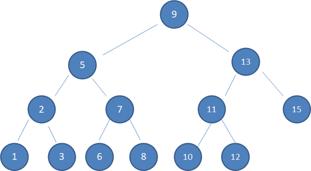
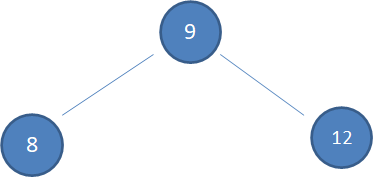
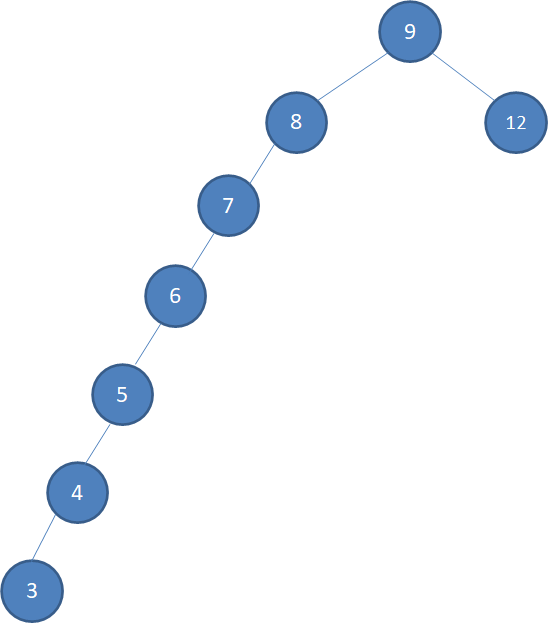

# 二叉查找树BST

1.**左子树上所有结点的值均小于或等于它的根结点的值。**

2**.右子树上所有结点的值均大于或等于它的根结点的值。**

3.**左、右子树也分别为二叉排序树。**

二叉查找树运用的正是二分查找的思想，使数据结构查找更快；但它的缺陷便是插入效率偶尔会不太平衡

假设初始的二叉查找树只有三个结点，根结点值为9，左孩子值为8，右孩子值为12：

接下来我们依次插入如下五个结点：7,6,5,4,3

**这样一来查找就基本变成了线性遍历，就失去二分查找的优点，所以有了红黑树。**

# 红黑树

红黑树是一种自平衡的二叉查找树，除了符合二叉查找树的基本特性之外还优化了以下特性：

1.结点是红色或黑色。

2.根结点是黑色。

3.**每个叶子结点都是黑色的空结点（NIL结点）。**

4 **每个红色结点的两个子结点都是黑色。(从每个叶子到根的所有路径上不能有两个连续的红色结点)**

5.**从任一结点到其每个叶子的所有路径都包含相同数目的黑色结点。**

通过红黑树的自平衡，我们就再也不用担心查找效率约等于线性查找的缺陷问题了；

# hashMap

说完了红黑树，我们回到集合～～

Java8将HashMap数据结构优化为数组+链表+红黑树，在Java7是不包含红黑树滴；

## 存储的优点

- 数组的特点：查询效率`高`，插入和删除效率`低`
- 链表的特点：查询效率`低`，插入和删除效率`高`
- 在HasnMap底层使用数组加`（链表或红黑树）`的结构完美的解决了数组和链表的问题，使的查询和插入，删除的效率都`很高`
- HashMap的散列表是`懒加载机制`，在第一次put的时候才会创建

## 存储元素的过程

- 首先将key、value封装到Node对象当中（节点）

- 调用key的hasnCode()方法取出hash值；通过hashcode值和数组长度取模得到元素存储的下标

此时分为两种情况

- 下标位置上没有元素，直接把元素方进入
- 该下标已有元素，判断该位置的元素和当前元素是否相等，**使用equals来比较（默认是比较两个对象的地址）**。如果两只相等则直接覆盖，如果不等则（Hash碰撞）在原元素下面使用链表的结构存储该元素（如果已存在链表，则插在链表尾部），每个元素节点都有一个next属性指向下一个节点，这就由数组结构变成了数组+链表；因为链表中元素太多的时候回影响查找效率，所以**当链表的元素个数达到`8`的时候使用链表存储就转变成了使用红黑树存储（当红黑树上的节点数量小于`6`个，会重新把红黑树变成单向链表数据结构**），原因就是红黑树是平衡二叉树，在查找性能方面比聊表要高。

### HashMap取值的实现

- 先调用k的hashCode()方法得出哈希值，并通过hash算法转换成数组的下标

- 通过hash值转换成数组下标后，通过数组定位到下标位置，如果该位置上什么都没有，返回null；如果该位置上有单向链表，那么就拿参数K和单向链表上的每一个节点的K进行equals比较，如果所有equals都返回false，则返回null，如果有一个节点的K和参数K通过equals返回true，那么此时该节点的value就是要获取的value值

## 扩容

- HashMap中有两个重要参数，初始容量大小和负载因子，在HashMap刚开始初始化的时候，使用默认的构造方法，会返回一个空的table，并且 thershold（扩容阈值）为`0`，**因此第一次扩容的时候默认值就会是`16`，负载因子默认为`0.75`，用数组容量乘以负载因子得到一个值，这个值就是扩容阈值，扩容一旦数组中存储的元素个数超过这个值就会调用rehash方法将数组容量增加到原来的两倍，threshold也会变为原来的两倍**
- 在做扩容的时候会生成一个新的数组，原来的所有数据需要重新计算哈希码值重新分配到新的数组，所以扩容的操作非常消耗性能。所以，如果知道要存入的数据量比较大的话，可以在创建的时候先指定一个比较大的数据容量
- 也可以引申到一个问题**HashMap是先插入还是先扩容**：HashMap初始化后首次插入数据时，先发生resize扩容再插入数据，之后每当插入的数据个数达到threshold时就会发生resize，此时是先插入数据再resize

备注：jdk7的时候是扩容再插入，8变成先插入后扩容；

## HashMap和HashTable区别

线程方面

- HashMap是非线程安全的，HashTable是线程安全的。 Hashtable的实现方法里面都添加了synchronized关键字来确保线程同步，因此相对而言HashMap性能会高一些，我们平时使用时若无特殊需求建议使用HashMap，**在多线程环境下若使用HashMap需要使用`Collections.synchronizedMap()`方法来获取一个线程安全的集合**。HashMap的不安全体现为扩容时的不安全；

- HashMap的key可以为null，HashTable的key不可为null

- HashMap是对Map接口的实现，HashTable实现了Map接口和Dictionary抽象类

- HashMap的初始容量为`16`，Hashtable初始容量为`11`，两者的填充因子默认都是`0.75`，HashMap扩容时是当前容量翻倍即：`capacity * 2`，Hashtable扩容时是容量翻倍+1即：`capacity * 2+1`

### HashMap中的hashcode怎么生成

- **调用对象key的hashCode方法**，**再对这个hashcode方法进行一些右移以及异或运算**（使的hashCode的高位和低位都参与到运算中）；通过右移和异或运算可以使hashMap的散列化更强，提高hashMap的get方法的效率。

## equals方法和hashcode的关系

归纳总结：

- 若重写了equals(Object obj)方法，则有必要重写hashCode()方法
- 若两个对象equals(Object obj)返回true，则hashCode()返回相同的int数
- 若两个对象equals(Object obj)返回false，则hashCode()不一定返回不同的int数
- 若两个对象hashCode()返回相同int数，则equals(Object obj)不一定返回true
- 若两个对象hashCode()返回不同int数，则equals(Object obj)一定返回false
- 同一对象在执行期间若已经存储在集合中，则不能修改影响hashCode值的相关信息，否则会导致内存泄露问题

